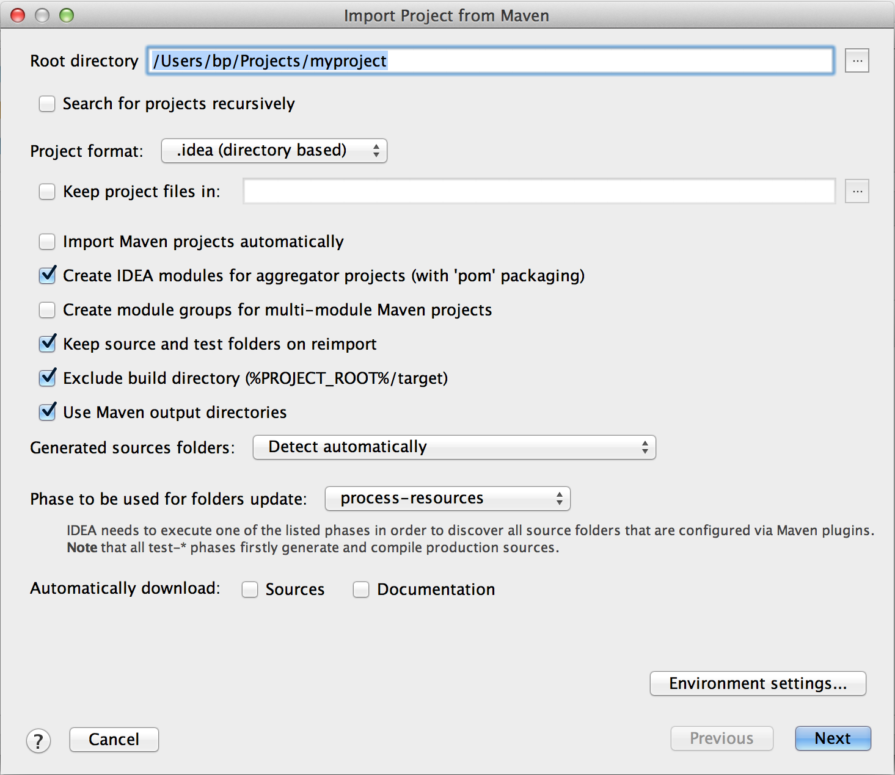

# 如何使用IntelliJ IDEA開發AEM專案{#how-to-develop-aem-projects-using-intellij-idea}

## 總覽 {#overview}

若要開始使用IntelliJ上的AEM開發，需執行下列步驟。

在本作法的其餘部分中，會更詳細地說明每個選項。

* 安裝IntelliJ
* 根據Maven設定AEM專案
* 在Maven POM中準備IntelliJ的JSP支援
* 將Maven專案匯入IntelliJ

>[!NOTE]
>
>本指南以IntelliJ IDEA Ultimate Edition 12.1.4和AEM 5.6.1為基礎。

### 安裝IntelliJ IDEA {#install-intellij-idea}

從下載IntelliJ IDEA [JetBrains的下載頁面](https://www.jetbrains.com/idea/download/index.html).

接著，請依照該頁面上的安裝指示操作。

### 根據Maven設定AEM專案 {#set-up-your-aem-project-based-on-maven}

接下來，使用Maven設定專案，如 [如何使用Apache Maven建立AEM專案](/help/sites-developing/ht-projects-maven.md).

若要開始在IntelliJ IDEA中使用AEM專案，請參閱 [5分鐘後快速入門](https://maven.apache.org/guides/getting-started/maven-in-five-minutes.html) 已足夠。

### 準備IntelliJ IDEA的JSP支援 {#prepare-jsp-support-for-intellij-idea}

IntelliJ IDEA也可提供使用JSP的支援，例如

* 自動完成標籤庫
* 對由 `<cq:defineObjects />` 和 `<sling:defineObjects />`

要讓此功能發揮作用，請遵循 [如何使用JSP](/help/sites-developing/ht-projects-maven.md#how-to-work-with-jsps) in [如何使用Apache Maven建立AEM專案](/help/sites-developing/ht-projects-maven.md).

### 匯入Maven專案 {#import-the-maven-project}

1. 開啟 **匯入** IntelliJ IDEA中的對話方塊

   * 選取 **匯入專案** 在歡迎螢幕上，如果尚未開啟項目
   * 選取 **檔案 — >導入項目** 從主菜單

1. 在「匯入」對話方塊中，選取專案的POM檔案。

   

1. 繼續進行下列對話方塊中顯示的預設設定。

   

1. 按一下，繼續進行下列對話方塊 **下一個** 和 **完成**.
1. 您現在已透過IntelliJ IDEA設定為AEM開發

   

### 使用IntelliJ IDEA調試JSP {#debugging-jsps-with-intellij-idea}

使用IntelliJ IDEA調試JSP時需要執行以下步驟

* 在專案中設定Web面向
* 安裝JSR45支援外掛程式
* 設定除錯設定檔
* 設定AEM以進行除錯模式

#### 在專案中設定Web面向 {#set-up-a-web-facet-in-the-project}

IntelliJ IDEA需要了解在何處查找用於調試的JSP。 由於IDEA無法解譯 `content-package-maven-plugin` 設定，則需要手動設定。

1. 前往 **檔案 — >項目結構**
1. 選取 **內容** 模組
1. 按一下 **+** 在模組清單上，然後選取 **Web**
1. 作為Web資源目錄，請選擇 `content/src/main/content/jcr_root subdirectory` 如下方螢幕擷取畫面所示。


#### 安裝JSR45支援外掛程式 {#install-the-jsr-support-plugin}

1. 前往 **外掛程式** IntelliJ IDEA設定中的窗格
1. 導覽至 **JSR45整合** 外掛程式，並選取旁邊的核取方塊
1. 按一下 **套用**
1. 請求重新啟動IntelliJ IDEA


#### 設定除錯設定檔 {#configure-a-debug-profile}

1. 前往 **運行 — >編輯配置**
1. 點擊 **+** 選取 **JSR45遠程**
1. 在設定對話方塊中，選取 **設定** 下一頁 **應用程式伺服器** 和配置通用伺服器
1. 如果您想在開始偵錯時開啟瀏覽器，請將啟動頁面設為適當的URL
1. 全部移除 **啟動前** 任務（如果您使用vlt自動同步），或者配置適當的Maven任務（如果不使用vlt自動同步）
1. 在 **啟動/連接** 窗格，根據需要調整埠
1. 複製IntelliJ IDEA提出的命令行參數

 

#### 設定AEM以進行除錯模式 {#configure-aem-for-debug-mode}

最後一個步驟是使用IntelliJ IDEA提議的JVM選項啟動AEM。

您可以直接啟動AEM jar檔案並新增這些選項（例如使用下列命令列）來執行此操作：

`java -Xdebug -Xrunjdwp:transport=dt_socket,address=58242,suspend=n,server=y -Xmx1024m -jar cq-quickstart-6.5.0.jar`

您也可以將這些選項新增至您的開始指令碼中 `crx-quickstart/bin/start` 如下所示。

```shell
# ...

# default JVM options
if [ -z "$CQ_JVM_OPTS" ]; then
 CQ_JVM_OPTS='-server -Xmx1024m -Djava.awt.headless=true'
fi

CQ_JVM_OPTS="$CQ_JVM_OPTS -Xdebug -Xrunjdwp:transport=dt_socket,address=58242,suspend=n,server=y"

# ...
```

#### 啟動調試 {#start-debugging}

現在，您都已設定為在AEM中調試JSP。

1. 選擇 **執行 — >除錯 — >您的除錯設定檔**
1. 在元件代碼中設定斷點
1. 在瀏覽器中存取頁面


### 使用IntelliJ IDEA除錯套件組合 {#debugging-bundles-with-intellij-idea}

可以使用標準通用遠程調試連接調試套件中的代碼。 您可以遵循 [遠程調試的Jetbrain文檔](https://www.jetbrains.com/idea/webhelp/run-debug-configuration-remote.html).
