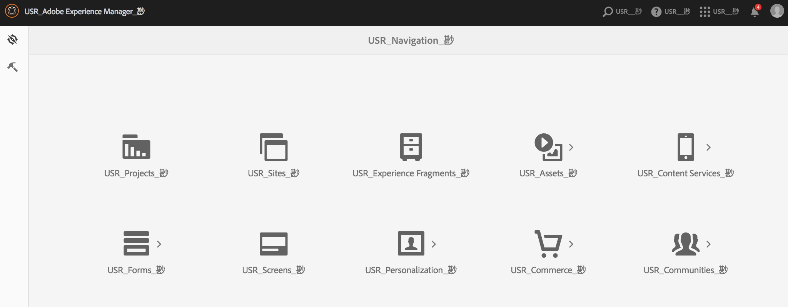

# 國際化UI字串 {#internationalizing-ui-strings}

Java和Javascript API使您能夠在以下類型的資源中國際化字串：

* Java源檔案。
* JSP指令碼。
* 客戶端庫或頁面源中的Javascript。
* 對話框和元件配置屬性中使用的JCR節點屬性值。

有關國際化和本地化流程的概述，請參閱 [國際化元件](/help/sites-developing/i18n.md)。

## Java和JSP代碼中的字串國際化 {#internationalizing-strings-in-java-and-jsp-code}

的 `com.day.cq.i18n` Java包使您能夠在UI中顯示本地化字串。 的 `I18n` 類提供 `get` 從字典檢索本地化字串AEM的方法。 的唯一必需參數 `get` 方法是英語中的字串文本。 英語是UI的預設語言。 下面的示例將單詞本地化 `Search`:

`i18n.get("Search");`

用英語標識字串不同於通常的國際化框架，在該框架中，ID標識字串，用於在運行時引用字串。 使用英文字串文本可提供以下好處：

* 代碼很容易理解。
* 預設語言中的字串始終可用。

### 確定用戶語言 {#determining-the-user-s-language}

有兩種方法可確定用戶喜歡的語言：

* 對於已驗證的用戶，根據用戶帳戶中的首選項確定語言。
* 請求的頁面的區域設定。

用戶帳戶的語言屬性是首選方法，因為它更可靠。 但是，用戶必須登錄才能使用此方法。

#### 建立I18n Java對象 {#creating-the-i-n-java-object}

I18n類提供了兩個建構子。 確定用戶首選語言的方式決定了要使用的建構子。

要以用戶帳戶中指定的語言顯示字串，請使用以下建構子（導入後） `com.day.cq.i18n.I18n)`:

```java
I18n i18n = new I18n(slingRequest);
```

建構子使用 `SlingHTTPRequest` 以檢索用戶的語言設定。

要使用頁面區域設定確定語言，您首先需要獲取所請求頁面語言的ResourceBundle:

```java
Locale pageLang = currentPage.getLanguage(false);
ResourceBundle resourceBundle = slingRequest.getResourceBundle(pageLang);
I18n i18n = new I18n(resourceBundle);
```

#### 字串國際化 {#internationalizing-a-string}

使用 `get` 方法 `I18n` 用於國際化字串的對象。 的唯一必需參數 `get` 方法是要國際化的字串。 該字串與「轉換器」字典中的字串相對應。 get方法在字典中查找字串並返回當前語言的翻譯。

第一個 `get` 方法必須符合以下規則：

* 該值必須是字串文本。 類型的變數 `String` 不能接受。
* 字串文本必須在單行上表示。
* 字串區分大小寫。

```xml
i18n.get("Enter a search keyword");
```

#### 使用翻譯提示 {#using-translation-hints}

指定 [翻譯提示](/help/sites-developing/i18n-translator.md#adding-changing-and-removing-strings) 用於區分字典中的重複字串。 使用的第二個可選參數 `get` 提供翻譯提示的方法。 翻譯提示必須與字典中項的Comment屬性完全匹配。

例如，字典包含字串 `Request` 兩次：一次是動詞，一次是名詞。 以下代碼將翻譯提示作為參數包含在 `get` 方法：

```java
i18n.get("Request","A noun, as in a request for a web page");
```

#### 局部化句中的變數 {#including-variables-in-localized-sentences}

在本地化字串中包括變數，以將上下文意義構建到句子中。 例如，登錄到Web應用程式後，首頁將顯示消息「歡迎返回管理員」。 您的收件箱中有2封留言。」 頁面上下文確定用戶名和消息數。

[在字典里](/help/sites-developing/i18n-translator.md#adding-changing-and-removing-strings)，變數在字串中表示為帶括弧的索引。 將變數的值指定為 `get` 的雙曲餘切值。 參數按轉換提示放置，索引與參數的順序相對應：

```xml
i18n.get("Welcome back {0}. You have {1} messages.", "user name, number of messages", user.getDisplayName(), numItems);
```

國際化字串和翻譯提示必須與字典中的字串和注釋完全匹配。 通過提供 `null` 值作為第二個參數。

#### 使用靜態獲取方法 {#using-the-static-get-method}

的 `I18N` 類定義靜態 `get` 方法，當需要本地化少量字串時，此方法非常有用。 除對象的參數外 `get` 方法，靜態方法要求 `SlingHttpRequest` 或 `ResourceBundle` 根據您確定用戶首選語言的方式來確定您使用的語言：

* 使用用戶的語言首選項：將SlingHttpRequest作為第一個參數提供。

   `I18n.get(slingHttpRequest, "Welcome back {}. You have {} messages.", "user name, number of messages", user.getDisplayName(), numItems);`
* 使用頁面語言：將ResourceBundle作為第一個參數提供。

   `I18n.get(resourceBundle,"Welcome back {}. You have {} messages.", "user name, number of messages", user.getDisplayName(), numItems);`

### 在Javascript代碼中國際化字串 {#internationalizing-strings-in-javascript-code}

Javascript API使您能夠在客戶端上本地化字串。 與 [Java和JSP](#internationalizing-strings-in-java-and-jsp-code) 代碼，Javascript API使您能夠標識要本地化的字串，提供本地化提示，並在本地化的字串中包括變數。

的 `granite.utils` [客戶端庫資料夾](/help/sites-developing/clientlibs.md) 提供了Javascript API。 要使用API，請將此客戶端庫資料夾包含在您的頁面上。 本地化函式使用 `Granite.I18n` 命名空間。

在顯示本地化字串之前，需要使用 `Granite.I18n.setLocale` 的子菜單。 該函式需要區域設定的語言代碼作為參數：

```
Granite.I18n.setLocale("fr");
```

要顯示本地化字串，請使用 `Granite.I18n.get` 函式：

```
Granite.I18n.get("string to localize");
```

下面的示例將字串&quot;Welcome back&quot;國際化：

```
Granite.I18n.setLocale("fr");
Granite.I18n.get("string to localize", [variables], "localization hint");
```

函式參數與Java I18n不同。get方法：

* 第一個參數是要本地化的字串文本。
* 第二個參數是要插入字串文本的值陣列。
* 第三個參數是本地化提示。

以下示例使用Javascript本地化「歡迎返回管理員」。 您的收件箱中有2封留言。」 句子：

```
Granite.I18n.setLocale("fr");
Granite.I18n.get("Welcome back {0}. You have {1} new messages in your inbox.", [username, numMsg], "user name, number of messages");
```

### 從JCR節點國際化字串 {#internationalizing-strings-from-jcr-nodes}

UI字串通常基於JCR節點屬性。 例如， `jcr:title` 頁面的屬性通常用作 `h1` 頁碼中的元素。 的 `I18n` 類提供 `getVar` 用於定位這些字串的方法。

以下示例JSP指令碼檢索 `jcr:title` 屬性，並在頁上顯示本地化字串：

```java
<% title = properties.get("jcr:title", String.class);%>
<h1><%=i18n.getVar(title) %></h1>
```

#### 指定JCR節點的轉換提示 {#specifying-translation-hints-for-jcr-nodes}

類似於 [Java API中的翻譯提示](#using-translation-hints)，可以提供翻譯提示，以在字典中區分重複字串。 將翻譯提示作為包含國際化屬性的節點的屬性提供。 提示屬性的名稱由國際化屬性名稱的名稱和 `_commentI18n` 尾碼：

`${prop}_commentI18n`

例如， `cq:page` node包含正在本地化的jcr:title屬性。 該提示作為名為jcr:title_commentI18n的屬性的值提供。

### 測試國際化範圍 {#testing-internationalization-coverage}

Test您是否已將UI中的所有字串國際化。 要查看包含哪些字串，請將用戶語言設定為zz_ZZ，然後在Web瀏覽器中開啟UI。 國際化字串將以下格式顯示存根轉換：

`USR_*Default-String*_尠`

下圖顯示了首頁的存根AEM翻譯：



要設定用戶的語言，請配置用戶帳戶的首選項節點的語言屬性。

用戶的首選項節點具有如下路徑：

`/home/users/<letter>/<hash>/preferences`


