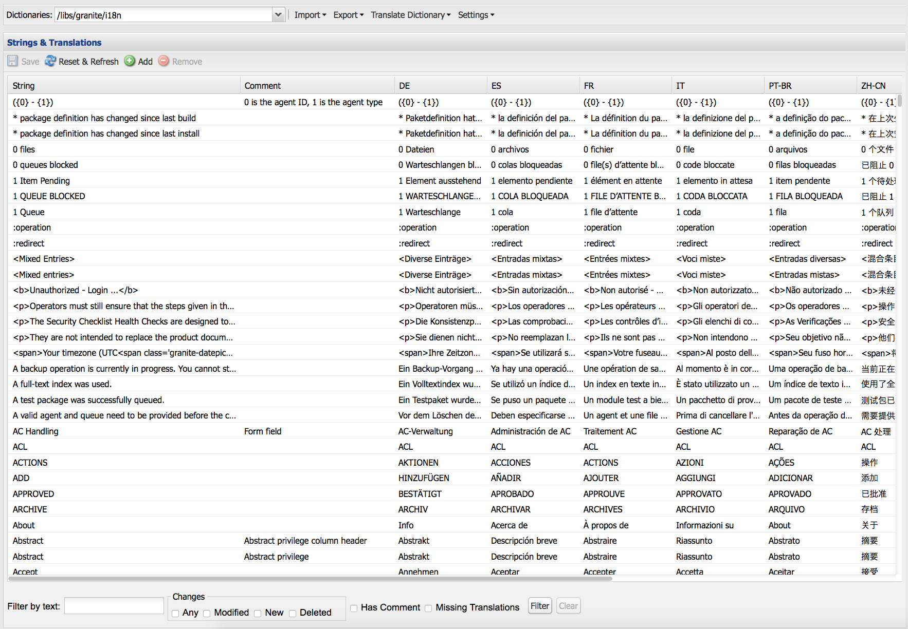

# 使用翻譯工具管理字典{#using-translator-to-manage-dictionaries}

AEM提供主控台，可管理元件UI中使用的各種文字翻譯。 此控制台可在

`https://<hostname>:<port-number>/libs/cq/i18n/translator.html`

使用翻譯工具管理英文字串及其翻譯。 字典是在儲存庫中建立的，例如/apps/myproject/i18n。

請注意，Translator工具和您管理的字典是用不同語言呈現元件UI。 如果您想要翻譯頁面或使用者產生的內容，請參 [閱「翻譯多語言網站的內容](/help/sites-administering/translation.md) 」 [和「翻譯使用者產生的內容」](/help/communities/translate-ugc.md)。

>[!CAUTION]
>
>僅編輯為您的專案建立並位於下方的字典 `/apps`。
>
>此工具中也提供AEM系統字典。 請勿變更AEM系統字典，因為這可能會導致AEM UI問題。 此外，升級時可能會遺失變更。 AEM系統字典位於下 `/libs`方。

>[!NOTE]
>
>雖然Translator工具有傳統的UI介面，但它用於翻譯片語，而不論這些片語的所在介面為何。

翻譯人員會列出AEM中使用的文字，並列出各種語言翻譯：



您可以搜尋、篩選及編輯英文和翻譯的文字。 您也可以將字典匯出為XLIFF格式以進行翻譯，然後將翻譯匯回字典。

您也可以從此控制台將i18n雙音調添加到翻譯項目中。 您可以建立新專案或新增至現有專案。

1. 按一下「 **翻譯字典」**。

   

1. 視您的需求選擇「建立」或「新增」選項。 對話方塊隨即開啟。

   

1. 視需要填寫欄位，然後按一下「確定」。 

1. 您現在可以按一下「 **確定** 」或查看「目標字典」。

   >[!NOTE]
   >
   >有關翻譯項目的詳細資訊，請閱 [讀管理翻譯項目](/help/sites-administering/tc-manage.md)。

## 建立字典 {#creating-a-dictionary}

建立字典，以管理本地化的UI字串。 在您建立字典後，您可以使用翻譯工具來管理它。

1. 使用CRXDE Lite，將新字典的根節點( `sling:Folder`)新增為包含語言定義的結構：

   ` /apps/<projectName>/i18n`

   例如， `/apps/myProject/i18n`

1. 在此根目錄下添加所需的語言結構。 例如：

   ```shell
   /apps/myProject/i18n [sling:Folder]
       - de.json [nt:file] [mix:language]
           + jcr:language = de
       - fr.json [nt:file] [mix:language]
           + jcr:language = fr
   ```

   >[!NOTE]
   >
   >這是來自 [Sling i18n模組的結構](https://sling.apache.org/site/internationalization-support.html)。

1. 重新載入翻譯器和字典路徑(例如) `/apps/myProject/i18n`將可在工具列的下拉式選取器中使用。 選擇此選項可開始添加字串及其翻譯。

   >[!NOTE]
   >
   >翻譯器將僅保存實際存在於路徑下的語言的翻譯(例如， `/apps/myProject/i18n`)。
   >
   >請確定這些語言與格線中顯示的語言對應。

## 管理字典字串 {#managing-dictionary-strings}

使用翻譯工具管理字典中的字串。 您可以新增、修改和移除英文字串，也可以提供翻譯的字串。

>[!CAUTION]
>
>僅編輯為您的專案建立並位於下方的字典 `/apps`。
>
>請勿變更AEM系統字典，因為這可能會導致AEM UI問題。 此外，升級時可能會遺失變更。 AEM系統字典位於下 `/libs`方。

### 添加、更改和刪除字串 {#adding-changing-and-removing-strings}

將英文字串新增至元件已國際化的字典。 只添加國際化的字串，以免通過翻譯未使用的字串來浪費資源。

您新增至字典的字串必須與程式碼中指定的字串完全相符。 如果程式碼中使用的預設英文字串與字典中的英文字串不符，則翻譯的字串不會視需要顯示在UI中。 字串區分大小寫。

**提供翻譯提示**

使用字典字串的Comment屬性為翻譯者提供資訊以釐清字串的含義。 通常，UI會協助使用者判斷歧義字詞的含義。 但是，翻譯器在UI的上下文中看不到字串。 翻譯提示消除歧義。 例如，注釋可協助翻譯人員瞭解英文單字「請求」是用作名詞，而非動詞。

翻譯提示還可區分相同且含義不同的字串。 例如，「搜尋」一詞可以是名詞或動詞，在字典中需要兩個「搜尋」項目，並有兩個不同的翻譯提示。 要求字串的程式碼也包含轉譯提示，以便在UI中使用正確的字串。

**包含索引變數**

在本地化字串中加入變數，將內容相關意義建立至句子中。 例如，登入Web應用程式後，首頁會顯示訊息「歡迎返回管理員」。 收件匣中有2條訊息。」 頁面內容會決定使用者名稱和訊息數量。

若要在本地化字串中包含變數，請在get方法第一個引數中的變數位置放置方括弧內的索引。 使用本地化提示來說明值。 翻譯者必須瞭解變數的含義，因為不同的語言使用不同的句子結構。

請注意， [請求翻譯字串的程式碼](/help/sites-developing/i18n-dev.md#including-variables-in-localized-sentences) ，會根據上下文提供索引變數的值。

例如，當使用者登入網站並包含在字典中時，會顯示下列字串：

`Welcome back {0}. You have {1} messages.`

以下注釋說明變數：

`{0} = the user name, {1} = the number of items in the user's inbox`

**修改字串**

當程式碼中的英文字串變更或移除時，請加以變更或移除。 當您變更字串時，原始字串會持續存在，並建立反映變更的新字串。 在移除字串之前，請確定沒有程式碼使用它。

請按下列步驟添加字串。

1. 在「字典」下拉式功能表中，選取您要新增字串的字典。 在下拉式功能表中，字典由其在儲存庫中的路徑表示。
1. 在「字串和翻譯」(Strings and Translations)表格上，按一下「添加」(Add)。

   

1. 在「新增字串」對話方塊的「字串」方塊中，輸入英文字串。 在「注釋」框中，鍵入翻譯員的翻譯提示（如果需要）。
1. 按一下「確定」。
1. 按一下「儲存」。

   

請按下列步驟更改字典中的字串。

1. 在「字典」下拉式選單中，選取包含要變更之字串的字典。
1. 連按兩下要變更的字串。
1. 在「編輯字串」對話框中，選擇「修改字串」或「注釋」（建立副本）。

   

1. 修改字串或注釋，然後按一下「確定」。
1. 按一下「儲存」。

   

請按下列步驟從字典中刪除字串。

1. 在「字典」下拉菜單中，選擇要從中刪除字串的字典。
1. 按一下「移除」。

   

1. 按一下「儲存」。

   

### 搜索字串 {#searching-for-strings}

Translator工具底部的搜索欄提供了字串選擇選項：

* **** 依文字篩選：與英文字串、註解或翻譯相符的模式。 表格中只會顯示與模式全部或部分相符的項目。
* **** 變更：任何、已修改、新建、已刪除：顯示已變更且未儲存的項目。

   * 任何：顯示已修改、新增或移除的項目。
   * 已修改：顯示已變更的項目。
   * 新增：顯示已新增的項目。
   * 已刪除：顯示要移除的項目。
   * 多個選擇：顯示具有所有選定屬性的項目。

* **留言**:顯示具有翻譯員注釋的項目。
* **** 缺少翻譯：顯示至少一種語言沒有翻譯的項目。


1. 在搜尋列上，選取篩選選項。
1. 若要使用選項進行篩選，請按一下「篩選」。
1. 若要移除篩選器並查看字典中的所有項目，請按一下「清除」。

### 編輯翻譯的字串 {#editing-translated-strings}

將英文字串新增至字典後，即可新增字串的翻譯。 您也可以 [匯出字典](/help/sites-developing/i18n-translator.md#exporting-a-dictionary) ，讓第三方翻譯字典。

1. 選擇 [項目特定字典](#creating-a-dictionary) ，因為它指定保存翻譯的儲存庫中的路徑。 例如，選擇「 **字典** 」:

   `/apps/myProject/i18n`

   >[!CAUTION]
   >
   >僅編輯為您的專案建立並位於下方的字典 `/apps`。
   >
   >此工具中也提供AEM系統字典。 請勿變更AEM系統字典，因為這可能會導致AEM UI問題。 此外，升級時可能會遺失變更。 AEM系統字典位於下 `/libs`方。

1. 要編輯其中一個字串的翻譯文本，您可以執行以下操作：

   * 連按兩下所需字串的適當語言以編輯該單一文字：
   

   * 連按兩下必要字 **串的字串** 或注釋欄位，以開啟 **Edit string** （編輯字串）對話方塊、視需要編輯轉譯，然後按一下 ******** OKZinglots以關閉對話方塊：
   

1. 按一 **下工具列** 中的「儲存」，以提交變更。

   >[!NOTE]
   >
   >按一下「 **重設並重新整理** 」(而非「 **儲存**」)會回復對先前文字的任何變更。

## 使用協力廠商翻譯員 {#using-third-party-translators}

為支援使用第三方翻譯服務，翻譯工具允許您導出和導入字典。

### 匯出字典 {#exporting-a-dictionary}

將字典匯出至XLIFF檔案，讓協力廠商服務可翻譯字典字串。

* 匯出字典，並包含語言的英文和翻譯詞語。
* 匯出部分或全部英文字串。

當導出XLIFF檔案並包含語言時，儲存庫中字典的節點結構必須包含該語言。 如果未包含語言，則會發生錯誤。 例如，要導出法文XLIFF檔案，字典資料夾必須包含名為的 `mix:language` 子節點 `fr`。 (請參 [閱建立字典](/help/sites-developing/i18n-translator.md#creating-a-dictionary)。)

請按下列步驟將XLIFF檔案導出為特定語言。

1. 開啟翻譯工具 `http://<host>:<port>/libs/cq/i18n/translator.html`
1. 使用「字典」下拉式功能表來選取要匯出的字典。
1. 按一下「匯出>完整 *匯出* XX Xliff選項」，其中 *XX* 是雙字母語言代碼，例如DE或FR。

   XLIFF檔案在新頁籤或窗口中開啟。

1. 使用網頁瀏覽器命令將頁面儲存為檔案系統上的檔案，例如「檔案>另存頁面為」。

請按下列步驟導出全部或部分僅英語字串。

1. 開啟翻譯工具。 `http://<host>:<port>/libs/cq/i18n/translator.html`
1. 使用「字典」下拉式功能表來選取要匯出的字典。
1. 如果要導出字串的子集，請選擇要導出的字典中的項目。 選擇不導出任何項將導出所有項。
1. 按一下「匯出>將選取範圍匯出為Xliff」（僅限字串）。
1. 在出現的對話方塊中，複製文字並貼入文字檔案。

### 匯入字典 {#importing-a-dictionary}

將XLIFF檔案匯入字典以填入字典。 當字典包含英文字串的翻譯，而XLIFF檔案包含相同字串的不同翻譯時，字典翻譯會被取代。

1. 開啟翻譯工具 `http://<host>:<port>/libs/cq/i18n/translator.html`
1. 按一下「匯入> XLIFF轉換」。
1. 選擇要導入的檔案，然後按一下「確定」。

## 管理支援的語言 {#managing-supported-lanuages}

新增或移除翻譯工具支援的語言，以及提供給網頁使用者的語言。

### 更改字典表中列出的語言 {#changing-languages-listed-in-the-dictionary-table}

Translator工具在字典表中包含以下語言：

* de —— 德文
* fr —— 法文
* it —— 義大利文
* es —— 西班牙文
* ja —— 日文
* pt-br —— 巴西葡萄牙文
* zh-cn —— 簡體中文
* zh-tw —— 繁體中文（有限支援）
* ko-kr —— 韓文

請按下列步驟添加或刪除語言。

1. 使用CRXDE Lite建立新節點：

   `/etc/languages`

1. 在此節點上，建立一個屬性：

   * **名稱**: `languages`
   * **類型**: `Multi-String`
   * **值**:您要顯示的語言清單。 例如：

      * fr
      * es
   >[!NOTE]
   >
   >語言代碼必須為小寫。

1. 按一 **下「在CRXDE** Lite中儲存全部」，然後重新載入轉譯器。 格線將會更新，以顯示所定義的語言。

   >[!NOTE]
   >
   >翻譯者將僅保存字典中實際 [存在的語言](#creating-a-dictionary) (例如，字典路徑下 `/apps/myProject/i18n`)的翻譯。
   >
   >請確定這些語言與格線中顯示的語言對應。

### 讓作者可使用語言 {#making-languages-available-to-authors}

為AEM例項新的語言定義字典後，您需要將此字典提供給作者選取(例如，用於 **Preferences**):

1. 要更改安全控制台的「首選項」中可用 **語言** ，請執 **行以下操作** :

   1. 在您的應用程式碼中建立覆蓋，以便：

      ```
              /libs/cq/security/widgets/source/widgets/security/Preferences.js
       and update as required.
      ```

1. 若要從「網站」主控台 **的****** 「偏好設定」中提供語言，您必須在應用程式中進行下列變更：

   1. 在下面建立結構的覆蓋：

      `/libs/cq/security/content/tools/userProperties`

   1. 覆蓋內部會更新下方的語言清單：

      `items/common/items /lang/options`

1. 保存所有內容並重新載入相應的控制台。

### 變更語言名稱和預設國家 {#changing-language-names-and-default-countries}

各國都使用相同的語言，例如美國，英國，澳洲都使用英文。 這由代碼指示，代碼同時指示語言和國家(如 `en_US`, `en_GB` 和 `en_AU`)。

顯示標幟時會使用預設國家（例如，在語言副本對話方塊中），用來解析國家（地區）的語言代碼。

>[!NOTE]
>
>對於由上述翻譯器管理的本地化，只有確切的語言有效。 如果語言首選項下拉式 `en_uk`清單使用，則儲存庫中必 `en_uk` 須有字典。

要更改預設定義，請執行以下操作：

1. 語言清單儲存在以下位置：

   `/libs/wcm/core/resources/languages`

   將它複製至：

   `/apps/wcm/core/resources/languages`

   然後變更或擴充清單。 語言節 `defaultCountry` 點上的屬性(例如 `ja`)必須包含完整的程式碼，例如 `ja_jp`，此程式碼會 `jp` 定義為語言的預設國家／地區 `ja`。

1. 更新 **CQ WCM語言管理器**。

   * **語言清單**:

      儲存庫中語言清單的路徑。 將此設定為用於覆蓋的位置：

      ```
             /apps/wcm/core/resources/languages
      ```
   您可以使用OSGi Web Console執行此操作：

   ```shell
   https://<hostname>:<port-number>/system/console/configMgr/com.day.cq.wcm.core.impl.LanguageManagerImpl
   ```

## 發佈字典 {#publishing-dictionaries}

將您的字典併入AEM應用程式的發行管理程式。 例如，將字典加入應用程式的內容套件中，以部署至發佈例項。 此策略提供以下優點：

* 字典適用於其發佈環境中的元件。
* 元件UI字串的變更會與更新的翻譯一起部署。

同樣地，字典字串測試也應在您正常的軟體開發生命週期中執行。

>[!NOTE]
>
>字典不應使用常規發佈功能或複製。 而應以與程式碼和設定相同的方式來對待字典。 這包括使用來源控制項來追蹤變更，以及使用內容封裝套用變更至作者和發佈。

>[!NOTE]
>
>使用Dispatcher時，您需要使快取 [的頁面失效](https://helpx.adobe.com/experience-manager/dispatcher/using/page-invalidate.html) ，以便在轉換的元件字串中包含新的字典字串。

