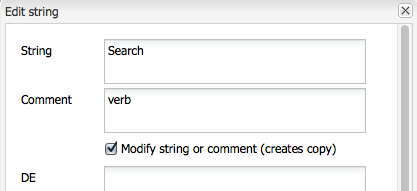

# 使用翻譯工具管理字典{#using-translator-to-manage-dictionaries}

AEM提供主控台，可管理元件UI中使用的各種文字翻譯。 此控制台可在

`https://<hostname>:<port-number>/libs/cq/i18n/translator.html`

使用翻譯工具管理英文字串及其翻譯。 字典是在存放庫中建立，例如/apps/myproject/i18n。

請注意，翻譯工具和您管理的字典是用於以不同語言呈現元件UI。 如果您想要翻譯頁面或使用者產生的內容，請參閱 [轉譯多語言網站的內容](/help/sites-administering/translation.md) 和 [翻譯使用者產生的內容](/help/communities/translate-ugc.md).

>[!CAUTION]
>
>僅編輯為您的專案建立且位於 `/apps`.
>
>AEM系統字典也可在此工具中使用。 請勿變更AEM系統字典，因為這可能會造成AEM UI問題。 此外，升級時可能會遺失變更。 AEM系統字典位於 `/libs`.

>[!NOTE]
>
>雖然「翻譯工具」具有傳統的UI介面，但它用於翻譯片語，而不管找到這些片語的介面為何。

翻譯器列出AEM中使用的各種語言翻譯的文本：


您可以搜尋、篩選及編輯英文和翻譯的文字。 您也可以將字典匯出為XLIFF格式以進行轉譯，然後將翻譯匯回字典。

您也可以從此主控台將i18n字典新增至翻譯專案。 您可以建立新專案或新增至現有專案。

1. 按一下 **翻譯字典**.

   

1. 視需要選取「建立」或「新增」選項。 對話方塊隨即開啟。

   

1. 視需要填寫欄位，然後按一下「確定」。 

1. 您現在可以按一下 **確定** 或參閱Target字典。

   >[!NOTE]
   >
   >如需翻譯專案的詳細資訊，請參閱 [管理翻譯專案](/help/sites-administering/tc-manage.md).

## 建立字典 {#creating-a-dictionary}

建立字典以管理本地化的UI字串。 建立字典後，可以使用翻譯工具來管理它。

1. 使用CRXDE Lite，新增根節點( `sling:Folder`)，以作為存放語言定義的結構：

   ` /apps/<projectName>/i18n`

   例如, `/apps/myProject/i18n`

1. 在此根下添加所需的語言結構。 例如：

   ```shell
   /apps/myProject/i18n [sling:Folder]
       - de.json [nt:file] [mix:language]
           + jcr:language = de
       - fr.json [nt:file] [mix:language]
           + jcr:language = fr
   ```

   >[!NOTE]
   >
   >這是 [Sling i18n模組](https://sling.apache.org/site/internationalization-support.html).

1. 重新載入翻譯器和字典路徑(例如 `/apps/myProject/i18n`)即可供工具列的下拉式選取器使用。 選擇此選項可開始添加字串及其翻譯。

   >[!NOTE]
   >
   >翻譯器只會儲存路徑下實際存在的語言的翻譯(例如 `/apps/myProject/i18n`)。
   >
   >請確定這些語言對應至格線中顯示的語言。

## 管理字典字串 {#managing-dictionary-strings}

使用翻譯工具管理字典中的字串。 您可以新增、修改和移除英文字串，也可提供翻譯的字串。

>[!CAUTION]
>
>僅編輯為您的專案建立且位於 `/apps`.
>
>請勿變更AEM系統字典，因為這可能會造成AEM UI問題。 此外，升級時可能會遺失變更。 AEM系統字典位於 `/libs`.

### 添加、更改和刪除字串 {#adding-changing-and-removing-strings}

將英文字串添加到元件已國際化的字典中。 僅添加國際化的字串，這樣您就不會通過轉換未使用的字串來浪費資源。

您新增至字典的字串必須與程式碼中指定的字串完全相符。 如果程式碼中使用的預設英文字串與字典中的英文字串不符，則視需要翻譯的字串不會出現在UI中。 字串區分大小寫。

**提供翻譯提示**

使用字典字串的Commenet屬性向翻譯者提供資訊以釐清字串的意義。 通常，UI會協助使用者判斷模糊字詞的含義。 不過，轉譯器在UI的內容中不會看到字串。 翻譯提示可消除模糊。 例如，注釋有助於翻譯人員了解英文單詞Request是作為名詞而不是動詞。

翻譯提示還能區分相同且含義不同的字串。 例如，Search可以是名詞或動詞，需要字典中兩個「Search」項，並有兩個不同的翻譯提示。 要求字串的程式碼也包含翻譯提示，以便在UI中使用正確的字串。

**包括索引變數**

在本地化字串中加入變數，將內容含義建置至句子中。 例如，登入Web應用程式後，首頁會顯示訊息「歡迎返回管理員」。 收件箱中有2條郵件。」 頁面內容會決定使用者名稱和訊息數量。

若要在本地化字串中加入變數，請將括弧內的索引放置在get方法第一個引數中變數的位置。 請使用本地化提示來說明值。 翻譯者必須了解變數的意義，因為不同語言使用不同的句子結構。

請注意 [請求翻譯字串的代碼](/help/sites-developing/i18n-dev.md#including-variables-in-localized-sentences) 根據上下文提供索引變數的值。

例如，當使用者登入網站且包含在字典中時，會顯示下列字串：

`Welcome back {0}. You have {1} messages.`

以下備注說明變數：

`{0} = the user name, {1} = the number of items in the user's inbox`

**修改字串**

變更或移除程式碼中已變更或移除的英文字串。 當您變更字串時，原始字串會持續存在，並會產生反映變更的新字串。 移除字串之前，請確定沒有程式碼使用該字串。

請依照下列程式新增字串。

1. 在「字典」下拉式功能表中，選取您要新增字串的字典。 在下拉式功能表中，字典由其在存放庫中的路徑表示。
1. 在「字串和翻譯」表格上方，按一下「新增」。

   

1. 在新增字串對話方塊的字串方塊中，輸入英文字串。 在「注釋」框中，為翻譯鍵入翻譯提示（如有必要）。
1. 按一下「確定」。
1. 按一下「儲存」。

   

使用以下過程更改字典中的字串。

1. 在「字典」下拉式功能表中，選取包含要變更之字串的字典。
1. 按兩下要更改的字串。
1. 在「編輯字串」對話框中，選擇「修改字串」或「注釋」（建立副本）。

   

1. 修改字串或注釋，然後按一下「確定」。
1. 按一下「儲存」。

   

使用以下過程從字典中刪除字串。

1. 在「字典」下拉式功能表中，選取您要移除字串的字典。
1. 按一下移除。

   

1. 按一下「儲存」。

   

### 搜尋字串 {#searching-for-strings}

「轉換器」工具底部的搜索欄提供了字串選擇選項：

* **依文字篩選：** 與英文字串、註解或翻譯相符的模式。 只有符合模式全部或部分的項目才會出現在表格中。
* **變更：任何、已修改、新建、已刪除：** 顯示已變更且未儲存的項目。

   * 任何：顯示已修改、新增或移除的項目。
   * 已修改：顯示已變更的項目。
   * 新增：顯示已新增的項目。
   * 已刪除：顯示要移除的項目。
   * 多個選擇：顯示具有所有所選屬性的項目。

* **有評論**:顯示具有筆譯員注釋的項目。
* **缺少翻譯：** 顯示至少有一個語言沒有翻譯的項目。


1. 在搜尋列上，選取篩選選項。
1. 若要使用選項進行篩選，請按一下「篩選」。
1. 若要移除篩選器並查看字典中的所有項目，請按一下清除。

### 編輯翻譯的字串 {#editing-translated-strings}

將英文字串新增至字典後，您可以新增字串的翻譯。 您也可以 [匯出字典](/help/sites-developing/i18n-translator.md#exporting-a-dictionary) 由第三方翻譯。

1. 選擇 [您的專案特定字典](#creating-a-dictionary) 因為它指定了儲存庫中保存翻譯的路徑。 例如，選取 **字典** 如下：

   `/apps/myProject/i18n`

   >[!CAUTION]
   >
   >僅編輯為您的專案建立且位於 `/apps`.
   >
   >AEM系統字典也可在此工具中使用。 請勿變更AEM系統字典，因為這可能會造成AEM UI問題。 此外，升級時可能會遺失變更。 AEM系統字典位於 `/libs`.

1. 若要編輯其中一個字串的翻譯文本，您可以執行以下操作：

   * 按兩下所需字串的適當語言以編輯該單一文字：

   

   * 按兩下 **字串** 或 **註解** 用於開啟 **編輯字串** 對話框，視需要編輯翻譯，然後按一下 **確定** 若要關閉對話方塊：

   

1. 按一下 **儲存** 在工具列中，提交變更。

   >[!NOTE]
   >
   >按一下 **重設和重新整理** (而非 **儲存**)會回復先前文字的任何變更。

## 使用第三方翻譯人員 {#using-third-party-translators}

為支援使用第三方翻譯服務，翻譯工具允許您導出和導入字典。

### 匯出字典 {#exporting-a-dictionary}

將字典匯出至XLIFF檔案，讓協力廠商服務可翻譯字典字串。

* 匯出字典，並包含語言的英文和翻譯詞語。
* 匯出部分或全部英文字串。

導出XLIFF檔案並包含語言時，儲存庫中字典的節點結構必須包含該語言。 如果未包含該語言，則會發生錯誤。 例如，要導出法文XLIFF檔案，字典資料夾必須包含 `mix:language` 子節點已命名 `fr`. (請參閱 [建立字典](/help/sites-developing/i18n-translator.md#creating-a-dictionary).)

使用以下過程導出特定語言的XLIFF檔案。

1. 開啟翻譯工具 `http://<host>:<port>/libs/cq/i18n/translator.html`
1. 使用「字典」下拉式功能表來選取要匯出的字典。
1. 按一下「導出」>「導出完整」 *XX* Xliff選項，其中 *XX* 是雙字母語言代碼，如DE或FR。

   「XLIFF檔案」（XLIFF檔案）將在新頁簽或窗口中開啟。

1. 使用Web瀏覽器命令將頁面另存為檔案系統上的檔案，如「檔案」(File)>「另存為」(Save Page As)。

請依照下列步驟，匯出全部或部分英文字串。

1. 開啟「翻譯」工具。 `http://<host>:<port>/libs/cq/i18n/translator.html`
1. 使用「字典」下拉式功能表來選取要匯出的字典。
1. 如果要匯出字串的子集，請選取要匯出的字典中的項目。 選擇任何項目將導出所有項目。
1. 按一下「匯出>將選取項目匯出為Xliff」（僅限字串）。
1. 在出現的對話方塊中，複製文字並貼到文字檔案中。

### 匯入字典 {#importing-a-dictionary}

將XLIFF檔案匯入字典以填入字典。 當字典包含英文字串的翻譯，而XLIFF檔案包含相同字串的不同翻譯時，將替換字典翻譯。

1. 開啟翻譯工具 `http://<host>:<port>/libs/cq/i18n/translator.html`
1. 按一下「導入」(Import)>「XLIFF翻譯」(XLIFF Translations)。
1. 選擇要導入的檔案，然後按一下「確定」。

## 管理支援的語言 {#managing-supported-lanuages}

新增或移除翻譯工具支援以及提供給網頁使用者的語言。

### 更改字典表中列出的語言 {#changing-languages-listed-in-the-dictionary-table}

「翻譯工具」在字典表中包含以下語言：

* de — 德文
* fr — 法文
* it — 義大利文
* es — 西班牙文
* ja — 日文
* pt-br — 巴西葡萄牙文
* zh-cn — 簡體中文
* zh-tw — 繁體中文（有限支援）
* ko-kr — 朝鮮語

使用以下過程添加或刪除語言。

1. 使用CRXDE Lite建立新節點：

   `/etc/languages`

1. 在此節點上，建立屬性：

   * **名稱**: `languages`
   * **類型**: `Multi-String`
   * **值**:要顯示的語言清單。 例如：

      * fr
      * es

   >[!NOTE]
   >
   >語言代碼必須為小寫。

1. 按一下 **全部儲存** 在CRXDE Lite中，並重新載入翻譯器。 將更新格線以顯示定義的語言。

   >[!NOTE]
   >
   >翻譯者只會儲存實際上 [在字典里](#creating-a-dictionary) (亦即在字典路徑下，例如 `/apps/myProject/i18n`)。
   >
   >請確定這些語言對應至格線中顯示的語言。

### 讓作者能使用語言 {#making-languages-available-to-authors}

為AEM例項新的語言定義字典後，您需要讓作者可以選取該語言(例如，以用於 **偏好設定**):

1. 若要變更可用語言的清單，請參閱 **偏好設定** 的 **安全性** 主控台：

   1. 在您的應用程式程式碼中建立覆蓋，以執行下列作業：

      ```
              /libs/cq/security/widgets/source/widgets/security/Preferences.js
       and update as required.
      ```

1. 若要讓語言在 **偏好設定** 從 **網站** 主控台時，您必須在應用程式中進行下列變更：

   1. 在下面為結構建立覆蓋：

      `/libs/cq/security/content/tools/userProperties`

   1. 覆蓋內會更新下方的語言清單：

      `items/common/items /lang/options`

1. 儲存所有內容並重新載入適當的主控台。

### 更改語言名稱和預設國家 {#changing-language-names-and-default-countries}

各國都使用同樣的語言，例如美國、英國和澳大利亞都使用英語。 這會以指出語言和國家/地區的程式碼來表示，例如 `en_US`, `en_GB` 和 `en_AU`.

顯示標幟時會使用預設國家（地區）（例如在語言復本對話方塊中），而用來解析語言代碼的國家（地區）。

>[!NOTE]
>
>對於由上面的翻譯器管理的本地化，只有確切的語言才有效。 如果語言偏好設定下拉式清單使用 `en_uk`，必須 `en_uk` 字典。

若要變更預設定義：

1. 語言清單儲存在下：

   `/libs/wcm/core/resources/languages`

   將其複製至：

   `/apps/wcm/core/resources/languages`

   然後在那裡更改或擴展清單。 屬性 `defaultCountry` 在語言節點(例如 `ja`)必須包含完整程式碼，例如 `ja_jp`，定義 `jp` 作為語言的預設國家/地區 `ja`.

1. 更新 **CQ WCM語言管理員**.

   * **語言清單**:

      存放庫中語言清單的路徑。 將此值設為用來覆蓋的位置：

      ```
             /apps/wcm/core/resources/languages
      ```
   您可以使用OSGi Web控制台執行此操作：

   ```shell
   https://<hostname>:<port-number>/system/console/configMgr/com.day.cq.wcm.core.impl.LanguageManagerImpl
   ```

## 發佈字典 {#publishing-dictionaries}

將字典併入AEM應用程式的發行管理程式。 例如，將字典包含在應用程式的內容套件中，以部署至發佈例項。 此策略提供下列優點：

* 字典適用於其發佈環境中的元件。
* 元件UI字串的變更會與更新的翻譯一併部署。

同樣地，測試字典字串也應在您正常的軟體開發生命週期中執行。

>[!NOTE]
>
>字典不應使用一般發佈功能或復寫。 字典的處理方式應與程式碼和設定相同。 這包括使用原始碼控制項來追蹤變更，以及使用內容套件將變更套用至製作和發佈。

>[!NOTE]
>
>使用Dispatcher時，您必須 [使快取頁面無效](https://helpx.adobe.com/experience-manager/dispatcher/using/page-invalidate.html) 在已轉譯的元件字串中加入新的字典字串。
