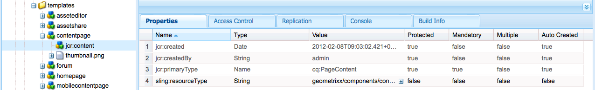

# 頁面範本——靜態{#page-templates-static}

「範本」可用來建立「頁面」，並定義哪些元件可在選取範圍內使用。 範本是節點的階層，其結構與要建立的頁面相同，但沒有任何實際內容。

每個範本都會提供可供使用的元件選擇。

* 範本由元件組 [成](/help/sites-developing/components.md);
* 元件使用並允許存取Widget，而這些元件則用來轉換內容。

>[!NOTE]
>
>[也提供可編輯的範本](/help/sites-developing/page-templates-editable.md) ，而且是建議的範本類型，以提供最大的彈性和最新功能。

## 模板的屬性和子節點 {#properties-and-child-nodes-of-a-template}

範本是類型cq:Template的節點，具有下列屬性和子節點：

<table>
 <tbody>
  <tr>
   <td><strong>名稱   </strong></td>
   <td><strong>類型   </strong></td>
   <td><strong>說明   </strong></td>
  </tr>
  <tr>
   <td>.   </td>
   <td> cq:Template</td>
   <td>目前範本。 範本為節點類型cq:Template。  </td>
  </tr>
  <tr>
   <td> allowedChildren </td>
   <td> String[]</td>
   <td>Path of a template that is allowed to be a child of this template.  </td>
  </tr>
  <tr>
   <td> allowedParents</td>
   <td> String[]</td>
   <td>Path of a template that is allowed to be a parent of this template.  </td>
  </tr>
  <tr>
   <td> allowedPaths</td>
   <td> String[]</td>
   <td>允許基於此模板的頁面的路徑。  </td>
  </tr>
  <tr>
   <td> jcr:created</td>
   <td> 日期</td>
   <td>範本的建立日期。  </td>
  </tr>
  <tr>
   <td> jcr:description</td>
   <td> 字串</td>
   <td>範本說明。  </td>
  </tr>
  <tr>
   <td> jcr:title</td>
   <td> 字串</td>
   <td>Title of the template.  </td>
  </tr>
  <tr>
   <td> 排名</td>
   <td> 長整數</td>
   <td>範本的排名。 用於在「使用者介面」中顯示範本。  </td>
  </tr>
  <tr>
   <td> jcr:content</td>
   <td> cq:PageContent</td>
   <td>包含範本內容的節點。  </td>
  </tr>
  <tr>
   <td> thumbnail.png</td>
   <td> nt：檔案</td>
   <td>範本的縮圖。  </td>
  </tr>
  <tr>
   <td> icon.png</td>
   <td> nt：檔案</td>
   <td>範本圖示。  </td>
  </tr>
 </tbody>
</table>

範本是頁面的基礎。

要建立頁面，必須將模板(節點——樹 `/apps/<myapp>/template/<mytemplate>`)複製到站點——樹中的相應位置：如果使用「網站」標籤建立頁面，就會發 **生這** 些。

此複製動作也會提供頁面的初始內容（通常為僅限Top-Level Content）和屬性sling:resourceType，用於呈現頁面的頁面元件路徑（子節點jcr:content中的所有項目）。

## 範本的結構方式 {#how-templates-are-structured}

需要考慮兩個方面：

* 範本本身的結構
* 使用範本時產生的內容結構

### 範本結構 {#the-structure-of-a-template}

在類型為 **cq:Template的節點下建立模板**。

可以設定各種屬性，特別是：

* **jcr:title** —— 範本的title;顯示在對話框中。
* **jcr:description** —— 模板的說明；顯示在對話框中。

此節點包含一個jcr:content(cq:PageContent)節點，作為生成頁面的內容節點的基礎；此參考，使用sling:resourceType，即用於呈現新頁面實際內容的元件。

此元件用於定義建立新頁面時的內容結構與設計。

### 範本產生的內容 {#the-content-produced-by-a-template}

範本可用來建立類型的頁 `cq:Page` 面（如前所述，頁面是特殊類型的元件）。 每個AEM頁面都有結構化節點 `jcr:content`。 此：

* 是cq:PageContent類型
* 是包含已定義內容定義的結構化節點類型
* has a property `sling:resourceType` to reference component honding the sling scripts used for rendering content

### 預設範本 {#default-templates}

AEM隨附許多預設範本，現已推出。 在某些情況下，您可能會想要依原樣使用範本。 在這種情況下，您需要確保該範本適用於您的網站。

例如，AEM隨附數個範本，包括內容頁面和首頁。

| **標題** | **元件** | **位置** | **目的** |
|---|---|---|---|
| 首頁 | 首頁 | geometrixx | Geometrixx首頁範本。 |
| 內容頁面 | contentpage | geometrixx | Geometrixx內容頁面範本。 |

#### 顯示預設模板 {#displaying-default-templates}

要查看儲存庫中所有模板的清單，請按如下步驟進行：

1. 在CRXDE Lite中，開啟「工具 **」功能表** ，然後按一 **下「查詢」**。

1. 在「查詢」頁籤中
1. 作為 **類型**，選擇 **XPath**。

1. 在「查 **詢輸入** 」欄位中，輸入下列字串：//element(*, cq:Template)

1. 按一下 **執行**。 清單將顯示在結果框中。

在大多數情況下，您會取用現有的範本，並開發新範本供您自用。 如需詳 [細資訊，請參閱開發頁面範本](#developing-page-templates) 。

若要為您的網站啟用現有範本，並希望在從 **Websites** ******** Console的「網站」下建立頁面時，將其顯示在「建立頁面」對話方塊中，請將範本節點的allowedPaths屬性設為： **/content(/)。*)?**

## 範本設計的套用方式 {#how-template-designs-are-applied}

當使用 [Design Mode在UI中定義樣式時](/help/sites-authoring/default-components-designmode.md)，設計會保留在要為其定義樣式的內容節點的確切路徑上。

>[!CAUTION]
>
>Adobe建議僅透過設計模式 [套用設計](/help/sites-authoring/default-components-designmode.md)。
>
>例如，在CRX DE中修改設計並非最佳實務，而且這種設計的應用可能與預期行為不同。

如果設計僅使用「設計模式」應用，則以下幾節、「設 [計路徑解析度](/help/sites-developing/page-templates-static.md#design-path-resolution)」( [Design Path Resolution](/help/sites-developing/page-templates-static.md#decision-tree))、「 [決策樹」(Decision Tree](/help/sites-developing/page-templates-static.md#example) )和「Example」（示例）不適用。

### 設計路徑解析度 {#design-path-resolution}

當根據靜態範本轉譯內容時，AEM會嘗試根據內容階層的遍歷，將最相關的設計和樣式套用至內容。

AEM會依下列順序決定內容節點最相關的樣式：

* 如果內容節點有完整且精確的路徑設計（如設計模式中定義設計時），則使用該設計。
* 如果父代的內容節點有設計，則使用該設計。
* 如果內容節點路徑上有任何節點有設計，則使用該設計。

在最後兩種情況中，如果有多個適用的設計，請使用最接近內容節點的設計。

### 決策樹 {#decision-tree}

這是設計路徑解析度邏 [輯的圖形表示](/help/sites-developing/page-templates-static.md#design-path-resolution) 。

### 例如 {#example}

請考慮如下簡單的內容結構，其中設計可以應用到任何節點：

`/root/branch/leaf`

下表說明AEM將如何選擇設計。

<table>
 <tbody>
  <tr>
   <td><strong>尋找適合  </strong></td>
   <td><strong>適用於  </strong></td>
   <td><strong>選擇的設計  </strong></td>
   <td><strong>評論</strong></td>
  </tr>
  <tr>
   <td><code class="code">leaf
      </code></td>
   <td>
<code>root</code>
 
<code>branch</code>
 
<code>leaf</code>
 </td>
   <td><code>leaf</code></td>
   <td>最精確的比對一律採用。  </td>
  </tr>
  <tr>
   <td><code>leaf</code></td>
   <td>
<code>root</code>
 
<code>branch</code>
 </td>
   <td><code>branch</code></td>
   <td>倒回樹下最接近的匹配位置。</td>
  </tr>
  <tr>
   <td><code>leaf</code></td>
   <td><code>root</code></td>
   <td><code>root</code></td>
   <td>如果所有的失敗，就拿下剩下的。  </td>
  </tr>
  <tr>
   <td><code>branch</code></td>
   <td><code>branch</code></td>
   <td><code>branch</code></td>
   <td> </td>
  </tr>
  <tr>
   <td><code>branch</code></td>
   <td>
<code>branch</code>
 
<code class="code">leaf
       </code>
 </td>
   <td><code>branch</code></td>
   <td> </td>
  </tr>
  <tr>
   <td><code>branch</code></td>
   <td>
<code>root</code>
 
<code class="code">branch
       </code>
 </td>
   <td><code>branch</code></td>
   <td> </td>
  </tr>
  <tr>
   <td><code>branch</code></td>
   <td>
<code>root</code>
 
<code class="code">leaf
       </code>
 </td>
   <td><code>root</code></td>
   <td>
如果沒有完全匹配，請將樹中的下一個取下。
 
假設這永遠適用，但樹狀結構可能過於具體。  
 </td>
  </tr>
 </tbody>
</table>

## 開發頁面範本 {#developing-page-templates}

AEM頁面範本只是用來建立新頁面的模型。 它們可視需要包含最少或最多的初始內容，其角色是建立正確的初始節點結構，而必要的屬性（主要是sling:resourceType）已設定為允許編輯和演算。

### 建立新範本（根據現有範本） {#creating-a-new-template-based-on-an-existing-template}

不用說可以完全從頭開始建立新範本，但通常會複製並更新現有的範本，以節省您的時間和精力。 例如，Geometrixx中的範本可用來協助您開始使用。

要基於現有模板建立新模板，請執行以下操作：

1. 將現有範本（最好以您想要達到的定義盡可能接近）複製到新節點。

   範本通常儲存在 **/apps/&lt;website-name>/templates/&lt;template-name>中**。

   >[!NOTE]
   >
   >可用的範本清單取決於新頁面的位置以及每個範本中指定的位置限制。 請參閱 [範本可用性](#templateavailibility)。

1. 變更 **新範本節點的jcr:title** ，以反映其新角色。 您也可以視需要 **更新jcr:description** 。 請務必視需要變更頁面的範本可用性。

   >[!NOTE]
   >
   >如果您希望範本在從 **Websites** **Console的「網站** 」下建立頁面時顯示在「建立頁面」對話方 ****`allowedPaths` 塊中，請將範本節點的屬性設為： `/content(/.*)?`

   

1. 複製範本所依據的元件(這由範本內 **jcr:content** node的sling:resourceType **** 屬性指示)以建立新例項。

   元件通常儲存在 **/apps/&lt;website-name>/components/&lt;component-name>中**。

1. 更新 **新元件的jcr:title****和jcr:description** 。
1. 如果您想要在範本選擇清單中顯示新的縮圖圖片，請取代thumbnail.png（大小為128 x 98 px）。
1. 更新 **範本的** jcr:content **node的sling:resourceType** ，以參考新元件。
1. 對範本及／或其基礎元件的功能或設計進行進一步的變更。

   >[!NOTE]
   >
   >對 **** /apps/&lt;website>/templates/&lt;template-name>節點所做的變更將影響模板實例（如在選擇清單中）。
   對 **** /apps/&lt;website>/components/&lt;component-name>節點所做的變更，將會影響使用範本時建立的內容頁面。

   您現在可以使用新範本在網站中建立頁面。

>[!NOTE]
編輯器用戶端程式庫會假設內容頁面 `cq.shared` 中存在命名空間，如果它不存在，則會產生JavaScript `Uncaught TypeError: Cannot read property 'shared' of undefined` 錯誤。
所有範例內容頁面都 `cq.shared`包含，因此任何以它們為基礎的內容都會自動包含 `cq.shared`。 不過，如果您決定從頭開始建立您自己的內容頁面，而不以範例內容為基礎，則必須確定包含命名空間 `cq.shared` 。
如需 [詳細資訊，請參閱使用用戶端程式庫](/help/sites-developing/clientlibs.md) 。

## 使現有範本可用 {#making-an-existing-template-available}

此範例說明如何允許範本用於特定內容路徑。 建立新頁面時頁面作者可用的範本，由「範本可用性」中定義的邏輯 [決定](/help/sites-developing/templates.md#template-availability)。

1. 在CRXDE Lite中，導覽至您要用於頁面的範本，例如電子報範本。
1. 變更用 `allowedPaths` 於範本可用性的屬性 [和其他屬性](/help/sites-developing/templates.md#template-availability)。 例如， `allowedPaths`:表 `/content/geometrixx-outdoors/[^/]+(/.*)?` 示此範本可在下列任何路徑中使用 `/content/geometrixx-outdoors`。

   
