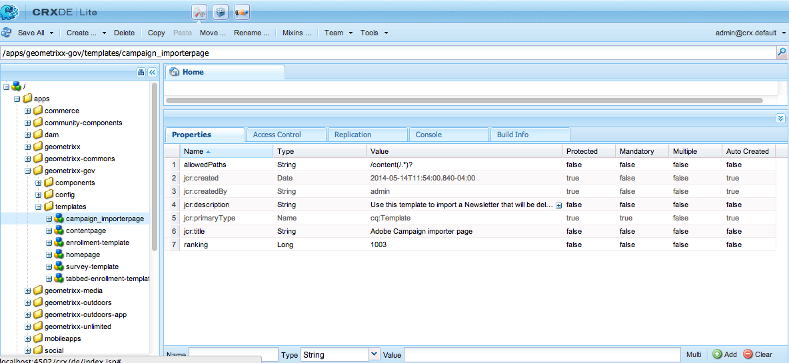

# 頁面範本 — 靜態{#page-templates-static}

模板用於建立頁面，並定義哪些元件可在選定範圍內使用。 範本是節點的階層，其結構與要建立的頁面相同，但沒有任何實際內容。

每個範本都會提供一系列可供使用的元件。

* 範本由 [元件](/help/sites-developing/components.md);
* 元件使用和允許訪問介面工具集，這些元件用於呈現內容。

>[!NOTE]
>
>[可編輯的範本](/help/sites-developing/page-templates-editable.md) 也提供，是最具彈性和最新功能的建議範本類型。

## 模板的屬性和子節點 {#properties-and-child-nodes-of-a-template}

範本是cq:Template類型的節點，具有以下屬性和子節點：

<table>
 <tbody>
  <tr>
   <td><strong>名稱   </strong></td>
   <td><strong>類型   </strong></td>
   <td><strong>說明   </strong></td>
  </tr>
  <tr>
   <td>.   </td>
   <td> cq:Template</td>
   <td>目前的範本。 範本的節點類型為cq:Template。  </td>
  </tr>
  <tr>
   <td> allowedChildren </td>
   <td> String[]</td>
   <td>允許作為此模板子項的模板的路徑。  </td>
  </tr>
  <tr>
   <td> allowedParents</td>
   <td> 字串[]</td>
   <td>允許作為此模板父項的模板的路徑。  </td>
  </tr>
  <tr>
   <td> allowedPaths</td>
   <td> 字串[]</td>
   <td>允許基於此模板的頁的路徑。  </td>
  </tr>
  <tr>
   <td> jcr:created</td>
   <td> 日期</td>
   <td>模板的建立日期。  </td>
  </tr>
  <tr>
   <td> jcr:description</td>
   <td> 字串</td>
   <td>範本說明。  </td>
  </tr>
  <tr>
   <td> jcr:title</td>
   <td> 字串</td>
   <td>範本的標題。  </td>
  </tr>
  <tr>
   <td> 排名</td>
   <td> 長整數</td>
   <td>範本的排名。 用於在使用者介面中顯示範本。  </td>
  </tr>
  <tr>
   <td> jcr:content</td>
   <td> cq:PageContent</td>
   <td>包含範本內容的節點。  </td>
  </tr>
  <tr>
   <td> thumbnail.png</td>
   <td> nt:file</td>
   <td>範本縮圖。  </td>
  </tr>
  <tr>
   <td> icon.png</td>
   <td> nt:file</td>
   <td>範本圖示。  </td>
  </tr>
 </tbody>
</table>

範本是頁面的基礎。

要建立頁面，必須複製模板（節點樹） `/apps/<myapp>/template/<mytemplate>`)到站點樹中的對應位置：若使用 **網站** 標籤。

此複製動作也會提供頁面的初始內容（通常僅限頂層內容）和屬性sling:resourceType，用於轉譯頁面的頁面元件路徑（子節點jcr:content中的所有內容）。

## 範本的結構方式 {#how-templates-are-structured}

需要考慮兩個方面：

* 模板本身的結構
* 使用範本時產生的內容結構

### 範本的結構 {#the-structure-of-a-template}

在類型的節點下建立模板 **cq：範本**.

可以設定各種屬性，特別是：

* **jcr:title**  — 範本標題；建立頁面時顯示在對話方塊中。
* **jcr:description**  — 範本說明；建立頁面時顯示在對話方塊中。

此節點包含jcr:content(cq:PageContent)節點，可作為產生頁面之內容節點的基礎；這會參考，使用sling:resourceType，用於轉譯新頁面實際內容的元件。

建立新頁面時，此元件用於定義內容的結構和設計。

### 範本產生的內容 {#the-content-produced-by-a-template}

範本可用來建立類型的頁面 `cq:Page` （如前所述，頁面是特殊類型的元件）。 每個AEM頁面都有結構化節點 `jcr:content`. 此特性：

* 屬於cq:PageContent類型
* 是包含定義內容定義的結構化節點類型
* 有屬性 `sling:resourceType` 以參考保有用於轉譯內容的sling指令碼的元件

### 預設範本 {#default-templates}

AEM隨附許多可立即使用的預設範本。 在某些情況下，您可能會想要依原樣使用範本。 在此情況下，您必須確保範本可供您的網站使用。

例如，AEM隨附數個範本，包括內容頁面和首頁。

| **標題** | **Component** | **位置** | **用途** |
|---|---|---|---|
| 首頁 | homepage | geometrixx | Geometrixx首頁模板。 |
| 內容頁面 | contentpage | geometrixx | Geometrixx內容頁面範本。 |

#### 顯示預設模板 {#displaying-default-templates}

要查看儲存庫中所有模板的清單，請按如下步驟操作：

1. 在CRXDE Lite中，開啟 **工具** 按一下 **查詢**.

1. 在查詢索引標籤中
1. As **類型**，選取 **XPath**.

1. 在 **查詢** 輸入欄位，輸入下列字串：//element(&#42;, cq：範本)

1. 按一下 **執行**. 清單顯示在結果框中。

在大多數情況下，您會取用現有範本，並開發新範本供您自用。 請參閱 [開發頁面範本](#developing-page-templates) 以取得更多資訊。

若要啟用網站的現有範本，且您希望該範本顯示在 **建立頁面** 對話方塊 **網站** 從 **網站** 控制台，將範本節點的allowedPaths屬性設定為： **/content(/)。&#42;)?**

## 如何套用範本設計 {#how-template-designs-are-applied}

當在UI中定義樣式時，使用 [設計模式](/help/sites-authoring/default-components-designmode.md)，則設計會保存在要為其定義樣式的內容節點的確切路徑上。

>[!CAUTION]
>
>Adobe建議僅透過 [設計模式](/help/sites-authoring/default-components-designmode.md).
>
>例如，在CRX DE中修改設計並非最佳作法，且此類設計的應用可能會與預期行為不同。

如果僅使用「設計模式」應用設計，則以下各節 [設計路徑解析度](/help/sites-developing/page-templates-static.md#design-path-resolution), [決策樹](/help/sites-developing/page-templates-static.md#decision-tree)，和 [範例](/help/sites-developing/page-templates-static.md#example) 不適用。

### 設計路徑解析度 {#design-path-resolution}

根據靜態範本轉譯內容時，AEM會嘗試根據內容階層的周遊情形，將最相關的設計和樣式套用至內容。

AEM會依下列順序決定內容節點最相關的樣式：

* 如果有內容節點完整且精確路徑的設計（如在「設計模式」中定義設計時），則使用該設計。
* 如果父項的內容節點有設計，則使用該設計。
* 如果內容節點路徑上的任何節點都有設計，則使用該設計。

在最後兩種情況中，如果有多個適用的設計，請使用最接近內容節點的設計。

### 決策樹 {#decision-tree}

這是 [設計路徑解析度](/help/sites-developing/page-templates-static.md#design-path-resolution) 邏輯。

### 範例 {#example}

請考慮如下的簡單內容結構，其中設計可應用於任何節點：

`/root/branch/leaf`

下表說明AEM將如何選擇設計。

<table>
 <tbody>
  <tr>
   <td><strong>尋找設計  </strong></td>
   <td><strong>設計適用於  </strong></td>
   <td><strong>已選擇設計  </strong></td>
   <td><strong>評論</strong></td>
  </tr>
  <tr>
   <td><code class="code">leaf
      </code></td>
   <td>
<code>root</code>
 
<code>branch</code>
 
<code>leaf</code>
 </td>
   <td><code>leaf</code></td>
   <td>最準確的匹配總是被採用。  </td>
  </tr>
  <tr>
   <td><code>leaf</code></td>
   <td>
<code>root</code>
 
<code>branch</code>
 </td>
   <td><code>branch</code></td>
   <td>回復到樹下最接近的匹配。</td>
  </tr>
  <tr>
   <td><code>leaf</code></td>
   <td><code>root</code></td>
   <td><code>root</code></td>
   <td>如果其他所有的都失敗了，就拿走剩下的。  </td>
  </tr>
  <tr>
   <td><code>branch</code></td>
   <td><code>branch</code></td>
   <td><code>branch</code></td>
   <td> </td>
  </tr>
  <tr>
   <td><code>branch</code></td>
   <td>
<code>branch</code>
 
<code class="code">leaf
       </code>
 </td>
   <td><code>branch</code></td>
   <td> </td>
  </tr>
  <tr>
   <td><code>branch</code></td>
   <td>
<code>root</code>
 
<code class="code">branch
       </code>
 </td>
   <td><code>branch</code></td>
   <td> </td>
  </tr>
  <tr>
   <td><code>branch</code></td>
   <td>
<code>root</code>
 
<code class="code">leaf
       </code>
 </td>
   <td><code>root</code></td>
   <td>
如果沒有完全匹配，請取樹中的下一個。
 
假設這一點永遠適用，但樹狀結構可能過於具體。  
 </td>
  </tr>
 </tbody>
</table>

## 開發頁面範本 {#developing-page-templates}

AEM頁面範本只是用來建立新頁面的模型。 它們可視需要包含盡量少或多的初始內容，其角色為建立正確的初始節點結構，並將必要屬性（主要是sling:resourceType）設為允許編輯和轉譯。

### 建立新範本（根據現有範本） {#creating-a-new-template-based-on-an-existing-template}

不用說，您可以從頭開始完全建立新範本，但經常會複製並更新現有範本，以節省時間和精力。 例如，您可以使用Geometrixx中的範本來開始使用。

要根據現有模板建立新模板：

1. 將現有範本（最好以盡可能接近您想要達到的定義）複製到新節點。

   範本通常儲存在 **/apps/&lt;website-name>/templates/&lt;template-name>**.

   >[!NOTE]
   >
   >可用的範本清單取決於新頁面的位置，以及每個範本中指定的位置限制。 請參閱 [範本可用性](#templateavailibility).

1. 變更 **jcr:title** 來反映其新角色。 您也可以更新 **jcr:description** 如果合適。 請務必視需要變更頁面的範本可用性。

   >[!NOTE]
   >
   >如果您希望範本顯示在 **建立頁面** 對話方塊 **網站** 從 **網站** 主控台，設定 `allowedPaths` 模板節點的屬性： `/content(/.*)?`

   

1. 複製範本所依據的元件(以 **sling:resourceType** 屬性 **jcr:content** 節點)以建立新例項。

   元件通常儲存在 **/apps/&lt;website-name>/components/&lt;component-name>**.

1. 更新 **jcr:title** 和 **jcr:description** 新元件。
1. 如果您想要在範本選取清單中顯示新的縮圖圖片，請取代thumbnail.png（大小為128 x 98 px）。
1. 更新 **sling:resourceType** 模板的 **jcr:content** 節點，以參考新元件。
1. 對範本和/或其基礎元件的功能或設計進行任何進一步變更。

   >[!NOTE]
   >
   >對 **/apps/&lt;website>/templates/&lt;template-name>** 節點將影響模板實例（如選擇清單中）。
   對 **/apps/&lt;website>/components/&lt;component-name>** 節點會影響使用範本時建立的內容頁面。

   您現在可以使用新範本在網站中建立頁面。

>[!NOTE]
編輯器用戶端程式庫會假設 `cq.shared` 命名空間（若不存在JavaScript錯誤） `Uncaught TypeError: Cannot read property 'shared' of undefined` 會產生。
所有範例內容頁面都包含 `cq.shared`，因此任何以其為基礎的內容都會自動包含 `cq.shared`. 不過，如果您決定從草稿開始建立自己的內容頁面，而不以範例內容為基礎，則必須確定包含 `cq.shared` 命名空間。
請參閱 [使用用戶端程式庫](/help/sites-developing/clientlibs.md) 以取得更多資訊。

## 讓現有範本可供使用 {#making-an-existing-template-available}

此範例說明如何允許將範本用於特定內容路徑。 建立新頁面時頁面作者可使用的範本，取決於中定義的邏輯 [範本可用性](/help/sites-developing/templates.md#template-availability).

1. 在CRXDE Lite中，導覽至您要用於頁面的範本，例如電子報範本。
1. 變更 `allowedPaths` 用於 [範本可用性](/help/sites-developing/templates.md#template-availability). 例如， `allowedPaths`: `/content/geometrixx-outdoors/[^/]+(/.*)?` 表示允許此範本位於 `/content/geometrixx-outdoors`.

   
