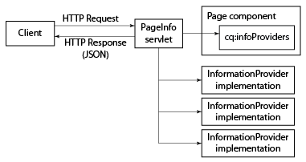

# 取得JSON格式的頁面資訊{#obtaining-page-information-in-json-format}

若要取得頁面資訊，請傳送要求給PageInfo servlet，以取得JSON格式的頁面中繼資料。

PageInfo servlet會傳回關於存放庫中資源的資訊。 Servlet綁定到URL `https://<server>:<port>/libs/wcm/core/content/pageinfo.json` ，並使用`path`參數標識資源。 下列範例URL會傳回`/content/we-retail/us/en`節點的相關資訊：

```shell
http://localhost:4502/libs/wcm/core/content/pageinfo.json?path=/content/we-retail/us/en
```

>[!NOTE]
>
>如果您需要JSON格式的頁面資訊，才能將內容傳送至非傳統AEM網頁的頻道，例如：
>
>* 單頁應用程式
>* 原生行動應用程式
>* AEM外部的其他管道和接觸點

>
>
請參閱[內容服務的JSON匯出工具](/help/sites-developing/json-exporter.md)檔案。

## 頁面資訊提供者{#page-information-providers}

頁面元件可與產生頁面中繼資料的一或多個`com.day.cq.wcm.api.PageInfoProvider`服務相關聯。 PageInfo servlet會呼叫每個PageInfoProvider服務並匯總中繼資料：

1. HTTP用戶端會傳送要求至PageInfo servlet，其中包含頁面的URL。
1. PageInfo servlet會探索哪個元件會轉譯頁面。
1. PageInfo servlet會呼叫與元件相關聯的每個PageInfoProvider。
1. Servlet會匯總每個PageInfoProvider傳回的中繼資料，並將中繼資料新增至JSON物件的HTTP回應。



>[!NOTE]
>
>與PageInfoProviders類似，使用ListInfoProviders以JSON格式更新資訊清單。 （請參閱[自訂網站管理控制台](/help/sites-developing/customizing-siteadmin.md)。）

## 預設頁面資訊提供程式{#default-page-information-providers}

`/libs/foundation/components/page`元件與以下PageInfoProvider服務關聯：

* **預設頁面狀態提供者：** 頁面狀態的相關資訊，例如是否已鎖定、頁面是否為作用中工作流程的裝載，以及頁面可使用的工作流程。
* **即時關係資訊提供者：** 關於多網站管理(MSM)的資訊，例如頁面是否屬於藍色列印，以及是否為即時副本。
* **內容語言Servlet:** 目前頁面的語言，以及頁面可用之語言的相關資訊。
* **工作流程狀態提供者：** 關於執行中以頁面作為裝載之工作流程的狀態資訊。
* **工作流包資訊提供程式：** 有關儲存在儲存庫中的每個工作流包以及每個包是否包含當前資源的資訊。
* **模擬器資訊提供者：** 此資源可用的行動裝置模擬器相關資訊。如果頁面元件未呈現行動頁面，則沒有可用的模擬器。
* **註解資訊提供者：** 頁面上的註解的相關資訊。

例如，PageInfo servlet會為`/content/we-retail/us/en`節點傳回下列JSON回應：

```
{
   "status":{
      "path":"/content/we-retail/us/en",
      "isLocked":false,
      "lockOwner":"",
      "canUnlock":false,
      "lastModified":1467202845038,
      "lastModifiedBy":"admin",
      "timeUntilValid":0,
      "onTime":0,
      "offTime":0,
      "replication":{
         "numQueued":0
      },
      "isDesignable":true,
      "isDeveloper":true
   },
   "isPage":true,
   "pageResourceType":"weretail/components/structure/page",
   "enableFragmentIdentifier":false,
   "workflow":{
      "isRunning":false
   },
   "workflows":{
      "wcm":{
         "models":[
            {
               "wid":"/etc/workflow/models/dam/adddamsize/jcr:content/model",
               "label":"Add Asset Size",
               "label_xss":"Add Asset Size"
            },
            {
               "wid":"/etc/workflow/models/ac-newsletter-workflow-simple/jcr:content/model",
               "label":"Approve for Adobe Campaign",
               "label_xss":"Approve for Adobe Campaign"
            },
            {
               "wid":"/etc/workflow/models/dam/dam-autotag-assets/jcr:content/model",
               "label":"DAM Smart Tag Assets",
               "label_xss":"DAM Smart Tag Assets"
            },
            {
               "wid":"/etc/workflow/models/dam/update_asset/jcr:content/model",
               "label":"DAM Update Asset",
               "label_xss":"DAM Update Asset"
            },
            {
               "wid":"/etc/workflow/models/cloudservices/DTM_bundle_download/jcr:content/model",
               "label":"Default DTM Bundle Download",
               "label_xss":"Default DTM Bundle Download"
            },
            {
               "wid":"/etc/workflow/models/dam/dam_download_asset/jcr:content/model",
               "label":"Download Asset",
               "label_xss":"Download Asset"
            },
            {
               "wid":"/etc/workflow/models/dam/dynamic-media-video-thumbnail-replacement/jcr:content/model",
               "label":"Dynamic Media Video Thumbnail Replacement",
               "label_xss":"Dynamic Media Video Thumbnail Replacement"
            },
            {
               "wid":"/etc/workflow/models/dam/dynamic-media-video-user-uploaded-thumbnail/jcr:content/model",
               "label":"Dynamic Media Video User Uploaded Thumbnail Process",
               "label_xss":"Dynamic Media Video User Uploaded Thumbnail Process"
            },
            {
               "wid":"/etc/workflow/models/projects/approval_workflow/jcr:content/model",
               "label":"Project Approval Workflow",
               "label_xss":"Project Approval Workflow"
            },
            {
               "wid":"/etc/workflow/models/publish_example/jcr:content/model",
               "label":"Publish Example",
               "label_xss":"Publish Example"
            },
            {
               "wid":"/etc/workflow/models/publish_to_campaign/jcr:content/model",
               "label":"Publish to Adobe Campaign",
               "label_xss":"Publish to Adobe Campaign"
            },
            {
               "wid":"/etc/workflow/models/s7dam/request_to_publish_to_youtube/jcr:content/model",
               "label":"Publish to YouTube",
               "label_xss":"Publish to YouTube"
            },
            {
               "wid":"/etc/workflow/models/projects/request_copy/jcr:content/model",
               "label":"Request Copy",
               "label_xss":"Request Copy"
            },
            {
               "wid":"/etc/workflow/models/request_for_activation/jcr:content/model",
               "label":"Request for Activation",
               "label_xss":"Request for Activation"
            },
            {
               "wid":"/etc/workflow/models/request_for_deactivation/jcr:content/model",
               "label":"Request for Deactivation",
               "label_xss":"Request for Deactivation"
            },
            {
               "wid":"/etc/workflow/models/request_for_deletion/jcr:content/model",
               "label":"Request for Deletion",
               "label_xss":"Request for Deletion"
            },
            {
               "wid":"/etc/workflow/models/request_to_complete_move_operation/jcr:content/model",
               "label":"Request to complete Move operation",
               "label_xss":"Request to complete Move operation"
            },
            {
               "wid":"/etc/workflow/models/screens-update-asset/jcr:content/model",
               "label":"Screens Update Asset",
               "label_xss":"Screens Update Asset"
            },
            {
               "wid":"/etc/workflow/models/s7dam/request_to_remove_from_youtube/jcr:content/model",
               "label":"Unpublish from YouTube",
               "label_xss":"Unpublish from YouTube"
            },
            {
               "wid":"/etc/workflow/models/wcm-translation/create_language_copy/jcr:content/model",
               "label":"WCM: Create Language Copy",
               "label_xss":"WCM: Create Language Copy"
            },
            {
               "wid":"/etc/workflow/models/wcm-translation/prepare_translation_project/jcr:content/model",
               "label":"WCM: Prepare Translation Project",
               "label_xss":"WCM: Prepare Translation Project"
            },
            {
               "wid":"/etc/workflow/models/wcm-translation/translate-i18n-dictionary/jcr:content/model",
               "label":"WCM: Prepare and Translate I18n-Dictionary",
               "label_xss":"WCM: Prepare and Translate I18n-Dictionary"
            },
            {
               "wid":"/etc/workflow/models/wcm-translation/sync_translation_job/jcr:content/model",
               "label":"WCM: Sync Translation Job",
               "label_xss":"WCM: Sync Translation Job"
            },
            {
               "wid":"/etc/workflow/models/wcm-translation/update_language_copy/jcr:content/model",
               "label":"WCM: Update Language Copy",
               "label_xss":"WCM: Update Language Copy"
            }
         ]
      },
      "translation":{
         "models":[
            {
               "wid":"/etc/workflow/models/dam/adddamsize/jcr:content/model",
               "label":"Add Asset Size",
               "label_xss":"Add Asset Size"
            },
            {
               "wid":"/etc/workflow/models/ac-newsletter-workflow-simple/jcr:content/model",
               "label":"Approve for Adobe Campaign",
               "label_xss":"Approve for Adobe Campaign"
            },
            {
               "wid":"/etc/workflow/models/dam/dam-autotag-assets/jcr:content/model",
               "label":"DAM Smart Tag Assets",
               "label_xss":"DAM Smart Tag Assets"
            },
            {
               "wid":"/etc/workflow/models/cloudservices/DTM_bundle_download/jcr:content/model",
               "label":"Default DTM Bundle Download",
               "label_xss":"Default DTM Bundle Download"
            },
            {
               "wid":"/etc/workflow/models/dam/dam_download_asset/jcr:content/model",
               "label":"Download Asset",
               "label_xss":"Download Asset"
            },
            {
               "wid":"/etc/workflow/models/dam/dynamic-media-video-thumbnail-replacement/jcr:content/model",
               "label":"Dynamic Media Video Thumbnail Replacement",
               "label_xss":"Dynamic Media Video Thumbnail Replacement"
            },
            {
               "wid":"/etc/workflow/models/dam/dynamic-media-video-user-uploaded-thumbnail/jcr:content/model",
               "label":"Dynamic Media Video User Uploaded Thumbnail Process",
               "label_xss":"Dynamic Media Video User Uploaded Thumbnail Process"
            },
            {
               "wid":"/etc/workflow/models/projects/approval_workflow/jcr:content/model",
               "label":"Project Approval Workflow",
               "label_xss":"Project Approval Workflow"
            },
            {
               "wid":"/etc/workflow/models/publish_to_campaign/jcr:content/model",
               "label":"Publish to Adobe Campaign",
               "label_xss":"Publish to Adobe Campaign"
            },
            {
               "wid":"/etc/workflow/models/s7dam/request_to_publish_to_youtube/jcr:content/model",
               "label":"Publish to YouTube",
               "label_xss":"Publish to YouTube"
            },
            {
               "wid":"/etc/workflow/models/projects/request_copy/jcr:content/model",
               "label":"Request Copy",
               "label_xss":"Request Copy"
            },
            {
               "wid":"/etc/workflow/models/request_for_deletion/jcr:content/model",
               "label":"Request for Deletion",
               "label_xss":"Request for Deletion"
            },
            {
               "wid":"/etc/workflow/models/request_to_complete_move_operation/jcr:content/model",
               "label":"Request to complete Move operation",
               "label_xss":"Request to complete Move operation"
            },
            {
               "wid":"/etc/workflow/models/screens-update-asset/jcr:content/model",
               "label":"Screens Update Asset",
               "label_xss":"Screens Update Asset"
            },
            {
               "wid":"/etc/workflow/models/translation/jcr:content/model",
               "label":"Translation Prepare",
               "label_xss":"Translation Prepare"
            },
            {
               "wid":"/etc/workflow/models/s7dam/request_to_remove_from_youtube/jcr:content/model",
               "label":"Unpublish from YouTube",
               "label_xss":"Unpublish from YouTube"
            }
         ]
      }
   },
   "translation":{

   },
   "design":{
      "path":"/conf/we-retail/settings/wcm/templates/hero-page/policies",
      "lastModified":0
   },
   "componentsRef":"/libs/wcm/core/content/components.1497341312569.json",
   "editableTemplate":"/conf/we-retail/settings/wcm/templates/hero-page",
   "msm":{
      "msm:isLiveCopy":true,
      "msm:isInBlueprint":false,
      "msm:isSource":false
   },
   "launches":{
      "isLaunch":false,
      "isInLaunch":false
   },
   "language":"en",
   "languages":{
      "rows":[
         {
            "path":"/content/we-retail/us/en",
            "exists":true,
            "hasContent":true,
            "lastModified":0,
            "iso":"en",
            "country":"gb",
            "language":"English"
         },
         {
            "path":"/content/we-retail/us/es",
            "exists":true,
            "hasContent":true,
            "lastModified":0,
            "iso":"es",
            "country":"es",
            "language":"Spanish"
         }
      ]
   },
   "workflowInfo":{
      "isRunning":false
   },
   "workflowPackageInfo":{
      "workflowPackages":[

      ],
      "selectedWorkflowPackages":[

      ],
      "runningSelectedWorkflowPackages":[

      ]
   },
   "emulators":{
      "groups":{
         "responsive":{
            "title":"Responsive Devices",
            "description":"The devices in this group are able to display a website built using responsive design patterns.",
            "path":"/etc/mobile/groups/responsive",
            "galaxy5":{
               "text":"Galaxy S5",
               "action":"start",
               "path":"/libs/wcm/mobile/components/emulators/galaxy5",
               "canRotate":true,
               "hasTouchScrolling":true,
               "contentCssPath":"/etc/mobile/groups/responsive/static.css",
               "width":1080,
               "height":1920,
               "device-pixel-ratio":3
            },
            "ipad":{
               "text":"iPad",
               "action":"start",
               "path":"/libs/wcm/mobile/components/emulators/ios/ipad",
               "canRotate":true,
               "hasTouchScrolling":true,
               "contentCssPath":"/etc/mobile/groups/responsive/static.css",
               "width":768,
               "height":1024,
               "device-pixel-ratio":1
            },
            "iphone5":{
               "text":"iPhone 5",
               "action":"start",
               "path":"/libs/wcm/mobile/components/emulators/ios/iphone5",
               "canRotate":true,
               "hasTouchScrolling":true,
               "contentCssPath":"/etc/mobile/groups/responsive/static.css",
               "width":640,
               "height":1136,
               "device-pixel-ratio":2
            },
            "iphone6":{
               "text":"iPhone 6",
               "action":"start",
               "path":"/libs/wcm/mobile/components/emulators/ios/iphone6",
               "canRotate":true,
               "hasTouchScrolling":true,
               "contentCssPath":"/etc/mobile/groups/responsive/static.css",
               "width":750,
               "height":1334,
               "device-pixel-ratio":2
            },
            "iphone4":{
               "text":"iPhone 4",
               "action":"start",
               "path":"/libs/wcm/mobile/components/emulators/ios/iphone4",
               "canRotate":true,
               "hasTouchScrolling":true,
               "contentCssPath":"/etc/mobile/groups/responsive/static.css",
               "width":640,
               "height":960,
               "device-pixel-ratio":2
            },
            "iphone6plus":{
               "text":"iPhone 6 Plus",
               "action":"start",
               "path":"/libs/wcm/mobile/components/emulators/ios/iphone6plus",
               "canRotate":true,
               "hasTouchScrolling":true,
               "contentCssPath":"/etc/mobile/groups/responsive/static.css",
               "width":1080,
               "height":1920,
               "device-pixel-ratio":2.6
            },
            "nexuss":{
               "text":"Nexus S",
               "action":"start",
               "path":"/libs/wcm/mobile/components/emulators/nexuss",
               "canRotate":true,
               "hasTouchScrolling":true,
               "contentCssPath":"/etc/mobile/groups/responsive/static.css",
               "width":320,
               "height":533,
               "device-pixel-ratio":1
            }
         }
      }
   },
   "annotations":[

   ],
   "permissions":{
      "modify":true,
      "replicate":true,
      "read":true,
      "create":true,
      "delete":true,
      "acl_read":true,
      "acl_edit":true
   },
   "isTargetable":"true",
   "responsive":{
      "breakpoints":{
         "phone":{
            "width":650,
            "title":"Smaller Screen"
         },
         "tablet":{
            "width":1200,
            "title":"Tablet"
         }
      }
   }
}
```

## 篩選工作流程包資訊{#filtering-workflow-package-information}

設定Day CQ WCM工作流程套件資訊提供者服務，使其只傳回您想要之工作流程套件的相關資訊。 預設情況下，工作流包資訊提供程式服務返回有關儲存庫中每個工作流包的資訊。 迭代處理工作流程套件的子集時使用的伺服器資源較少。

>[!NOTE]
>
>Sidekick的Workflow頁簽使用PageInfo servlet來獲取工作流包的清單。 從清單中，您可以選取要新增目前頁面的套件。 您建立的篩選器會影響此清單。


服務的ID為`com.day.cq.wcm.workflow.impl.WorkflowPackageInfoProvider`。 若要建立篩選器，請為`workflowpackageinfoprovider.filter`屬性指定值。

屬性值的前置詞為+或 — 字元，後面接著封裝路徑：

* 路徑是工作流包的根節點的路徑。 路徑使用FileVault語法。
* 若要包含套件，請使用+首碼。
* 若要排除套件，請使用 — 首碼。

此服務會套用所有篩選器的累積結果。 例如，下列篩選值會排除除Editions資料夾中的外的所有工作流程套件：

```
-/etc/workflow/packages(/.*)?
+/etc/workflow/packages/Editions(/.&ast;)?
```

>[!NOTE]
>
>使用AEM時，有數種方法可管理這類服務的組態設定。 如需完整詳細資訊，請參閱[設定OSGi](/help/sites-deploying/configuring-osgi.md) 。

例如，若要使用CRXDE Lite設定服務：

1. 開啟CRXDE Lite([http://localhost:4502/crx/de](http://localhost:4502/crx/de))。
1. 在應用程式的設定資料夾中，建立節點：

   * 名稱: `com.day.cq.wcm.workflow.impl.WorkflowPackageInfoProvider`
   * 類型: `sling:OsgiConfig`

1. 選取節點並新增屬性：

   * 名稱: `workflowpackageinfoprovider.filter`
   * 類型: `String[]`
   * 值：使用正確格式的工作流程套件路徑。

1. 按一下「全部儲存」 。

若要在專案來源中設定服務：

1. 在專案來源中找出或建立AEM應用程式的設定資料夾。

   例如，如果您使用內容套件Maven外掛程式的多模組原型來建立專案，資料夾路徑為`<projectroot>/content/src/ for example content/src/main/content/jcr_root/apps/<appname>/config`。
1. 在設定資料夾中，建立名為com.day.cq.wcm.workflow.impl.WorkflowPackageInfoProvider.xml的文字檔
1. 將下列文字複製到檔案：

   ```
   <?xml version="1.0" encoding="UTF-8"?>
    <jcr:root xmlns:sling="https://sling.apache.org/jcr/sling/1.0"
    xmlns:jcr="https://www.jcp.org/jcr/1.0"
    jcr:primaryType="sling:OsgiConfig"
    workflowpackageinfoprovider.filter="[]"/>
   ```

1. 在圍繞`workflowpackageinfoprovider.filter`屬性的方括弧(`[]`)內，輸入以逗號分隔的篩選值清單，類似下列範例：

   `workflowpackageinfoprovider.filter="[-/etc/workflow/packages(/.*)?,+/etc/workflow/packages/Editions(/.*)?]"/>`

1. 儲存檔案。

## 建立頁面資訊提供程式{#creating-a-page-information-provider}

建立自訂頁面資訊提供者服務，以新增您的應用程式可輕鬆取得的頁面中繼資料。

1. 實作`com.day.cq.wcm.api.PageInfoProvider`介面。
1. 將類別捆綁並部署為OSGi服務。
1. 在您的應用程式中建立頁面元件。 使用`foundation/components/page`作為`sling:resourceSuperType`屬性的值。

1. 在名為`cq:infoProviders`的元件節點下添加節點。
1. 在`cq:infoProviders`節點下方，為PageInfoProvider服務新增節點。 您可以指定節點的任何名稱。
1. 將下列屬性新增至您的PageInfoProvider節點：

   * 名稱：className
   * 類型：字串
   * 值：PageInfoProvider服務的PID。

對於將應用程式頁面元件用作`sling:resourceType`的資源，PageInfo servlet除了預設的PageInfoProvider元資料外，還返回自定義PageInfoProvider元資料。

### 範例PageInfoProvider實作{#example-pageinfoprovider-implementation}

以下Java類實現[PageInfoProvider](https://helpx.adobe.com/experience-manager/6-5/sites/developing/using/reference-materials/javadoc/index.html)並返回當前頁資源的已發佈URL。

```java
package com.adobe.example;

import org.apache.felix.scr.annotations.Component;
import org.apache.felix.scr.annotations.Properties;
import org.apache.felix.scr.annotations.Property;
import org.apache.felix.scr.annotations.ReferenceCardinality;
import org.apache.felix.scr.annotations.Service;
import org.apache.felix.scr.annotations.Reference;

import org.apache.sling.api.SlingHttpServletRequest;
import org.apache.sling.api.resource.Resource;
import org.apache.sling.api.resource.ResourceResolver;

import org.apache.sling.commons.json.JSONException;
import org.apache.sling.commons.json.JSONObject;

import com.day.cq.wcm.api.Page;
import com.day.cq.wcm.api.PageInfoProvider;

@Component(metatype = false)
@Properties({
 @Property(name="service.description", value="Returns the public URL of a resource.")
})
@Service
public class PageUrlInfoProvider implements PageInfoProvider {

 @Reference(cardinality = ReferenceCardinality.OPTIONAL_UNARY)
 private com.day.cq.commons.Externalizer externalizer;

 private String fetchExternalUrl(ResourceResolver rr, String path) {
  return externalizer.publishLink(rr, path);
 }

 public void updatePageInfo(SlingHttpServletRequest request, JSONObject info, Resource resource)
   throws JSONException {

  Page page = resource.adaptTo(Page.class);
  JSONObject urlinfo = new JSONObject();
  urlinfo.put("publishURL", fetchExternalUrl(null,page.getPath()));
  info.put("URLs",urlinfo);
 }
}
```

以下示例(在CRXDE Lite中)顯示配置為使用PageUrlInfoProvider服務的頁面元件：


PageUrlInfoProvider服務返回`/content/we-retail/us/en`節點的以下資料：

```xml
"URLs": {
    "publishURL": "http://localhost:4503/content/we-retail/us/en"
}
```
