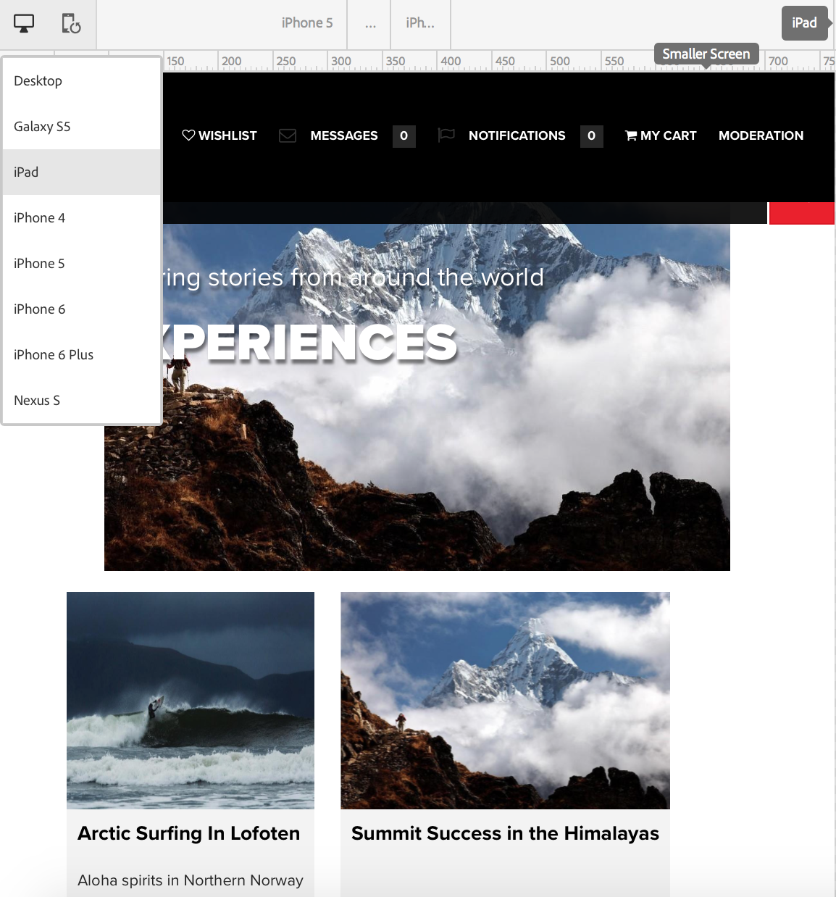
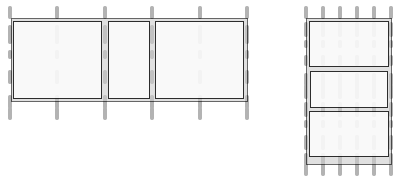

# 網頁自適應設計{#responsive-design-for-web-pages}

>[!NOTE]
>
>Adobe建議針對需要單頁應用程式架構用戶端轉換(例如 _React_)的專案使用SPA編輯器。 [了解更多](/help/sites-developing/spa-overview.md).


設計網頁，以配合顯示網頁的用戶端檢視區。 透過多方互動設計，可以在多種裝置上以兩種方向有效顯示相同的頁面。 下列影像示範頁面回應檢視區大小變更的一些方式：

* 版面配置：對較小的視區使用單欄版面，對較大的視區使用多欄版面。
* 文字大小：在較大的檢視區中使用較大的文字大小（如適當時，例如標題）。
* 內容：在較小的裝置上顯示時，僅包含最重要的內容。
* 導覽：提供裝置專用工具以存取其他頁面。
* 影像：為客戶端視區提供適合的映像轉譯。 根據窗口尺寸。


開發Adobe Experience Manager(AEM)應用程式，以產生可適應多種視窗大小和方向的HTML5頁面。 例如，下列視區寬度範圍與各種裝置類型和方向相對應

* 最大寬度為480像素（手機、縱向）
* 最大寬度為767像素（手機、橫向）
* 768像素和979像素之間的寬度（平板電腦、縱向）
* 寬度介於980像素和1199像素（平板電腦、橫向）
* 寬度為1200像素或更高（桌上型）

如需實作互動式設計行為的相關資訊，請參閱下列主題：

* [媒體查詢](/help/sites-developing/responsive.md#using-media-queries)
* [流體格線](/help/sites-developing/responsive.md#developing-a-fluid-grid)
* [最適化影像](/help/sites-developing/responsive.md#using-adaptive-images)

在您設計時，請使 **[!UICONTROL 用Sidekick]** ，預覽各種螢幕大小的頁面。

## 在您開發之前 {#before-you-develop}

在您開發支援網頁的AEM應用程式之前，應先做幾項設計決策。 例如，您需要有下列資訊：

* 您要定位的裝置。
* 目標視區大小。
* 每個目標視區大小的頁面佈局。

### 應用程式結構 {#application-structure}

典型的AEM應用程式結構支援所有互動式設計實作：

* 頁面元件位於/apps/*application_name*/components下方
* 範本位於/apps/*application_name*/templates下
* 設計位於/etc/designs下方

## 使用媒體查詢 {#using-media-queries}

媒體查詢可選擇性使用CSS樣式來轉換頁面。 AEM開發工具和功能可讓您在應用程式中有效且有效率地建置媒體查詢。

W3C群組提供介 [質查詢建議](https://www.w3.org/TR/css3-mediaqueries/) ，說明此CSS3功能和語法。

### 建立CSS檔案 {#creating-the-css-file}

在CSS檔案中，根據您所定位裝置的屬性來定義媒體查詢。 以下實施策略對於管理每個媒體查詢的樣式非常有效：

* 使用ClientLibraryFolder來定義呈現頁面時組合的CSS。
* 在個別的CSS檔案中定義每個媒體查詢和相關的樣式。 使用代表媒體查詢裝置功能的檔案名稱很實用。
* 在個別的CSS檔案中定義所有裝置通用的樣式。
* 在ClientLibraryFolder的css.txt檔案中，依組合的CSS檔案中的要求來排序清單CSS檔案。

We.Retail media範例使用此策略來定義網站設計中的樣式。 We.Retail使用的CSS檔案位於 `*/apps/weretail/clientlibs/clientlib-site/less/grid.less`。

下表列出css子檔案夾中的檔案。

<table>
 <tbody>
  <tr>
   <th>檔案名稱</th>
   <th>說明</th>
   <th>媒體查詢</th>
  </tr>
  <tr>
   <td>style.css</td>
   <td>常用樣式。</td>
   <td>N/A</td>
  </tr>
  <tr>
   <td>bootstrap.css</td>
   <td>常用樣式，由Twitter引導定義。</td>
   <td>N/A</td>
  </tr>
  <tr>
   <td>responsive-1200px.css</td>
   <td>寬或寬1200像素的所有媒體樣式。</td>
   <td><p><br /> @media(最小寬度：1200px){<br /> ...}</p> </td>
  </tr>
  <tr>
   <td>responsive-980px-1199px.css</td>
   <td>介質的樣式，介於980像素和1199像素寬之間。</td>
   <td><p><br /> @media(最小寬度：980px)和(最大寬度：1199px){<br /> ...}</p> </td>
  </tr>
  <tr>
   <td>responsive-768px-979px.css</td>
   <td>介質的樣式，介於768像素和979像素寬之間。 </td>
   <td><p><br /> @media(最小寬度：768像素)和(最大寬度：979px){<br /> ...}</p> </td>
  </tr>
  <tr>
   <td>responsive-767px-max.css</td>
   <td>寬度小於768像素的所有媒體樣式。</td>
   <td><p><br /> @media(最大寬度：767px){<br /> ...}</p> </td>
  </tr>
  <tr>
   <td>responsive-480px.css</td>
   <td>寬度小於481像素的所有媒體樣式。</td>
   <td><br /> @media(最大寬度：480){<br /> ...}</td>
  </tr>
 </tbody>
</table>

資料夾中的css.txt檔案 `/etc/designs/weretail/clientlibs` 會列出用戶端資料庫資料夾所包含的CSS檔案。 檔案順序實現樣式優先。 當裝置大小減少時，樣式會更具體。

`#base=css`

```
style.css
 bootstrap.css
```

```
responsive-1200px.css
 responsive-980px-1199px.css
 responsive-768px-979px.css
 responsive-767px-max.css
 responsive-480px.css
```

**提示**:描述性檔案名稱可讓您輕鬆識別目標的檢視區大小。

### 將媒體查詢與AEM頁面搭配使用 {#using-media-queries-with-aem-pages}

在頁面元件的JSP指令碼中包含用戶端程式庫資料夾，以產生包含媒體查詢的CSS檔案，並參考該檔案。

```xml
<ui:includeClientLib categories="apps.weretail.all"/>
```

>[!NOTE]
> 用戶 `apps.weretail.all` 端程式庫資料夾會內嵌clientlibs程式庫。


JSP指令碼生成以下引用樣式表的HTML代碼：

```xml
<link rel="stylesheet" href="/etc/designs/weretail/clientlibs-all.css" type="text/css">
<link href="/etc/designs/weretail.css" rel="stylesheet" type="text/css">
```

## 預覽特定裝置 {#previewing-for-specific-devices}

檢視不同檢視區大小的頁面預覽，以測試互動式設計的行為。 在「 **[!UICONTROL 預覽]** 」模式中， **[!UICONTROL Sidekick]** 包含一個「裝 **** 置」下拉式選單，供您用來選取裝置。 當您選取裝置時，頁面會隨著檢視區大小而改變。



若要在 **[!UICONTROL Sidekick中啟用裝置預覽]**，您必須設定頁面和 **** MobileEmulatorProvider服務。 另一個頁面配置控制「設備」清單中顯示的設 **[!UICONTROL 備]** 清單。

### 添加設備清單 {#adding-the-devices-list}

當您的 **[!UICONTROL 頁面包含轉譯「裝置]** 」清單的JSP指令碼時，「裝置」清單會顯示在Sidekick ******** 中。 若要將「裝 **[!UICONTROL 置]** 」清單新增至 **[!UICONTROL Sidekick]**，請在您頁面的 `/libs/wcm/mobile/components/simulator/simulator.jsp` 區段中 `head` 加入指令碼。

在JSP中包含下列代碼，用於定義節 `head` 目：

`<cq:include script="/libs/wcm/mobile/components/simulator/simulator.jsp"/>`

若要檢視範例，請在CRXDE `/apps/weretail/components/page/head.jsp` Lite中開啟檔案。

### 註冊頁面元件以進行模擬 {#registering-page-components-for-simulation}

若要啟用裝置模擬器來支援您的頁面，請使用MobileEmulatorProvider工廠服務註冊您的頁面元件，並定義屬 `mobile.resourceTypes` 性。

使用AEM時，有幾種方法可管理此類服務的組態設定；如需 [完整詳細資訊](/help/sites-deploying/configuring-osgi.md) ，請參閱設定OSGi。

例如，要在應用程式中 ` [sling:OsgiConfig](/help/sites-deploying/configuring-osgi.md#adding-a-new-configuration-to-the-repository)` 建立節點：

* Parent folder: `/apps/application_name/config`
* 名稱: `com.day.cq.wcm.mobile.core.impl.MobileEmulatorProvider-*alias*`

   由於MobileEmulatorProvider `*alias*` 服務是工廠服務，因此需要——尾碼。 使用此工廠唯一的別名。

* jcr:primaryType: `sling:OsgiConfig`

添加以下節點屬性：

* 名稱: `mobile.resourceTypes`
* 類型: `String[]`
* 值：呈現您網頁的頁面元件路徑。 例如，geometrixx-media應用程式使用下列值：

   ```
   geometrixx-media/components/page
    geometrixx-unlimited/components/pages/page
    geometrixx-unlimited/components/pages/coverpage
    geometrixx-unlimited/components/pages/issue
   ```

### 指定設備組 {#specifying-the-device-groups}

要指定出現在「設備」清單中的設備組，請將 `cq:deviceGroups` 屬性添加 `jcr:content` 到站點根頁的節點。 屬性值是到設備組節點的路徑陣列。

設備組節點位於資料夾 `/etc/mobile/groups` 中。

例如，Geometrixx Media網站的根頁面為 `/content/geometrixx-media`。 節 `/content/geometrixx-media/jcr:content` 點包含下列屬性：

* 名稱: `cq:deviceGroups`
* 類型: `String[]`
* 值: `/etc/mobile/groups/responsive`

使用「工具」控制台可 [建立和編輯裝置群組](/help/sites-developing/groupfilters.md)。

>[!NOTE]
>
>對於用於自適應設計的設備組，請編輯設備組，並在「常規」頁籤上選擇「禁用模擬器」。 此選項可防止模擬器轉盤出現，這與自適應設計無關。


## 使用最適化影像 {#using-adaptive-images}

您可以使用媒體查詢來選擇要顯示在頁面中的影像資源。 但是，使用媒體查詢條件化其使用的每個資源都會下載到客戶端。 媒體查詢僅確定是否顯示下載的資源。

對於大型資源（例如影像），下載所有資源並非對用戶端資料管道的有效使用。 若要選擇性下載資源，請在媒體查詢執行選擇後，使用javascript來啟動資源請求。

以下策略載入使用媒體查詢選擇的單個資源：

1. 為每個資源版本添加DIV元素。 將資源的URI作為屬性值。 瀏覽器不會將屬性解譯為資源。
1. 將媒體查詢添加到適合該資源的每個DIV元素。
1. 當檔案載入或視窗調整大小時，javascript程式碼會測試每個DIV元素的媒體查詢。
1. 根據查詢結果，確定要包括的資源。
1. 在參考資源的DOM中插入HTML元素。

### 使用Javascript評估媒體查詢 {#evaluating-media-queries-using-javascript}

W3C定義的 [MediaQueryList介面實作](https://dev.w3.org/csswg/cssom-view/#the-mediaquerylist-interface) ，可讓您使用javascript評估媒體查詢。 您可以將邏輯套用至媒體查詢結果，並執行目前視窗的指令碼：

* 實作MediaQueryList介面的瀏覽器支援此 `window.matchMedia()` 函式。 此函式會測試特定字串的媒體查詢。 該函式返回 `MediaQueryList` 提供查詢結果訪問的對象。

* 對於未實作介面的瀏覽器，您可以使用 `matchMedia()` 多角填色，例如 [matchMedia.js](https://github.com/paulirish/matchMedia.js)，這是免費可用的javascript程式庫。

#### 選擇媒體特定資源 {#selecting-media-specific-resources}

W3C建議的圖片元 [素](https://picture.responsiveimages.org/) ，使用媒體查詢來判斷要用於影像元素的來源。 圖片元素使用元素屬性將媒體查詢與影像路徑關聯。

可自由取用的 [Picturefill.js程式庫提供與建議的元素類似的功能](https://github.com/scottjehl/picturefill)`picture` ，並使用類似的策略。 picturefill.js程式庫會呼 `window.matchMedia` 叫以評估為一組元素所定義的媒體查 `div` 詢。 每個 `div` 元素也指定影像來源。 當元素的媒體查詢傳回時，會使用 `div` 來源 `true`。

程式 `picturefill.js` 庫需要類似下列範例的HTML程式碼：

```xml
<div data-picture>
    <div data-src='path to default image'></div>
    <div data-src='path to small image'    data-media="(media query for phone)"></div>
    <div data-src='path to medium image'   data-media="(media query for tablet)"></div>
    <div data-src='path to large image'     data-media="(media query for monitor)"></div>
</div>
```

在轉譯頁面時，picturefull.js會將元素 `img` 插入為元素的最後 `<div data-picture>` 子項：

```xml
<div data-picture>
    <div data-src='path to default image'></div>
    <div data-src='path to small image'    data-media="(media query for phone)"></div>
    <div data-src='path to medium image'   data-media="(media query for tablet)"></div>
    <div data-src='path to large image'     data-media="(media query for monitor)"></div>
    
</div>
```

在AEM頁面中，屬性的值 `data-src` 是儲存庫中資源的路徑。

### 在AEM中實作最適化影像 {#implementing-adaptive-images-in-aem}

若要在AEM應用程式中實作最適化影像，您需要新增必要的javascript程式庫，並在您的頁面中加入必要的HTML標籤。

**資料庫**

取得下列javascript程式庫，並將它們加入用戶端程式庫資料夾：

* [matchMedia.js](https://github.com/paulirish/matchMedia.js) （適用於不實作MediaQueryList介面的瀏覽器）
* [picturefindler.js](https://github.com/scottjehl/picturefill)
* jquery.js(可透過用戶端程式庫資料 `/etc/clientlibs/granite/jquery` 夾（類別= jquery）取得)
* [jquery.debouncedresize.js](https://github.com/louisremi/jquery-smartresize) （在調整視窗大小後發生一次的jquery事件）

**** 提示：您可以透過內嵌，自動串連多個用戶端程式庫 [資料夾](/help/sites-developing/clientlibs.md#embedding-code-from-other-libraries)。

**HTML**

建立元件，以產生pictureincl.js程式碼所需的div元素。 在AEM頁面中，data-src屬性的值是儲存庫中資源的路徑。 例如，頁面元件可在DAM中硬式編碼媒體查詢和影像轉譯的相關路徑。 或者，建立自訂的影像元件，讓作者可以選取影像轉譯或指定執行時期轉譯選項。

下列範例HTML會從相同影像的2個DAM轉譯中選取。

```xml
<div data-picture>
    <div data-src='/content/dam/geometrixx-media/articles/meridien.png'></div>
    <div data-src='/content/dam/geometrixx-media/articles/meridien.png/jcr:content/renditions/cq5dam.thumbnail.319.319.png'    data-media="(min-width: 769px)"></div>
    <div data-src='/content/dam/geometrixx-media/articles/meridien.png/jcr:content/renditions/cq5dam.thumbnail.140.100.png'   data-media="(min-width: 481px)"></div>
</div>
```

>[!NOTE]
>
>最適化影像基礎元件可建置最適化影像：
>
>* 客戶端庫資料夾： `/libs/foundation/components/adaptiveimage/clientlibs`
>* 產生HTML的指令碼： `/libs/foundation/components/adaptiveimage/adaptiveimage.jsp`
>
>
後續部分提供了有關此元件的詳細資訊。


### 瞭解AEM中的影像演算 {#understanding-image-rendering-in-aem}

若要自訂影像演算，您應瞭解預設的AEM靜態影像演算實作。 AEM提供影像元件和影像轉換servlet，可搭配運作來轉換網頁的影像。 當頁面的段落系統中包含影像元件時，會發生下列事件順序：

1. 編寫：作者會編輯影像元件，以指定要包含在HTML頁面中的影像檔案。 檔案路徑儲存為Image元件節點的屬性值。
1. 頁面要求：頁面元件的JSP會產生HTML程式碼。 Image元件的JSP將生成一個img元素並將其添加到頁面中。
1. 影像要求：網頁瀏覽器會載入頁面，並根據img元素的src屬性要求影像。
1. 影像演算：影像轉換servlet會將影像傳回至網頁瀏覽器。


例如，Image元件的JSP生成以下HTML元素：

``

當瀏覽器載入頁面時，會使用src屬性的值作為URL來要求影像。 Sling會解構URL:

* 資源: `/content/mywebsite/en/_jcr_content/par/image_0`
* 副檔名： `.jpg`
* 選擇器: `img`
* 尾碼： `1358372073597.jpg`

節 `image_0` 點的 `jcr:resourceType` 值為 `foundation/components/image`，值 `sling:resourceSuperType` 為 `foundation/components/parbase`。 parbase元件包含img.GET.java指令碼，該指令碼與選擇器和請求URL的檔案副檔名匹配。 CQ使用此指令碼(servlet)來呈現影像。

若要查看指令碼的原始碼，請使用CRXDE Lite來開啟檔 `/libs/foundation/components/parbase/img.GET.java`案。

## 縮放影像以符合目前的檢視區大小 {#scaling-images-for-the-current-viewport-size}

根據用戶端檢視器的特性，在執行時期縮放影像，以提供符合自適應設計原則的影像。 使用與靜態影像演算相同的設計模式，使用servlet和編寫元件。

元件需要執行以下任務：

* 將影像資源的路徑和所需維度儲存為屬性值。
* 產生 `div` 包含媒體選擇器和服務呼叫的元素，以呈現影像。

>[!NOTE]
>
>網頁用戶端使用matchMedia和Picturefilljavascript程式庫（或類似程式庫）來評估媒體選擇器。


處理映像請求的Servlet需要執行以下任務：

* 從元件屬性中檢索影像的路徑和尺寸。
* 根據屬性縮放影像並傳回影像。

**可用的解決方案**

AEM會安裝下列您可使用或擴充的實作。

* 產生媒體查詢的Adaptive Image基礎元件，以及對可調整影像的Adaptive Image元件Servlet的HTTP請求。
* Geometrixx Commons套件會安裝影像參考修改Servlet範例servlet，以變更影像解析度。

### 瞭解最適化影像元件 {#understanding-the-adaptive-image-component}

自適應影像元件生成對自適應影像元件Servlet的調用，以呈現根據設備螢幕調整大小的影像。 該元件包括以下資源：

* JSP:新增div元素，將媒體查詢與呼叫關聯至最適化影像元件Servlet。
* 用戶端程式庫：clientlibs資料夾會組 `cq:ClientLibraryFolder` 合matchMedia Polyfill javascript程式庫和已修改的Picturefilljavascript程式庫。
* 編輯對話框：節 `cq:editConfig` 點覆蓋CQ基礎影像元件，以便放置目標建立自適應影像元件而不是基礎影像元件。

#### 添加DIV元素 {#adding-the-div-elements}

adaptive-image.jsp指令碼包含以下生成div元素和媒體查詢的代碼：

```
<div data-picture data-alt='<%= alt %>'>
    <div data-src='<%= path + ".img.320.low." + extension + suffix %>'       data-media="(min-width: 1px)"></div>                                        <%-- Small mobile --%>
    <div data-src='<%= path + ".img.320.medium." + extension + suffix %>'    data-media="(min-width: 320px)"></div>  <%-- Portrait mobile --%>
    <div data-src='<%= path + ".img.480.medium." + extension + suffix %>'    data-media="(min-width: 321px)"></div>  <%-- Landscape mobile --%>
    <div data-src='<%= path + ".img.476.high." + extension + suffix %>'      data-media="(min-width: 481px)"></div>   <%-- Portrait iPad --%>
    <div data-src='<%= path + ".img.620.high." + extension + suffix %>'      data-media="(min-width: 769px)"></div>  <%-- Landscape iPad --%>
    <div data-src='<%= path + ".img.full.high." + extension + suffix %>'     data-media="(min-width: 1025px)"></div> <%-- Desktop --%>

    <%-- Fallback content for non-JS browsers. Same img src as the initial, unqualified source element. --%>
    <noscript>
        ' alt='<%= alt %>'>
    </noscript>
</div>
```

變 `path` 量包含當前資源的路徑（自適應映像元件節點）。 程式碼會產生一系列具 `div` 有下列結構的元素：

`<div data-scr = "*path-to-parent-node*.adaptive-image.adapt.*width*.*quality*.jpg" data-media="*media query*"></div>`

屬性的值是 `data-scr` Sling解析至轉譯影像的Adaptive Image Component Servlet的URL。 data-media屬性包含根據用戶端屬性評估的媒體查詢。

以下HTML代碼是JSP生成的 `div` 元素的示例：

```xml
<div data-src='/content/geometrixx-media/en/events/the-lineup-you-ve-been-waiting-for/jcr:content/article-content-par/adaptive_image.adapt.320.low.jpg'></div>
    <div data-src='/content/geometrixx-media/en/events/the-lineup-you-ve-been-waiting-for/jcr:content/article-content-par/adaptive_image.adapt.320.medium.jpg'    data-media="(min-width: 320px)"></div>
    <div data-src='/content/geometrixx-media/en/events/the-lineup-you-ve-been-waiting-for/jcr:content/article-content-par/adaptive_image.adapt.480.medium.jpg'    data-media="(min-width: 321px)"></div>
    <div data-src='/content/geometrixx-media/en/events/the-lineup-you-ve-been-waiting-for/jcr:content/article-content-par/adaptive_image.adapt.476.high.jpg'     data-media="(min-width: 481px)"></div>
    <div data-src='/content/geometrixx-media/en/events/the-lineup-you-ve-been-waiting-for/jcr:content/article-content-par/adaptive_image.adapt.620.high.jpg'     data-media="(min-width: 769px)"></div>
    <div data-src='/content/geometrixx-media/en/events/the-lineup-you-ve-been-waiting-for/jcr:content/article-content-par/adaptive_image.adapt.full.high.jpg'     data-media="(min-width: 1025px)"></div>
```

#### 變更影像大小選擇器 {#changing-the-image-size-selectors}

如果自定義最適化映像元件並更改寬度選擇器，則還必須配置最適化映像元件Servlet以支援寬度。

### 瞭解最適化影像元件Servlet {#understanding-the-adaptive-image-component-servlet}

最適化影像元件Servlet會根據指定的寬度調整JPEG影像的大小，並設定JPEG品質。

#### 自適應影像元件Servlet的介面 {#the-interface-of-the-adaptive-image-component-servlet}

Adaptive Image Component servlet會系結至預設的Sling Servlet，並支援。jpg、.jpeg、.gif和。png副檔名。 servlet選擇器是img。

>[!CAUTION]
>
>AEM不支援動態。gif檔案以進行最適化轉譯。

因此，Sling會將下列格式的HTTP要求URL解析為此servlet:

`*path-to-node*.img.*extension*`

例如，Sling會將URL的HTTP請求轉送 `http://localhost:4502/content/geometrixx/adaptiveImage.img.jpg` 至Adaptive Image Component Servlet。

另外兩個選擇器會指定要求的影像寬度和JPEG品質。 以下範例要求寬度為480像素且中等品質的影像：

`http://localhost:4502/content/geometrixx/adaptiveImage.adapt.480.MEDIUM.jpg`

**支援的影像屬性**

Servlet接受有限數量的影像寬度和質量。 預設支援下列寬度（以像素為單位）:

* 完整
* 320
* 480
* 476
* 620

完整值表示無縮放。

支援下列JPEG品質值：

* 低
* 中
* 高

數值分別為0.4、0.82和1.0。

**變更預設支援寬度**

使用Web Console([http://localhost:4502/system/console/configMgr](http://localhost:4502/system/console/configMgr))或sling:OsgiConfig節點來設定Adobe CQ Adaptive Image Component servlet的支援寬度。

如需如何設定AEM服務的詳細資訊，請參 [閱Configuring OSGi](/help/sites-deploying/configuring-osgi.md)。

<table>
 <tbody>
  <tr>
   <th> </th>
   <th>Web控制台</th>
   <th>sling:OsgiConfig</th>
  </tr>
  <tr>
   <th>服務或節點名稱</th>
   <td>「配置」頁籤上的服務名是Adobe CQ Adaptive Image Component Servlet</td>
   <td>com.day.cq.wcm.foundation.impl. AdaptiveImageComponentServlet</td>
  </tr>
  <tr>
   <th>屬性</th>
   <td><p>支援的寬度</p>
    <ul>
     <li>若要新增支援的寬度，請按一下+按鈕並輸入正整數。</li>
     <li>若要移除支援的寬度，請按一下相關的——按鈕。</li>
     <li>若要修改支援的寬度，請編輯欄位值。</li>
    </ul> </td>
   <td><p>adapt.supported.widts</p>
    <ul>
     <li>屬性是多值字串值。</li>
    </ul> </td>
  </tr>
 </tbody>
</table>

#### 實作詳細資訊 {#implementation-details}

該 `com.day.cq.wcm.foundation.impl.AdaptiveImageComponentServlet` 類擴展 [](https://helpx.adobe.com/experience-manager/6-5/sites/developing/using/reference-materials/javadoc/com/day/cq/wcm/commons/AbstractImageServlet.html) AbstractImageServlet類。 AdaptiveImageComponentServlet原始碼位於資料夾 `/libs/foundation/src/impl/src/com/day/cq/wcm/foundation/impl` 中。

類使用Felix SCR注釋來配置servlet所關聯的資源類型和檔案副檔名以及第一個選擇器的名稱。

```java
@Component(metatype = true, label = "Adobe CQ Adaptive Image Component Servlet",
        description = "Render adaptive images in a variety of qualities")
@Service
@Properties(value = {
    @Property(name = "sling.servlet.resourceTypes", value = "foundation/components/adaptiveimage", propertyPrivate = true),
    @Property(name = "sling.servlet.selectors", value = "img", propertyPrivate = true),
    @Property(name = "sling.servlet.extensions", value ={
            "jpg",
            "jpeg",
            "png",
            "gif"
    }, propertyPrivate = true)
})
```

Servlet使用屬性SCR注釋來設定預設支援的影像質量和尺寸。

```java
@Property(value = {
            "320", // iPhone portrait
            "480", // iPhone landscape
            "476", // iPad portrait
            "620" // iPad landscape
    },
            label = "Supported Widths",
            description = "List of widths this component is permitted to generate.")
```

類 `AbstractImageServlet` 別提供處 `doGet` 理HTTP請求的方法。 此方法確定與請求關聯的資源，從儲存庫中檢索資源屬性，並在 [ImageContext對象中返回它們](https://helpx.adobe.com/experience-manager/6-5/sites/developing/using/reference-materials/javadoc/com/day/cq/wcm/commons/AbstractImageServlet.ImageContext.html) 。

>[!NOTE]
>
>[com.day.cq.commons.DownloadResource](https://helpx.adobe.com/experience-manager/6-5/sites/developing/using/reference-materials/javadoc/com/day/cq/commons/DownloadResource.html) 類提供 `getFileReference method`，用於檢索資源屬性的 `fileReference` 值。

類別 `AdaptiveImageComponentServlet` 會覆寫方 `createLayer` 法。 該方法從對象獲得影像資源的路徑和所請求的影像寬 `ImageContext` 度。 然後調用類的方法，這 `info.geometrixx.commons.impl.AdaptiveImageHelper` 些方法執行實際的影像縮放。

AdaptiveImageComponentServlet類還覆蓋writeLayer方法。 此方法會將JPEG品質套用至影像。

### 影像參考修改Servlet(Geometrixx Common) {#image-reference-modification-servlet-geometrixx-common}

示例Image Reference Modification servlet為img元素生成大小屬性，以在網頁上縮放影像。

#### 調用servlet {#calling-the-servlet}

servlet綁定到資 `cq:page` 源並支援。jpg檔案副檔名。 Servlet選擇器為 `image`。 因此，Sling會將下列格式的HTTP要求URL解析為此servlet:

`path-to-page-node.image.jpg`

例如，Sling會將URL的HTTP請求轉送至 `http://localhost:4502/content/geometrixx/en.image.jpg` Image Reference Modification Servlet。

另外3個選擇器會指定所要求的影像寬度、高度和（選擇性）品質。 以下範例要求寬度為770像素、高度為360像素和中等品質的影像。

`http://localhost:4502/content/geometrixx/en.image.770.360.MEDIUM.jpg`

**支援的影像屬性**

Servlet接受有限數量的影像尺寸和質量值。

預設支援下列值(widthxheight):

* 256x192
* 370x150
* 480x200
* 127x127
* 770x360
* 620x290
* 480x225
* 320x150
* 375x175
* 303x142
* 1170x400
* 940x340
* 770x300
* 480x190

支援下列影像品質值：

* 低
* 中
* 高

使用AEM時，有幾種方法可管理此類服務的組態設定；如需 [完整詳細資訊](/help/sites-deploying/configuring-osgi.md) ，請參閱設定OSGi。

#### 指定影像資源 {#specifying-the-image-resource}

映像路徑、維和質量值必須儲存為儲存庫中節點的屬性：

* The node name is `image`.
* 父節點是資 `jcr:content` 源的節 `cq:page` 點。

* 影像路徑會儲存為名為的屬性值 `fileReference`。

製作頁面時，請使 **用Sidekick** 來指定影像並將節 `image` 點新增至頁面屬性：

1. 在 **Sidekick**&#x200B;中，按一下「 **Page** 」標籤，然後按一下「 **Page Properties**」。
1. 按一下「 **影像** 」索引標籤並指定影像。
1. 按一下 **確定**。

#### 實作詳細資訊 {#implementation-details-1}

info.geometrixx.commons.impl.servlets.ImageReferenceModificationServlet類可擴展 [](https://helpx.adobe.com/experience-manager/6-5/sites/developing/using/reference-materials/javadoc/com/day/cq/wcm/commons/AbstractImageServlet.html) AbstractImageServlet類。 如果您已安裝cq-geometrixx-commons-pkg套件，ImageReferenceModificationServlet原始碼就位於資料夾 `/apps/geometrixx-commons/src/core/src/main/java/info/geometrixx/commons/impl/servlets` 中。

類使用Felix SCR注釋來配置servlet所關聯的資源類型和檔案副檔名以及第一個選擇器的名稱。

```java
@Component(metatype = true, label = "Adobe CQ Image Reference Modification Servlet",
        description = "Render the image associated with a page in a variety of dimensions and qualities")
@Service
@Properties(value = {
    @Property(name = "sling.servlet.resourceTypes", value = NameConstants.NT_PAGE, propertyPrivate = true),
    @Property(name = "sling.servlet.selectors", value = "image", propertyPrivate = true),
    @Property(name = "sling.servlet.extensions", value = "jpg", propertyPrivate = true)
})
```

Servlet使用屬性SCR注釋來設定預設支援的影像質量和尺寸。

```java
@Property(label = "Image Quality",
            description = "Quality must be a double between 0.0 and 1.0", value = "0.82")
@Property(value = {
                "256x192", // Category page article list images
                "370x150", // "Most popular" desktop & iPad & carousel min-width: 1px
                "480x200", // "Most popular" phone
                "127x127", // article summary phone square images
                "770x360", // article summary, desktop
                "620x290", // article summary, tablet
                "480x225", // article summary, phone (landscape)
                "320x150", // article summary, phone (portrait) and fallback
                "375x175", // 2-column article summary, desktop
                "303x142", // 2-column article summary, tablet
                "1170x400", // carousel, full
                "940x340",  // carousel min-width: 980px
                "770x300",  // carousel min-width: 768px
                "480x190"   // carousel min-width: 480px
            },
            label = "Supported Resolutions",
            description = "List of resolutions this component is permitted to generate.")
```

類 `AbstractImageServlet` 別提供處 `doGet` 理HTTP請求的方法。 此方法確定與調用相關聯的資源，從儲存庫中檢索資源屬性，並將其保存在 [ImageContext](https://helpx.adobe.com/experience-manager/6-5/sites/developing/using/reference-materials/javadoc/com/day/cq/wcm/commons/AbstractImageServlet.ImageContext.html) 對象中。

類別 `ImageReferenceModificationServlet` 會覆寫方 `createLayer` 法，並實作決定要演算的影像資源的邏輯。 該方法檢索名為的頁面節點的子 `jcr:content` 節點 `image`。 從 [此節點建立Image](https://helpx.adobe.com/experience-manager/6-5/sites/developing/using/reference-materials/javadoc/com/day/cq/wcm/foundation/Image.html) 對象，該方法 `image` 從影像節點的屬性返回到 `getFileReference``fileReference` 影像檔案的路徑。

>[!NOTE]
>com.day.cq.commons. [](https://helpx.adobe.com/experience-manager/6-5/sites/developing/using/reference-materials/javadoc/com/day/cq/commons/DownloadResource.html) DownloadResource類提供getFileReference方法。


## 開發流體網格 {#developing-a-fluid-grid}

AEM可讓您有效率地建置流暢格點。 本頁說明如何將流暢格點或現有格點實作(例如 [Bootstrap](https://twitter.github.com/bootstrap/))整合至AEM應用程式。

如果您不熟悉流暢格線，請參 [閱本頁底部的「流暢格線簡介](/help/sites-developing/responsive.md#developing-a-fluid-grid) 」一節。 本文概述了流體網格的設計，並對流體網格的設計進行了指導。

### 使用頁面元件定義網格 {#defining-the-grid-using-a-page-component}

使用頁面元件來產生定義頁面內容區塊的HTML元素。 頁面參照的ClientLibraryFolder提供控制內容區塊配置的CSS:

* 頁面元件：新增div元素，代表內容區塊的列。 代表內容區塊的div元素包含作者新增內容的parsys元件。
* 客戶端庫資料夾：提供包含div元素之媒體查詢和樣式的CSS檔案。

例如，範例geometrixx-media應用程式包含media-home元件。 此頁元件插入兩個指令碼，它們生成 `div` 兩個類元 `row-fluid`素：

* 第一行包含類 `div` 別的元 `span12` 素（內容涵蓋12欄）。 元素 `div` 包含parsys元件。

* 第二行包含兩 `div` 個元素，一個是類， `span8` 另一個是類 `span4`。 每個 `div` 元素都包含parsys元件。

```xml
<div class="page-content">
    <div class="row-fluid">
        <div class="span12">
            <cq:include path="grid-12-par" resourceType="foundation/components/parsys" />
        </div>
    </div>
    <div class="row-fluid">
        <div class="span8">
            <cq:include path="grid-8-par" resourceType="foundation/components/parsys" />
        </div>
        <div class="span4">
            <cq:include path="grid-4-par" resourceType="foundation/components/parsys" />
        </div>
    </div>
</div>
```

>[!NOTE]
>
>當元件包含參照 `cq:include` parsys元件的多個元素時，每個屬 `path` 性必須有不同的值。


#### 縮放頁面元件格線 {#scaling-the-page-component-grid}

與geometrixx-media頁面元件(`/etc/designs/geometrixx-media`)關聯的設計包含 `clientlibs` ClientLibraryFolder。 此ClientLibraryFolder會定義類、類 `row-fluid` 和類 `span*` 的 `span*` 子類的CSS樣 `row-fluid` 式。 媒體查詢可針對不同的視區大小重新定義樣式。

以下範例CSS是這些樣式的子集。 此子集主要針對 `span12`兩個視 `span8`區大小 `span4` ，討論類別和媒體查詢。 請注意CSS的下列特性：

* 樣式 `.span` 使用絕對數字定義元素寬度。
* 樣式 `.row-fluid .span*` 會將元素寬度定義為父項的百分比。 百分比是從絕對寬度計算。
* 較大視區的媒體查詢會指定較大的絕對寬度。

>[!NOTE]
>
>Geometrixx Media範例將 [Bootstrap](https://twitter.github.com/bootstrap/javascript.html) javascript架構整合至其流暢格點實作。 Bootstrap架構提供bootstrap.css檔案。

```xml
/* default styles (no media queries) */
 .span12 { width: 940px }
 .span8 { width: 620px }
 .span4 { width: 300px }
 .row-fluid .span12 { width: 100% }
 .row-fluid .span8 { width: 65.95744680851064% }
 .row-fluid .span4 { width: 31.914893617021278% }

@media (min-width: 768px) and (max-width: 979px) {
 .span12 { width: 724px; }
 .span8 {     width: 476px; }
 .span4 {     width: 228px; }
 .row-fluid .span12 {     width: 100%;}
 .row-fluid .span8 {     width: 65.74585635359117%; }
 .row-fluid .span4 {     width: 31.491712707182323%; }
}

@media (min-width: 1200px) {
 .span12 { width: 1170px }
 .span8 { width: 770px }
 .span4 { width: 370px }
 .row-fluid .span12 { width: 100% }
 .row-fluid .span8 { width: 65.81196581196582% }
 .row-fluid .span4 { width: 31.623931623931625% }
}
```

#### 重新定位頁面元件格線中的內容 {#repositioning-content-in-the-page-component-grid}

範例Geometrixx Media應用程式的頁面會以水準方式在廣角區域中散布內容區塊列。 在較小的視區中，相同的區塊垂直分佈。 下列範例CSS顯示媒體首頁元件所產生之HTML程式碼實作此行為的樣式：

* 媒體歡迎頁面的預設CSS會為位於類別 `float:left` 內的 `span*` 類別指派樣 `row-fluid` 式。

* 對較小視區的媒體查詢為相 `float:none` 同類指定樣式。

```xml
/* default styles (no media queries) */
    .row-fluid [class*="span"] {
        width: 100%;
        float: left;
}

@media (max-width: 767px) {
    [class*="span"], .row-fluid [class*="span"] {
        float: none;
        width: 100%;
    }
}
```

#### 模組化您的頁面元件 {#tip-modularize-your-page-components}

將元件模組化，以有效率地使用程式碼。 您的網站可能使用幾種不同的頁面類型，例如歡迎頁面、文章頁面或產品頁面。 每種頁面類型都包含不同的內容類型，並可能使用不同的版面。 不過，當每個版面的某些元素在多個頁面上共用時，您可以重複使用實作該部分版面的程式碼。

**使用頁面元件覆蓋**

建立首頁面元件，提供指令碼以產生頁面的各個部分， `head` 例如 `body` 、 `header`、 `content`和 `footer` 內文中的章節。

建立使用首頁面元件做為其他頁面元件 `cq:resourceSuperType`。 這些元件包含可視需要覆寫首頁面指令碼的指令碼。

例如，goemetrixx-media應用程式包含頁面元件( `sling:resourceSuperType` 是基礎頁面元件)。 數個子元件（例如文章、類別和媒體首頁）會使用此頁面元件做為 `sling:resourceSuperType`。 每個子元件都包含一個content.jsp檔案，該檔案會覆蓋頁元件的content.jsp檔案。

**重複使用指令碼**

建立多個JSP指令碼，這些指令碼生成多個頁面元件常用的行和列組合。 例如，文章 `content.jsp` 的指令碼和媒體首頁元件都會參照指令 `8x4col.jsp` 碼。

**依目標檢視區大小組織CSS樣式**

在個別檔案中加入CSS樣式和媒體查詢，以檢視不同的檢視區大小。 使用用戶端程式庫資料夾來串連這些資料夾。

### 將元件插入頁面格線 {#inserting-components-into-the-page-grid}

當元件產生單一內容區塊時，通常頁面元件建立的格線會控制內容的放置。

作者應注意，內容區塊可以以各種大小和相對位置呈現。 內容文字不應使用相對方向來參照其他內容區塊。

如有必要，元件應提供其產生之HTML程式碼所需的任何CSS或javascript程式庫。 在元件內使用用戶端程式庫資料夾來產生CSS和JS檔案。 若要公開檔案，請建 [立相依關係或將程式庫內嵌在/etc檔案夾下的其他用戶端程式庫檔案夾中](/help/sites-developing/clientlibs.md#creating-client-library-folders) 。

**子格線**

如果元件包含多個內容區塊，請在列內新增內容區塊，以建立頁面上的子格線：

* 使用與包含頁面元件相同的類別名稱，將div元素表示為列和內容區塊。
* 若要覆寫頁面設計的CSS實作的行為，請為列div元素使用第二個類別名稱，並在用戶端資料庫資料夾中提供相關的CSS。

例如，元件 `/apps/geometrixx-media/components/2-col-article-summary` 會產生兩欄內容。 其產生的HTML具有下列結構：

```xml
<div class="row-fluid mutli-col-article-summary">
    <div class="span6">
        <article>
            <div class="article-summary-image">...</div>
            <div class="social-header">...</div>
            <div class="article-summary-description">...</div>
            <div class="social">...</div>
        </article>
    </div>
</div>
```

頁 `.row-fluid .span6` 面CSS的選擇器會套用至此HTML中 `div` 相同類別和結構的元素。 不過，此元件也包含/apps/geometrixx-media/components/2-col-article-summary/clientlibs用戶端程式庫資料夾：

* CSS使用與頁面元件相同的媒體查詢，以建立相同離散頁面寬度的版面配置變更。
* 選擇器 `multi-col-article-summary` 使用行元素 `div` 的類來覆蓋頁麵類的行 `row-fluid` 為。

例如，檔案中包含下列樣 `/apps/geometrixx-media/components/2-col-article-summary/clientlibs/css/responsive-480px.css` 式：

```xml
@media (max-width: 480px) {
    .mutli-col-article-summary .article-summary-image {
        float: left;
        width: 127px;
    }
    .mutli-col-article-summary .article-summary-description {
        width: auto;
        margin-left: 127px;
    }
    .mutli-col-article-summary .article-summary-description h4 {
        padding-left: 10px;
    }
    .mutli-col-article-summary .article-summary-text {
        margin-left: 127px;
        min-height: 122px;
        top: 0;
    }
}
```

## 流體網格簡介 {#introduction-to-fluid-grids}

流暢格點可讓頁面版面配合用戶端檢視區的尺寸。 格線由邏輯欄和行組成，這些列將內容區塊放置在頁面上。

* 欄會決定內容區塊的水準位置和寬度。
* 列決定內容區塊的相對垂直位置。

使用HTML5技術，您可以建置格線並加以控制，以根據不同的檢視區大小調整頁面版面：

* HTML `div` 元素包含跨越特定欄數的內容區塊。
* 當這些div元素中的一個或多個元素共用公共父元素時，它們組成一行。

### 使用離散寬度 {#using-discrete-widths}

針對您要定位的每個檢視區寬度範圍，請使用固定寬度的靜態頁面寬度和內容區塊。 當手動調整瀏覽器視窗大小時，內容大小的變更會發生在離散視窗寬度（也稱為中斷點）。 因此，頁面設計會更緊密地黏附在一起，讓使用者體驗最大化。

#### 縮放網格 {#scaling-the-grid}

使用格點來縮放內容區塊，以配合不同的檢視區大小。 內容區塊會跨越特定數目的欄。 隨著欄寬的增加或減少以適合不同的檢視區大小，內容區塊的寬度也隨之增加或減少。 縮放可支援大型和中型的檢視區，其寬度足以容納內容區塊並排放置。


#### 重新定位格線中的內容 {#repositioning-content-in-the-grid}

內容區塊的大小可以受到最小寬度的限制，超過此限度縮放不再有效。 對於較小的視區，格線可用來垂直分佈內容區塊，而非水準分佈。


### 設計網格 {#designing-the-grid}

決定您在頁面上放置內容區塊所需的欄和列。 您的頁面版面會決定跨網格的欄數和列數。

**欄數**

在所有版面中加入足夠的欄，以水準放置內容區塊（視區大小）。 您應使用比目前需要多的欄來容納未來的頁面設計。

**列內容**

使用列來控制內容區塊的垂直位置。 確定共用相同列的內容區塊：

* 任何版面中水準排列的內容區塊都位於同一列。
* 水準（較寬的視區）和垂直（較小的視區）相鄰的內容塊位於同一行中。

### 網格實施 {#grid-implementations}

建立CSS類別和樣式，以控制頁面上內容區塊的版面配置。 頁面設計通常根據檢視區內內容區塊的相對大小和位置。 視區會決定內容區塊的實際大小。 您的CSS必須考慮相對和絕對大小。 您可以使用三種類型的CSS類別來實作流暢格點：

* 元素的類， `div` 它是所有行的容器。 此類設定網格的絕對寬度。
* 表示行 `div` 的元素的類。 此類別控制其所含內容區塊的水準或垂直位置。
* 代表不 `div` 同寬度之內容區塊的元素類別。 寬度以父項（行）的百分比表示。

定位的檢視區寬度（及其相關的媒體查詢）會標定用於頁面版面的離散寬度。

#### 內容區塊寬度 {#widths-of-content-blocks}

通常，內 `width` 容區塊類別的樣式是根據您頁面和格線的下列特性：

* 您針對每個目標視區大小使用的絕對頁面寬度。 這些是已知值。
* 每個頁面寬度的格線欄的絕對寬度。 您決定這些值。
* 每欄的相對寬度佔頁面寬度總計的百分比。 您會計算這些值。

CSS包含一系列使用下列結構的媒體查詢：

```xml
@media(query_for_targeted_viewport){

  .class_for_container{ width:absolute_page_width }
  .class_for_row { width:100%}

  /* several selectors for content blocks   */
  .class_for_content_block1 { width:absolute_block_width1 }
  .class_for_content_block2 { width:absolute_block_width2 }
  ...

  /* several selectors for content blocks inside rows */
  .class_for_row .class_for_content_block1 { width:relative_block_width1 }
  .class_for_row .class_for_content_block2 { width:relative_block_width2 }
  ...
}
```

使用下列演算法來開發頁面的元素類別和CSS樣式。

1. 定義包含所有行的div元素的類名，例如 `content.`
1. 為div元素定義CSS類別，這些元素代表行，例如 `row-fluid`。
1. 定義內容區塊元素的類別名稱。 對於所有可能的寬度（以列範圍而言），都需要一個類。 例如，對於跨3 `span3` 列的元素 `div` ，請使用類，對 `span4` 4列的跨度使用類。 定義網格中任意多個類。

1. 針對您所定位的每個檢視區大小，將對應的媒體查詢新增至CSS檔案。 在每個媒體查詢中新增下列項目：

   * 例如，類 `content` 的選擇器 `.content{}`。
   * 例如，每個跨類的選擇器 `.span3{ }`。
   * 類別的選 `row-fluid` 擇器，例如 `.row-fluid{ }`
   * 例如，位於行流體類內的跨類的選擇器 `.row-fluid span3 { }`。

1. 為每個選取器新增寬度樣式：

   1. 例如，將選 `content` 擇器的寬度設定為頁面的絕對大小 `width:480px`。
   1. 將所有列流體選擇器的寬度設為100%。
   1. 將所有範圍選擇器的寬度設定為內容塊的絕對寬度。 瑣碎的網格使用相同寬度的均勻分佈列： `(absolute width of page)/(number of columns)`。
   1. 將選擇器的寬 `.row-fluid .span` 度設為總寬度的百分比。 使用公式計算此 `(absolute span width)/(absolute page width)*100` 寬度。

#### 將內容區塊定位在行中 {#positioning-content-blocks-in-rows}

使用類的浮點樣式 `.row-fluid` 控制行中的內容塊是水準排列還是垂直排列。

* 或樣 `float:left` 式會 `float:right` 造成子元素（內容區塊）的水準分佈。

* 樣式 `float:none` 會導致子元素的垂直分佈。

將樣式新增至每個媒 `.row-fluid` 體查詢內的選擇器。 根據您用於該媒體查詢的頁面配置設定值。 例如，下圖說明了一行，該行水準分佈內容用於寬視區，垂直分佈內容用於窄視區。



下列CSS可實作此行為：

```xml
@media (min-width: 768px) and (max-width: 979px) {
   .row-fluid {
       width:100%;
       float:left
   }
}

@media (max-width:480px){
    .row-fluid {
       width:100%;
       float:none
   }
}
```

#### 為內容塊分配類 {#assigning-classes-to-content-blocks}

針對您要定位的每個檢視區大小的頁面版面配置，決定每個內容區塊涵蓋的欄數。 然後，確定要用於這些內容塊的div元素的類。

建立div類別後，您可以使用AEM應用程式實作格線。
