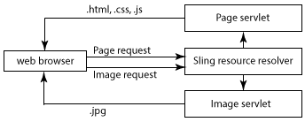

# 網頁的回應式設計{#responsive-design-for-web-pages}

>[!NOTE]
>
>Adobe建議針對需要單頁應用程式架構用戶端轉譯的專案使用SPA編輯器(例如 _React_)。 [了解更多](/help/sites-developing/spa-overview.md).

>[!NOTE]
>
>各種範例都以Geometrixx範例內容為基礎，這些內容已由We.Retail取代，不再隨AEM提供。 請參閱檔案 [We.Retail參考實作](/help/sites-developing/we-retail.md#we-retail-geometrixx) 以了解如何下載和安裝Geometrixx。

設計您的網頁，使其與顯示其的用戶端檢視區相適應。 透過回應式設計，相同的頁面可以兩種方向有效地顯示在多個裝置上。 下列影像示範頁面可以透過哪些方式回應檢視區大小的變更：

* 配置：對較小的視區使用單列佈局，對較大的視區使用多列佈局。
* 文本大小：在較大的檢視區中使用較大的文字大小（如適當，例如標題）。
* 內容：在較小的裝置上顯示時，僅包含最重要的內容。
* 導覽：提供裝置專用工具，供存取其他頁面。
* 影像：提供適合用戶端檢視區的影像轉譯。 根據窗口尺寸。


開發Adobe Experience Manager(AEM)應用程式，產生可適應多種視窗大小和方向的HTML5頁。 例如，下列檢視區寬度範圍對應於各種裝置類型和方向

* 最大寬度為480像素（手機、縱向）
* 最大寬度為767像素（手機、橫向）
* 寬度介於768像素和979像素（平板電腦、縱向）之間
* 寬度介於980像素和1199像素（平板電腦、橫向）之間
* 寬度為1200px或更高（台式機）

如需實作回應式設計行為的相關資訊，請參閱下列主題：

* [媒體查詢](/help/sites-developing/responsive.md#using-media-queries)
* [流體網格](/help/sites-developing/responsive.md#developing-a-fluid-grid)
* [最適化影像](/help/sites-developing/responsive.md#using-adaptive-images)

在您設計時，請使用 **[!UICONTROL Sidekick]** 來預覽不同螢幕大小的頁面。

## 開發之前 {#before-you-develop}

在開發支援您網頁的AEM應用程式之前，應先做出幾項設計決策。 例如，您需要下列資訊：

* 您正在定位的裝置。
* 目標檢視區大小。
* 每個目標檢視區大小的頁面配置。

### 應用程式結構 {#application-structure}

典型的AEM應用程式結構支援所有回應式設計實施：

* 頁面元件位於/apps/下&#x200B;*application_name*/components
* 範本位於/apps/下方&#x200B;*application_name*/templates
* 設計位於/etc/designs下方

## 使用媒體查詢 {#using-media-queries}

媒體查詢可讓您選擇性使用CSS樣式來呈現頁面。 AEM開發工具和功能可讓您有效且有效地在應用程式中實施媒體查詢。

W3C群組提供 [媒體查詢](https://www.w3.org/TR/css3-mediaqueries/) 說明此CSS3功能和語法的建議。

### 建立CSS檔案 {#creating-the-css-file}

在您的CSS檔案中，根據您所定位裝置的屬性定義媒體查詢。 下列實施策略對於管理每個媒體查詢的樣式是有效的：

* 使用ClientLibraryFolder定義呈現頁面時組合的CSS。
* 在個別CSS檔案中定義每個媒體查詢及相關的樣式。 使用代表媒體查詢之裝置功能的檔案名稱會很實用。
* 定義個別CSS檔案中所有裝置通用的樣式。
* 在ClientLibraryFolder的css.txt檔案中，按照組合的CSS檔案中的需要對清單CSS檔案進行排序。

We.Retail媒體範例使用此策略來定義網站設計中的樣式。 We.Retail使用的CSS檔案位於 `*/apps/weretail/clientlibs/clientlib-site/less/grid.less`.

下表列出css子資料夾中的檔案。

<table>
 <tbody>
  <tr>
   <th>檔案名</th>
   <th>說明</th>
   <th>媒體查詢</th>
  </tr>
  <tr>
   <td>style.css</td>
   <td>常見樣式。</td>
   <td>N/A</td>
  </tr>
  <tr>
   <td>bootstrap.css</td>
   <td>通用樣式，由TwitterBootstrap定義。</td>
   <td>不適用</td>
  </tr>
  <tr>
   <td>responsive-1200px.css</td>
   <td>1200像素寬或寬的所有介質的樣式。</td>
   <td><p>@media(最小寬度：1200px){<br /> ...<br /> }</p> </td>
  </tr>
  <tr>
   <td>responsive-980px-1199px.css</td>
   <td>介質的樣式，介於980像素和1199像素之間。</td>
   <td><p>@media(最小寬度：980px)和(最大寬度：1199px){<br /> ...<br /> }</p> </td>
  </tr>
  <tr>
   <td>responsive-768px-979px.css</td>
   <td>介質的樣式，介於768像素和979像素之間。 </td>
   <td><p>@media(最小寬度：768px)和(最大寬度：979px){<br /> ...<br /> }</p> </td>
  </tr>
  <tr>
   <td>responsive-767px-max.css</td>
   <td>寬小於768像素的所有媒體的樣式。</td>
   <td><p>@media(最大寬度：767px){<br /> ...<br /> }</p> </td>
  </tr>
  <tr>
   <td>responsive-480px.css</td>
   <td>寬小於481像素的所有媒體的樣式。</td>
   <td>@media(最大寬度：480){<br /> ...<br /> }</td>
  </tr>
 </tbody>
</table>

中的css.txt檔案 `/etc/designs/weretail/clientlibs` 資料夾會列出用戶端程式庫資料夾所包含的CSS檔案。 檔案的順序實現樣式優先。 隨著裝置大小減小，樣式會更具體。

`#base=css`

```
style.css
 bootstrap.css
```

```
responsive-1200px.css
 responsive-980px-1199px.css
 responsive-768px-979px.css
 responsive-767px-max.css
 responsive-480px.css
```

**筆尖**:描述性檔案名稱可讓您輕鬆識別目標檢視區大小。

### 搭配AEM頁面使用媒體查詢 {#using-media-queries-with-aem-pages}

將客戶端庫資料夾包含在頁面元件的JSP指令碼中，以生成包含媒體查詢的CSS檔案，並引用該檔案。

```xml
<ui:includeClientLib categories="apps.weretail.all"/>
```

>[!NOTE]
>
>此 `apps.weretail.all` 用戶端程式庫資料夾內嵌clientlibs程式庫。

JSP指令碼會生成以下引用樣式表的HTML代碼：

```xml
<link rel="stylesheet" href="/etc/designs/weretail/clientlibs-all.css" type="text/css">
<link href="/etc/designs/weretail.css" rel="stylesheet" type="text/css">
```

## 預覽特定裝置 {#previewing-for-specific-devices}

以不同檢視區大小查看頁面的預覽，以測試回應式設計的行為。 在 **[!UICONTROL 預覽]** 模式， **[!UICONTROL Sidekick]** 包括 **[!UICONTROL 裝置]** 用於選擇設備的下拉菜單。 選取裝置時，頁面會隨著檢視區大小而變更。


若要在中啟用裝置預覽 **[!UICONTROL Sidekick]**，您必須設定頁面和 **[!UICONTROL MobileEmulatorProvider]** 服務。 另一個頁面設定會控制顯示在 **[!UICONTROL 裝置]** 清單。

### 添加設備清單 {#adding-the-devices-list}

此 **[!UICONTROL 裝置]** 清單顯示於 **[!UICONTROL Sidekick]** 當頁面包含轉譯JSP指令碼時 **[!UICONTROL 裝置]** 清單。 若要新增 **[!UICONTROL 裝置]** 清單 **[!UICONTROL Sidekick]**，包括 `/libs/wcm/mobile/components/simulator/simulator.jsp` 指令碼 `head` 區段。

在JSP中包括以下代碼，該代碼定義 `head` 小節：

`<cq:include script="/libs/wcm/mobile/components/simulator/simulator.jsp"/>`

若要查看範例，請開啟 `/apps/weretail/components/page/head.jsp` 檔案CRXDE Lite。

### 註冊頁面元件以進行模擬 {#registering-page-components-for-simulation}

若要啟用裝置模擬器以支援您的頁面，請使用MobileEmulatorProvider工廠服務註冊您的頁面元件，並定義 `mobile.resourceTypes` 屬性。

使用AEM時，有數種方法可管理這類服務的組態設定；請參閱 [配置OSGi](/help/sites-deploying/configuring-osgi.md) 以取得完整詳細資訊。

例如，若要建立 ` [sling:OsgiConfig](/help/sites-deploying/configuring-osgi.md#adding-a-new-configuration-to-the-repository)` 節點：

* 父資料夾： `/apps/application_name/config`
* 名稱: `com.day.cq.wcm.mobile.core.impl.MobileEmulatorProvider-*alias*`

   此。 `*alias*` 尾碼為必要值，因為MobileEmulatorProvider服務是工廠服務。 使用此工廠唯一的任何別名。

* jcr:primaryType: `sling:OsgiConfig`

新增下列節點屬性：

* 名稱: `mobile.resourceTypes`
* 類型: `String[]`
* 值：呈現網頁之頁面元件的路徑。 例如，geometrixx-media應用程式使用下列值：

   ```
   geometrixx-media/components/page
    geometrixx-unlimited/components/pages/page
    geometrixx-unlimited/components/pages/coverpage
    geometrixx-unlimited/components/pages/issue
   ```

### 指定設備組 {#specifying-the-device-groups}

要指定顯示在「設備」清單中的設備組，請添加 `cq:deviceGroups` 屬性 `jcr:content` 網站根頁面的節點。 屬性的值是指向設備組節點的路徑陣列。

設備組節點位於 `/etc/mobile/groups` 檔案夾。

例如，Geometrixx Media網站的根頁面為 `/content/geometrixx-media`. 此 `/content/geometrixx-media/jcr:content` node包含下列屬性：

* 名稱: `cq:deviceGroups`
* 類型: `String[]`
* 值: `/etc/mobile/groups/responsive`

使用工具控制台 [建立和編輯設備組](/help/sites-developing/groupfilters.md).

>[!NOTE]
>
>對於用於響應式設計的設備組，編輯設備組，並在「常規」頁簽上選擇「禁用模擬器」。 此選項可防止模擬器輪播出現，這與回應式設計無關。

## 使用最適化影像 {#using-adaptive-images}

您可以使用媒體查詢來選取要顯示在頁面中的影像資源。 但是，每個使用媒體查詢來條件化其使用的資源都會下載到用戶端。 媒體查詢只會判斷是否顯示下載的資源。

對於影像等大型資源，下載所有資源並非有效使用用戶端的資料管道。 若要選擇性地下載資源，請在媒體查詢執行選取後，使用javascript起始資源要求。

以下策略載入使用媒體查詢選擇的單一資源：

1. 為每個資源版本新增DIV元素。 將資源的URI作為屬性值。 瀏覽器不會將屬性解譯為資源。
1. 將媒體查詢新增至適合資源的每個DIV元素。
1. 當檔案載入或調整視窗大小時，javascript程式碼會測試每個DIV元素的媒體查詢。
1. 根據查詢的結果，確定要包括的資源。
1. 在參考資源的DOM中插入HTML元素。

### 使用Javascript評估媒體查詢 {#evaluating-media-queries-using-javascript}

實作 [MediaQueryList介面](https://dev.w3.org/csswg/cssom-view/#the-mediaquerylist-interface) W3C所定義的欄位，可讓您使用javascript評估媒體查詢。 您可以將邏輯套用至媒體查詢結果，並執行針對目前視窗的指令碼：

* 實作MediaQueryList介面的瀏覽器支援 `window.matchMedia()` 函式。 此函式會針對指定字串測試媒體查詢。 函式會傳回 `MediaQueryList` 提供查詢結果存取權的物件。

* 若為未實作介面的瀏覽器，您可以使用 `matchMedia()` 多填，例如 [matchMedia.js](https://github.com/paulirish/matchMedia.js)，此元件為可免費使用的javascript資料庫。

#### 選取媒體特定資源 {#selecting-media-specific-resources}

W3C建議 [圖片元素](https://picture.responsiveimages.org/) 使用媒體查詢來判斷要用於影像元素的來源。 圖片元素使用元素屬性來將媒體查詢與影像路徑關聯。

可自由使用 [picturefill.js資料庫](https://github.com/scottjehl/picturefill) 提供與建議的類似功能 `picture` 元素，並使用類似的策略。 picturefill.js程式庫呼叫 `window.matchMedia` 評估為 `div` 元素。 每個 `div` 元素也指定影像源。 來源用於 `div` 元素傳回 `true`.

此 `picturefill.js` 程式庫需要類似下列範例的HTML程式碼：

```xml
<div data-picture>
    <div data-src='path to default image'></div>
    <div data-src='path to small image'    data-media="(media query for phone)"></div>
    <div data-src='path to medium image'   data-media="(media query for tablet)"></div>
    <div data-src='path to large image'     data-media="(media query for monitor)"></div>
</div>
```

轉譯頁面時，picturefull.js插入 `img` 元素，作為的最後一個子項 `<div data-picture>` 元素：

```xml
<div data-picture>
    <div data-src='path to default image'></div>
    <div data-src='path to small image'    data-media="(media query for phone)"></div>
    <div data-src='path to medium image'   data-media="(media query for tablet)"></div>
    <div data-src='path to large image'     data-media="(media query for monitor)"></div>
    
</div>
```

在AEM頁面中， `data-src` 屬性是存放庫中資源的路徑。

### 在AEM中實作最適化影像 {#implementing-adaptive-images-in-aem}

若要在AEM應用程式中實作最適化影像，您需要新增必要的javascript程式庫，並在頁面中加入必要的HTML標籤。

**資料庫**

取得下列javascript程式庫，並將其納入用戶端程式庫資料夾中：

* [matchMedia.js](https://github.com/paulirish/matchMedia.js) （適用於不實作MediaQueryList介面的瀏覽器）
* [picturefill.js](https://github.com/scottjehl/picturefill)
* jquery.js(透過 `/etc/clientlibs/granite/jquery` 用戶端程式庫資料夾(category = jquery)
* [jquery.debouncedresize.js](https://github.com/louisremi/jquery-smartresize) （一個jquery事件，在調整窗口大小後發生一次）

**提示：** 您可以依照 [內嵌](/help/sites-developing/clientlibs.md#embedding-code-from-other-libraries).

**HTML**

建立元件，以產生picturefill.js程式碼預期的必要div元素。 在AEM頁面中， data-src屬性的值是存放庫中資源的路徑。 例如，頁面元件可以在DAM中為影像轉譯硬式編碼媒體查詢和相關路徑。 或者，建立自訂影像元件，讓作者選取影像轉譯或指定執行階段轉譯選項。

下列範例HTML會從相同影像的2個DAM轉譯中選取。

```xml
<div data-picture>
    <div data-src='/content/dam/geometrixx-media/articles/meridien.png'></div>
    <div data-src='/content/dam/geometrixx-media/articles/meridien.png/jcr:content/renditions/cq5dam.thumbnail.319.319.png'    data-media="(min-width: 769px)"></div>
    <div data-src='/content/dam/geometrixx-media/articles/meridien.png/jcr:content/renditions/cq5dam.thumbnail.140.100.png'   data-media="(min-width: 481px)"></div>
</div>
```

>[!NOTE]
>
>自適應影像基礎元件會實施自適應影像：
>
>* 客戶端庫資料夾： `/libs/foundation/components/adaptiveimage/clientlibs`
>* 生成HTML的指令碼： `/libs/foundation/components/adaptiveimage/adaptiveimage.jsp`
>
>後續章節提供此元件的詳細資訊。

### 了解AEM中的影像轉譯 {#understanding-image-rendering-in-aem}

若要自訂影像轉譯，您應了解預設的AEM靜態影像轉譯實施。 AEM提供影像元件和影像轉譯servlet，可搭配使用來轉譯網頁的影像。 當頁面的段落系統中包含影像元件時，會發生下列事件順序：

1. 編寫：作者可編輯影像元件，以指定要包含在HTML頁面中的影像檔案。 檔案路徑儲存為影像元件節點的屬性值。
1. 頁面請求：頁面元件的JSP會產生HTML代碼。 Image元件的JSP將生成一個img元素並添加到頁面中。
1. 影像要求：Web瀏覽器載入頁面，並根據img元素的src屬性要求影像。
1. 影像呈現：影像呈現servlet會將影像傳回至Web瀏覽器。



例如，影像元件的JSP將生成以下HTML元素：

``

瀏覽器載入頁面時，會使用src屬性的值作為URL來要求影像。 Sling會解壓縮URL:

* Resource: `/content/mywebsite/en/_jcr_content/par/image_0`
* 檔案名副檔名： `.jpg`
* 選擇器: `img`
* 字尾: `1358372073597.jpg`

此 `image_0` 節點具有 `jcr:resourceType` 值 `foundation/components/image`，其中 `sling:resourceSuperType` 值 `foundation/components/parbase`. parbase元件包含img.GET.java指令碼，該指令碼與請求URL的選擇器和檔案名副檔名匹配。 CQ使用此指令碼(servlet)來轉譯影像。

若要查看指令碼的原始碼，請使用CRXDE Lite開啟 `/libs/foundation/components/parbase/img.GET.java`
檔案。

## 根據當前視區大小縮放影像 {#scaling-images-for-the-current-viewport-size}

根據客戶端視區的特性在運行時縮放影像，以提供符合響應式設計原則的影像。 使用與靜態影像呈現相同的設計模式，使用servlet和製作元件。

元件需要執行下列工作：

* 將影像資源的路徑和所需維度儲存為屬性值。
* 產生 `div` 包含要轉譯影像之媒體選取器和服務呼叫的元素。

>[!NOTE]
>
>Web用戶端使用matchMedia和Picturefill javascript程式庫（或類似的程式庫）來評估媒體選取器。

處理影像請求的Servlet需要執行下列任務：

* 從元件屬性中檢索影像的路徑和尺寸。
* 根據屬性縮放影像並傳回影像。

**可用的解決方案**

AEM會安裝下列您可使用或擴充的實作。

* 可產生媒體查詢的適用性影像基礎元件，以及可縮放影像的適用性影像元件Servlet的HTTP要求。
* Geometrixx公域套件會安裝影像參考修改Servlet範例servlet，以變更影像解析度。

### 了解自適應影像元件 {#understanding-the-adaptive-image-component}

自適應影像元件產生對自適應影像元件Servlet的調用，以呈現根據設備螢幕大小的影像。 元件包含下列資源：

* JSP:新增div元素，將媒體查詢與對適用性影像元件Servlet的呼叫建立關聯。
* 客戶端庫：clientlibs資料夾是 `cq:ClientLibraryFolder` 會組合matchMedia polyfill javascript程式庫和修改的Picturefill javascript程式庫。
* 編輯對話框：此 `cq:editConfig` 節點會覆寫CQ基礎影像元件，以便放置目標建立自適應影像元件而非基礎影像元件。

#### 新增DIV元素 {#adding-the-div-elements}

adaptive-image.jsp指令碼包含下列程式碼，用於產生div元素和媒體查詢：

```
<div data-picture data-alt='<%= alt %>'>
    <div data-src='<%= path + ".img.320.low." + extension + suffix %>'       data-media="(min-width: 1px)"></div>                                        <%-- Small mobile --%>
    <div data-src='<%= path + ".img.320.medium." + extension + suffix %>'    data-media="(min-width: 320px)"></div>  <%-- Portrait mobile --%>
    <div data-src='<%= path + ".img.480.medium." + extension + suffix %>'    data-media="(min-width: 321px)"></div>  <%-- Landscape mobile --%>
    <div data-src='<%= path + ".img.476.high." + extension + suffix %>'      data-media="(min-width: 481px)"></div>   <%-- Portrait iPad --%>
    <div data-src='<%= path + ".img.620.high." + extension + suffix %>'      data-media="(min-width: 769px)"></div>  <%-- Landscape iPad --%>
    <div data-src='<%= path + ".img.full.high." + extension + suffix %>'     data-media="(min-width: 1025px)"></div> <%-- Desktop --%>

    <%-- Fallback content for non-JS browsers. Same img src as the initial, unqualified source element. --%>
    <noscript>
        ' alt='<%= alt %>'>
    </noscript>
</div>
```

此 `path` 變數包含目前資源的路徑（自適應影像元件節點）。 程式碼會產生一系列 `div` 元素，具有下列結構：

`<div data-scr = "*path-to-parent-node*.adaptive-image.adapt.*width*.*quality*.jpg" data-media="*media query*"></div>`

的值 `data-scr` 屬性是Sling解析至可轉譯影像的適用性影像元件Servlet的URL。 data-media屬性包含根據用戶端屬性評估的媒體查詢。

下列HTML程式碼是 `div` JSP生成的元素：

```xml
<div data-src='/content/geometrixx-media/en/events/the-lineup-you-ve-been-waiting-for/jcr:content/article-content-par/adaptive_image.adapt.320.low.jpg'></div>
    <div data-src='/content/geometrixx-media/en/events/the-lineup-you-ve-been-waiting-for/jcr:content/article-content-par/adaptive_image.adapt.320.medium.jpg'    data-media="(min-width: 320px)"></div>
    <div data-src='/content/geometrixx-media/en/events/the-lineup-you-ve-been-waiting-for/jcr:content/article-content-par/adaptive_image.adapt.480.medium.jpg'    data-media="(min-width: 321px)"></div>
    <div data-src='/content/geometrixx-media/en/events/the-lineup-you-ve-been-waiting-for/jcr:content/article-content-par/adaptive_image.adapt.476.high.jpg'     data-media="(min-width: 481px)"></div>
    <div data-src='/content/geometrixx-media/en/events/the-lineup-you-ve-been-waiting-for/jcr:content/article-content-par/adaptive_image.adapt.620.high.jpg'     data-media="(min-width: 769px)"></div>
    <div data-src='/content/geometrixx-media/en/events/the-lineup-you-ve-been-waiting-for/jcr:content/article-content-par/adaptive_image.adapt.full.high.jpg'     data-media="(min-width: 1025px)"></div>
```

#### 更改影像大小選擇器 {#changing-the-image-size-selectors}

如果您自訂適用性影像元件並變更寬度選取器，您也必須設定適用性影像元件Servlet以支援寬度。

### 了解最適化影像元件Servlet {#understanding-the-adaptive-image-component-servlet}

自適應影像元件Servlet根據指定的寬度調整JPEG影像的大小，並設定JPEG品質。

#### 自適應影像元件Servlet的介面 {#the-interface-of-the-adaptive-image-component-servlet}

適用性影像元件Servlet系結至預設的Sling Servlet，並支援.jpg、.jpeg、.gif和.png副檔名。 Servlet選擇器為img。

>[!CAUTION]
>
>AEM不支援動畫.gif檔案進行最適化轉譯。

因此，Sling會將下列格式的HTTP要求URL解析為此servlet:

`*path-to-node*.img.*extension*`

例如，Sling會轉送含有URL的HTTP要求 `http://localhost:4502/content/geometrixx/adaptiveImage.img.jpg` 至適用性影像元件Servlet。

另外兩個選取器會指定要求的影像寬度和JPEG品質。 下列範例要求寬度480像素且中等品質的影像：

`http://localhost:4502/content/geometrixx/adaptiveImage.adapt.480.MEDIUM.jpg`

**支援的影像屬性**

Servlet接受有限數量的影像寬度和質量。 預設支援以下寬度（以像素為單位）:

* 完整
* 320
* 480
* 476
* 620

完整值表示沒有縮放。

支援下列JPEG品質值：

* 低
* 中
* 高

數值分別為0.4、0.82和1.0。

**更改預設支援寬度**

使用Web控制台([http://localhost:4502/system/console/configMgr](http://localhost:4502/system/console/configMgr))或sling:OsgiConfig節點，以設定Adobe CQ適用性影像元件Servlet支援的寬度。

如需如何設定AEM服務的詳細資訊，請參閱 [配置OSGi](/help/sites-deploying/configuring-osgi.md).

<table>
 <tbody>
  <tr>
   <th> </th>
   <th>Web主控台</th>
   <th>sling:OsgiConfig</th>
  </tr>
  <tr>
   <th>服務或節點名稱</th>
   <td>「設定」標籤上的服務名稱為Adobe CQ適用性影像元件Servlet</td>
   <td>com.day.cq.wcm.foundation.impl. AdaptiveImageComponentServlet</td>
  </tr>
  <tr>
   <th>屬性</th>
   <td><p>支援的寬度</p>
    <ul>
     <li>若要新增支援的寬度，請按一下+按鈕並輸入正整數。</li>
     <li>若要移除支援的寬度，請按一下相關的 — 按鈕。</li>
     <li>要修改支援的寬度，請編輯欄位值。</li>
    </ul> </td>
   <td><p>adapt.supported.widths</p>
    <ul>
     <li>屬性是多值字串值。</li>
    </ul> </td>
  </tr>
 </tbody>
</table>

#### 實作詳細資料 {#implementation-details}

此 `com.day.cq.wcm.foundation.impl.AdaptiveImageComponentServlet` 類擴展 [AbstractImageServlet](https://helpx.adobe.com/experience-manager/6-5/sites/developing/using/reference-materials/javadoc/com/day/cq/wcm/commons/AbstractImageServlet.html) 類別。 AdaptiveImageComponentServlet原始碼位於 `/libs/foundation/src/impl/src/com/day/cq/wcm/foundation/impl` 檔案夾。

類使用Felix SCR注釋來配置servlet關聯的資源類型和副檔名以及第一個選擇器的名稱。

```java
@Component(metatype = true, label = "Adobe CQ Adaptive Image Component Servlet",
        description = "Render adaptive images in a variety of qualities")
@Service
@Properties(value = {
    @Property(name = "sling.servlet.resourceTypes", value = "foundation/components/adaptiveimage", propertyPrivate = true),
    @Property(name = "sling.servlet.selectors", value = "img", propertyPrivate = true),
    @Property(name = "sling.servlet.extensions", value ={
            "jpg",
            "jpeg",
            "png",
            "gif"
    }, propertyPrivate = true)
})
```

Servlet使用屬性SCR注釋來設定預設支援的影像質量和尺寸。

```java
@Property(value = {
            "320", // iPhone portrait
            "480", // iPhone landscape
            "476", // iPad portrait
            "620" // iPad landscape
    },
            label = "Supported Widths",
            description = "List of widths this component is permitted to generate.")
```

此 `AbstractImageServlet` 類別提供 `doGet` 處理HTTP要求的方法。 此方法會判斷與請求相關聯的資源，從存放庫中擷取資源屬性，並在 [ImageContext](https://helpx.adobe.com/experience-manager/6-5/sites/developing/using/reference-materials/javadoc/com/day/cq/wcm/commons/AbstractImageServlet.ImageContext.html) 物件。

>[!NOTE]
>
>此 [com.day.cq.commons.DownloadResource](https://helpx.adobe.com/experience-manager/6-5/sites/developing/using/reference-materials/javadoc/com/day/cq/commons/DownloadResource.html) 類別提供 `getFileReference method`，會擷取資源的值 `fileReference` 屬性。

此 `AdaptiveImageComponentServlet` 類覆蓋 `createLayer` 方法。 該方法從影像資源的路徑和請求的影像寬度 `ImageContext` 物件。 接著，會呼叫 `info.geometrixx.commons.impl.AdaptiveImageHelper` 類，執行實際影像縮放。

AdaptiveImageComponentServlet類還覆蓋writeLayer方法。 此方法會將JPEG品質套用至影像。

### 影像參考修改Servlet(Geometrixx公用) {#image-reference-modification-servlet-geometrixx-common}

示例Image Reference Modification Servlet為img元素生成大小屬性，以在網頁上縮放影像。

#### 呼叫Servlet {#calling-the-servlet}

Servlet已綁定到 `cq:page` 資源，並支援.jpg檔案副檔名。 Servlet選擇器為 `image`. 因此，Sling會將下列格式的HTTP要求URL解析為此servlet:

`path-to-page-node.image.jpg`

例如，Sling會轉送含有URL的HTTP要求 `http://localhost:4502/content/geometrixx/en.image.jpg` 到影像引用修改Servlet。

另外三個選取器會指定要求的影像寬度、高度和（選擇性）品質。 下列範例要求寬度770像素、高度360像素和中等品質的影像。

`http://localhost:4502/content/geometrixx/en.image.770.360.MEDIUM.jpg`

**支援的影像屬性**

Servlet接受有限數量的影像尺寸和質量值。

預設支援下列值(widthheight):

* 256x192
* 370x150
* 480x200
* 127x127
* 770x360
* 620x290
* 480x225
* 320x150
* 375x175
* 303x142
* 1170x400
* 940x340
* 770x300
* 480x190

支援下列影像品質值：

* 低
* 中
* 高

使用AEM時，有數種方法可管理這類服務的組態設定；請參閱 [配置OSGi](/help/sites-deploying/configuring-osgi.md) 以取得完整詳細資訊。

#### 指定影像資源 {#specifying-the-image-resource}

影像路徑、維度和質量值必須儲存為儲存庫中節點的屬性：

* 節點名稱為 `image`.
* 父節點是 `jcr:content` 節點 `cq:page` 資源。

* 影像路徑會儲存為 `fileReference`.

編寫頁面時，請使用 **Sidekick** 指定影像並新增 `image` 節點到頁面屬性：

1. 在 **Sidekick**，按一下 **頁面** ，然後按一下 **頁面屬性**.
1. 按一下 **影像** 頁簽，並指定影像。
1. 按一下&#x200B;**「確定」**。

#### 實作詳細資料 {#implementation-details-1}

info.geometrixx.commons.impl.servlets.ImageReferenceModificationServlet類別延伸 [AbstractImageServlet](https://helpx.adobe.com/experience-manager/6-5/sites/developing/using/reference-materials/javadoc/com/day/cq/wcm/commons/AbstractImageServlet.html) 類別。 若您已安裝cq-geometrixx-commons-pkg套件，則ImageReferenceModificationServlet原始碼位於 `/apps/geometrixx-commons/src/core/src/main/java/info/geometrixx/commons/impl/servlets` 檔案夾。

類使用Felix SCR注釋來配置servlet關聯的資源類型和副檔名以及第一個選擇器的名稱。

```java
@Component(metatype = true, label = "Adobe CQ Image Reference Modification Servlet",
        description = "Render the image associated with a page in a variety of dimensions and qualities")
@Service
@Properties(value = {
    @Property(name = "sling.servlet.resourceTypes", value = NameConstants.NT_PAGE, propertyPrivate = true),
    @Property(name = "sling.servlet.selectors", value = "image", propertyPrivate = true),
    @Property(name = "sling.servlet.extensions", value = "jpg", propertyPrivate = true)
})
```

Servlet使用屬性SCR注釋來設定預設支援的影像質量和尺寸。

```java
@Property(label = "Image Quality",
            description = "Quality must be a double between 0.0 and 1.0", value = "0.82")
@Property(value = {
                "256x192", // Category page article list images
                "370x150", // "Most popular" desktop & iPad & carousel min-width: 1px
                "480x200", // "Most popular" phone
                "127x127", // article summary phone square images
                "770x360", // article summary, desktop
                "620x290", // article summary, tablet
                "480x225", // article summary, phone (landscape)
                "320x150", // article summary, phone (portrait) and fallback
                "375x175", // 2-column article summary, desktop
                "303x142", // 2-column article summary, tablet
                "1170x400", // carousel, full
                "940x340",  // carousel min-width: 980px
                "770x300",  // carousel min-width: 768px
                "480x190"   // carousel min-width: 480px
            },
            label = "Supported Resolutions",
            description = "List of resolutions this component is permitted to generate.")
```

此 `AbstractImageServlet` 類別提供 `doGet` 處理HTTP要求的方法。 此方法會判斷與呼叫相關聯的資源、從存放庫中擷取資源屬性，並將其儲存在 [ImageContext](https://helpx.adobe.com/experience-manager/6-5/sites/developing/using/reference-materials/javadoc/com/day/cq/wcm/commons/AbstractImageServlet.ImageContext.html) 物件。

此 `ImageReferenceModificationServlet` 類覆蓋 `createLayer` 方法及實現邏輯，該邏輯決定要呈現的影像資源。 方法會擷取頁面的子節點 `jcr:content` 節點已命名 `image`. 安 [影像](https://helpx.adobe.com/experience-manager/6-5/sites/developing/using/reference-materials/javadoc/com/day/cq/wcm/foundation/Image.html) 物件是從此 `image` 節點，和 `getFileReference` 方法會從 `fileReference` 影像節點的屬性。

>[!NOTE]
>此 [com.day.cq.commons.DownloadResource](https://helpx.adobe.com/experience-manager/6-5/sites/developing/using/reference-materials/javadoc/com/day/cq/commons/DownloadResource.html) 類提供getFileReference方法。

## 開發流體網格 {#developing-a-fluid-grid}

AEM可讓您有效實作流體格線。 本頁面說明如何整合流體格線或現有格線實施(例如 [Bootstrap](https://twitter.github.com/bootstrap/))放入您的AEM應用程式中。

如果您不熟悉流體格線，請參閱 [流體網格簡介](/help/sites-developing/responsive.md#developing-a-fluid-grid) 區段。 本文概述了流體網格的概述，並為流體網格的設計提供了指導。

### 使用頁面元件定義網格 {#defining-the-grid-using-a-page-component}

使用頁面元件來產生定義頁面內容區塊的HTML元素。 頁面所參考的ClientLibraryFolder提供控制內容區塊配置的CSS:

* 頁面元件：新增代表內容區塊列的div元素。 代表內容區塊的div元素包含「parsys」元件，供作者新增內容。
* 客戶端庫資料夾：提供CSS檔案，其中包含div元素的媒體查詢和樣式。

例如，範例geometrixx-media應用程式包含media-home元件。 此頁面元件插入兩個指令碼，並產生兩個 `div` 類元素 `row-fluid`:

* 第一列包含 `div` 類別元素 `span12` （內容涵蓋12欄）。 此 `div` 元素包含parsys元件。

* 第二列包含兩個 `div` 元素，類之一 `span8` 和其他同類 `span4`. 每個 `div` 元素包含parsys元件。

```xml
<div class="page-content">
    <div class="row-fluid">
        <div class="span12">
            <cq:include path="grid-12-par" resourceType="foundation/components/parsys" />
        </div>
    </div>
    <div class="row-fluid">
        <div class="span8">
            <cq:include path="grid-8-par" resourceType="foundation/components/parsys" />
        </div>
        <div class="span4">
            <cq:include path="grid-4-par" resourceType="foundation/components/parsys" />
        </div>
    </div>
</div>
```

>[!NOTE]
>
>當元件包含多個 `cq:include` 參照parsys元件的元素，每個元素 `path` 屬性必須有不同的值。

#### 縮放頁面元件格線 {#scaling-the-page-component-grid}

與geometrixx-media頁面元件(`/etc/designs/geometrixx-media`)包含 `clientlibs` ClientLibraryFolder。 此ClientLibraryFolder定義 `row-fluid` 類別， `span*` 類別和 `span*` 屬於 `row-fluid` 類別。 媒體查詢可根據不同的檢視區大小重新定義樣式。

以下範例CSS是這些樣式的子集。 此子集著重於 `span12`, `span8`，和 `span4` 類別和媒體查詢。 請注意CSS的下列特性：

* 此 `.span` 樣式使用絕對數字定義元素寬度。
* 此 `.row-fluid .span*` 樣式將元素寬度定義為父項的百分比。 百分比是從絕對寬度計算。
* 較大檢視區的媒體查詢會指派較大的絕對寬度。

>[!NOTE]
>
>Geometrixx Media範例整合 [Bootstrap](https://twitter.github.com/bootstrap/javascript.html) javascript架構整合至其流暢的格線實施中。 Bootstrap框架提供bootstrap.css檔案。

```xml
/* default styles (no media queries) */
 .span12 { width: 940px }
 .span8 { width: 620px }
 .span4 { width: 300px }
 .row-fluid .span12 { width: 100% }
 .row-fluid .span8 { width: 65.95744680851064% }
 .row-fluid .span4 { width: 31.914893617021278% }

@media (min-width: 768px) and (max-width: 979px) {
 .span12 { width: 724px; }
 .span8 {     width: 476px; }
 .span4 {     width: 228px; }
 .row-fluid .span12 {     width: 100%;}
 .row-fluid .span8 {     width: 65.74585635359117%; }
 .row-fluid .span4 {     width: 31.491712707182323%; }
}

@media (min-width: 1200px) {
 .span12 { width: 1170px }
 .span8 { width: 770px }
 .span4 { width: 370px }
 .row-fluid .span12 { width: 100% }
 .row-fluid .span8 { width: 65.81196581196582% }
 .row-fluid .span4 { width: 31.623931623931625% }
}
```

#### 重新定位頁面元件格線中的內容 {#repositioning-content-in-the-page-component-grid}

範例Geometrixx Media應用程式的頁面在寬檢視區中水準分佈內容區塊列。 在較小的檢視區中，相同的區塊會垂直分佈。 下列範例CSS顯示為媒體首頁元件產生的HTML程式碼實作此行為的樣式：

* media-welcome頁面的預設CSS會指派 `float:left` 樣式 `span*` 內的類 `row-fluid` 類別。

* 較小檢視區的媒體查詢會指派 `float:none` 樣式。

```xml
/* default styles (no media queries) */
    .row-fluid [class*="span"] {
        width: 100%;
        float: left;
}

@media (max-width: 767px) {
    [class*="span"], .row-fluid [class*="span"] {
        float: none;
        width: 100%;
    }
}
```

#### 將頁面元件模組化 {#tip-modularize-your-page-components}

將元件模組化，以有效使用程式碼。 您的網站可能會使用數種不同類型的頁面，例如歡迎頁面、文章頁面或產品頁面。 每種類型的頁面包含不同的內容類型，且可能使用不同的版面。 不過，當每個版面的某些元素在多個頁面間共用時，您可以重複使用實作該部分版面的程式碼。

**使用頁面元件覆蓋**

建立主要頁面元件，提供用於產生頁面各個部分的指令碼，例如 `head` 和 `body` 區段和 `header`, `content`，和 `footer` 內的部分。

建立使用首頁面元件作為 `cq:resourceSuperType`. 這些元件包含可視需要覆寫主要頁面指令碼的指令碼。

例如，gemetrixx-media應用程式包含頁面元件( `sling:resourceSuperType` 是基礎頁面元件)。 有數個子元件（例如文章、類別和媒體首頁）使用此頁面元件作為 `sling:resourceSuperType`. 每個子元件都包含一個content.jsp檔案，該檔案將覆蓋頁元件的content.jsp檔案。

**重複使用指令碼**

建立多個JSP指令碼，這些指令碼生成多個頁面元件通用的行和列組合。 例如， `content.jsp` 文章的指令碼和media-home元件都會參考 `8x4col.jsp` 指令碼。

**依目標檢視區大小組織CSS樣式**

在個別檔案中包含不同檢視區大小的CSS樣式和媒體查詢。 使用用戶端程式庫資料夾來串連。

### 在頁面格線中插入元件 {#inserting-components-into-the-page-grid}

元件產生單一內容區塊時，通常頁面元件所建立的格線會控制內容的放置位置。

作者應注意，內容區塊可以以各種大小和相對位置呈現。 內容文字不應使用相對方向來參照其他內容區塊。

如有需要，元件應提供其產生之HTML程式碼所需的任何CSS或Javascript程式庫。 在元件內使用用戶端程式庫資料夾來產生CSS和JS檔案。 為了公開檔案， [建立相依性或內嵌程式庫](/help/sites-developing/clientlibs.md#creating-client-library-folders) 位於/etc資料夾下方的另一個客戶端庫資料夾中。

**子網格**

如果元件包含多個內容區塊，請在列內新增內容區塊，以在頁面上建立子格線：

* 使用與容納頁面元件相同的類別名稱，將div元素表示為行和內容區塊。
* 若要覆寫頁面設計的CSS實作的行為，請為列div元素使用第二個類別名稱，並在用戶端程式庫資料夾中提供相關聯的CSS。

例如， `/apps/geometrixx-media/components/2-col-article-summary` 元件會產生兩欄內容。 其產生的HTML具有下列結構：

```xml
<div class="row-fluid mutli-col-article-summary">
    <div class="span6">
        <article>
            <div class="article-summary-image">...</div>
            <div class="social-header">...</div>
            <div class="article-summary-description">...</div>
            <div class="social">...</div>
        </article>
    </div>
</div>
```

此 `.row-fluid .span6` 頁面CSS的選取器會套用至 `div` 此HTML中相同類和結構的元素。 不過，元件也包含/apps/geometrixx-media/components/2-col-article-summary/clientlibs用戶端程式庫資料夾：

* CSS使用與頁面元件相同的媒體查詢，以建立相同離散頁面寬度的版面配置變更。
* 選取器使用 `multi-col-article-summary` 行的類 `div` 元素來覆寫頁面的行為 `row-fluid` 類別。

例如， `/apps/geometrixx-media/components/2-col-article-summary/clientlibs/css/responsive-480px.css` 檔案：

```xml
@media (max-width: 480px) {
    .mutli-col-article-summary .article-summary-image {
        float: left;
        width: 127px;
    }
    .mutli-col-article-summary .article-summary-description {
        width: auto;
        margin-left: 127px;
    }
    .mutli-col-article-summary .article-summary-description h4 {
        padding-left: 10px;
    }
    .mutli-col-article-summary .article-summary-text {
        margin-left: 127px;
        min-height: 122px;
        top: 0;
    }
}
```

## 流體網格簡介 {#introduction-to-fluid-grids}

流暢的格線可讓頁面配置與用戶端檢視區的尺寸相適應。 網格由邏輯欄和列組成，這些列會在頁面上放置內容區塊。

* 欄決定內容區塊的水準位置和寬度。
* 列決定內容區塊的相對垂直位置。

使用HTML5技術，您可以實作格線並操控它，以調整頁面配置以適應不同的檢視區大小：

* HTML `div` 元素包含跨越特定數列的內容區塊。
* 當這些div元素中的一個或多個共用父元素時，它們構成一行。

### 使用離散寬度 {#using-discrete-widths}

對於您要定位的每個檢視區寬度範圍，請使用靜態頁面寬度和內容區塊（以恆定寬度表示）。 手動調整瀏覽器視窗大小時，內容大小的變更會發生在離散的視窗寬度（也稱為中斷點）。 因此，頁面設計得更緊密地黏附，以最大化使用者體驗。

#### 縮放網格 {#scaling-the-grid}

使用格線來縮放內容區塊，以適應不同的檢視區大小。 內容區塊會跨越特定數量的欄。 隨著欄寬的增加或減小以適合不同的視區尺寸，內容塊的寬度相應地增加或減小。 縮放可支援大型和中型檢視區，其寬度足以容納並排放置內容區塊。


#### 重新定位網格中的內容 {#repositioning-content-in-the-grid}

內容區塊的大小可以受到最小寬度的限制，超過此寬度便不再有效縮放。 對於較小的檢視區，格線可用來垂直分佈內容區塊，而非水準分佈。


### 設計網格 {#designing-the-grid}

決定在頁面上放置內容區塊所需的欄和列。 您的頁面配置決定跨網格的欄和列數。

**欄數**

包括足夠的列，以水準放置所有佈局中的內容塊（所有視區大小）。 若要容納未來的頁面設計，您應使用的欄數應多於目前所需的欄數。

**列內容**

使用列來控制內容區塊的垂直定位。 決定共用相同列的內容區塊：

* 任何版面中水準排列彼此相鄰的內容區塊都位於同一列。
* 水準（較寬的檢視區）和垂直（較小的檢視區）相鄰的內容區塊位於同一列。

### 網格實現 {#grid-implementations}

建立CSS類別和樣式以控制頁面上內容區塊的版面。 頁面設計通常以檢視區內內容區塊的相對大小和位置為基礎。 檢視區會決定內容區塊的實際大小。 您的CSS必須考慮相對大小和絕對大小。 您可以使用三種CSS類別來實作流動格線：

* 的類別 `div` 元素，此元素是所有列的容器。 此類設定網格的絕對寬度。
* 的類別 `div` 代表列的元素。 此類控制其包含的內容塊的水準或垂直位置。
* 的類 `div` 代表不同寬度內容區塊的元素。 寬度以父項（列）的百分比表示。

目標檢視區寬度（及其相關的媒體查詢）會標定用於頁面配置的離散寬度。

#### 內容區塊寬度 {#widths-of-content-blocks}

一般而言， `width` 內容塊類的樣式基於頁面和網格的以下特性：

* 用於每個目標檢視區大小的絕對頁面寬度。 這些是已知值。
* 每個頁面寬度的網格列的絕對寬度。 這些值由您決定。
* 每欄的相對寬度佔總頁面寬度的百分比。 您可以計算這些值。

CSS包含一系列使用下列結構的媒體查詢：

```xml
@media(query_for_targeted_viewport){

  .class_for_container{ width:absolute_page_width }
  .class_for_row { width:100%}

  /* several selectors for content blocks   */
  .class_for_content_block1 { width:absolute_block_width1 }
  .class_for_content_block2 { width:absolute_block_width2 }
  ...

  /* several selectors for content blocks inside rows */
  .class_for_row .class_for_content_block1 { width:relative_block_width1 }
  .class_for_row .class_for_content_block2 { width:relative_block_width2 }
  ...
}
```

使用下列演算法作為開發頁面的元素類別和CSS樣式的起點。

1. 為包含所有列的div元素定義類別名稱，例如 `content.`
1. 為代表列的div元素定義CSS類別，例如 `row-fluid`.
1. 定義內容區塊元素的類別名稱。 所有可能的寬度（以列範圍計）都需要一個類。 例如，使用 `span3` 類別 `div` 跨3欄的元素，請使用 `span4` 4欄範圍的類別。 定義網格中列數。

1. 針對您要定位的每個檢視區大小，將對應的媒體查詢新增至您的CSS檔案。 在每個媒體查詢中新增下列項目：

   * 的選取器 `content` 類，例如 `.content{}`.
   * 例如，每個跨類的選取器 `.span3{ }`.
   * 的選取器 `row-fluid` 類，例如 `.row-fluid{ }`
   * 例如，行 — 流體類內跨類的選擇器 `.row-fluid span3 { }`.

1. 為每個選取器新增寬度樣式：

   1. 設定 `content` 選取器來調整頁面的絕對大小，例如 `width:480px`.
   1. 將所有列流體選取器的寬度設為100%。
   1. 將所有跨度選取器的寬度設定為內容區塊的絕對寬度。 瑣碎的網格使用相同寬度的均勻分佈列： `(absolute width of page)/(number of columns)`.
   1. 設定 `.row-fluid .span` 選取器（佔總寬度的百分比）。 使用 `(absolute span width)/(absolute page width)*100` 公式。

#### 在行中定位內容塊 {#positioning-content-blocks-in-rows}

使用 `.row-fluid` 類，控制行中的內容塊是水準排列還是垂直排列。

* 此 `float:left` 或 `float:right` 樣式會造成子元素（內容區塊）的水準分佈。

* 此 `float:none` 樣式會造成子元素的垂直分佈。

將樣式新增至 `.row-fluid` 每個媒體查詢內的選取器。 根據您要用於該媒體查詢的頁面配置設定值。 例如，下圖說明的列會水準分配內容供寬檢視區使用，而垂直分配供窄檢視區使用。


下列CSS可實作此行為：

```xml
@media (min-width: 768px) and (max-width: 979px) {
   .row-fluid {
       width:100%;
       float:left
   }
}

@media (max-width:480px){
    .row-fluid {
       width:100%;
       float:none
   }
}
```

#### 為內容塊指派類 {#assigning-classes-to-content-blocks}

針對您要定位的每個檢視區大小的頁面版面，決定每個內容區塊涵蓋的欄數。 然後，決定要用於這些內容區塊的div元素的類別。

建立div類後，可以使用AEM應用程式實施網格。
