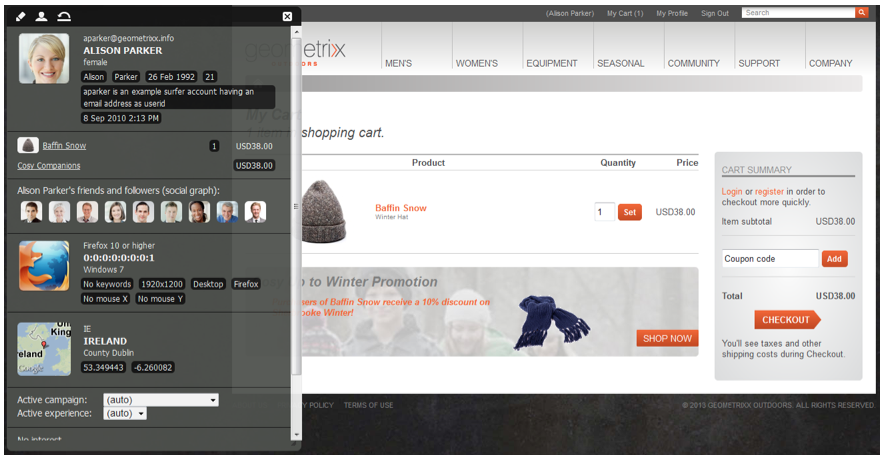

# 使用SAP Commerce cloud進行開發 {#developing-with-sap-commerce-cloud}

>[!NOTE]
>
>電子商務架構可與任何電子商務解決方案搭配使用。 此處討論的某些細節和範例將參照 [hybris](https://www.hybris.com/) 解決方案。

整合架構包含具有API的整合層。 這可讓您：

* 外掛電子商務系統並將產品資料提取至AEM
* 建立AEM元件，以提供獨立於特定電子商務引擎的商務功能


>[!NOTE]
>
>[另外也提供](/help/sites-developing/ecommerce.md#api-documentation) API檔案。

提供許多現成可用的AEM元件，以使用整合層。 目前有：

* 產品顯示元件
* 購物車
* 結帳

針對搜尋，提供整合掛接，可讓您使用AEM搜尋、電子商務系統搜尋、協力廠商搜尋（例如Search&amp;Promote）或其組合。

## 電子商務引擎選擇 {#ecommerce-engine-selection}

電子商務架構可與任何電子商務解決方案搭配使用，所使用的引擎需要由AEM識別：

* 電子商務引擎是支援介面的OSGi服 `CommerceService` 務

   * 引擎可由服務屬性 `commerceProvider` 區分

* AEM支援 `Resource.adaptTo()` 與 `CommerceService``Product`

   * 實 `adaptTo` 施會在資源的 `cq:commerceProvider` 層次結構中查找屬性：

      * 如果找到，則使用該值來篩選商務服務查閱。
      * 如果找不到，則會使用排名最高的商務服務。
   * 使 `cq:Commerce` 用混合素，以便 `cq:commerceProvider` 將其添加到強型資源。


* 該 `cq:commerceProvider` 屬性也用於參考相應的商務工廠定義。

   * 例如，具 `cq:commerceProvider` 有值的屬性 `hybris` 將關聯至Hybris **Day CQ Commerce Factory的OSGi組態(com.adobe.cq.commerce.hybris.impl.HybrisServiceFactory)-其中參數** 也有值 `commerceProvider``hybris`。

   * 您可在這裡設定其他屬性， **例如Catalog版本** （若適用且可用）。

請參閱下列範例：

| `cq:commerceProvider = geometrixx` | 在標準AEM安裝中，需要特定實作；例如，geometrixx範例，其中包含一般API的最小擴充功能 |
|---|---|
| `cq:commerceProvider = hybris` | Hybris實現 |

### 例如 {#example}

```shell
/content/store
+ cq:commerceProvider = hybris
  + mens
    + polo-shirt-1
    + polo-shirt-2
    + employee
+ cq:commerceProvider = jcr
  + adobe-logo-shirt
    + cq:commerceType = product
    + price = 12.50
  + adobe-logo-shirt_S
    + cq:commerceType = variant
    + size = S
  + adobe-logo-shirt_XL
    + cq:commerceType = variant
    + size = XL
    + price = 14.50
```

>[!NOTE]
>
>使用CRXDE Lite，您就可以在Hybris實作的產品元件中看到如何處理這些問題：
>
>`/apps/geometrixx-outdoors/components/hybris/product/product.jsp`

### Hybris 4的開發 {#developing-for-hybris}

電子商務整合架構的hybris擴充功能已更新，以支援Hybris 5，並維持與Hybris 4的回溯相容性。

程式碼中的預設設定會針對Hybris 5進行調整。

若要為Hybris 4開發，需要下列項目：

* 調用maven時，將以下命令行參數添加到命令中

   `-P hybris4`

   它會下載預先設定的Hybris 4散發，並內嵌在套件中：

   ```
   cq-commerce-hybris-server
   ```

* 在OSGi配置管理器中：

   * 停用Hybris 5對預設回應剖析器服務的支援。
   * 請確定Hybris Basic Authentication Handler服務的服務排名低於Hybris OAuth Handler服務。

### 作業處理 {#session-handling}

hybris使用使用者作業來儲存資訊，例如客戶的購物車。 工作階段ID會從Cookie中的 `JSESSIONID` Hybris傳回，而Cookie需要在後續的Hybris請求時傳送。 為避免將工作階段ID儲存在儲存庫中，會將其編碼在儲存在購物者瀏覽器中的其他Cookie中。 執行下列步驟：

* 在第一次要求時，購物者的要求不會設定Cookie;因此，請求會傳送至hybris例項以建立工作階段。
* 作業Cookie會從回應中擷取，並編碼為新Cookie(例如 `hybris-session-rest`)，並在對購物者的回應上設定。 需要新Cookie中的編碼，因為原始Cookie僅對特定路徑有效，否則在後續的請求中不會從瀏覽器傳回。 路徑資訊也必須新增至Cookie的值。
* 在後續的請求中，Cookie會從 `hybris-session-<*xxx*>` Cookie中解碼，並設定在HTTP用戶端上，用來從Hybris請求資料。

>[!NOTE]
>
>當原始作業階段不再有效時，會建立新的匿名作業階段。

#### CommerceSession {#commercesession}

* 此作業「擁有」購 **物車**

   * 執行添加／刪除／等
   * 對購物車執行各種計算；

      `commerceSession.getProductPrice(Product product)`

* 擁有訂 *單資料的存* 儲位置 ****

   `CommerceSession.getUserContext()`

* 也擁有付款 **處理** 連線
* 也擁有履約 **連線** 。

### 產品同步與發佈 {#product-synchronization-and-publishing}

以Hybris維護的產品資料必須可在AEM中使用。 已實施下列機制：

* 初始載入的ID由混合物作為饋送提供。 此動態消息可能有更新。
* hybris將透過動態消息（AEM會進行投票）提供更新資訊。
* 當AEM使用產品資料時，會將要求傳回至目前資料的Hybris（使用上次修改日期的條件式取得要求）。
* 在hybris上，可以以宣告方式指定動態消息內容。
* 將饋送結構對應至AEM內容模型會發生在AEM側的饋送介面卡中。


* 匯入工具(b)用於AEM中目錄的頁面樹狀結構初始設定。
* Hybris中的型錄變更會透過動態消息指示給AEM，然後傳播至AEM(b)

   * 針對型錄版本新增／刪除／變更產品。
   * 已核准產品。

* hybris擴充功能提供輪詢匯入程式（「hybris」配置），可設定此匯入程式以指定的間隔（例如，每隔24小時，以秒為單位指定間隔）將變更匯入AEM:

   * 
      ```
      http://localhost:4502/content/geometrixx-outdoors/en_US/jcr:content.json
       {
       * "jcr:mixinTypes": ["cq:PollConfig"],
       * "enabled": true,
       * "source": "hybris:outdoors",
       * "jcr:primaryType": "cq:PageContent",
       * "interval": 86400
       }
      ```

* AEM中的目錄設定可辨識 **Staged** and **Online目錄版本** 。

* 在型錄版本之間同步產品需要（取消）啟動對應的AEM頁面(a、c)

   * 將產品新增至 **線上** 型錄版本需要啟動產品的頁面。
   * 移除產品時，必須停用。

* 在AEM(c)中啟動頁面需要勾選(b)，而且只有在

   * 產品位於產品頁 **面的** 「線上目錄」版本。
   * 參考的產品可用於其 **他頁面** （例如促銷活動頁面）的線上目錄版本。

* 啟動的產品頁面需要存取產品資料的 **線上** (d)版本。

* AEM發佈例項需要存取hybris，才能擷取產品和個人化資料(d)。

### 建築 {#architecture}

#### 產品和變型的架構 {#architecture-of-product-and-variants}

單一產品可以有多種變化；例如，可能因顏色和／或大小而異。 產品必須定義哪些屬性驅動變化；我們用變 *型軸來定義*。

但是，並非所有屬性都是變型軸。 變化也會影響其他屬性；例如，價格可能取決於規模。 購物者無法選取這些屬性，因此不視為變型軸。

每個產品和／或變體都由資源表示，因此將1:1映射到儲存庫節點。 由此推論，特定產品和／或變體可以通過其路徑唯一標識。

產品／變型資源並不總是包含實際的產品資料。它可能是實際保存在另一個系統（如hybris）上的資料的表示。 例如，產品說明、定價等不會儲存在AEM中，而是從電子商務引擎即時擷取。

任何產品資源都可以用 `Product API`。 產品API中的大部分呼叫都是變數特定的（雖然變數可能繼承祖先的共用值），但也有呼叫會列出變數集( `getVariantAxes()`、 `getVariants()`等等)。

>[!NOTE]
>
>實際上，變型軸由任何返回項 `Product.getVariantAxes()` 決定：
>
>* hybris為hybris實作定義它
>
>
雖然產品（一般而言）可以有許多變型軸，但現成的產品元件只能處理兩個：
>
>1. `size`
   >
   >
1. 再加一個
   >   此額外變數是透過產品參 `variationAxis` 考的屬性選取(通常 `color` 適用於Geometrixx Outdoors)。
>


#### 產品參考資料和產品資料 {#product-references-and-product-data}

一般而言：

* 產品資料位於 `/etc`

* 和產品參考 `/content`。

產品變化與產品資料節點之間必須有1:1的對應。

產品參考也必須為每個呈現的變化提供一個節點——但不需要顯示所有的變化。 例如，如果產品有S、M、L變數，則產品資料可能是：

```shell
etc
  commerce
    products
      shirt
        shirt-s
        shirt-m
        shirt-l
```

雖然「高大」目錄可能只有：

```shell
content
  big-and-tall
    shirt
      shirt-l
```

最後，不需要使用產品資料。 您可以將所有產品資料放在目錄的參考之下；但是，若不複製所有產品資料，就無法真正擁有多個型錄。

**API**

#### com.adobe.cq.commerce.api.Product介面 {#com-adobe-cq-commerce-api-product-interface}

```java
public interface Product extends Adaptable {

    public String getPath();            // path to specific variation
    public String getPagePath();        // path to presentation page for all variations
    public String getSKU();             // unique ID of specific variation

    public String getTitle();           // shortcut to getProperty(TITLE)
    public String getDescription();     // shortcut to getProperty(DESCRIPTION)
    public String getImageUrl();        // shortcut to getProperty(IMAGE_URL)
    public String getThumbnailUrl();    // shortcut to getProperty(THUMBNAIL_URL)

    public <T> T getProperty(String name, Class<T> type);

    public Iterator<String> getVariantAxes();
    public boolean axisIsVariant(String axis);
    public Iterator<Product> getVariants(VariantFilter filter) throws CommerceException;
}
```

#### com.adobe.cq.commerce.api.VariantFilter {#com-adobe-cq-commerce-api-variantfilter}

```java
/**
 * Interface for filtering variants and AxisFilter provided as common implementation
 *
 * The <code>VariantFilter</code> is used to filter variants,
 * e.g. when using {@link Product#getVariants(VariantFilter filter)}.
 */
public interface VariantFilter {
    public boolean includes(Product product);
}

/**
 * A {@link VariantFilter} for filtering variants by the given
 * axis and value. The following example returns a list of
 * variant products that have a value of <i>blue</i> on the
 * <i>color</i> axis.
 *
 * <p>
 * <code>product.getVariants(new AxisFilter("color", "blue"));</code>
 */
public class AxisFilter implements VariantFilter {

    private String axis;
    private String value;

    public AxisFilter(String axis, String value) {
        this.axis = axis;
        this.value = value;
    }

    /**
     * {@inheritDoc}
     */
    public boolean includes(Product product) {
        ValueMap values = product.adaptTo(ValueMap.class);

        if(values != null) {
            String v = values.get(axis, String.class);

            return v != null && v == value;
        }

        return false;
    }
}
```

* **通用儲存機制**

   * 產品節點為nt:unstructured。
   * 產品節點可以是：

      * 參考，其中產品資料儲存在其他位置：

         * 產品參考包 `productData` 含屬性，其指向產品資料(通常在 `/etc/commerce/products`下)。
         * 產品資料是分層的；產品屬性繼承自產品資料節點的祖先。
         * 產品參考也可以包含局部屬性，這些屬性會覆寫其產品資料中指定的屬性。
      * 產品本身：

         * 沒有屬 `productData` 性。
         * 在本機保存所有屬性（且不包含productData屬性）的產品節點會直接從其祖先繼承產品屬性。


* **AEM-generic產品結構**

   * 每個變型都必須有自己的葉節點。
   * 產品介面既代表產品，也代表變型，但相關儲存庫節點是特定的。
   * 產品節點描述產品屬性和變型軸。

#### 例如 {#example-1}

```shell
+ banyan_shirt
    - cq:commerceType = product
    - cq:productAttributes = [jcr:title, jcr:description, size, price, color]
    - cq:productVariantAxes = [color, size]
    - jcr:title = Banyan Shirt
    - jcr:description = Flowery, all-cotton shirt.
    - price = 14.00
    + banyan_shirt_s
        - cq:commerceType = variant
        - size = S
        + banyan_shirt_s_red
            - cq:commerceType = variant
            - color = red
        + banyan_shirt_s_blue
            - cq:commerceType = variant
            - color = blue
    + banyan_shirt_m
        - cq:commerceType = variant
        - size = M
        + banyan_shirt_m_red
            - cq:commerceType = variant
            - color = red
        + banyan_shirt_m_blue
            - cq:commerceType = variant
            - color = blue
    + banyan_shirt_l
        - cq:commerceType = variant
        - size = L
        + banyan_shirt_l_red
            - cq:commerceType = variant
            - color = red
        + banyan_shirt_l_blue
            - cq:commerceType = variant
            - color = blue
    + banyan_shirt_xl
        - cq:commerceType = variant
        - size = XL
        - price = 18.00
```

#### 購物車的架構 {#architecture-of-the-shopping-cart}

**元件**

* 購物車歸 `CommerceSession:`

   * 執 `CommerceSession` 行添加／刪除等。
   * 此外 `CommerceSession` ，還會對購物車執行各種計算。&quot;

* 雖然不直接與購物車相關，但 `CommerceSession` 必須提供目錄定價資訊（因為它擁有定價）

   * 定價可能有數種修飾詞：

      * 數量折扣。
      * 不同的貨幣。
      * 適用增值稅且免加值稅。
   * 這些修飾元是完全開放的，具有下列介面：

      * `int CommerceSession.getQuantityBreakpoints(Product product)`
      * `String CommerceSession.getProductPrice(Product product)`


**儲存**

* 儲存

   * 在hybris案例中，hybris伺服器擁有購物車。
   * 在的AEM-generic案例中，購物車會儲存在 [ClientContext中](/help/sites-administering/client-context.md)。

**個性化**

* 個人化應一律透過 [ClientContext推動](/help/sites-administering/client-context.md)。
* 購物車 `/version/` 的ClientContext會在所有情況下建立：

   * 應使用方法添加產 `CommerceSession.addCartEntry()` 品。

* 以下說明ClientContext購物車中購物車資訊的範例：



#### 結帳的架構 {#architecture-of-checkout}

**購物車和訂購資料**

The owns `CommerceSession` the three elements:

1. 購物車內容
1. 定價
1. 訂單詳細資訊

1. **購物車內容**

   購物車內容結構由API修正：

   ```java
       public void addCartEntry(Product product, int quantity);
       public void modifyCartEntry(int entryNumber, int quantity);
       public void deleteCartEntry(int entryNumber);
   ```

1. **定價**

   API也會修正定價結構：

   ```java
       public String getCartPreTaxPrice();
       public String getCartTax();
       public String getCartTotalPrice();
       public String getOrderShipping();
       public String getOrderTotalTax();
       public String getOrderTotalPrice();
   ```

1. **訂單詳細資料**

   但是，訂單詳細資 *料* ,API並未修正：

   ```java
       public void updateOrderDetails(Map<String, String> orderDetails);
       public Map<String, String> getOrderDetails();
       public void submitOrder();
   ```

**發運計算**

* 訂單通常需要提供多種運送選項（和價格）。
* 價格可能根據訂單的項目和詳細資訊，例如重量和／或交貨地址。
* The `CommerceSession` has access to all the dependiences, so the it can as simaly as approduct pricing:

   * 該公司 `CommerceSession` 擁有運費定價。
   * 可使用 `updateOrder(Map<String, Object> delta)`

>[!NOTE]
>
>您可以實作運送選擇器；例如：
>
>`yourProject/commerce/components/shippingpicker`:
>
>* 本質上，這可以是副本 `foundation/components/form/radio`，但對的回呼 `CommerceSession` 為：
   >
   >
* 檢查方法是否可用
>* 新增定價資訊
>* 若要讓購物者在AEM中更新訂單頁面（包括超集的運送方法和說明它們的文字），同時仍具備公開相關資訊的控 `CommerceSession` 制權。


**付款處理**

* 付款 `CommerceSession` 處理連線也歸您所有。
* 實施者需要將特定呼叫（加入其選擇的付款處理服務）新增至實 `CommerceSession` 施。

**訂單履行**

* The `CommerceSession` also own the fulfillment connection.
* 實施者將需要在實施中新增特定呼叫(至其選擇的付款處理服 `CommerceSession` 務)。

### 搜尋定義 {#search-definition}

遵循標準服務API模型，電子商務專案提供一組可由個別商務引擎實施的搜尋相關API。

>[!NOTE]
>
>目前，只有hybris引擎會立即建置搜尋API。
>
>不過，搜尋API是通用的，可由每個CommerceService個別實作。

電子商務專案包含預設搜尋元件，位於：

`/libs/commerce/components/search`


這可使用搜尋API來查詢選取的商務引擎(請參閱 [電子商務引擎選擇](#ecommerce-engine-selection)):

#### 搜尋API {#search-api}

核心專案提供數個通用／輔助類別：

1. `CommerceQuery`

   用於描述搜索查詢（包含有關查詢文本、當前頁、頁面大小、排序和選定刻面的資訊）。 所有實作搜尋API的電子商務服務都會收到此類的例項，以執行其搜尋。 可 `CommerceQuery` 以從請求物件( `HttpServletRequest`)實例化。

1. `FacetParamHelper`

   是提供一種靜態方法的實用程式類 `toParams` 別——用於從刻面和一個切 `GET` 換的值清單中生成參數字串。 這在UI端很有用，您需要針對每個Facet的每個值顯示超連結，如此當使用者按一下超連結時，就會切換個別值（例如，如果選取該值，則會從查詢中移除，否則會新增）。 這會處理處理多／單值刻面、覆寫值等所有邏輯。

搜尋API的入口點是傳回 `CommerceService#search` 物件的方 `CommerceResult` 法。 如需此 [主題的詳細資訊](/help/sites-developing/ecommerce.md#api-documentation) ，請參閱API檔案。

### 使用者整合 {#user-integration}

AEM與各種電子商務系統之間提供整合。 這需要在不同系統之間同步化購物者的策略，讓AEM專用的程式碼只需知道AEM，反之亦然：

* 驗證

   AEM被認為是唯一 *的* Web前端，因此執行 *所有* 。

* 從屬帳戶

   AEM會針對每位購物者建立Hybris的奴隸帳戶。 從屬帳戶的使用者名稱與AEM使用者名稱相同。 密碼隨機密碼會自動產生並儲存（加密）至AEM。

#### 預先存在的使用者 {#pre-existing-users}

AEM前端可定位在現有Hybris實作之前。 您也可以將hybris引擎新增至現有的AEM安裝。 要執行此操作，系統必須能夠正常處理任一系統中的現有用戶：

* AEM -> hybris

   * 登入hybris時，如果AEM使用者尚未存在：

      * 使用密碼學隨機密碼建立新的混合使用者
      * 將hybris使用者名稱儲存在AEM使用者的使用者目錄中
   * 請參閱： `com.adobe.cq.commerce.hybris.impl.HybrisSessionImpl#login()`


* hybris -> AEM

   * 登入AEM時，如果系統識別使用者：

      * 嘗試使用提供的username/pwd登入hybris
      * 如果成功，請使用相同密碼在AEM中建立新使用者（AEM-specific salt會產生AEM-specific雜湊）
   * 上述演算法是在Sling中實作 `AuthenticationInfoPostProcessor`

      * 請參閱： `com.adobe.cq.commerce.hybris.impl.user.LazyUserImporter.java`


### 自訂匯入程式 {#customizing-the-import-process}

若要建立現有功能，您的自訂匯入處理常式：

* 必須實作介 `ImportHandler` 面

* 可以擴展 `DefaultImportHandler`

```java
/**
 * Services implementing the <code>ImportHandler</code> interface are
 * called by the {@link HybrisImporter} to create actual commerce entities
 * such as products.
 */
public interface ImportHandler {

    /**
     * Not used.
     */
    public void createTaxonomie(ImporterContext ctx);

    /**
     * Creates a catalog with the given name.
     * @param ctx   The importer context
     * @param name  The catalog's name
     * @return Path of created catalog
     */
    public String createCatalog(ImporterContext ctx, String name) throws Exception;

    /**
     * Creates a product from the given values.
     * @param ctx                The importer context
     * @param values             The product's properties
     * @param parentCategoryPath The containing category's path
     * @return Path of created product
     */
    public String createProduct(ImporterContext ctx, ValueMap values, String parentCategoryPath) throws Exception;

    /**
     * Creates a variant product from the given values.
     * @param ctx             The importer context
     * @param values          The product's properties
     * @param baseProductPath The base product's path
     * @return Path of created product
     */
    public String createVariantProduct(ImporterContext ctx, ValueMap values, String baseProductPath) throws Exception;

    /**
     * Creates an asset for a product. This is usually a product
     * image.
     * @param ctx             The importer context
     * @param values          The product's properties
     * @param baseProductPath The product's path
     * @return Path of created asset
     */
    public String createAsset(ImporterContext ctx, ValueMap values, String productPath) throws Exception;

    /**
     * Creates a category from the given values.
     * @param ctx           The importer context
     * @param values        The category's properties
     * @param parentPath    Path of parent category or base path of import in case of root category
     * @return Path of created category
     */
    public String createCategory(ImporterContext ctx, ValueMap values, String parentCategoryPath) throws Exception;
}
```

對於要由匯入工具識別的自訂處理常式，它必須指定 `service.ranking`值大於0的屬性；例如：

```java
@Component
@Service
@Property(name = "service.ranking", value = 100)
public class MyImportHandler extends DefaultImportHandler {
    ...
}
```

