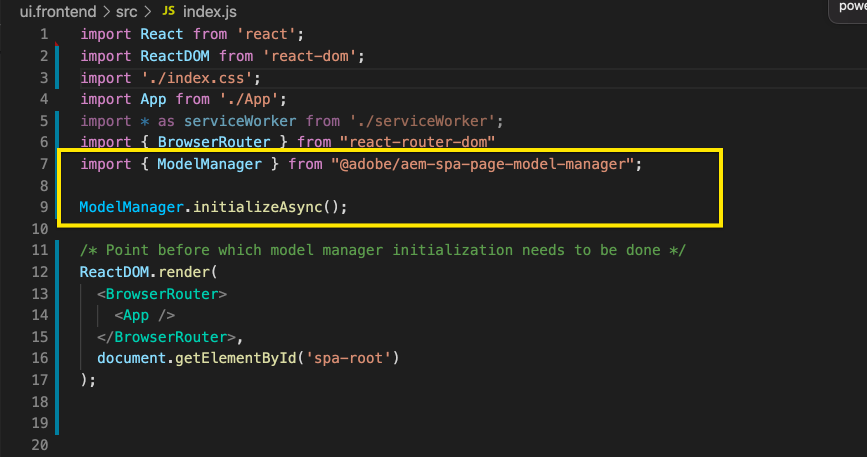

# 在&lt;a0SPA/AEM>中編輯外部{#editing-external-spa-within-aem}

在決定您想要在外部和之間進行何種SPA整AEM合時，您通常需要能夠編輯並檢視SPA內部AEM。

## 概覽 {#overview}

本檔案說明將獨立作業上傳至例項SPA、新AEM增可編輯的內容區段，以及啟用編寫的建議步驟。

## 必備條件 {#prerequisites}

先決條件很簡單。

* 請確定本機執AEM行的例項。
* 使用&lt;a0/AEM>專案原型來建AEM立基本專案。](https://experienceleague.adobe.com/docs/experience-manager-core-components/using/developing/archetype/overview.html?#available-properties)[
   * 這將構成項目的基AEM礎，項目將更新為包括外部SPA。
   * 對於本文中的示例，我們使用[WKND項SPA目的起點。](https://experienceleague.adobe.com/docs/experience-manager-learn/sites/spa-editor/spa-editor-framework-feature-video-use.html#spa-editor)
* 讓您想要整合的SPA外部有效回應。

## 上SPA傳AEM至專案{#upload-spa-to-aem-project}

首先，您需要將外部內SPA容上傳AEM至專案。

1. 將`/ui.frontend`專案資料夾中的`src`取代為React應用程式的`src`資料夾。
1. 在應用程式的`package.json`檔案中，加入其他相依性。`/ui.frontend/package.json`
   * 確定SPASDK相依性為[建議版本。](spa-getting-started-react.md#dependencies)
1. 在`/public`資料夾中加入任何自訂項目。
1. 在`/public/index.html`檔案中加入任何內嵌指令碼或樣式。

## 配置遠SPA程{#configure-remote-spa}

現在，外部SPA是項目的一AEM部分，需要在中進行配AEM置。

### 包含AdobeSPASDK套件{#include-spa-sdk-packages}

要利用功AEM能，SPA請依賴以下三個軟體包。

* [`@adobe/aem-react-editable-components`](https://github.com/adobe/aem-react-editable-components)
* [`@adobe/aem-spa-component-mapping`](https://www.npmjs.com/package/@adobe/aem-spa-component-mapping)
* [`@adobe/aem-spa-page-model-manager`](https://www.npmjs.com/package/@adobe/aem-spa-model-manager)

`@adobe/aem-spa-page-model-manager` 提供API，用於初始化「模型管理器」並從實例中檢索AEM模型。然後，此模型可用AEM於使用`@adobe/aem-react-editable-components`和`@adobe/aem-spa-component-mapping`的API來轉換元件。

#### 安裝{#installation}

運行以下npm命令以安裝所需的軟體包。

```shell
npm install --save @adobe/aem-spa-component-mapping @adobe/aem-spa-page-model-manager @adobe/aem-react-editable-components
```

### ModelManager初始化{#model-manager-initialization}

在應用程式轉譯之前，[`ModelManager`](spa-blueprint.md#pagemodelmanager)必須進行初始化，以處理AEM`ModelStore`的建立。

這必須在應用程式的`src/index.js`檔案中，或在產生應用程式根目錄的任何地方完成。

對此，我們可以使用`ModelManager`提供的`initializationAsync` API。

以下螢幕擷取顯示如何在簡單的React應用程式中啟用初始化`ModelManager`。 唯一的限制是`initializationAsync`需要在`ReactDOM.render()`之前呼叫。



在此示例中，初始化`ModelManager`並建立空`ModelStore`。

`initializationAsync` 可以選擇接受 `options` 對象作為參數：

* `path` -初始化時，將讀取定義路徑上的模型並將其儲存在中 `ModelStore`。如有需要，可使用此選項在初始化時讀取`rootModel`。
* `modelClient` -允許提供負責讀取模型的自定義客戶端。
* `model` -使用 `model` SSR時通常以參數形式傳遞 [的對象。](spa-ssr.md)

### 可AEM授權的葉元件{#authorable-leaf-components}

1. 建立／識別AEM要為其建立可授權React元件的元件。 在此示例中，我們使用WKND項目的文本元件。

   

1. 在中建立簡單的React文本組SPA件。 在此示例中，已使用以下內容建立了新檔案`Text.js`。

   

1. 建立配置對象以指定啟用編輯所需的AEM屬性。

   

   * `resourceType` 必須將React元件映射到元件，AEM並在編輯器中開啟時啟AEM用編輯。

1. 使用包裝函式`withMappable`。

   

   此包裝函式將React元件映射AEM到配置中指定的`resourceType` ，並在編輯器中開啟時啟用編輯AEM功能。 對於獨立元件，它還將獲取特定節點的模型內容。

   >[!NOTE]
   >
   >在此範例中，元件有個別版本：包AEM裝和解包React元件。 明確使用元件時，必須使用包裝版本。 當元件是頁面的一部分時，您可以繼續使用目前在編輯器中完成的預設元SPA件。

1. 在元件中演算內容。

   文本元件的JCR屬性如下所示AEM。

   

   這些值會作為屬性傳遞給新建立的`AEMText` React元件，並可用來轉換內容。

   ```javascript
   import React from 'react';
   import { withMappable } from '@adobe/aem-react-editable-components';
   
   export const TextEditConfig = {
       // Empty component placeholder label
       emptyLabel:'Text', 
       isEmpty:function(props) {
          return !props || !props.text || props.text.trim().length < 1;
       },
       // resourcetype of the AEM counterpart component
       resourceType:'wknd-spa-react/components/text'
   };
   
   const Text = ({ text }) => (<div>{text}</div>);
   
   export default Text;
   
   export const AEMText = withMappable(Text, TextEditConfig);
   ```

   這是配置完成時元件的AEM顯示方式。

   ```javascript
   const Text = ({ cqPath, richText, text }) => {
      const richTextContent = () => (
         <div className="aem_text" id={cqPath.substr(cqPath.lastIndexOf('/') + 1)} data-rte-editelement dangerouslySetInnerHTML={{__html: text}}/>
      );
      return richText ? richTextContent() : (<div className="aem_text">{text}</div>);
   };
   ```

   >[!NOTE]
   >
   >在此範例中，我們進一步自訂演算的元件，以符合現有的文字元件。 但這與在中編寫無關AEM。

#### 將可授權元件新增至頁面{#add-authorable-component-to-page}

建立可授權的React元件後，我們就可以在整個應用程式中使用這些元件。

讓我們舉一個範例頁面，其中需要從WKND專案新增文SPA字。 在此範例中，我們要顯示文字&quot;Hello World!&quot; 於 `/content/wknd-spa-react/us/en/home.html`.

1. 確定要顯示的節點路徑。

   * `pagePath`:包含節點的頁面，在我們的範例中  `/content/wknd-spa-react/us/en/home`
   * `itemPath`:頁面內節點的路徑，在我們的範例中  `root/responsivegrid/text`
      * 這包括頁面上包含項目的名稱。

   

1. 在頁面的必要位置新增元件。

   

   `AEMText`元件可在頁面內的必要位置新增，其中`pagePath`和`itemPath`值設為屬性。 `pagePath` 是強制屬性。

#### 驗證在{#verify-text-edit}上編輯AEM文本內容

我們現在可以在執行中的例項上測試AEM元件。

1. 從`aem-guides-wknd-spa`目錄運行以下Maven命令，以生成項目並將其部署到AEM。

```shell
mvn clean install -PautoInstallSinglePackage
```

1. 在實例AEM中，導航至`http://<host>:<port>/editor.html/content/wknd-spa-react/us/en/home.html`。


`AEMText`元件現在可在上授權AEM。

### 可AEM授權的頁面{#aem-authorable-pages}

1. 識別要新增的頁面，以便在中進行編SPA寫。 此示例使用`/content/wknd-spa-react/us/en/home.html`。
1. 建立新檔案(例如`Page.js`)。 在這裡，我們可以重複使用`@adobe/cq-react-editable-components`中提供的頁面元件。
1. 在[可授權葉元件部分重複步AEM驟4。](#authorable-leaf-components) 在元件上使 `withMappable` 用wrapper函式。
1. 如先前所做，請將`MapTo`套用至頁面AEM內所有子元件的資源類型。

   ```javascript
   import { Page, MapTo, withMappable } from '@adobe/aem-react-editable-components';
   import Text, { TextEditConfig } from './Text';
   
   export default withMappable(Page);
   
   MapTo('wknd-spa-react/components/text')(Text, TextEditConfig);
   ```

   >[!NOTE]
   >
   >在此示例中，我們使用未包裝的React文本元件，而不是先前建立的包裝的`AEMText`。 這是因為，當元件是頁面／容器的一部分，而非獨立時，容器將負責遞歸對應元件並啟用編寫功能，而且每個子系不需要額外的包裝函式。

1. 若要在中新增可授權的頁SPA面，請依照[將可授權的元件新增至頁面中的相同步驟進行。](#add-authorable-component-to-page) 不過，我們可以在此略過 `itemPath` 屬性。

#### 驗證&lt;a0/AEM>上的頁面內容{#verify-page-content}

要驗證頁面是否可以編輯，請按照[上「驗證編輯文本內容」一節中的相AEM同步驟操作。](#verify-text-edit)


頁面現在可在上編AEM輯，並包含版面容器和子文字元件。

### 虛擬葉元件{#virtual-leaf-components}

在先前的範例中，我們新增元件至包含現SPA有內AEM容。 不過，有些情況下，內容尚未在中建立，但AEM需要由內容作者稍後新增。 為配合此需求，前端開發人員可將元件新增至 在中的編輯器中開啟這些元件時，將顯示佔位符AEM。 內容作者在這些預留位置中新增內容後，就會在JCR結構中建立節點，並保留內容。 建立的元件將允許與獨立葉元件相同的操作集。

在此示例中，我們重複使用以前建立的`AEMText`元件。 我們希望在WKND首頁的現有文本元件下添加新文本。 添加的組分與普通葉元件相同。 但是，`itemPath`可以更新為需要添加新元件的路徑。

由於新元件必須新增至`root/responsivegrid/text`的現有文字下方，因此新路徑應為`root/responsivegrid/{itemName}`。

```html
<AEMText
 pagePath='/content/wknd-spa-react/us/en/home'
 itemPath='root/responsivegrid/text_20' />
```

添加虛擬元件後，`TestPage`元件如下所示。


>[!NOTE]
>
>確保`AEMText`元件在配置中設定了`resourceType`以啟用此功能。

您現在可以部署變更，AEM以遵循[中「驗證編輯文字內容」一節的步驟AEM。](#verify-text-edit) 將顯示當前非現有節點的佔位符 `text_20` 。


當內容作者更新此元件時，會在`/content/wknd-spa-react/us/en/home`的`root/responsivegrid/text_20`中建立新的`text_20`節點。


#### 要求與限制{#limitations}

添加虛擬葉元件有許多要求，也有一些限制。

* `pagePath`屬性是建立虛擬元件的必備屬性。
* `pagePath`路徑中提供的頁面節點必須存在於項AEM目中。
* `itemPath`中必須提供要建立的節點的名稱。
* 可在任何級別建立元件。
   * 如果我們在上例中提供`itemPath='text_20'`，則新節點將直接在頁面(如`/content/wknd-spa-react/us/en/home/jcr:content/text_20`
* 通過`itemPath`提供時，建立新節點的節點路徑必須有效。
   * 在此示例中，`root/responsivegrid`必須存在，以便在此處建立新節點`text_20`。
* 僅支援葉元件建立。 未來版本將支援虛擬容器和頁面。

## 其他自定義{#additional-customizations}

如果您遵循先前的範例，現在可在SPA中編輯外部AEM。 不過，您可進一步自訂外SPA部的其他方面。

### 根節點ID {#root-node-id}

依預設，我們假設React應用程式會呈現在元素ID `spa-root`的`div`中。 如有需要，可自訂此選項。

例如，假設我們有SPA一個應用程式在元素ID `root`的`div`中呈現。 這必須反映在三個檔案中。

1. 在React應用程式的`index.js`中（或呼叫`ReactDOM.render()`的位置）

   

1. 在React應用程式的`index.html`中

   

1. 在應用AEM程式的頁面元件內文中，透過兩個步驟：

   1. 為頁面元件建立新的`body.html`。

   

   1. 在新的`body.html`檔案中新增根元素。

   

### 編輯SPA路由{#editing-react-spa-with-routing}

如果外部React應SPA用程式具有多個頁，[它可以使用路由來確定要渲染的頁／元件。](spa-routing.md) 基本使用案例是將目前作用中的URL與路由提供的路徑相符。為了能夠在此類支援路由的應用程式上進行編輯，需要轉換與之匹配的路徑，以容納AEM特定資訊。

在下列範例中，我們提供包含兩頁的簡單React應用程式。 要呈現的頁面是通過將提供給路由器的路徑與活動URL匹配來確定的。 例如，如果我們位於`mydomain.com/test`，則會呈現`TestPage`。


若要在此範例AEM中啟用編SPA輯功能，請執行下列步驟。

1. 確定作為根的級別AEM。

   * 對於我們的示例，我們將`wknd-spa-react/us/en`視為的根SPA。 這表示該路徑前的所有項目都AEM只是頁面／內容。

1. 在所需層級建立新頁面。

   * 在此範例中，要編輯的頁面為`mydomain.com/test`。 `test` 位於應用程式的根路徑中。在中建立頁面時，也需要保AEM留此項。 因此，我們可以在上一步驟中定義的根級別建立新頁面。
   * 建立的新頁面必須與要編輯的頁面具有相同的名稱。 在此示例中，對於`mydomain.com/test`，建立的新頁必須是`/path/to/aem/root/test`。

1. 在路線中增加幫SPA手。

   * 新建立的頁面尚未在中呈現預期的內容AEM。 這是因為路由器預期路徑為`/test` ，而AEM活動路徑為`/wknd-spa-react/us/en/test`。 為了容AEM納URL的特定部分，我們需要在旁邊加入一些幫SPA助器。

   

   * `@adobe/cq-spa-page-model-manager`提供的`toAEMPath`幫助程式可用於此。 當應用程式在實例上開啟時，它將為路由提供的路AEM徑轉換為包括特定AEM部分。 它接受三個參數：
      * 路由所需的路徑
      * 編輯實例AEM的原SPA點URL
      * 項目根位AEM於第一步中確定
   * 這些值可設為環境變數，以提供更大的彈性。


1. 確認在中編輯頁AEM面。

   * 將專案部AEM署至並導覽至新建立的`test`頁面。 現在會轉譯頁面內容，並AEM可編輯元件。

## 其他資源 {#additional-resources}

以下參考資料有助於瞭解SPA相關內容AEM。

* [原AEM型工程](https://experienceleague.adobe.com/docs/experience-manager-core-components/using/developing/archetype/overview.html)
* [WKND專SPA案](https://experienceleague.adobe.com/docs/experience-manager-learn/sites/spa-editor/spa-editor-framework-feature-video-use.html)
* [使用ReactSPA快速入AEM門](spa-getting-started-react.md)
* [參SPA考資料（API參考）](spa-reference-materials.md)
* [BlueprintSPA和PageModelManager](spa-blueprint.md#pagemodelmanager)
* [模SPA型路由](spa-routing.md)
* [和SPA伺服器端演算](spa-ssr.md)
