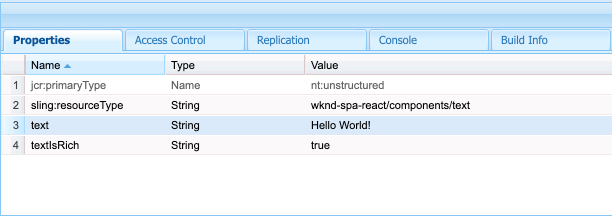
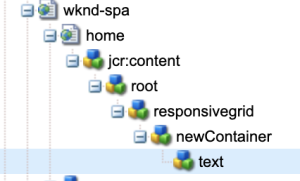

# 在Adobe Experience Manager中編輯外部SPA {#editing-external-spa-within-aem}

在決定您要在外部SPA和Adobe Experience Manager (AEM)之間進行的整合層級時，您通常需要能夠在AEM中編輯和檢視SPA。

## 概觀 {#overview}

本檔案說明將獨立SPA上傳到AEM執行個體、新增內容的可編輯區段及啟用編寫的建議步驟。

## 先決條件 {#prerequisites}

先決條件很簡單。

* 請確定AEM的執行個體正在本機執行。
* 建立基礎AEM SPA專案，使用 [AEM專案原型](https://experienceleague.adobe.com/docs/experience-manager-core-components/using/developing/archetype/overview.html?#available-properties).
   * 這將構成AEM專案的基礎，專案將更新以包含外部SPA。
   * 本檔案中的範例使用 [wknd SPA專案](https://experienceleague.adobe.com/docs/experience-manager-learn/sites/spa-editor/spa-editor-framework-feature-video-use.html#spa-editor).
* 準備好您想要整合的可使用的外部React SPA。

## 上傳SPA至AEM專案 {#upload-spa-to-aem-project}

首先，您需要將外部SPA上傳至AEM專案。

1. 取代 `src` 在 `/ui.frontend` 含有您React應用程式的 `src` 資料夾。
1. 在應用程式的 `package.json` 在 `/ui.frontend/package.json` 檔案。
   * 確認SPA SDK相依性為 [建議的版本](spa-getting-started-react.md#dependencies).
1. 將任何自訂專案納入 `/public` 資料夾。
1. 納入任何內嵌指令碼或樣式 `/public/index.html` 檔案。

## 設定遠端SPA {#configure-remote-spa}

現在，外部SPA屬於AEM專案的一部分，必須在AEM中進行設定。

### 包含AdobeSPA SDK套件 {#include-spa-sdk-packages}

若要利用AEM SPA功能，需依賴下列三個套件。

* [`@adobe/aem-react-editable-components`](https://github.com/adobe/aem-react-editable-components)
* [`@adobe/aem-spa-component-mapping`](https://www.npmjs.com/package/@adobe/aem-spa-component-mapping)
* [`@adobe/aem-spa-page-model-manager`](https://www.npmjs.com/package/@adobe/aem-spa-model-manager)

此 `@adobe/aem-spa-page-model-manager` 提供用於初始化「模型管理員」和從AEM執行個體擷取模型的API。 然後，此模型可用於使用來自的API轉譯AEM元件 `@adobe/aem-react-editable-components` 和 `@adobe/aem-spa-component-mapping`.

#### 安裝 {#installation}

執行下列npm命令以安裝必要的套件。

```shell
npm install --save @adobe/aem-spa-component-mapping @adobe/aem-spa-page-model-manager @adobe/aem-react-editable-components
```

### ModelManager初始化 {#model-manager-initialization}

在應用程式轉譯之前， [`ModelManager`](spa-blueprint.md#pagemodelmanager) 必須初始化才能處理AEM的建立 `ModelStore`.

這需要在以下範圍內完成： `src/index.js` 應用程式的檔案，或是呈現應用程式根目錄的位置。

為此，請使用 `initializationAsync` API由 `ModelManager`.

下列熒幕擷圖顯示如何啟用 `ModelManager` 在簡單的React應用程式中。 唯一的限制是 `initializationAsync` 必須在以下時間之前呼叫： `ReactDOM.render()`.


在此範例中， `ModelManager` 已初始化且是空的 `ModelStore` 「 」已建立。

此 `initializationAsync` 可選擇接受 `options` 物件做為引數：

* `path`  — 初始化時，會擷取定義路徑上的模型並儲存在 `ModelStore`. 這可用來擷取 `rootModel` 初始化時（如有需要）。
* `modelClient`  — 允許提供負責擷取模型的自訂使用者端。
* `model` - A `model` 作為引數傳遞的物件通常在 [使用SSR。](spa-ssr.md)

### AEM Authorable Leaf元件 {#authorable-leaf-components}

1. 建立/識別將為其建立可授權的React元件的AEM元件。 在此範例中，WKND專案使用文字元件。

   

1. 在SPA中建立簡單的React文字元件。 在此範例中，新檔案 `Text.js` 已使用下列內容建立。

   

1. 建立組態物件，以指定啟用AEM編輯所需的屬性。

   

   * `resourceType` 在AEM編輯器中開啟時，必須將React元件對應至AEM元件並啟用編輯。

1. 使用包裝函式 `withMappable`.

   

   此包裝函式將React元件對應至AEM `resourceType` 在設定中指定，並在AEM編輯器中開啟時啟用編輯功能。 對於獨立元件，它也會擷取特定節點的模型內容。

   >[!NOTE]
   >
   >在此範例中，有不同版本的元件： AEM包裝和未包裝的React元件。 明確使用元件時，需要使用包裝好的版本。 當元件是頁面的一部分時，您可以繼續使用預設元件，就像目前在SPA編輯器中完成的一樣。

1. 呈現元件中的內容。

   文字元件的JCR屬性在AEM中會顯示如下。

   

   這些值會以屬性形式傳遞至新建立的 `AEMText` React元件，並可用於呈現內容。

   ```javascript
   import React from 'react';
   import { withMappable } from '@adobe/aem-react-editable-components';
   
   export const TextEditConfig = {
       // Empty component placeholder label
       emptyLabel:'Text', 
       isEmpty:function(props) {
          return !props || !props.text || props.text.trim().length < 1;
       },
       // resourcetype of the AEM counterpart component
       resourceType:'wknd-spa-react/components/text'
   };
   
   const Text = ({ text }) => (<div>{text}</div>);
   
   export default Text;
   
   export const AEMText = withMappable(Text, TextEditConfig);
   ```

   這是AEM設定完成時元件的顯示方式。

   ```javascript
   const Text = ({ cqPath, richText, text }) => {
      const richTextContent = () => (
         <div className="aem_text" id={cqPath.substr(cqPath.lastIndexOf('/') + 1)} data-rte-editelement dangerouslySetInnerHTML={{__html: text}}/>
      );
      return richText ? richTextContent() : (<div className="aem_text">{text}</div>);
   };
   ```

   >[!NOTE]
   >
   >在此範例中，已對轉譯的元件進行進一步自訂，以符合現有的文字元件。 但這與AEM中的製作無關。

#### 將可編寫的元件新增至頁面 {#add-authorable-component-to-page}

建立可授權的React元件後，即可在整個應用程式中使用這些元件。

讓我們舉一個需要新增WKND SPA專案文字的範例頁面。 在此範例中，您想要顯示文字「Hello World！」 於 `/content/wknd-spa-react/us/en/home.html`.

1. 決定要顯示的節點路徑。

   * `pagePath`：範例中包含節點的頁面 `/content/wknd-spa-react/us/en/home`
   * `itemPath`：頁面中節點的路徑，在範例中為 `root/responsivegrid/text`
      * 由頁面上包含專案的名稱組成。

   

1. 在頁面的所需位置新增元件。

   

   此 `AEMText` 元件可新增至頁面內的必要位置，並具有 `pagePath` 和 `itemPath` 值會設定為屬性。 `pagePath` 是強制屬性。

#### 驗證在AEM上編輯文字內容 {#verify-text-edit}

現在請在執行中的AEM例項上測試元件。

1. 從以下位置執行以下Maven命令： `aem-guides-wknd-spa` 目錄，以建置專案並部署至AEM。

```shell
mvn clean install -PautoInstallSinglePackage
```

1. 在您的AEM執行個體上，導覽至 `http://<host>:<port>/editor.html/content/wknd-spa-react/us/en/home.html`.


此 `AEMText` 元件現在可在AEM上編寫。

### AEM可編寫頁面 {#aem-authorable-pages}

1. 識別要新增以在SPA中編寫的頁面。 此範例使用 `/content/wknd-spa-react/us/en/home.html`.
1. 建立檔案(例如， `Page.js`)作為可編寫的頁面元件使用。 在這裡，頁面元件可以重複使用，這在 `@adobe/cq-react-editable-components`.
1. 在區段中重複步驟4 [AEM可編寫的葉元件](#authorable-leaf-components). 使用包裝函式 `withMappable` 於元件上。
1. 如同先前一樣，套用 `MapTo` 至頁面中所有子元件的AEM資源型別。

   ```javascript
   import { Page, MapTo, withMappable } from '@adobe/aem-react-editable-components';
   import Text, { TextEditConfig } from './Text';
   
   export default withMappable(Page);
   
   MapTo('wknd-spa-react/components/text')(Text, TextEditConfig);
   ```

   >[!NOTE]
   >
   >在此範例中，使用未包裝的React文字元件，而非包裝的 `AEMText` 先前建立的。 這是因為當元件屬於頁面/容器且不是獨立的一部分時，容器會負責遞回對應元件及啟用撰寫功能，而且每個子系不需要額外的包裝函式。

1. 若要在SPA中新增可編寫頁面，請遵循區段中的相同步驟 [將可編寫的元件新增至頁面](#add-authorable-component-to-page). 在此，我們可以略過 `itemPath` 屬性。

#### 驗證AEM上的頁面內容 {#verify-page-content}

若要確認可編輯頁面，請遵循區段中的相同步驟 [驗證在AEM上編輯文字內容](#verify-text-edit).


該頁面現在可在AEM上編輯，並包含版面容器和子文字元件。

### 虛擬分葉元件 {#virtual-leaf-components}

在先前的範例中，我們使用現有AEM內容將元件新增至SPA。 但在某些情況下，內容尚未在AEM中建立，但需要由內容作者稍後新增。 為了因應這種情況，前端開發人員可以在SPA內的適當位置新增元件。 在AEM的編輯器中開啟這些元件時，會顯示預留位置。 內容作者將內容新增到這些預留位置後，節點會在JCR結構中建立並保留內容。 建立的元件將允許與獨立葉元件相同的一組操作。

在此範例中，我們重複使用 `AEMText` 先前建立的元件。 我們希望在WKND首頁上的現有文字元件下方新增文字。 新增的元件與一般葉元件相同。 然而， `itemPath` 可更新為新元件需要新增的路徑。

由於新元件需要新增到現有文字的下方，位於 `root/responsivegrid/text`，新路徑將為 `root/responsivegrid/{itemName}`.

```html
<AEMText
 pagePath='/content/wknd-spa-react/us/en/home'
 itemPath='root/responsivegrid/text_20' />
```

此 `TestPage` 新增虛擬元件後，元件如下所示。


>[!NOTE]
>
>確保 `AEMText` 元件有其 `resourceType` 在設定中設定以啟用此功能。

您現在可以依照一節中的步驟，將變更部署至AEM [驗證在AEM上編輯文字內容](#verify-text-edit). 會顯示目前不存在的預留位置 `text_20` 節點。


內容作者更新此元件時，會使用新的 `text_20` 節點建立於 `root/responsivegrid/text_20` 在 `/content/wknd-spa-react/us/en/home`.


#### 要求和限制 {#limitations}

新增虛擬分葉元件有幾項需求和部分限制。

* 此 `pagePath` 屬性是建立虛擬元件的必要專案。
* 中的路徑所提供的頁面節點 `pagePath` 必須存在於AEM專案中。
* 要建立的節點名稱必須提供在 `itemPath`.
* 可在任何層級建立元件。
   * 如果我們提供 `itemPath='text_20'` 在上一個範例中，新節點將直接建立於頁面 `/content/wknd-spa-react/us/en/home/jcr:content/text_20`
* 指向在其中建立新節點的路徑，在透過提供時必須有效 `itemPath`.
   * 在此範例中， `root/responsivegrid` 必須存在，才能使用新節點 `text_20` 可以在那裡建立。
* 僅支援建立分葉元件。 未來版本將支援虛擬容器和頁面。

### 虛擬容器 {#virtual-containers}

即使尚未在AEM中建立對應的容器，也支援新增容器的功能。 概念和方法類似於 [虛擬分葉元件。](#virtual-leaf-components)

前端開發人員可以在AEM內的適當位置新增容器元件，這些元件在SPA的編輯器中開啟時會顯示預留位置。 然後，作者可以將元件及其內容新增到容器，這將會在JCR結構中建立所需的節點。

例如，如果容器已存在於 `/root/responsivegrid` 而開發人員想要新增子容器：


`newContainer` 尚未存在於AEM中。

在AEM中編輯包含此元件的頁面時，會顯示容器的空白預留位置，以供作者新增內容。


一旦作者將子元件新增至容器後，新容器節點就會以JCR結構中的對應名稱建立。




現在，您可以依照作者的需求，將更多元件和內容新增至容器，且變更將會持續存在。

#### 要求和限制 {#container-limitations}

新增虛擬容器有幾項需求和幾項限制。

* 決定可新增哪些元件的原則將會從父容器繼承。
* 要建立的容器的直接父系必須已存在於AEM中。
   * 如果容器 `root/responsivegrid` AEM容器中已存在，則可提供路徑以建立新容器 `root/responsivegrid/newContainer`.
   * 但是 `root/responsivegrid/newContainer/secondNewContainer` 是不可能的。
* 一次只能虛擬建立一個新層級的元件。

## 其他自訂 {#additional-customizations}

如果您依照前面的範例進行，現在可以在AEM內編輯外部SPA。 不過，您外部SPA還有其他方面可以進一步自訂。

### 根節點ID {#root-node-id}

依預設，我們假設React應用程式是在 `div` 元素ID的 `spa-root`. 如有需要，可自訂。

例如，假設我們有一個SPA，應用程式在其中呈現 `div` 元素ID的 `root`. 這需要在三個檔案中反映。

1. 在 `index.js` React應用程式的(或 `ReactDOM.render()` 稱為)

   

1. 在 `index.html` React應用程式的

   

1. 在AEM應用程式的頁面元件本文中，透過兩個步驟：

   1. 建立 `body.html` 用於頁面元件。

   

   1. 在新的中新增根元素 `body.html` 檔案。

   

### 使用路由編輯React SPA {#editing-react-spa-with-routing}

如果外部React SPA應用程式有多個頁面， [它可使用路由來決定要呈現的頁面/元件](spa-routing.md). 基本的使用案例是將目前作用中的URL與為路由提供的路徑進行比對。 若要在啟用路由的應用程式上啟用編輯，需要轉換要比對的路徑，以符合AEM的特定資訊。

在以下範例中，我們有一個包含兩個頁面的簡單React應用程式。 要呈現的頁面是根據提供給路由器的路徑與作用中URL相符來決定。 例如，若我們在 `mydomain.com/test`， `TestPage` 將會呈現。


若要在AEM內啟用此範例SPA的編輯功能，需要下列步驟。

1. 識別將做為AEM根的層級。

   * 在我們的範例中，我們考慮 `wknd-spa-react/us/en` 作為SPA的根目錄。 這表示該路徑之前的所有內容都僅限AEM頁面/內容。

1. 在所需層級建立頁面。

   * 在此範例中，要編輯的頁面為 `mydomain.com/test`. `test` 在應用程式的根路徑中。 在AEM中建立頁面時，也需要保留此專案。 因此，您可以在先前步驟中定義的根層級建立頁面。
   * 建立的新頁面必須與要編輯的頁面同名。 在此範例中 `mydomain.com/test`，建立的新頁面必須 `/path/to/aem/root/test`.

1. 在SPA路由中新增協助程式。

   * 新建立的頁面將不會在AEM中轉譯預期的內容。 這是因為路由器預期路徑為 `/test` 而AEM作用中路徑是 `/wknd-spa-react/us/en/test`. 為了適應AEM特定的URL部分，我們需要在SPA端新增一些協助程式。

   

   * 此 `toAEMPath` 協助程式提供者： `@adobe/cq-spa-page-model-manager` 可用於此目的。 它會轉換為路由提供的路徑，以便在AEM例項上開啟應用程式時包含AEM的特定部分。 它接受三個引數：
      * 路由所需的路徑
      * 編輯SPA的AEM執行個體的來源URL
      * AEM上的專案根目錄，如第一個步驟所決定

   * 這些值可設為環境變數，以獲得更多彈性。

1. 驗證是否在AEM中編輯頁面。

   * 將專案部署到AEM並導覽至新建立的 `test` 頁面。 頁面內容現在已呈現，且AEM元件可供編輯。

## 框架限制 {#framework-limitations}

RemotePage元件預期實作會提供如下的資產資訊清單 [可在此處找到](https://github.com/shellscape/webpack-manifest-plugin). 不過，RemotePage元件僅通過測試可用於React架構（以及透過remote-page-next元件的Next.js），因此不支援從其他架構(例如Angular)從遠端載入應用程式。

## 其他資源 {#additional-resources}

下列參考資料可協助您瞭解AEM內容中的SPA。

* [AEM專案原型](https://experienceleague.adobe.com/docs/experience-manager-core-components/using/developing/archetype/overview.html)
* [wknd SPA專案](https://experienceleague.adobe.com/docs/experience-manager-learn/sites/spa-editor/spa-editor-framework-feature-video-use.html)
* [開始在 AEM 中使用 React 建立 SPA](spa-getting-started-react.md)
* [SPA參考資料（API參考）](spa-reference-materials.md)
* [SPA Blueprint和PageModelManager](spa-blueprint.md#pagemodelmanager)
* [SPA模型路由](spa-routing.md)
* [SPA和伺服器端轉譯](spa-ssr.md)
