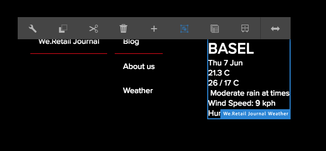

# 實施SPA的React元件{#implementing-a-react-component-for-spa}

單頁應用程式(SPA)可為網站使用者提供引人入勝的體驗。 開發人員希望能夠使用SPA架構建立網站，而作者則想在AEM中為使用SPA架構建立的網站順暢地編輯內容。

SPA製作功能提供完整的解決方案，以支援AEM中的SPA。 本文舉出如何調整簡單、現有的React元件以搭配AEM SPA編輯器運作的範例。

>[!NOTE]
>
>SPA編輯器是建議的解決方案，適用於需要以SPA架構為基礎的用戶端轉換（例如React或Angular）的專案。

## 簡介 {#introduction}

由於AEM需要簡單而輕量型的合約，並在SPA和SPA編輯器之間建立，所以使用現有的Javascript應用程式並將它調整為可與AEM中的SPA搭配使用，是一件直接的事。

本文說明We.Retail Journal範例SPA中氣象要素的範例。

在閱讀本文章之前，您 [應先熟悉AEM的SPA應用程式結構](/help/sites-developing/spa-getting-started-react.md) 。

## The Weather Component {#the-weather-component}

We.Retail Journal應用程式的左上角有氣象元件。 它顯示已定義位置的當前天氣，動態提取天氣資料。

### 使用氣象工具集 {#using-the-weather-widget}


在SPA編輯器中編寫SPA內容時，氣象元件會以任何其他AEM元件的形式顯示，並加上工具列，而且是可編輯的。



您可以像其他AEM元件一樣，在對話方塊中更新城市。


此變更會持續存在，而元件會使用新氣象資料自動更新。


### 氣象要素實施 {#weather-component-implementation}

氣象要素實際上是基於一個公開提供的React元件，稱為 [React Open Weather](https://www.npmjs.com/package/react-open-weather)，它已經適合作為We.Retail Journal示例SPA應用程式中的一個元件。

以下是NPM文檔中有關React Open Weather元件使用情況的片段。


在We.Retail Journal應用程式中檢閱自訂氣象 `Weather.js`元件()的程式碼：

* **第16行**:React Open Weather Widget會視需要載入。
* **第46行**:此函 `MapTo` 數將此React元件與對應的AEM元件關聯，以便在SPA編輯器中編輯它。

* **第22-29行**:已定 `EditConfig` 義，檢查城市是否已填入，並定義值（如果空）。

* **第31-44行**:Weather元件擴展了類 `Component` 別並提供React Open Weather元件的NPM使用文檔中定義的所需資料，並呈現該元件。

```
/*~~~~~~~~~~~~~~~~~~~~~~~~~~~~~~~~~~~~~~~~~~~~~~~~~~~~~~~~~~~~~~~~~~~~~~~~~~~~~~
 ~ Copyright 2018 Adobe Systems Incorporated
 ~
 ~ Licensed under the Apache License, Version 2.0 (the "License");
 ~ you may not use this file except in compliance with the License.
 ~ You may obtain a copy of the License at
 ~
 ~     https://www.apache.org/licenses/LICENSE-2.0
 ~
 ~ Unless required by applicable law or agreed to in writing, software
 ~ distributed under the License is distributed on an "AS IS" BASIS,
 ~ WITHOUT WARRANTIES OR CONDITIONS OF ANY KIND, either express or implied.
 ~ See the License for the specific language governing permissions and
 ~ limitations under the License.
 ~~~~~~~~~~~~~~~~~~~~~~~~~~~~~~~~~~~~~~~~~~~~~~~~~~~~~~~~~~~~~~~~~~~~~~~~~~~~~*/
import React, {Component} from 'react';
import ReactWeather from 'react-open-weather';
import {MapTo} from '@adobe/cq-react-editable-components';

require('./Weather.css');

const WeatherEditConfig = {

    emptyLabel: 'Weather',

    isEmpty: function() {
        return !this.props || !this.props.cq_model || !this.props.cq_model.city || this.props.cq_model.city.trim().length < 1;
    }
};

class Weather extends Component {

    render() {
        let apiKey = "12345678901234567890";
        let city;

        if (this.props.cq_model) {
            city = this.props.cq_model.city;
            return <ReactWeather key={'react-weather' + Date.now()} forecast="today" apikey={apiKey} type="city" city={city} />
        }

        return null;
    }
}

MapTo('we-retail-journal/global/components/weather')(Weather, WeatherEditConfig);
```

雖然後端元件必須已經存在，但前端開發人員可以在We.Retail Journal SPA中運用React Open Weather元件，而且只需少量編碼。

## 下一步 {#next-step}

如需有關開發AEM的SPA的詳細資訊，請參閱「開發AEM [的SPA」文章](/help/sites-developing/spa-architecture.md)。
