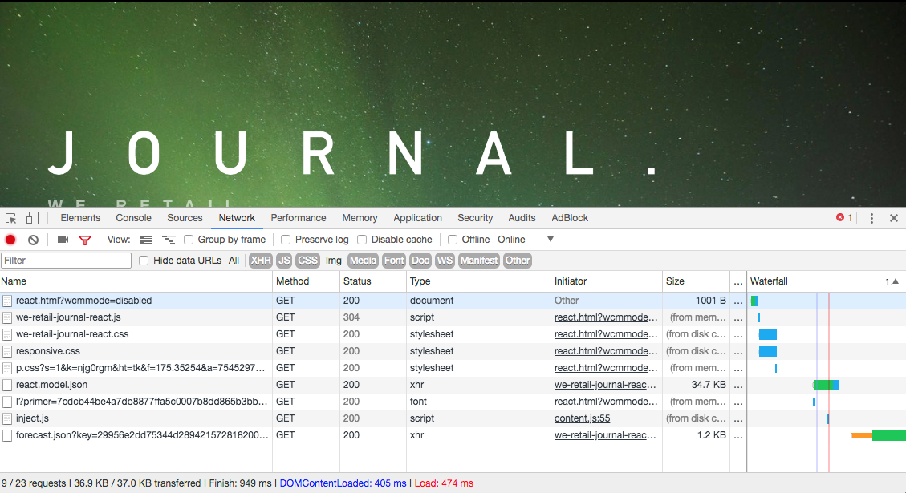

# SPA簡介和逐步說明{#spa-introduction-and-walkthrough}

單頁應用程式 (SPA) 可為網站使用者提供引人入勝的體驗。開發人員希望能使用SPA架構建立網站，而作者則想在AEM中為使用此架構建立的網站順暢地編輯內容。

SPA編輯器提供全方位的解決方案，可支援AEM中的SPA。 本文逐步說明如何使用基本的SPA應用程式進行編寫，並說明其與基礎AEM SPA編輯器的關聯。

>[!NOTE]
>
>若專案需要SPA架構的用戶端轉譯(例如React或Angular),SPA Editor是建議的解決方案。

## 簡介 {#introduction}

### 文章目標 {#article-objective}

本文先介紹SPA的基本概念，然後使用簡單的SPA應用程式來示範基本內容編輯，引導讀者完成SPA編輯器的逐步說明。 接著深入探討頁面的建構，以及SPA應用程式與AEM SPA編輯器的關聯與互動方式。

本簡介和逐步說明的目標是向AEM開發人員說明SPA的相關性、其一般運作方式、AEM SPA編輯器如何處理SPA，以及它與標準AEM應用程式有何不同。

逐步說明以標準AEM功能和範例We.Retail Journal應用程式為基礎。 必須符合下列要求：

* [AEM 6.4版（含service pack 2或更新版本）](/help/release-notes/release-notes.md)
* [在此安裝範例GitHub上可用的We.Retail Journal應用程式。](https://github.com/Adobe-Marketing-Cloud/aem-sample-we-retail-journal)

>[!CAUTION]
>
>本檔案使用 [We.Retail Journal應用程式](https://github.com/Adobe-Marketing-Cloud/aem-sample-we-retail-journal) 僅供示範之用。 它不應用於任何項目工作。
>
>任何AEM專案皆應運用 [AEM專案原型](https://docs.adobe.com/content/help/zh-Hant/experience-manager-core-components/using/developing/archetype/overview.html)，可支援使用React或Angular的SPA專案，並運用SPA SDK。

### 什麼是SPA? {#what-is-a-spa}

單頁應用程式(SPA)與傳統頁面不同，前者是在用戶端轉譯，主要是Javascript導向，需仰賴Ajax呼叫來載入資料並動態更新頁面。 根據使用者與頁面的互動，大部分或所有內容在單一頁面載入中會擷取一次，並視需要以非同步方式載入其他資源。

這可減少頁面重新整理的需求，並為使用者呈現流暢、快速的體驗，且感覺更像原生應用程式體驗。

AEM SPA編輯器可讓前端開發人員建立可整合至AEM網站的SPA，讓內容作者可像編輯任何其他AEM內容一樣輕鬆編輯SPA內容。

### 為什麼是SPA? {#why-a-spa}

SPA更像原生應用程式，更加快速、流暢，不僅對網頁的訪客，而且由於SPA的運作方式，對行銷人員和開發人員而言，都成為極具吸引力的體驗。


**訪客**

* 訪客在與內容互動時需要類似原生的體驗。
* 有清楚的資料顯示，頁面越快，轉換發生的可能性就越大。

**行銷人員**

* 行銷人員想要提供豐富、類似原生的體驗，以吸引訪客充分參與內容。
* 個人化可讓這些體驗更具吸引力。

**開發人員**

* 開發人員想要將內容與簡報之間的疑慮徹底分離。
* 清潔分離使系統更具可擴充性，並允許獨立的前端開發。

### SPA如何運作？ {#how-does-a-spa-work}

SPA的主要思想是減少呼叫和對伺服器的依賴，以將伺服器呼叫所造成的延遲降至最低，以便SPA接近原生應用程式的回應。

在傳統、循序的網頁中，只會載入即時頁面所需的資料。 這表示當訪客移至其他頁面時，會呼叫伺服器以取得其他資源。 當訪客與頁面上的元素互動時，可能需要進行其他呼叫。 由於頁面必須趕上訪客的要求，因此這多個呼叫可能會產生延遲或延遲的感覺。


為獲得更流暢的體驗，即接近訪客從行動裝置、原生應用程式預期的體驗，SPA會在首次載入時為訪客載入所有必要資料。 雖然一開始可能需要較長的時間，但之後就不需要額外的伺服器呼叫。

透過在用戶端上呈現，頁面元素的反應更快，且訪客與頁面的互動即時。 系統會以非同步方式呼叫可能需要的任何其他資料，以最大化頁面速度。

>[!NOTE]
>
>如需SPA在AEM中如何運作的技術詳細資訊，請參閱文章 [AEM中的SPA快速入門](/help/sites-developing/spa-getting-started-react.md).
>
>如需深入了解SPA編輯器的設計、架構和技術工作流程，請參閱文章 [SPA編輯器概述](/help/sites-developing/spa-overview.md).

## 使用SPA編輯內容體驗 {#content-editing-experience-with-spa}

建置SPA以運用AEM SPA編輯器時，內容作者在編輯和建立內容時沒有發現差異。 提供通用AEM功能，且不需要變更作者的工作流程。

>[!NOTE]
>
>逐步說明以標準AEM功能和範例We.Retail Journal應用程式為基礎。 必須符合下列要求：
>
>* [AEM 6.4版（含service pack 2）](/help/release-notes/release-notes.md)
>* [在此安裝範例GitHub上可用的We.Retail Journal應用程式。](https://github.com/Adobe-Marketing-Cloud/aem-sample-we-retail-journal)
>


1. 在AEM中編輯We.Retail Journal應用程式。

   `https://localhost:4502/editor.html/content/we-retail-journal/react.html`

   

1. 選取標題元件，並注意工具列的顯示方式與任何其他元件相同。 選擇 **編輯**.

   

1. 在AEM中以正常方式編輯內容，請注意變更會持續存在。

   

   >[!NOTE]
   >請參閱 [SPA編輯器概述](spa-overview.md#requirements-limitations) 以取得現成文字編輯器和SPA的詳細資訊。

1. 使用「資產瀏覽器」將新影像拖放至影像元件中。

   

1. 變更持續存在。

   

如同任何非SPA應用程式，也支援其他製作工具，例如在頁面上拖放其他元件、重新排列元件以及修改版面。

>[!NOTE]
>
>SPA編輯器不會修改應用程式的DOM。 SPA本身負責DOM。
>
>若要查看其運作方式，請繼續閱讀本文的下一節 [SPA應用程式和AEM SPA Editor](/help/sites-developing/spa-walkthrough.md#spa-apps-and-the-aem-spa-editor).

## SPA應用程式和AEM SPA Editor {#spa-apps-and-the-aem-spa-editor}

體驗SPA對一般使用者的行為，然後檢查SPA頁面，有助於更清楚了解SAP應用程式如何與AEM中的SPA編輯器搭配運作。

### 使用SPA應用程式 {#using-an-spa-application}

1. 在發佈伺服器上或使用選項載入We.Retail Journal應用程式 **檢視為已發佈** 從 **頁面資訊** 功能表。

   `/content/we-retail-journal/react.html`

   

   請注意頁面結構，包括導覽至子頁面、天氣Widget和文章。

1. 使用功能表導覽至子頁面，並查看頁面會立即載入，而不需重新整理。

   

1. 當您導覽子頁面時，請開啟瀏覽器的內建開發人員工具並監控網路活動。

   

   當您在應用程式中從頁面移至頁面時，流量非常小。 不會重新載入頁面，只會要求新影像。

   SPA會完全在用戶端管理內容和路由。

因此，如果在子頁面導覽時頁面未重新載入，會如何載入？

下一節， [載入SPA應用程式](/help/sites-developing/spa-walkthrough.md#loading-an-spa-application)，深入了解載入SPA的機制，以及如何以同步和非同步方式載入內容。

### 載入SPA應用程式 {#loading-an-spa-application}

1. 如果尚未載入，請在發佈伺服器上或使用選項載入We.Retail Journal應用程式 **檢視為已發佈** 從 **頁面資訊** 功能表。

   `/content/we-retail-journal/react.html`

   

1. 使用瀏覽器的內建工具檢視頁面來源。
1. 請注意，來源的內容極為有限。

   ```
   <!DOCTYPE HTML>
   <html lang="en-CH">
       <head>
       <meta charset="UTF-8">
       <title>We.Retail Journal</title>
   
       <meta name="template" content="we-retail-react-template"/>
   
   <link rel="stylesheet" href="/etc.clientlibs/we-retail-journal/react/clientlibs/we-retail-journal-react.css" type="text/css">
   
   <link rel="stylesheet" href="/libs/wcm/foundation/components/page/responsive.css" type="text/css">
   
   </head>
       <body class="page basicpage">
   
   <div id="page"></div>
   
   <script type="text/javascript" src="/etc.clientlibs/we-retail-journal/react/clientlibs/we-retail-journal-react.js"></script>
   
       </body>
   </html>
   ```

   頁面內文中沒有任何內容。 它主要由樣式表和對React指令碼的調用組成， `we-retail-journal-react.js`.

   此React指令碼是此應用程式的主要驅動程式，負責呈現所有內容。

1. 使用瀏覽器的內建工具來檢查頁面。 請參閱DOM已完全載入的內容。

   

1. 切換到檢查器中的「網路」頁簽，然後重新載入該頁。

   忽略影像要求，請注意為頁面載入的主要資源為頁面本身、CSS、React Javascript、其相依性，以及頁面的JSON資料。

   

1. 載入 `react.model.json` 的子句。

   `/content/we-retail-journal/react.model.json`

   

   AEM SPA Editor會利用 [AEM Content Services](/help/assets/content-fragments/content-fragments.md) 以JSON模型傳送頁面的整個內容。

   Sling模型會實作特定介面，為SPA提供必要資訊。 JSON資料的傳送會向下委派給每個元件（從頁面、到段落、到元件等）。

   每個元件都會選擇公開的項目及呈現方式（在伺服器端使用HTL，或在用戶端使用React）。 當然，本文著重於使用React進行用戶端轉譯。

1. 模型也可以將頁面分組，以便同步載入，減少所需的頁面重新載入次數。

   在We.Retail Journal的範例中， `home`, `blog`，和 `aboutus` 頁面會同步載入，因為訪客通常會瀏覽這些頁面。 不過 `weather` 頁面會以非同步方式載入，因為訪客不太可能造訪頁面。

   此行為非強制性，且可完全定義。

   

1. 要查看行為中的這種差異，請重新載入頁面並清除檢查器的網路活動。 導覽至部落格，並在頁面功能表中導覽關於我們的頁面，查看未回報任何網路活動。

   導覽至天氣頁面，並查看 `weather.model.json` 非同步呼叫。

   

### 與SPA編輯器互動 {#interaction-with-the-spa-editor}

使用範例We.Retail Journal應用程式，運用內容服務進行JSON內容傳送以及非同步載入資源，可清楚知道應用程式的運作方式和在發佈時載入。

此外，對於內容作者，使用SPA編輯器建立內容在AEM中是順暢的。

在以下章節中，我們將探討可讓SPA編輯器將SPA中的元件與AEM元件建立關聯，並實現順暢的編輯體驗的合約。

1. 在編輯器中載入We.Retail Journal應用程式，並切換至 **預覽** 模式。

   `https://localhost:4502/editor.html/content/we-retail-journal/react.html`

1. 使用瀏覽器的內建開發人員工具來檢查頁面內容。 使用選取工具，在頁面上選取可編輯的元件並檢視元素詳細資料。

   請注意，元件有新的資料屬性 `data-cq-data-path`.

   

   例如

   `data-cq-data-path="root/responsivegrid/paragraph_1`

   此路徑允許檢索和關聯每個元件的編輯上下文配置對象。

   這是編輯器唯一需要的標籤屬性，以便將其識別為SPA內的可編輯元件。 SPA編輯器會根據此屬性決定哪些可編輯的設定與元件相關聯，以便找到正確的框架、工具列等。 已載入。

   還為標籤預留位置和資產拖放功能新增了某些特定類別名稱。

   >[!NOTE]
   >
   >這是AEM中伺服器端轉譯頁面的行為變更，其中 `cq` 為每個可編輯元件插入的元素。
   >
   >
   >SPA中的此方法不需要插入自訂元素，而僅需依賴其他資料屬性，讓前端開發人員可更輕鬆地加上標籤。

## 後續步驟 {#next-steps}

現在您已了解AEM中的SPA編輯體驗，以及SPA與SPA編輯器的關聯，深入了解SPA的建立方式。

* [AEM中的SPA快速入門](/help/sites-developing/spa-getting-started-react.md) 顯示如何建置基本SPA以搭配AEM中的SPA編輯器運作
* [SPA編輯器概述](/help/sites-developing/spa-overview.md) 深入探討AEM與SPA的通訊模型。
* [開發SPA for AEM](/help/sites-developing/spa-architecture.md) 說明如何吸引前端開發人員參與開發SPA for AEM，以及SPA如何與AEM架構互動。
