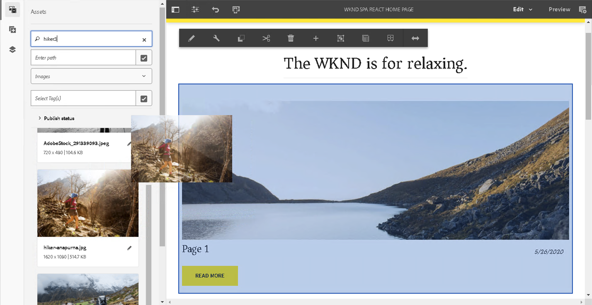

# SPA 簡介和逐步解說 {#spa-introduction-and-walkthrough}

單頁應用程式 (SPA) 可為網站使用者提供引人入勝的體驗。開發人員希望能使用 SPA 框架建立網站，而作者則想在 AEM 中為使用這類框架建立網站，順暢地編輯內容。

SPA 編輯器提供了一個全面的解決方案來支援在 AEM 中使用 SPA。本文章逐步解說如何使用基本 SPA 應用程式進行編寫，並說明它與基礎 AEM SPA 編輯器的關係。

>[!NOTE]
>
>編輯SPA器是需要基於框架的SPA客戶端呈現(例如，反應或Angular)的項目的推薦解決方案。

## 簡介 {#introduction}

### 文章目標 {#article-objective}

本文章介紹 SPA 的基本概念，然後透過使用簡單 SPA 應用程式來示範基本的內容編輯，逐步引導讀者了解 SPA 編輯器。然後深入探討頁面的結構以及 SPA 應用程式如何與 AEM SPA 編輯器相關及互動。

此簡介和逐步解說的目的是向 AEM 開發人員示範 SPA 為何相關、其一般運作方式、AEM SPA 編輯器如何處理 SPA，以及它與標準 AEM 應用程式有何不同。

## 要求 {#requirements}

逐步解說是以標準 AEM 功能和範例 WKND SPA 專案應用程式為基礎。若要依此逐步解說操作，您必須具備以下項目。

* [AEM 6.5.4版或更高版本](/help/release-notes/release-notes.md)
   * 您必須擁有系統的管理員權限。
* [GitHub 提供的範例 WKND SPA 專案應用程式](https://github.com/adobe/aem-guides-wknd-spa)
   * 下載 [React應用的最新版本。](https://github.com/adobe/aem-guides-wknd-spa/releases) 將命名為類似 `wknd-spa-react.all.classic-X.Y.Z-SNAPSHOT.zip`。
   * 下載 [最新樣本影像](https://github.com/adobe/aem-guides-wknd-spa/releases) 的下一頁。 將命名為類似 `wknd-spa-sample-images-X.Y.Z.zip`。
   * [使用包管理器](/help/sites-administering/package-manager.md) 安裝軟體包，如同您在中安裝任何其他軟體包一樣AEM。
   * 出於本逐步解說的目的，應用程式不需要使用 Maven 安裝。

>[!CAUTION]
>
>此文檔使用 [WKND Spa項目應用](https://github.com/adobe/aem-guides-wknd-spa) 僅供演示之用。 它不應用於任何專案。
>
>任何AEM項目都應利用 [原型AEM計畫，](https://experienceleague.adobe.com/docs/experience-manager-core-components/using/developing/archetype/overview.html?lang=zh-Hant) 支援使SPA用React或Angular的項目，並利用SPASDK。

### 什麼是 SPA？ {#what-is-a-spa}

單頁應用程式 (SPA) 與傳統頁面的不同之處在於它是在用戶端呈現並且主要由 Javascript 驅動，依賴 Ajax 呼叫來載入資料和動態更新頁面。在單頁載入時一次擷取大部分或所有內容，並根據使用者與頁面的互動，視需要非同步載入其他資源。

這減少了頁面重新整理的需要，讓使用者擁有順暢、快速且像是使用原生應用程式的體驗。

AEM SPA 編輯器允許前端開發人員建立可整合到 AEM 網站的 SPA，從而允許內容作者輕鬆編輯 SPA 內容，像編輯任何其他 AEM 內容一樣輕鬆。

### 為什麼是 SPA？ {#why-a-spa}

由於 SPA 的運作本質，SPA 可以更流暢、快速且像是原生應用程式，不僅對網頁訪客而且對行銷人員和開發人員來說都是一種極具吸引力的體驗。

**訪客**

* 訪客在與內容互動時希望獲得類似原生的體驗。
* 有明確資料代表頁面生成越快，就越可能發生轉換。

**行銷人員**

* 行銷人員希望提供豐富的、類似原生的體驗，以吸引訪客與內容完全互動。
* 個人化可以使這些體驗更具吸引力。

**開發人員**

* 開發人員希望清楚分開內容和展示之間的考量點。
* 清楚分開使系統更具可擴展性，並允許獨立的前端開發。

### SPA 如何運作？ {#how-does-a-spa-work}

a背後的主要思SPA想是減少對伺服器的調用和依賴，以最小化由伺服器調用引起的延遲，SPA從而接近本機應用程式的響應。

在傳統的循序網頁中，僅載入即時頁面所需的資料。這表示當訪客移至另一個頁面時，將呼叫伺服器以取得額外資源。當訪問者與頁面上的元素交互時，可能需要進行其他呼叫。 由於頁面必須趕上訪客的要求，因此這些多次呼叫可能會讓人產生延滯或延遲的感覺。

要獲得更流暢的體驗，即接近訪問者從移動本機應用程式期望的SPA值，在第一次載入時載入訪問者的所有必要資料。 雖然這在開始時可能需要較長的時間，但之後就不需要額外呼叫伺服器。

通過在客戶端進行渲染，頁面元素會更快地反應，並且訪問者與頁面的交互是即時的。 可能需要的任何附加資料都會被非同步調用，以最大化頁面速度。

>[!NOTE]
>
>有關如何工作的SPA技術詳AEM細資訊，請參閱 [入SPA門AEM](/help/sites-developing/spa-getting-started-react.md)。
>
>有關編輯器的設計、體系結構和技術工作流的詳細SPA瞭解，請參閱文章 [編SPA輯器概述](/help/sites-developing/spa-overview.md)。

## SPA 的內容編輯體驗 {#content-editing-experience-with-spa}

構建SPA以利用編輯AEM器時，SPA內容作者在編輯和建立內容時沒有發現任何差異。 可以使用常用的 AEM 功能，作者的工作流程無需變更。

1. 在 AEM 編輯 WKND SPA 專案應用程式。

   `http://<host>:<port>/editor.html/content/wknd-spa-react/us/en/home.html`

   

1. 選擇標題元件，並注意工具欄顯示與任何其它元件類似。 選取&#x200B;**編輯**。

   

1. 在 AEM 中正常編輯內容，並注意變更已保留。

   

   >[!NOTE]
   >
   >查看 [編SPA輯器概述](spa-overview.md#requirements-limitations) 的子菜單SPA。

1. 使用資產瀏覽器將新影像拖放到影像元件中。

   

1. 變更已保留。

   

如同任何非 SPA 應用程式，支援其他編寫工具，例如在頁面上拖放其他元件、重新排列元件和修改版面。

>[!NOTE]
>
>SPA 編輯器不會修改應用程式的 DOM。SPA 自行負責 DOM。
>
>若要了解其運作原理，請繼續閱讀本文的下一章節：[SPA 應用程式和 AEM SPA 編輯器](#spa-apps-and-the-aem-spa-editor)。

## SPA 應用程式和 AEM SPA 編輯器 {#spa-apps-and-the-aem-spa-editor}

體驗最終SPA用戶的行為，然後檢查頁SPA面有助於更好地瞭解SAP應用與中的編輯器SPA的工作AEM方式。

### 使用 SPA 應用程式 {#using-an-spa-application}

1. 將 WKND SPA 專案應用程式載入到發佈伺服器，或使用頁面編輯器&#x200B;**頁面資訊**&#x200B;選單的&#x200B;**如發佈時檢視**&#x200B;選項。

   `http://<host>:<port>/content/wknd-spa-react/us/en/home.html`

   

   請注意頁面結構，包括子頁面、天氣小部件和文章的導航。

1. 使用選單導覽到子頁面，可以看到頁面立即載入，無需重新整理。

   

1. 開啟瀏覽器內建的開發人員工具，並在您瀏覽子頁面時監控網路活動。

   

   當您在應用程式中從一個頁面移動到另一個頁面時，流量非常小。該頁面不會重新載入，只會要求新影像。

   SPA 完全在用戶端管理內容和路由。

那麼如果在子頁面間瀏覽時頁面沒有重新載入，它是如何載入？

下一節， [載入應SPA用程式，](#loading-an-spa-application) 更深入地瞭解載入的機SPA制，以及如何同步和非同步載入內容。

### 載入 SPA 應用程式 {#loading-an-spa-application}

1. 如果尚未載入，請將 WKND SPA 專案應用程式載入至發佈伺服器，或使用頁面編輯器&#x200B;**頁面資訊**&#x200B;選單的&#x200B;**如發佈時檢視**&#x200B;選項。

   `http://<host>:<port>/content/wknd-spa-react/us/en/home.html`

   

1. 使用瀏覽器的內建工具檢視頁面的來源。
1. 請注意，源的內容非常有限。

   * 頁面的內文中沒有任何內容。它主要由樣式表和對各種指令碼 (例如 `clientlib-react.min.js`) 的呼叫所組成。
   * 這些指令碼是此應用程式的主要驅動程式，負責呈現所有內容。

1. 使用瀏覽器的內建工具檢查頁面。查看完全載入之 DOM 的內容。

   

1. 切換到 **網路** 的子菜單。

   忽略影像要求，注意為頁面載入的主要資源是頁面本身、CSS、React Javascript、其相依性，以及頁面的 JSON 資料。

   

1. 在新索引標籤中載入 `react.model.json`。

   `http://<host>:<port>/content/wknd-spa-react/us/en/home.model.json`

   

   AEM SPA 編輯器利用 [AEM 內容服務](/help/assets/content-fragments/content-fragments.md)將頁面的全部內容以 JSON 模型傳遞。

   透過實作特定的介面，Sling 模型為 SPA 提供必要的資訊。JSON 資料的傳遞工作向下委派給每個元件 (從頁面到段落到元件等)。

   每個元件都選擇它公開的內容和呈現方式（伺服器端帶HTL或客戶端帶React）。 本文章重點介紹使用 React 進行用戶端呈現。

1. 此模型還可以將頁面群組在一起，以便同步載入，從而減少所需的頁面重新載入次數。

   在 WKND SPA 專案應用程式範例中，`home`、`page-1`、`page-2` 和 `page-3` 頁面是同步載入的，因為訪客通常會造訪所有這些頁面。

   此行為不是強制性的，而且完全可定義的。

   

1. 要查看行為上的這種差異，請重新載入頁面並清除開發人員工具的網路活動。 導覽到頁面選單中的 `page-1`，可以看到唯一的網路活動是要求 `page-1` 的影像。`page-1` 本身不需要載入。

   

### 與 SPA 編輯器的互動 {#interaction-with-the-spa-editor}

使用範例 WKND SPA 專案應用程式，可以清楚地了解應用程式在發佈時的行為和載入方式，利用內容服務進行 JSON 內容傳遞，以及非同步載入資源。

此外，內容作者可在 AEM 中使用 SPA 編輯器順暢地建立內容。

在下一章節中，我們將探討允許 SPA 編輯器將 SPA 元件與 AEM 元件相關聯並實現此無縫編輯體驗的合約。

1. 在編輯器中載入 WKND SPA 專案應用程式，並切換到&#x200B;**預覽**&#x200B;模式。

   `http://<host>:<port>/editor.html/content/wknd-spa-react/us/en/home.html`

1. 使用瀏覽器的內建開發人員工具，檢查頁面的內容。使用選取工具，在頁面上選取一個可編輯的元件並查看元素詳細資料。

   請注意，該元件有新的資料屬性 `data-cq-data-path`。

   

   例如

   `data-cq-data-path="/content/wknd-spa-react/us/en/home/jcr:content/root/responsivegrid/text`

   此路徑允許擷取和關聯每個元件的編輯情境設定物件。

   這是編輯器將其識別為 SPA 中的可編輯元件所需的唯一標記屬性。根據此屬性，SPA 編輯器將確定哪個可編輯設定與元件關聯，以便載入正確的框架、工具列等。

   也會新增一些特定類別名稱，用於標記預留位置和資產拖放功能。

   >[!NOTE]
   >
   >這是從中的伺服器端呈現頁面的行為AEM更改，其中 `cq` 為每個可編輯元件插入的元素。
   >
   >
   >中的此方SPA法無需注入自定義元素，僅依賴附加的資料屬性，從而使前端開發人員的標籤更簡單。

## 後續步驟 {#next-steps}

現在您已經了解 AEM 中的 SPA 編輯體驗，以及 SPA 與 SPA 編輯器的關係，接下來要更深入地了解如何建立 SPA。

* [入SPA門AEM](/help/sites-developing/spa-getting-started-react.md) 顯示了如何SPA構建基本檔案以與SPAEditor一起AEM工作
* [SPA 編輯器概述](/help/sites-developing/spa-overview.md)更深入地介紹 AEM 和 SPA 之間的通訊模型。
* [為 AEM 開發 SPA](/help/sites-developing/spa-architecture.md) 介紹如何讓前端開發人員為 AEM 開發 SPA，以及 SPA 如何與 AEM 架構互動。
