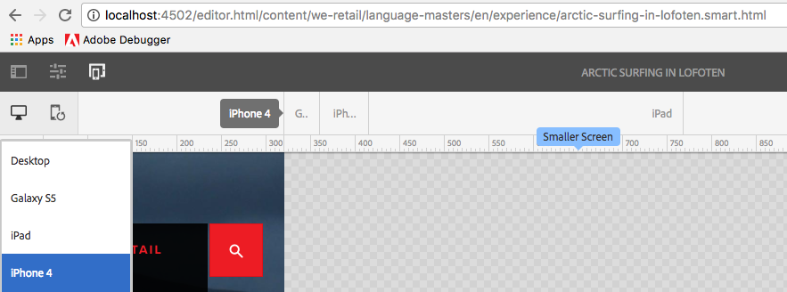

# 最適化範本演算{#adaptive-template-rendering}

自適應範本演算提供管理含變化之頁面的方式。 這項功能原本適用於為行動裝置提供各種HTML輸出（例如功能手機與智慧型手機），當體驗必須傳送至需要不同標籤或HTML輸出的各種裝置時，這項功能十分有用。

## 概覽 {#overview}

範本通常以回應式格線為基礎，而根據這些範本建立的頁面則完全回應，可自動調整至用戶端裝置的檢視區。 使用頁面編輯器中的「模擬器」工具列，作者可將版面定位至特定裝置。

您也可以設定範本，以支援自適應轉換。 當裝置群組已正確設定時，在模擬器模式中選取裝置時，頁面會在URL中以不同的選擇器呈現。 使用選取器，可透過URL直接呼叫特定頁面演算。

設定裝置群組時請記住：

* 每個設備必須至少位於一個設備組中。
* 一個設備可以是多個設備組。
* 由於裝置可以位於多個裝置群組中，因此可以結合選擇器。
* 選擇器的組合會由上到下評估，因為它們保存在儲存庫中。

>[!NOTE]
>
>裝置群組 **回應式裝置** (Responsive Devices)永遠不會有選擇器，因為可辨識為支援回應式設計的裝置，會假設不需要最適化版面

## 設定 {#configuration}

可針對現有的裝置群組或您自行建立的群組， [設定最適化演算選擇器。](/help/sites-developing/mobile.md#device-groups)

在此範例中，我們將設定現有的裝置群組 **Smart Phone** ，在We.Retail的「 **Experience Page** 」範本中，有一個可調式轉換選擇器。

1. 編輯需要最適化選擇器的裝置群組，位於 `http://localhost:4502/miscadmin#/etc/mobile/groups`

   設定「禁用模 **擬器** 」並保存選項。

   

1. 如果依照下列步驟將裝置群組 **** Smart Phone **（智慧型手機）新增至範本和頁面結構，則選擇器將可用於Blackberry** 和 **** iPhone 4。

   

1. 使用CRX DE Lite，將裝置群組新增至範本結構上的多值字串屬性，以允許 `cq:deviceGroups` 在範本上使用。

   `/conf/<your-site>/settings/wcm/templates/<your-template>/structure/jcr:content`

   例如，如果我們要添加智慧電話設備組：

   `/conf/we-retail/settings/wcm/templates/experience-page/structure/jcr:content`

   

1. 使用CRX DE Lite，將裝置群組新增至網站結構上的多值字串屬性，以允許 `cq:deviceGroups` 在您的網站上使用。

   `/content/<your-site>/jcr:content`

   例如，如果我們要允許 **Smart Phone** device group:

   `/content/we-retail/jcr:content`

   

現在，當在頁面 [編輯器中使用](/help/sites-authoring/responsive-layout.md#layout-definitions-device-emulation-and-breakpoints) 「模擬器」(例如修改版面時 )並選擇已設定裝置群組的裝置時，會以選擇器呈現頁面，作為URL的一部分。

在我們的範例中，當根據 **Experience Page** 範本編輯頁面，並在模擬器中選擇iPhone 4時，會將頁面轉譯為包含選擇器，而非 `arctic-surfing-in-lofoten.smart.html``arctic-surfing-in-lofoten.html`

您也可以使用此選擇器直接呼叫頁面。

