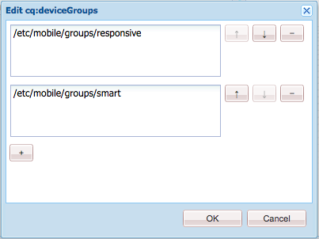

# 最適化範本轉譯{#adaptive-template-rendering}

最適化範本轉譯提供管理含有變異之頁面的方法。 此功能原本可用於為行動裝置提供各種HTML輸出（例如功能電話與智慧電話），但當體驗必須傳送至需要不同標籤或HTML輸出的各種裝置時，此功能就十分實用。

## 總覽 {#overview}

範本通常以回應式格線為基礎建置，而根據這些範本建立的頁面完全回應，會自動調整至用戶端裝置的檢視區。 使用頁面編輯器中的「模擬器」工具列，作者可以將佈局目標定位到特定設備。

您也可以設定範本以支援最適化轉譯。 在模擬器模式中選取裝置時，正確設定裝置群組時，頁面會以URL中的不同選取器呈現。 使用選取器可以透過URL直接呼叫特定頁面呈現。

設定裝置群組時請記住：

* 每個設備必須至少位於一個設備組中。
* 一個設備可以位於多個設備組中。
* 因為裝置可以位於多個裝置群組中，所以可以結合選取器。
* 選取器組合會由上到下評估，因為它們會保存在存放庫中。

>[!NOTE]
>
>設備組 **回應式裝置** 永遠不會有選取器，因為系統假設已認定為支援回應式設計的裝置不需要最適化版面

## 設定 {#configuration}

可為現有裝置群組或 [您自行建立的群組。](/help/sites-developing/mobile.md#device-groups)

在此範例中，我們將設定現有裝置群組 **智慧手機** 讓最適化演算選取器成為 **體驗頁面** 範本。

1. 編輯需要適用性選取器的裝置群組，位於 `http://localhost:4502/miscadmin#/etc/mobile/groups`

   設定選項 **禁用模擬器** 並儲存。

   

1. 選取器將可用於 **Blackberry** 和 **iPhone 4** 已提供裝置群組 **智慧手機** 會在下列步驟中新增至範本和頁面結構。

   

1. 使用CRX DE Lite，將裝置群組新增至多值字串屬性，以便在您的範本上使用裝置群組 `cq:deviceGroups` 在範本的結構上。

   `/conf/<your-site>/settings/wcm/templates/<your-template>/structure/jcr:content`

   例如，如果要添加智慧電話設備組：

   `/conf/we-retail/settings/wcm/templates/experience-page/structure/jcr:content`

   

1. 使用CRX DE Lite，將裝置群組新增至多值字串屬性，以允許在您的網站上使用 `cq:deviceGroups` 在網站結構上。

   `/content/<your-site>/jcr:content`

   例如，如果我們想允許 **智慧手機** 設備組：

   `/content/we-retail/jcr:content`

   

現在，當使用 [模擬器](/help/sites-authoring/responsive-layout.md#layout-definitions-device-emulation-and-breakpoints) (例如 [修改配置](/help/sites-authoring/responsive-layout.md))，然後您選擇已設定裝置群組的裝置，則頁面將會呈現為URL中的選取器。

在範例中，根據 **體驗頁面** 範本，並在模擬器中選擇iPhone 4，則會轉譯頁面，其中包含選取器作為 `arctic-surfing-in-lofoten.smart.html` 而非 `arctic-surfing-in-lofoten.html`

也可以使用此選取器直接呼叫頁面。

