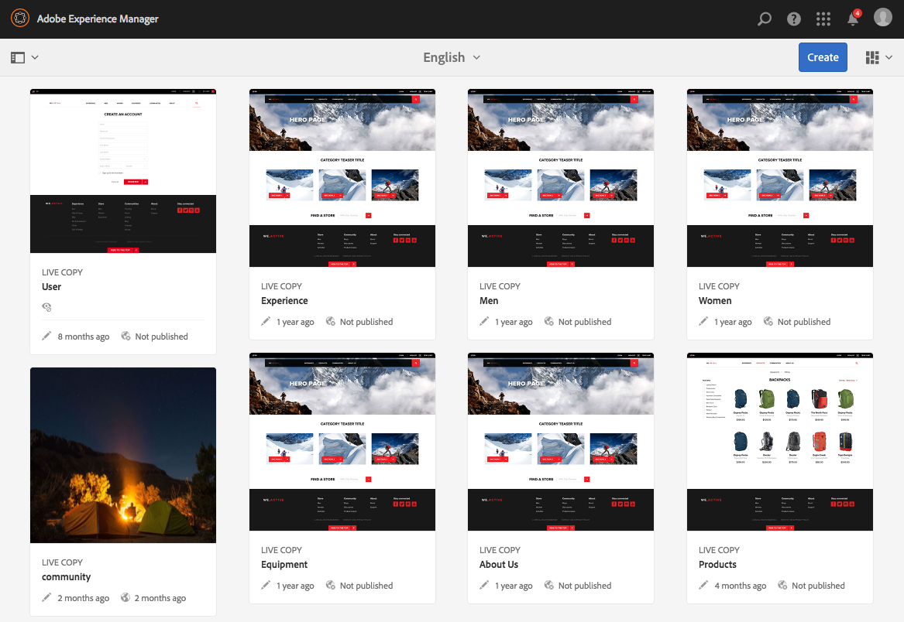

# AEM觸控式UI的概念{#concepts-of-the-aem-touch-enabled-ui}

AEM提供觸控式UI，搭配 [回應式設計](/help/sites-authoring/responsive-layout.md) 適用於設計為可在觸控式和桌上型裝置上運作的製作環境。

>[!NOTE]
>
>觸控式UI是AEM的標準UI。 AEM 6.4已淘汰傳統UI。

觸控式UI包括：

* 套裝標題：
   * 顯示徽標
   * 提供指向全局導航的連結
   * 提供其他一般動作的連結；例如搜尋、說明、Marketing Cloud解決方案、通知和使用者設定。
* 左側邊欄（視需要顯示且可隱藏），可顯示：
   * 時間軸
   * 引用
   * 篩選條件
* 導覽標題，同樣會上下文相關，可顯示：
   * 指出您目前使用的主控台和/或該主控台內的位置
   * 左側邊欄的選取項目
   * 階層連結
   * 適當的 **建立** 動作
   * 檢視選取項目
* 內容區域：
   * 列出內容項目（無論是頁面、資產、論壇貼文等）
   * 可依要求格式化，例如欄、卡片或清單
   * 使用回應式設計（顯示會根據您的裝置和/或視窗大小自動調整大小）
   * 使用無限捲動（不再分頁，所有項目在一個窗口中列出）



>[!NOTE]
>
>幾乎所有AEM功能都已移植至觸控式UI。 但在某些有限的情況下，功能會回復為傳統UI。 請參閱 [觸控式UI功能狀態](/help/release-notes/touch-ui-features-status.md) 以取得更多資訊。

觸控式UI是由Adobe設計，以提供多項產品的使用者體驗一致性。 其基礎為：

* **Coral UI** (CUI)觸控式UI的Adobe視覺樣式實作。 Coral UI提供您的產品/專案/網頁應用程式採用UI視覺風格所需的一切。
* **Granite UI** 元件是使用Coral UI建置。

觸控式UI的基本原則為：

* 首先是行動（考慮案頭）
* 回應式設計
* 內容相關顯示
* 可重複使用
* 包含內嵌參考檔案
* 包含內嵌測試
* 由下而上的設計，以確保這些原則適用於每個元素和元件

如需觸控式UI結構的進一步概覽，請參閱文章 [AEM觸控式UI的結構](/help/sites-developing/touch-ui-structure.md).

## AEM技術堆疊 {#aem-technology-stack}

AEM以Granite平台為基礎，而Granite平台除其他外包含Java內容存放庫。


## Granite {#granite}

Granite是Adobe的Open Web堆疊，提供多種元件，包括：

* 應用程式啟動器
* 部署了所有內容的OSGi架構
* 支助建築應用程式的若干OSGi簡編服務
* 提供各種記錄API的完整記錄架構
* JCR API規範的CRX存放庫實作
* Apache Sling Web Framework
* 當前CRX產品的其他部分

>[!NOTE]
>
>Granite在Adobe中以開放開發專案的形式執行：對程式碼、討論和問題的貢獻來自整個公司。
>
>不過，Granite是 **not** 開放原始碼專案。 它主要以數個開放原始碼專案為基礎（尤其是Apache Sling、Felix、Jackrabbit和Lucene），但Adobe在公開項目與內部專案之間划出明確界限。

## Granite UI {#granite-ui}

Granite工程平台也提供基礎的UI架構。 其主要目標是：

* 提供精細的UI Widget
* 實作UI概念並說明最佳實務（長清單呈現、清單篩選、物件CRUD、CUD精靈……）
* 提供可擴充且以外掛程式為基礎的管理UI

這些符合要求：

* 尊重「行動優先」
* 可擴充
* 易於覆蓋


GraniteUI.pdf

[取得檔案](assets/graniteui.pdf)
Granite UI:

* 使用Sling的RESTful架構
* 實作用於建立以內容為中心的Web應用程式的元件庫
* 提供精細的UI小工具
* 提供預設的標準化UI
* 可擴充
* 專為行動裝置和桌上型電腦裝置而設計（以行動為先）
* 可用於任何以Granite為基礎的平台/產品/專案；eg AEM


* [Granite UI Foundation元件](#granite-ui-foundation-components)
此基礎元件庫可供其他程式庫使用或擴充。
* [Granite UI管理元件](#granite-ui-administration-components)

### 用戶端與伺服器端 {#client-side-vs-server-side}

Granite UI中的客戶端與伺服器通訊由超文字、而非物件組成，因此不需要客戶端了解業務邏輯

* 伺服器利用語義資料豐富HTML
* 客戶端利用超媒體豐富超文本（交互）


#### 用戶端 {#client-side}

這會使用HTML辭匯的擴充功能，讓作者可表達建立互動式網頁應用程式的意圖。 這是類似的方法 [瓦伊阿里亞](https://www.w3.org/TR/wai-aria/) 和 [微格式](https://microformats.org/).

它主要包含由JS和CSS程式碼解譯的互動模式（例如非同步提交表單）集合，會在用戶端上執行。 用戶端的作用是增強標籤（以伺服器可負擔的超媒體形式提供）以提供互動性。

用戶端獨立於任何伺服器技術。 只要伺服器提供適當的標籤，用戶端就能發揮其作用。

目前JS和CSS程式碼是以Granite傳送 [clientlibs](/help/sites-developing/clientlibs.md) 在類別下：

`granite.ui.foundation and granite.ui.foundation.admin`

這些內容會隨內容套件提供：

`granite.ui.content`

#### 伺服器端 {#server-side}

這是由Sling元件集合所組成，可讓作者 *撰寫* 網路應用程式。 開發人員開發元件，作者將元件組合成網頁應用程式。 伺服器端的角色是為用戶端提供超媒體可承受性（標籤）。

目前，元件位於Granite存放庫的：

`/libs/granite/ui/components/foundation`

這是內容套件內容的一部分：

`granite.ui.content`

### 與傳統UI的差異 {#differences-with-the-classic-ui}

Granite UI與ExtJS（用於傳統UI）之間的差異也值得關注：

<table>
 <tbody>
  <tr>
   <td><strong>ExtJS</strong></td>
   <td><strong>Granite UI</strong></td>
  </tr>
  <tr>
   <td>遠程過程調用<br /> </td>
   <td>狀態轉換</td>
  </tr>
  <tr>
   <td>資料傳輸物件</td>
   <td>超媒體</td>
  </tr>
  <tr>
   <td>客戶端知道伺服器內部</td>
   <td>客戶端不知道內部</td>
  </tr>
  <tr>
   <td>"胖客戶端"</td>
   <td>"瘦客戶端"</td>
  </tr>
  <tr>
   <td>專用的用戶端程式庫</td>
   <td>通用用戶端程式庫</td>
  </tr>
 </tbody>
</table>

### Granite UI Foundation元件 {#granite-ui-foundation-components}

此 [Granite UI基礎元件](https://helpx.adobe.com/experience-manager/6-5/sites/developing/using/reference-materials/granite-ui/api/jcr_root/libs/granite/ui/index.html) 提供建置任何UI所需的基本建置區塊。 其中包括：

* 按鈕
* 超連結
* 使用者頭像

基礎元件位於以下位置：

`/libs/granite/ui/components/foundation`

此程式庫包含每個Coral元素的Granite UI元件。 元件由內容驅動，其配置駐留在儲存庫中。 這可以不用手寫HTML標籤，即可組成Granite UI應用程式。

用途:

* HTML元素的元件模型
* 組分組合物
* 自動單元和功能測試

實施:

* 基於儲存庫的構成和配置
* 善用Granite平台提供的測試設施
* JSP模板

此基礎元件庫可供其他程式庫使用或擴充。

### ExtJS和對應的Granite UI元件 {#extjs-and-corresponding-granite-ui-components}

升級ExtJS程式碼以使用Granite UI時，下列清單可方便地概述ExtJS xtypes和節點類型，以及其相等的Granite UI資源類型。

| **ExtJS xtype** | **Granite UI資源類型** |
|---|---|
| `button` | `granite/ui/components/foundation/form/button` |
| `checkbox` | `granite/ui/components/foundation/form/checkbox` |
| `componentstyles` | `cq/gui/components/authoring/dialog/componentstyles` |
| `cqinclude` | `granite/ui/components/foundation/include` |
| `datetime` | `granite/ui/components/foundation/form/datepicker` |
| `dialogfieldset` | `granite/ui/components/foundation/form/fieldset` |
| `hidden` | `granite/ui/components/foundation/form/hidden` |
| `html5smartfile, html5smartimage` | `granite/ui/components/foundation/form/fileupload` |
| `multifield` | `granite/ui/components/foundation/form/multifield` |
| `numberfield` | `granite/ui/components/foundation/form/numberfield` |
| `pathfield, paragraphreference` | `granite/ui/components/foundation/form/pathbrowser` |
| `selection` | `granite/ui/components/foundation/form/select` |
| `sizefield` | `cq/gui/components/authoring/dialog/sizefield` |
| `tags` | `granite/ui/components/foundation/form/autocomplete``cq/gui/components/common/datasources/tags` |
| `textarea` | `granite/ui/components/foundation/form/textarea` |
| `textfield` | `granite/ui/components/foundation/form/textfield` |

| **節點類型** | **Granite UI資源類型** |
|---|---|
| `cq:WidgetCollection` | `granite/ui/components/foundation/container` |
| `cq:TabPanel` | `granite/ui/components/foundation/container``granite/ui/components/foundation/layouts/tabs` |
| `cq:panel` | `granite/ui/components/foundation/container` |

### Granite UI管理元件 {#granite-ui-administration-components}

此 [Granite UI管理元件](https://helpx.adobe.com/experience-manager/6-5/sites/developing/using/reference-materials/granite-ui/api/jcr_root/libs/granite/ui/index.html) 在foundation元件上建置，以提供任何管理應用程式皆可實施的通用建置模組。 其中包括：

* 全域導覽列
* 邊欄（骨架）
* 搜尋面板

用途:

* 管理應用程式的統一外觀
* 管理應用程式Rad

實施:

* 使用基礎元件預先定義元件
* 元件可以自訂

## Coral UI {#coral-ui}

CoralUI.pdf

[取得檔案](assets/coralui.pdf)
Coral UI(CUI)是Adobe觸控式UI視覺風格的實作，專為提供跨多個產品的一致使用者體驗而設計。 Coral UI提供您在製作環境中採用視覺風格所需的一切。

>[!CAUTION]
>
>Coral UI是UI程式庫，可供AEM客戶在授權使用產品的範圍內建立應用程式和網頁介面。
>
>僅允許使用Coral UI:
>
>
>* 與AEM一併出貨和搭配時。
>* 用於擴充製作環境的現有UI時。
>* Adobe企業宣傳資料、廣告和演示文稿。
>* Adobe品牌應用程式的UI（字型不得隨時供其他用途使用）。
>* 有次要的自訂。
>
>請避免在下列項目中使用Coral UI:
>
>* 與Adobe無關的文檔和其他項目。
>* 內容建立環境（其中之前的項目可能由其他人產生）。
>* 未明確連結至Adobe的應用程式/元件/網頁。
>


Coral UI是開發網頁應用程式的基礎要素集合。


設計為從頭開始模組化，每個模組根據其主要角色形成一個不同的層。 儘管這些層設計為相互支援，但如果需要，也可以獨立使用。 這可讓您在任何支援HTML的環境中實作Coral的使用者體驗。

透過Coral UI，不強制使用特定開發模式和/或平台。 Coral的主要目標是提供統一且清潔的HTML5標籤，不受發出此標籤所使用的實際方法所影響。 這可用於用戶端或伺服器端轉譯、範本、JSP、PHP，甚至AdobeFlashRIA應用程式 — 僅舉幾個例子。

### HTML元素 — 標籤層 {#html-elements-the-markup-layer}

HTML元素提供所有基本UI元素（包括導覽列、按鈕、功能表、邊欄等）的共同外觀和風格。

在最基本的層級，HTML元素是具有專用類別名稱的HTML標籤。 更複雜的元素可由多個標籤組成，並彼此巢狀（以特定方式）。

CSS可用來提供實際的外觀。 為了能輕鬆自訂外觀和風格（例如品牌），實際樣式值會宣告為由 [較少](https://lesscss.org/) 運行時的前置處理器。

用途:

* 提供具有通用外觀和風格的基本UI元素
* 提供預設網格系統

實施:

* HTML標籤，靈感來源為 [引導](https://twitter.github.com/bootstrap/)
* 類在LESS檔案中定義
* 表徵圖定義為字型Sprite

例如，標籤：

```xml
<button class="btn btn-large btn-primary" type="button">Large button</button>
<button class="btn btn-large" type="button">Large button</button>
```

顯示為：


外觀和風格以LESS定義，並以專用的類別名稱系結至元素（為了簡潔起見，已縮短下列擷取）:

```xml
.btn {
    font-size: @baseFontSize;
    line-height: @baseLineHeight;
    .buttonBackground(@btnBackground,
                                @btnBackgroundHighlight,
                                @grayDark, 0 1px 1px rgba(255,255,255,.75));
```

實際值在LESS變數檔案中定義（為了簡潔起見，已縮短下列擷取）:

```xml
@btnBackgroundHighlight: darken(@white, 10%);
@btnPrimaryBackgroundHighlight: spin(@btnPrimaryBackground, 20%);
@baseFontSize: 17px;
@baseFontFamily: @sansFontFamily;
```

### 元素外掛程式 {#element-plugins}

許多HTML元素必須顯示某種動態行為，例如開啟和關閉快顯功能表。 這是元素外掛程式的角色，可透過使用JavaScript操控DOM來完成此類工作。

外掛程式可以是：

* 設計用於運作於特定DOM元素。 例如，對話方塊外掛程式會尋找 `DIV class=dialog`
* 一般性。 例如，配置管理器提供任何 `DIV` 或 `LI` 元素

外掛程式行為可透過下列其中一種方式，以參數自訂：

* 透過Javascript呼叫傳遞參數
* 使用專用 `data-*` 連結到HTML標籤的屬性

雖然開發人員可為任何外掛程式選取最佳方法，但經驗法則是使用：

* `data-*` 屬性，以取得與HTML配置相關的選項。 例如，若要指定欄數
* 與資料相關的功能的API選項/類別。 例如，建構要顯示的項目清單

相同的概念用於實作表單驗證。 對於要驗證的元素，您必須將所需的輸入表單指定為自訂 `data-*` 屬性。 然後，此屬性將用作驗證插件的選項。

>[!NOTE]
>
>HTML5原生表單驗證應盡可能使用和/或展開。

用途:

* 為HTML元素提供動態行為
* 提供純CSS無法使用的自訂配置
* 執行表單驗證
* 執行進階DOM操作

實施:

* jQuery外掛程式，系結至特定DOM元素
* 使用 `data-*` 屬性自訂行為

範例標籤的擷取(請注意指定為data-&#42; 屬性):

```xml
<ul data-column-width="220" data-layout="card" class="cards">
  <li class="item">
    <div class="thumbnail">
      
      <div class="caption">
        <h4>Toolbar</h4>
          <p><small>toolbar</small><br></p>
      </div>
    </div>
  </li>
  <li class="item">
    <div class="thumbnail">
      
      <div class="caption">
        <h4>Toolbar</h4>
        <p><small>toolbar</small><br></p>
      </div>
    </div>
  </li>
```

對jQuery外掛程式的呼叫：

```
$(‘.cards’).cardlayout ();
```

這會顯示為：


此 `cardLayout` 外掛程式會佈置 `UL` 元素，並考慮父項的寬度。

### HTML元素小工具 {#html-elements-widgets}

介面工具集會將一或多個基本元素與Javascript外掛程式結合，以形成「較高層級」的UI元素。 這些元素可實作比單一元素更複雜的行為，以及更複雜的外觀和感覺。 標籤選取器或邊欄Widget是不錯的範例。

介面工具集可觸發並監聽自訂事件，以與頁面上的其他介面工具集合作。 有些小工具實際上是使用CoralHTML元素的原生jQuery小工具。

用途:

* 實作表現複雜行為的較高層級UI元素
* 觸發和處理事件

實施:

* jQuery plugin +HTML標籤
* 可利用客戶端/伺服器端模板

示例標注為：

```
<input type="text" name="tags" placeholder="Tags" class="tagManager"/>
```

對jQuery外掛程式的呼叫（含選項）:

```
$(".tagManager").tagsManager({
        prefilled: ["Pisa", "Rome"] })
```

外掛程式會發出HTML標籤（此標籤會使用基本元素，而可能在內部使用其他外掛程式）:

```
<span>Pisa</code>
<a title="Removing tag" tagidtoremove="0"
   id="myRemover_0" class="myTagRemover" href="#">x</a></code>

<span id="myTag_1" class="myTag"><span>Rome</code>
<a title="Removing tag" tagidtoremove="1"
   id="myRemover_1" class="myTagRemover" href="#">x</a></code>

<input type="text" data-original-title="" class="input-medium tagManager"
       placeholder="Tags" name="tags" data-provide="typeahead" data-items="6"
       autocomplete="off">
```

這會顯示為：


### 實用程式庫 {#utility-library}

此程式庫是javascript協助程式外掛程式和/或函式的集合，其為：

* 獨立於UI
* 但對於構建功能完整的Web應用程式至關重要

這些包括XSS處理和事件匯流排。

雖然HTML元素插件和小部件可能依賴實用程式庫提供的功能，但實用程式庫不能對元素或小部件本身有任何硬依賴性。

用途:

* 提供通用功能
* 事件匯流排實作
* 用戶端範本
* XSS

實施:

* jQuery外掛程式或AMD相容JavaScript模組
