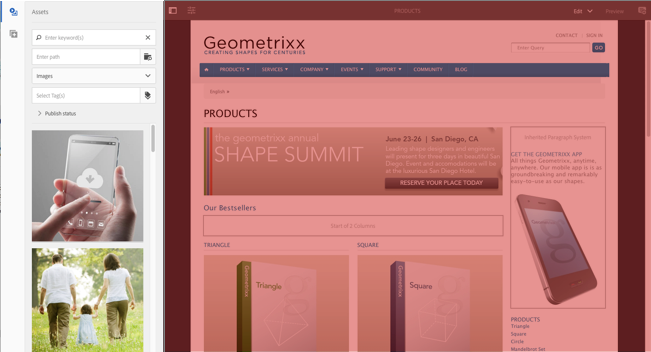
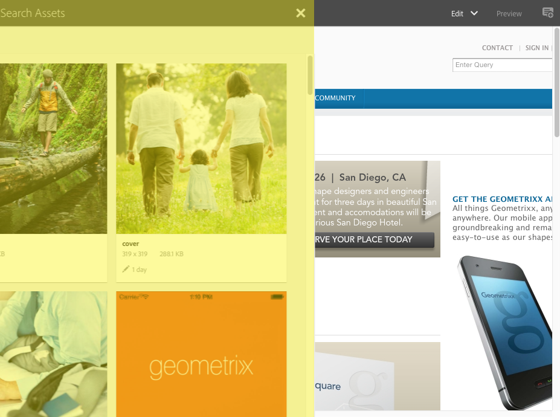

# AEM Touch-Enabled UI的結構{#structure-of-the-aem-touch-enabled-ui}

AEM觸控式UI包含數個基本原則，由數個關鍵元素組成：

## 控制台 {#consoles}

### 基本版面和調整大小 {#basic-layout-and-resizing}

UI適用於行動與桌上型裝置，但Adobe決定使用一種適用於所有螢幕與裝置的樣式，而不是建立兩種樣式。

所有模組都使用相同的基本版面，在AEM中，這可以看成：

版面符合回應式設計樣式，並可配合您使用的裝置／視窗大小。

例如，當解析度低於1024像素（如行動裝置）時，顯示器會隨之調整：

### 標題列 {#header-bar}

標題列顯示全域元素，包括：

* 標誌和您目前使用的特定產品／解決方案；對於AEM，這也會形成全域導覽的連結
* 搜尋
* 表徵圖，用於訪問幫助資源
* 表徵圖，用於訪問其他解決方案
* 指示（並訪問）等待您的任何警報或收件箱項
* 使用者圖示，以及描述檔管理的連結

### 工具列 {#toolbar}

這與您的位置和表面工具相關，並與控制頁面中的檢視或資產有關。 工具列是特定於產品的，但是這些元素有一些通用性。

在任何位置，工具列都會顯示目前可用的動作：

還取決於當前是否選擇了資源：

### 左側邊欄 {#left-rail}

左側邊欄可視需要開啟／隱藏，以顯示：

* **時間軸**
* **引用**
* **篩選**

預設值為「 **僅限內容** （隱藏邊欄）」。

## 頁面編寫 {#page-authoring}

編寫頁面時，結構區域如下。

### 內容影格 {#content-frame}

頁面內容會在內容影格中呈現。 內容影格完全獨立於編輯器——以確保不會因CSS或javascript而產生衝突。

內容影格位於視窗的右側區段、工具列下方。

### 編輯器框架 {#editor-frame}

該編輯器框架實現了編輯功能。

編輯器框架是所有頁面製作元素的容 *器（抽象）*。 它位於內容框架之上，並包含：

* 頂端工具列
* 側面板
* 所有覆蓋
* 任何其他頁面製作元素；例如，元件工具列

### 側面板 {#side-panel}

其中包含兩個預設標籤，可讓您選擇資產和元件；它們可從這裡拖曳至頁面。

側面板預設為隱藏。 當選取時，它會顯示在左側，或滑過來覆蓋整個視窗(當視窗大小低於1024像素寬度時；例如，在行動裝置上)。

### 側面板——資產 {#side-panel-assets}

在「資產」索引標籤中，您可以從資產範圍中選取。 您也可以篩選特定詞語，或選取群組。

### 側面板——資產群組 {#side-panel-asset-groups}

在「資產」標籤中，有一個下拉式清單，您可用來選取特定的資產群組。

### 側面板——元件 {#side-panel-components}

在「元件」索引標籤中，您可以從元件範圍中選取。 您也可以篩選特定詞語，或選取群組。

### 覆蓋 {#overlays}

這些內容會覆蓋內容影格，並由圖層使 [用](#layer) ，以瞭解如何（完全透明）與元件及其內容互動的機制。

覆蓋會在編輯器影格中顯示（與所有其他頁面製作元素一起顯示），不過實際覆蓋內容影格中的適當元件。

### 圖層 {#layer}

圖層是一組獨立的功能，可以激活它以：

* 提供頁面的不同檢視
* 可讓您控制和／或與頁面互動

這些圖層可為整個頁面提供複雜的功能，而不是個別元件上的特定動作。

AEM隨附數個已建置用於頁面製作的圖層；例如，編輯、預覽、註解。

>[!NOTE]
>
>圖層是強大的概念，會影響使用者對頁面內容的檢視和互動。 在開發您自己的圖層時，您需要確保該圖層在退出時清理乾淨。

### 圖層切換器 {#layer-switcher}

圖層切換器可讓您選擇要使用的圖層。 關閉時，它表示當前正在使用的層。

圖層切換器可從工具列（位於視窗頂部，位於編輯器框架內）下拉式清單中取用。

### 元件工具列 {#component-toolbar}

每個元件例項都會在按下時顯示其工具列（按一下一次或按兩下慢速）。 工具列包含頁面上元件例項（可編輯）可用的特定動作（例如複製、貼上、開啟編輯器）。

視可用空間而定，元件工具欄位於相應元件的右上角或右下角。

## 更多資訊 {#further-information}

如需啟用觸控的UI相關概念的詳細資訊，請繼續閱讀 [AEM Touch-Enabled UI的「概念」文章](/help/sites-developing/touch-ui-concepts.md)。

如需詳細技術資訊，請參 [閱啟用觸控的頁面編輯器](https://helpx.adobe.com/experience-manager/6-5/sites/developing/using/reference-materials/jsdoc/ui-touch/editor-core/index.html) ,JS檔案集。

