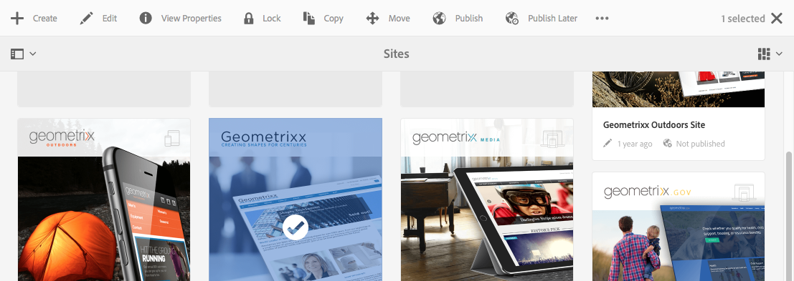

# AEM觸控式UI的結構{#structure-of-the-aem-touch-enabled-ui}

AEM觸控式UI有數個基本原則，且由數個關鍵元素組成：

## 主控台 {#consoles}

### 基本版面配置和調整大小 {#basic-layout-and-resizing}

UI可同時適用於行動裝置和桌上型電腦裝置，但已決定使用適用於所有螢幕和裝置的單一樣式，而非建立兩種樣式Adobe。

所有模組都使用相同的基本版面，在AEM中，這可視為：

版面會固定至回應式設計樣式，並隨您使用的裝置/視窗大小調整。

例如，當解析度低於1024px時（如行動裝置），顯示器會據此調整：

### 標題列 {#header-bar}

標題列顯示全域元素，包括：

* 徽標以及您當前使用的特定產品/解決方案；對於AEM，這也會形成全域導覽的連結
* 搜尋
* 圖示來存取說明資源
* 用於訪問其他解決方案的表徵圖
* 指示（和訪問）等待您的任何警報或收件箱項
* 使用者圖示，以及您設定檔管理的連結

### 工具列 {#toolbar}

這與您的位置和曲面工具相關，而且與控制下方頁面中的檢視或資產相關。 工具列是產品專屬的，但元素有一些通用性。

在任何位置中，工具列都會顯示目前可用的動作：

還取決於當前是否選擇了資源：

### 左側邊欄 {#left-rail}

左側邊欄可視需要開啟/隱藏，以顯示：

* **時間軸**
* **引用**
* **篩選**

預設為 **僅內容** （隱藏邊欄）。

## 頁面編寫 {#page-authoring}

編寫頁面時，結構區域如下。

### 內容框架 {#content-frame}

頁面內容會在內容框架中呈現。 內容框架與編輯器完全無關，以確保沒有因CSS或JavaScript而產生衝突。

內容框架位於窗口的右側部分（工具欄下）。

### 編輯器框架 {#editor-frame}

編輯器框架實現編輯功能。

編輯器框架是所有 *頁面製作元素*. 它位於內容框架的頂端，並包含：

* 頂端工具列
* 側面板
* 所有覆蓋
* 任何其他頁面製作元素；例如，元件工具欄

### 側面板 {#side-panel}

這包含兩個預設標籤，可讓您選取資產和元件；可從這裡拖曳到頁面上。

側面板預設為隱藏。 選取後，會顯示在左側，或滑過以覆蓋整個視窗（當視窗大小低於1024px的寬度時）;例如，在行動裝置上)。

### 側面板 — 資產 {#side-panel-assets}

在「資產」索引標籤中，您可以從資產範圍中選取。 您也可以篩選特定詞語，或選取群組。

### 側面板 — 資產群組 {#side-panel-asset-groups}

在「資產」標籤中，有一個下拉式清單可供您用來選取特定資產群組。

### 側面板 — 元件 {#side-panel-components}

在「元件」索引標籤中，您可以從元件範圍中選取。 您也可以篩選特定詞語，或選取群組。

### 覆蓋 {#overlays}

這些會覆蓋內容框架，並供 [層](#layer) 以實現您與元件及其內容互動（完全透明）的機制。

覆蓋圖會在編輯器框架中顯示（與所有其他頁面製作元素一起顯示），但實際上會覆蓋內容框架中的適當元件。

### 圖層 {#layer}

圖層是可激活至以下功能的獨立功能組合：

* 提供頁面的不同檢視
* 可讓您操控頁面及/或與頁面互動

與個別元件上的特定動作相比，這些層可提供整個頁面的複雜功能。

AEM隨附數個已實作用於頁面製作的層；包括編輯、預覽、注釋。

>[!NOTE]
>
>圖層是一個強大的概念，會影響使用者的檢視以及與頁面內容的互動。 在開發自己的圖層時，您需要確保該圖層在退出時清除。

### 層切換器 {#layer-switcher}

圖層切換器可讓您選擇要使用的圖層。 關閉時，它表示當前正在使用的圖層。

圖層切換器可從工具列（位於視窗頂端、編輯器框架內）下拉式清單中使用。

### 元件工具列 {#component-toolbar}

按一下元件的每個例項都會顯示其工具列（按一下或按兩下即可顯示）。 工具列包含頁面上元件例項（可編輯）可用的特定動作（例如複製、貼上、開啟編輯器）。

根據可用空間，元件工具欄位於相應元件的右上角或右下角。

## 更多資訊 {#further-information}

如需觸控式UI相關概念的詳細資訊，請繼續參閱文章 [AEM觸控式UI的概念](/help/sites-developing/touch-ui-concepts.md).

欲知更多技術資訊，請參閱 [JS檔案集](https://helpx.adobe.com/experience-manager/6-5/sites/developing/using/reference-materials/jsdoc/ui-touch/editor-core/index.html) （適用於啟用觸控的頁面編輯器）。
