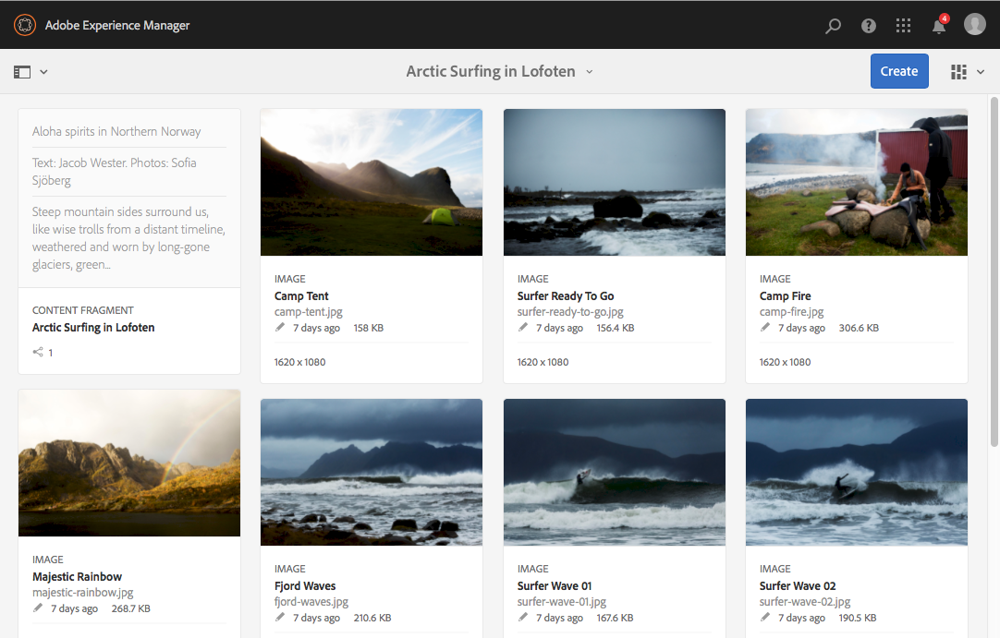
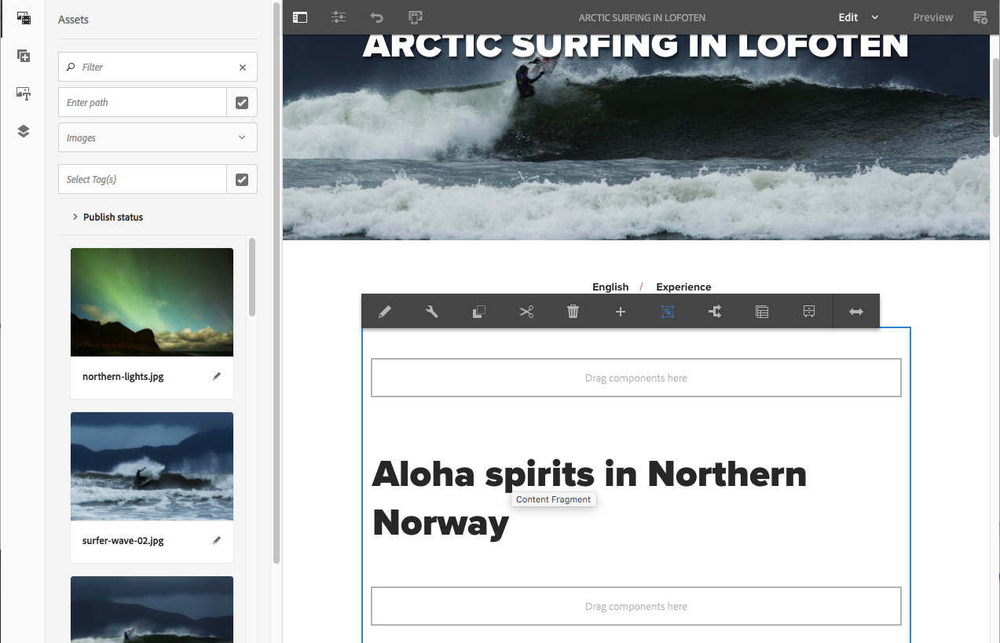

# 在We.Retail中試用內容片段{#trying-out-content-fragments-in-we-retail}

內容片段可讓您建立不受通道影響的內容，以及（可能是特定通道的）變化。 **We.Retail** （如AEM的現成可用例項所提供）提供Lofoten的殘片 **Arcitic Surfing** ，做為基本範例。 這說明：

* Adobe Experience Manager(AEM)內容片段會建 [立並管理為不受頁面影響的資產](/help/assets/content-fragments.md)。 它們可讓您建立不受頻道影響的內容，以及（可能是特定頻道的）變化。

   * 查看 [在We.Retail中尋找內容片段資產的位置](#where-to-find-content-fragments-in-we-retail)

* 然後，您就 [可在製作內容頁面時使用這些片段](/help/sites-authoring/content-fragments.md) ，以及其變化。

   * 查 [看We.Retail中使用內容片段的位置](#where-content-fragments-are-used-in-we-retail)

有關建立、管理、使用和開發內容片段的完整檔案：

* 請參閱 [詳細資訊](#further-information)

>[!NOTE]
>
>**「內容片段** 」和「 **[體驗片段](/help/sites-authoring/experience-fragments.md)**」是AEM中的不同功能：
>
>* **內容片段** 是編輯內容，主要是文字和相關影像。 它們是純粹的內容，不需要設計和版面配置。
>* **體驗片段** ，內容已完整排版；網頁的片段。
>
>
「體驗片段」可以包含內容片段的形式，但不能以相反的方式包含。

## 在We.Retail中尋找內容片段的位置 {#where-to-find-content-fragments-in-we-retail}

We.Retail中有數個範例內容片段；透過「 **Assets」（資產）、「** Files **」（檔案）、「** Retail **」（零售）、「Retail**」（英文）、「 ******** Experiences」（體驗）進行導覽。

其中包括 **Lofoten的北極衝浪**，這是一塊碎片，以及相關的視覺資產：

* 透過Navigate **Assets**、Files **、** Retail **、Exglish Assets、************** Experiences、Artic Surfing in Lofoten（線上衝浪）瀏覽：

   * [http://localhost:4502/assets.html/content/dam/we-retail/en/experiences/arctic-surfing-in-lofoten](http://localhost:4502/assets.html/content/dam/we-retail/en/experiences/arctic-surfing-in-lofoten)

您可以選擇並編輯Lofoten中 **的北極衝浪片段** :

* [http://localhost:4502/editor.html/content/dam/we-retail/en/experiences/arctic-surfing-in-lofoten/arctic-surfing-in-lofoten](http://localhost:4502/editor.html/content/dam/we-retail/en/experiences/arctic-surfing-in-lofoten/arctic-surfing-in-lofoten)

您可以在此 [處使用標籤](/help/assets/content-fragments.md) （左側面板）編輯和管理片段：

<!--  ASSET does not exist-->

* **[包括Markdown](/help/assets/content-fragments-variations.md)**的變[數](/help/assets/content-fragments-markdown.md)
* **[相關聯的內容](/help/assets/content-fragments-assoc-content.md)**
* **[中繼資料](/help/assets/content-fragments-metadata.md)**

## We.Retail中使用內容片段的位置 {#where-content-fragments-are-used-in-we-retail}

若要以 [內容片段來說明頁面製作](/help/sites-authoring/content-fragments.md) ，請在以下提供數個範例頁面：

* [http://localhost:4502/sites.html/content/we-retail/language-masters/en/experience](http://localhost:4502/sites.html/content/we-retail/language-masters/en/experience)

例如，Lofoten中的 **北極衝浪內容片段** ，在「網站」頁面中參考：

* 透過網站 **、** We.Retail **、** Masters **Language Experience**、English Lighn Experience ********&#x200B;導覽。 然後在Lofoten **開啟「北極衝浪** 」進行編輯：

   * [http://localhost:4502/editor.html/content/we-retail/language-masters/en/experience/arctic-surfing-in-lofoten.html](http://localhost:4502/editor.html/content/we-retail/language-masters/en/experience/arctic-surfing-in-lofoten.html)

## 更多資訊 {#further-information}

如需詳細資訊，請參閱：

* [使用內容片段](/help/assets/content-fragments.md)

   * 瞭解如何建立、編輯和管理您的內容片段資產。

* [使用內容片段製作頁面](/help/sites-authoring/content-fragments.md)

   * 在編寫頁面時使用您的內容片段。

* [開發AEM —— 內容片段的元件](/help/sites-developing/components-content-fragments.md)

   * 內容片段的元件概觀。

* [開發和擴充內容片段](/help/sites-developing/customizing-content-fragments.md)

   * 協助您開發和擴充內容片段的資訊。

