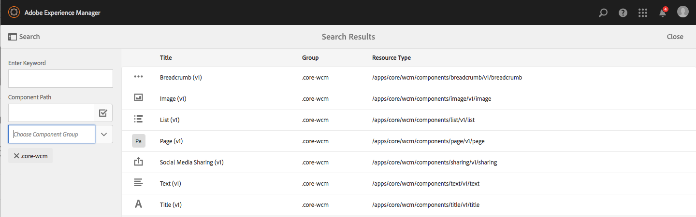
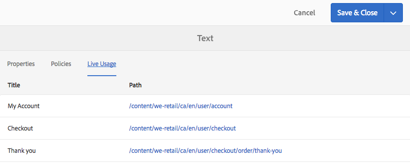
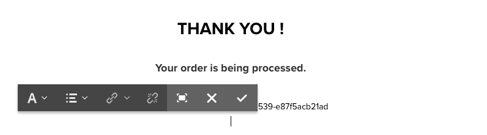

# 在We.Retail中試用核心元件{#trying-out-core-components-in-we-retail}

核心元件是現代化、有彈性的元件，具有輕鬆的擴充性，並可輕鬆整合至您的專案。 核心元件是以數種主要設計原則為基礎而建立，例如HTL、可用性、現成可用性、可設定性、版本設定和擴充性。 We.Retail已建置在核心元件上。

## 試試 {#trying-it-out}

1. 從We.Retail範例內容開啟AEM，然後開啟 [元件主控台](/help/sites-authoring/default-components-console.md).

   **全局導航 — >工具 — >元件**

1. 在「元件控制台」中開啟邊欄，您可以篩選特定元件群組。 核心元件位於

   * `.core-wcm`:標準核心元件
   * `.core-wcm-form`:表單提交核心元件

   選擇 `.core-wcm`.

   

1. 請注意，所有核心元件均已命名 **v1**，反映此為此核心元件的第一個版本。 日後將發行一般版本，其版本與AEM相容，且可輕鬆升級，以便您運用最新功能。
1. 按一下 **文字(v1)**.

   請參閱 **資源類型** 的 `/apps/core/wcm/components/text/v1/text`. 核心元件位於 `/apps/core/wcm/components` 和已根據元件進行版本控制。

   

1. 按一下 **檔案** 標籤，以查看元件的開發人員檔案。

   

1. 返回元件控制台。 群組的篩選 **We.Retail** ，然後選取 **文字** 元件。
1. 請參閱 **資源類型** 指向元件，如 `/apps/weretail` 但 **資源超類型** 指向核心元件 `/apps/core/wcm/components/text/v1/text`.

   

1. 按一下 **使用中** 頁簽，查看當前正在使用此元件的頁面。 按一下第一個 **謝謝** 頁面來編輯頁面。

   

1. 在感謝頁面上，選擇文本元件，然後在元件的編輯菜單中按一下取消繼承表徵圖。

   [We.Retail具有全球化的網站結構](/help/sites-developing/we-retail-globalized-site-structure.md) 內容從語言主版推播至 [透過稱為繼承的機制執行即時副本](/help/sites-administering/msm.md). 因此，必須取消繼承，才能讓使用者手動編輯文字。

   

1. 按一下以確認取消 **是**.

   

1. 取消繼承並選取文字元件後，可使用更多選項。 按一下** Edit**。

   

1. 您現在可以查看文字元件有哪些編輯選項可用。

   

1. 從 **頁面資訊** 功能表選取 **編輯範本**.
1. 在頁面的範本編輯器中，按一下 **原則** 表徵圖 **版面容器** 頁面的下一個頁面。

   

1. 核心元件可讓範本作者設定頁面作者可使用的屬性。 這些功能包括允許的貼上來源、格式選項、可用的段落樣式等。

   此類設計對話方塊適用於許多核心元件，並與範本編輯器搭配運作。 啟用後，作者可透過元件編輯器使用。

   

## 更多資訊 {#further-information}

如需核心元件的詳細資訊，請參閱製作檔案 [核心元件](https://docs.adobe.com/content/help/zh-Hant/experience-manager-core-components/using/introduction.html) 以概略了解核心元件的功能，以及開發人員檔案 [開發核心元件](https://helpx.adobe.com/experience-manager/core-components/using/developing.html) 以取得技術概觀。

您也可以進一步調查 [可編輯的範本](/help/sites-developing/we-retail-editable-templates.md). 請參閱編寫檔案 [建立頁面範本](/help/sites-authoring/templates.md) 或開發人員文檔頁面 [範本 — 可編輯](/help/sites-developing/page-templates-editable.md) 以取得可編輯範本的完整詳細資訊。
