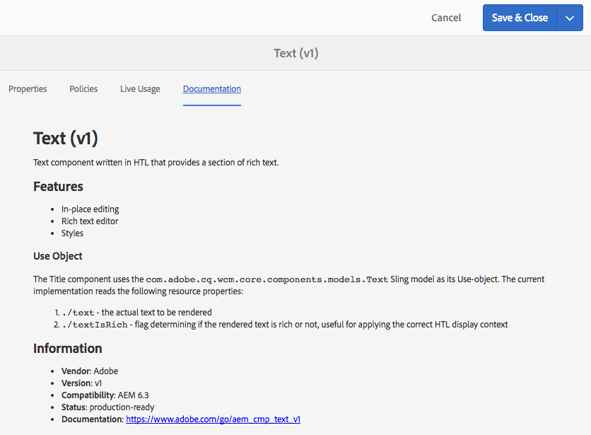

# 在We.Retail中試用核心元件{#trying-out-core-components-in-we-retail}

核心元件是現代、彈性的元件，具有輕鬆擴充的功能，並可輕鬆整合至您的專案。 核心元件是圍繞幾項主要設計原則建置的，例如HTL、現成可用的能力、可設定性、版本設定和擴充性。 We.Retail是以核心元件為基礎所建置。

## 正在試用中 {#trying-it-out}

1. 以We.Retail範例內容啟動Adobe Experience Manager (AEM)，並開啟 [元件主控台](/help/sites-authoring/default-components-console.md).

   **全域導覽>工具>元件**

1. 在元件主控台中開啟邊欄，即可篩選特定元件群組。 核心元件可在下列位置找到：

   * `.core-wcm`：標準核心元件
   * `.core-wcm-form`：表單提交核心元件

   選擇 `.core-wcm`.

   

1. 所有核心元件皆已命名 **v1**，表示這是此核心元件的第一個版本。 未來將發行常規版本，此版本與AEM版本相容，且可輕鬆升級，讓您可以利用最新功能。
1. 按一下 **文字(v1)**.

   檢視 **資源型別** 元件的 `/apps/core/wcm/components/text/v1/text`. 核心元件位於 `/apps/core/wcm/components` 和會根據元件建立版本。

   

1. 按一下 **檔案** 標籤以檢視元件的開發人員檔案。

   

1. 返回「元件主控台」。 篩選群組 **We.Retail** 並選取 **文字** 元件。
1. 檢視 **資源型別** 依照預期，指向下的元件 `/apps/weretail` 但是 **資源超級型別** 指向核心元件 `/apps/core/wcm/components/text/v1/text`.

   

1. 按一下 **即時使用情況** 索引標籤以檢視此元件在哪些頁面上使用。 按一下第一個 **感謝您** 頁面以編輯頁面。

   

1. 在「感謝您」頁面上，選取文字元件，然後在元件的編輯選單中按一下「取消繼承」圖示。

   [We.Retail具有全球化網站結構](/help/sites-developing/we-retail-globalized-site-structure.md) 將內容從語言主版推送至的位置 [透過稱為繼承的機制執行即時副本](/help/sites-administering/msm.md). 因此，必須取消繼承，才能讓使用者手動編輯文字。

   

1. 按一下「 」以確認取消 **是**.

   

1. 一旦取消繼承並選取文字元件後，就可使用更多選項。 按一下 **編輯**.

   

1. 您現在可以看到文字元件有哪些編輯選項可用。

   

1. 從 **頁面資訊** 功能表，選取 **編輯範本**.
1. 在頁面的範本編輯器中，按一下 **原則** 圖示中的文字元件 **配置容器** 頁面的「 」。

   

1. 核心元件可讓範本作者設定哪些屬性可供頁面作者使用。 這些功能包括允許貼上來源、格式選項和可用段落樣式等功能。

   這類設計對話方塊適用於許多核心元件，並與範本編輯器共同作業。 在啟用後，作者可以透過元件編輯器使用它們。

   

## 更多資訊 {#further-information}

如需核心元件的詳細資訊，請參閱撰寫檔案 [核心元件](https://experienceleague.adobe.com/docs/experience-manager-core-components/using/introduction.html?lang=zh-Hant) 核心元件和開發人員檔案的功能概觀 [開發核心元件](https://experienceleague.adobe.com/docs/experience-manager-core-components/using/developing/overview.html) 以取得技術概覽。

您也可以進一步調查 [可編輯的範本](/help/sites-developing/we-retail-editable-templates.md). 請參閱撰寫檔案 [建立頁面範本](/help/sites-authoring/templates.md) 或開發人員檔案頁面 [範本 — 可編輯](/help/sites-developing/page-templates-editable.md) 以取得可編輯範本的完整詳細資訊。
