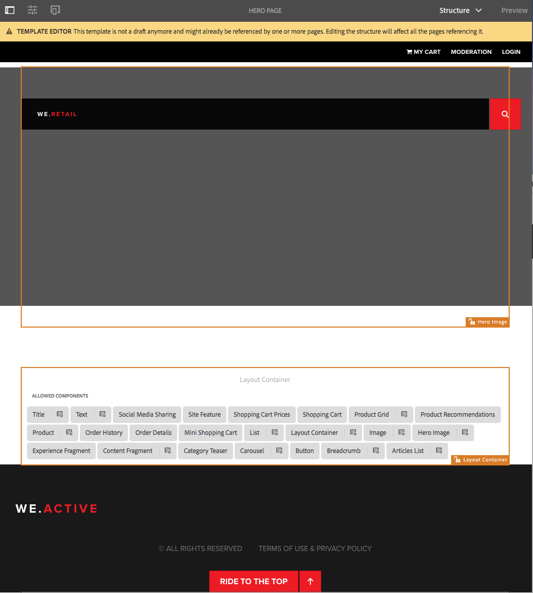

# 在We.Retail中試用可編輯的範本{#trying-out-editable-templates-in-we-retail}

使用可編輯的範本，建立和維護範本不再是開發人員專屬的工作。 一種高級用戶（稱為模板作者）現在可以建立模板。 開發人員仍需要設定環境、建立用戶端程式庫和建立要使用的元件，但是當這些基本功能準備就緒後，範本作者就可以彈性地建立和設定範本，而不需要開發專案。

We.Retail中的所有頁面都以可編輯的範本為基礎，讓非開發人員能夠調整和自訂範本。

## 試用 {#trying-it-out}

1. 編輯語言主分支的「設備」頁。

   http://localhost:4502/editor.html/content/we-retail/language-masters/en/equipment.html

1. 請注意，模式選擇器不再提供設計模式。 We.Retail的所有頁面都以可編輯的範本為基礎，而要改變可編輯範本的設計，則必須在範本編輯器中加以編輯。
1. 從「頁面 **資訊」功能表** ，選取「 **編輯範本」**。
1. 您現在正在編輯「英雄頁面」範本。

   頁面的結構模式允許您修改模板的結構。 這包括例如版面容器中允許的元件。

   

1. 設定配置容器的原則，以定義容器中允許的元件。

   策略與設計配置相當。

   

1. 在版面容器的設計對話方塊中，您可以

   * 選擇現有策略或為容器建立新策略
   * 選取容器中允許的元件
   * 定義資產拖曳至容器時要放置的預設元件
   

1. 回到範本編輯器中，您可以編輯版面容器中文字元件的原則。

   這可讓您：

   * 選擇現有策略或為容器建立新策略
   * 定義使用此元件(例如

      * 允許貼上來源
      * 格式選項
      * 允許的段落樣式
      * 允許的特殊字元
   許多以核心元件為基礎的元件都允許透過可編輯的範本，在元件層級設定選項，讓開發人員不再需要自訂。

   

1. 回到範本編輯器中，您可以使用模式選擇器變更為「初始內容 **** 」模式，以定義頁面上需要哪些內容。

   **配置** (Layout)模式可如同在一般頁面上一樣使用，以定義範本的配置。

## 更多資訊 {#more-information}

如需詳細資訊，請參閱製作檔案 [Creating Page Templates](/help/sites-authoring/templates.md) （建立頁面範本）或開發人員檔案Page [Templates - Editable](/help/sites-developing/page-templates-editable.md) （頁面範本——可編輯），以取得可編輯範本的完整技術詳細資訊。

您也可能希望調查核 [心元件](/help/sites-developing/we-retail-core-components.md)。 如需核心元件功能 [的概觀](https://docs.adobe.com/content/help/en/experience-manager-core-components/using/introduction.html) ，請參閱編寫檔案核心元件，如需技術概觀，請參閱開發人員檔案 [開發核心元件](https://helpx.adobe.com/experience-manager/core-components/using/developing.html) 。

