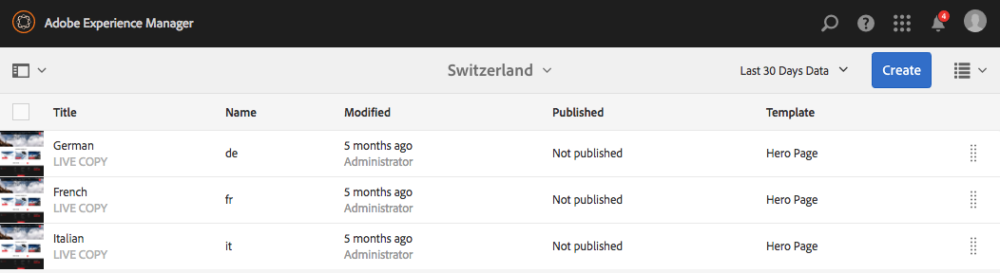
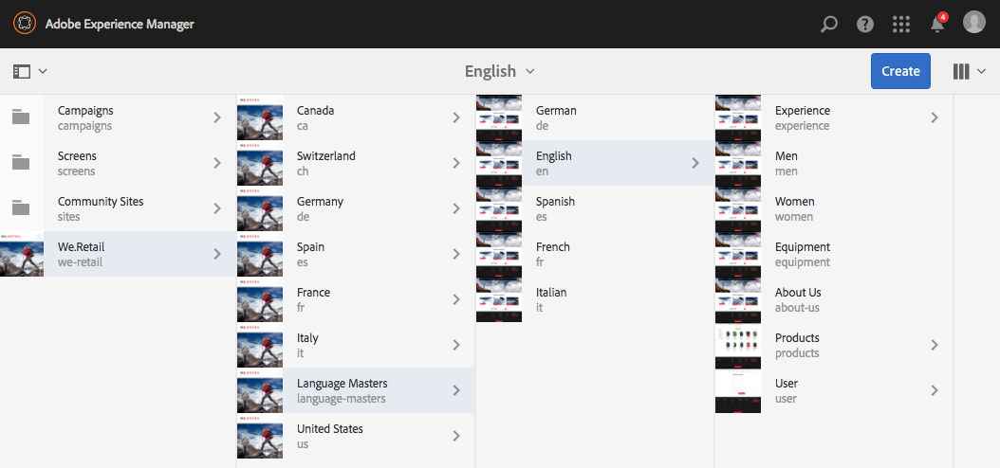

# 在We.Retail中試用全域化網站結構{#trying-out-the-globalized-site-structure-in-we-retail}

We.Retail是藉由全球化網站結構所建置，可提供語言母版，且可供即時複製至特定國家/地區的網站。 所有開箱即用的功能均已設定完畢，可讓您試驗此結構和內建的翻譯功能。

## 正在試用中 {#trying-it-out}

1. 從&#x200B;**全域導覽>網站**&#x200B;開啟網站主控台。
1. 切換到欄檢視（如果尚未啟用）並選取We.Retail。 請記下具有瑞士、美國、法國等的國家結構範例，以及Language Master。

   

1. 選取瑞士，並檢視該國家/地區的語言根目錄。 這些根目錄下還沒有任何內容。

   

1. 切換到清單檢視，檢視國家/地區的語言副本都是即時副本。

   

1. 返回欄檢視，然後按一下語言主版，檢視含有內容的語言主版根。 只有英文有內容。

   We.Retail未隨附任何翻譯內容，但結構和設定已準備就緒，可讓您示範翻譯服務。

   

1. 選取英文主版後，在網站主控台中開啟&#x200B;**參考**&#x200B;邊欄，並選取&#x200B;**語言副本**。

   

1. 勾選「**語言副本**」標籤旁的核取方塊，以選取所有語言副本。 在邊欄的&#x200B;**更新語言副本**&#x200B;區段中，選取&#x200B;**建立新翻譯專案**&#x200B;的選項。 提供專案名稱，然後按一下&#x200B;**更新**。

   

1. 系統會為每個語言翻譯建立一個專案。 在&#x200B;**導覽>專案**&#x200B;下檢視它們。

   

1. 按一下德文可檢視翻譯專案的詳細資料。 狀態為&#x200B;**草稿**。 若要使用Microsoft®的翻譯服務開始翻譯，請按一下&#x200B;**翻譯工作**&#x200B;標題旁的>形箭號，然後選取&#x200B;**開始**。

   

1. 翻譯專案隨即開始。 按一下標示為翻譯工作的卡片底部的省略符號以檢視詳細資訊。 翻譯服務已翻譯狀態為&#x200B;**準備好檢閱**&#x200B;的頁面。

   

1. 選取清單中的其中一個頁面，然後在工具列中&#x200B;**在網站中預覽**&#x200B;會在頁面編輯器中開啟翻譯的頁面。

   

>[!NOTE]
>
>此程式展示與Microsoft®機器翻譯的內建整合。 使用[AEM Translation Integration Framework](/help/sites-administering/translation.md)，您可以整合許多標準翻譯服務，以協調AEM的翻譯。

## 詳細資訊 {#further-information}

如需詳細資訊，請參閱撰寫檔案[翻譯多語言網站的內容](/help/sites-administering/translation.md)，以取得完整的技術細節。
