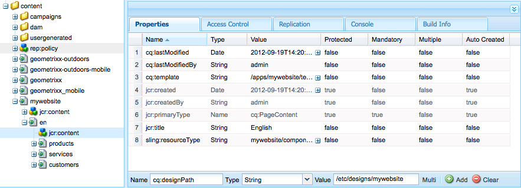
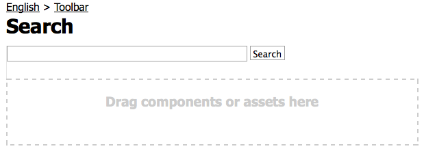

# 建立功能完備的網站(JSP){#create-a-fully-featured-website-jsp}

>[!NOTE]
>
>本文說明如何使用JSP並以傳統的UI為基礎建立網站。 Adobe建議您運用最新的AEM技術來建立網站，如「開發AEM網站快速入門」一文 [中所述](/help/sites-developing/getting-started.md)。

本教學課程可讓您使用Adobe Experience Manager(AEM)建立功能完整的網站。 該網站將以一般網站為基礎，主要針對網頁開發人員。 所有開發工作都將在作者環境中進行。

本教學課程說明如何：

1. 安裝AEM。
1. 存取CRXDE Lite（開發環境）。
1. 在CRXDE Lite中設定專案結構。
1. 建立範本、元件和指令碼，做為建立內容頁面的基礎。
1. 建立網站的根頁面，然後建立內容頁面。
1. 建立下列元件以用於您的頁面：

   * 上層導覽
   * 列出子項
   * 標誌
   * 影像
   * 文字影像
   * 搜尋

1. 包含各種基礎元件。

執行完所有步驟後，您的頁面外觀如下：


**下載最終結果**

若要遵循教學課程而非執行練習，請下載website-1.0.zip。 此檔案是AEM內容套件，包含本教學課程的結果。 使用 [Package Manager](/help/sites-administering/package-manager.md) ，將套件安裝至您的作者實例。

**** 注意：安裝此套件將會覆寫您使用本教學課程所建立的編寫執行個體上的所有資源。

網站內容套件

[取得檔案](assets/website-1_0.zip)

## 安裝Adobe Experience Manager {#installing-adobe-experience-manager}

若要安裝AEM例項以開發您的網站，請依照指示設定部署環境與作者 [和發佈例項](/help/sites-deploying/deploy.md#author-and-publish-installs)，或執行一般 [安裝](/help/sites-deploying/deploy.md#default-local-install)。 一般安裝包括下載AEM Quickstart JAR檔案、將license.properties檔案置於與JAR檔案相同的目錄中，以及連按兩下JAR檔案。

安裝AEM後，按一下「歡迎」頁面上的CRXDE Lite連結，即可存取CRXDE Lite開發環境：


>[!NOTE]
>
>AEM製作例項的CRXDE Lite URL（使用預設連接埠安裝在本機）是 [https://localhost:4502/crx/de/](https://localhost:4502/crx/de/)。

### 在CRXDE Lite中設定項目結構 {#setting-up-the-project-structure-in-crxde-lite}

使用CRXDE Lite在儲存庫中建立mywebsite應用程式結構：

1. 在CRXDE Lite左側的樹狀結構中，以滑鼠右鍵按一下資料夾，然 **`/apps`** 後按一下「建 **立** >建 **立資** 料 **夾**」。 在「建立 **資料夾** 」對話框中，鍵入 `mywebsite` 作為資料夾名稱，然後按一下「 **確定」**。
1. 在資料夾上按一 **`/apps/mywebsite`** 下滑鼠右鍵，然 **後按** 「建 **立資料夾」**。 在「建立 **資料夾** 」對話框中，鍵入 `components` 作為資料夾名稱，然後按一下「 **確定」**。
1. 在資料夾上按一 **`/apps/mywebsite`** 下滑鼠右鍵，然 **後按** 「建 **立資料夾」**。 在「建立 **資料夾** 」對話框中，鍵入 `templates` 作為資料夾名稱，然後按一下「 **確定」**。

   樹狀結構現在應該是這樣的：

   

1. 按一下「 **全部儲存**」。

### 設定設計 {#setting-up-the-design}

在本節中，您使用設計工具為應用程式建立設計。 本設計為您的網站提供CSS和影像資源。

>[!NOTE]
>
>按一下下列連結以下載mywebsite.zip。 封存檔包含您設計的static.css和影像檔案。

static.css檔案和影像範例

[取得檔案](assets/mywebsite.zip)

1. 在「AEM歡迎」頁面上，按一下「 **工具**」。 ([https://localhost:4502/libs/cq/core/content/welcome.html](https://localhost:4502/libs/cq/core/content/welcome.html))

   

1. 在檔案夾樹狀結構中，選取「 **Designs** 」檔案夾，然後按一下「 **New** > **New Page**」。 鍵入 `mywebsite` 作為標題，然後按一下「 **建立」**。

1. 如果mywebsite項目未顯示在表中，請刷新樹或表。

1. [使用WebDAV](/help/sites-administering/webdav-access.md) 存取https://localhost:4502的URL，將下載的mywebsite.zip檔案中的範例檔 `static.css``images` 案和檔案夾複製到檔案夾 `/etc/designs/mywebsite` 中。

   

### 建立內容頁範本、元件和指令碼 {#creating-the-contentpage-template-component-and-script}

在本節中，您將建立以下內容：

* 用於在範例網站中建立內容頁面的內容頁面範本
* 用於呈現內容頁面的內容頁面元件
* 內容頁面指令碼

#### 建立內容頁面範本 {#creating-the-contentpage-template}

建立範本，以做為您網站網頁的基礎。

範本會定義新頁面的預設內容。 複雜的網站可能會使用數個範本來建立網站中不同類型的頁面。 在本練習中，所有頁面都以單一簡單範本為基礎。

1. 在CRXDE Lite的資料夾樹中，按一下右鍵，然 `/apps/mywebsite/templates` 後按一下「創 **建** >創 **建模板**」。

1. 在「建立範本」對話方塊中，輸入下列值，然後按一下「下 **一步**:

   * **標籤**:contentpage
   * **標題**:我的網站內容頁面範本
   * **說明**:這是我的網站內容頁面範本
   * **** 資源類型：mywebsite/components/contentpage
   使用「排名」屬性的預設值。

   

   資源類型標識轉換頁面的元件。 在這種情況下，使用contentpage模板建立的所有頁面都由元件呈 `mywebsite/components/contentpage` 現。

1. 若要指定可使用此範本的頁面路徑，請按一下加號按鈕，然後在顯示 `/content(/.*)?` 的文字方塊中輸入。 然後，按一下「 **Next(下一步**)」。

   

   允許的路徑屬性的值是規則運 *算式。* 路徑與運算式相符的頁面可以使用範本。 在這種情況下，規則運算式與 **/content資料夾的路徑** ，以及所有子頁面相符。

   當作者在/content下方建立頁面時，內容 **頁面範本會顯示在** 可用範本清單中。

1. 在「 **Allowed Parents(允** 許的父項)」和「Allowed Children **(允許的子項** )」面板中按一下「Next（下一步）」 ，然後按一下「 **OK（確定）」******。 在CRXDE Lite中，按一下「全 **部儲存」**。

   

#### 建立Contentpage元件 {#creating-the-contentpage-component}

建立定 *義內容* ，並轉譯使用內容頁面範本的頁面的元件。 元件的位置必須與內容頁模板的「資源類型」屬性的值對應。

1. 在CRXDE Lite中，以滑鼠右鍵按一下， `/apps/mywebsite/components` 然後按一下「 **建立** >元 **件**」。
1. 在「創 **建元件** 」對話框中，鍵入以下屬性值：

   * **標籤**:contentpage
   * **標題**:我的網站內容頁面元件
   * **說明**:這是我的網站內容頁面元件
   

   新元件的位置為 `/apps/mywebsite/components/contentpage`。 此路徑與內容頁面範本的資源類型(減去路徑的 **`/apps/`** 初始部分)相對應。

   此對應將範本連結至元件，對網站的正確運作至關重要。

1. 按一下「 **下一步** 」，直到出現對話框的「允許的子項」面板，然後按一下「 **確定」**。 在CRXDE Lite中，按一下「全 **部儲存」**。

   現在的結構如下：

   

#### 開發Contentpage元件指令碼 {#developing-the-contentpage-component-script}

將程式碼新增至contentpage.jsp指令碼以定義頁面內容。

1. 在CRXDE Lite中，在中開啟 `contentpage.jsp` 檔案 `/apps/mywebsite/components/contentpage`。 依預設，檔案包含下列程式碼：

   ```java
   <%--
   
     My Website Content Page Component component.
   
     This is My Website Content Page Component.
   
   --%><%
   %><%@include file="/libs/foundation/global.jsp"%><%
   %><%@page session="false" %><%
   %><%
       /* TODO add you code here */
   %>
   ```

1. 複製下列程式碼，並將它貼在預設程式碼之後的contentpage.jsp中：

   ```java
   <%@ page language="java" contentType="text/html; charset=ISO-8859-1"
       pageEncoding="ISO-8859-1"%>
   <!DOCTYPE html PUBLIC "-//W3C//DTD HTML 4.01 Transitional//EN"
   "https://www.w3.org/TR/html4/loose.dtd">
   <html>
   <head>
   <meta http-equiv="Content-Type" content="text/html; charset=ISO-8859-1">
   <title>My title</title>
   </head>
   <body>
   <div>My body</div>
   </body>
   </html>
   ```

1. 按一 **下「全部儲存** 」以儲存變更。

### 建立網站頁面和內容頁面 {#creating-your-website-page-and-content-pages}

在本節中，您會建立下列所有使用內容頁面範本的頁面：我的網站、英文、產品、服務和客戶。

1. 在「AEM歡迎」頁面([https://localhost:4502/libs/cq/core/content/welcome.html](https://localhost:4502/libs/cq/core/content/welcome.html))上，按一下「網站」。

   

1. 在資料夾樹狀結構中，選取「 **Websites** 」資料夾，然後按一下「新 **增** >新 **增頁面**」。
1. 在「創 **建頁面** 」窗口中，輸入以下內容：

   * 標題: `My Website`
   * 名稱: `mywebsite`
   * 選取 `My Website Content Page Template`
   

1. 按一下&#x200B;**「建立」**。在資料夾樹中，選擇「 **/網站／我的網站** 」頁面，然後按一下「 **新建** 」>「 **新建頁面**」。
1. 在「建立頁」對話框中，輸入以下屬性值，然後按一下建立：

   * 標題：英文
   * 名稱：en
   * 選取「我的網站內容頁面」範本

1. 在資料夾樹中，選擇「 **/Websites/My Website/English** 」頁，然後按一下「 **New****>** New Page」。
1. 在「建 **立頁面** 」對話方塊中，輸入下列屬性值，然後按一下「 **建立**:

   * 標題：產品
   * 選取「我的網站內容頁面」範本

1. 在資料夾樹中，選擇「 **/Websites/My Website/English** 」頁，然後按一下「 **New** (新建 **)」**&#x200B;頁。
1. 在「建 **立頁面** 」對話方塊中，輸入下列屬性值，然後按一下「 **建立**:

   * 標題：服務
   * 選取「我的網站內容頁面」範本

1. 在資料夾樹中，選擇「 **/Websites/My Website/English** 」頁，然後按一下「 **New** (新建 **)」**&#x200B;頁。
1. 在「建 **立頁面** 」對話方塊中，輸入下列屬性值，然後按一下「 **建立**:

   * 標題：客戶
   * 選取「我的網站內容頁面」範本
   您的結構如下所示：

   

1. 若要將頁面連結至mywebsite設計，請在CRXDE Lite中選取節 `/content/mywebsite/en/jcr:content` 點。 在「屬性」索引標籤中，為新屬性輸入下列值，然後按一下「新增」:

   * 名稱：cq:designPath
   * 類型：字串
   * 值：/etc/designs/mywebsite
   

1. 在新的網頁瀏覽器標籤或視窗中，開啟 [https://localhost:4502/content/mywebsite/en/products.html](https://localhost:4502/content/mywebsite/en/products.html) ，以檢視「產品」頁面：

   

### 增強Contentpage指令碼 {#enhancing-the-contentpage-script}

本節說明如何使用AEM基礎元件指令碼並撰寫您自己的指令碼來增強contentpage指令碼。

「產 **品** 」頁面如下所示：


#### 使用Foundation頁指令碼 {#using-the-foundation-page-scripts}

在本練習中，您可設定您的pagecontent元件，使其超類型為AEM Page元件。 由於元件繼承其超類型的功能，因此您的頁面內容會繼承Page元件的指令碼和屬性。

例如，在元件JSP代碼中，可以參照超類型元件提供的指令碼，就像它們包含在元件中一樣。

1. 在CRXDE Lite中，將屬性新增至節 `/apps/mywebsite/components/contentpage` 點。

   1. 選擇節 `/apps/mywebsite/components/contentpage` 點。
   1. 在「屬性」索引標籤底部，輸入下列屬性值，然後按一下「新增」:

      * **** 名稱：sling:resourceSuperType
      * **** 類型：字串
      * **** 值：foundation/components/page
   1. 按一下「全部儲存」。


1. 在下方 `contentpage.jsp` 開啟檔 `/apps/mywebsite/components/contentpage` 案，並以下列程式碼取代現有程式碼：

   ```xml
   <%@include file="/libs/foundation/global.jsp"%><%
   %><%@page session="false" contentType="text/html; charset=utf-8" %><%
   %><!DOCTYPE HTML PUBLIC "-//W3C//DTD HTML 4.01//EN" "https://www.w3.org/TR/html4/strict.dtd">
   <html>
   <cq:include script="head.jsp"/>
   <cq:include script="body.jsp"/>
   </html>
   ```

1. 儲存您的變更。
1. 在瀏覽器中，重新載入「產品」頁面。 其外觀如下：

   

   開啟頁面來源，以檢視head.jsp和body.jsp指令碼產生的javascript和HTML元素。 當您開啟頁面時，下列指令碼片段會開啟Sidekick:

   ```java
   CQ.WCM.launchSidekick("/content/mywebsite/en/products",
               {propsDialog: "/libs/foundation/components/page/dialog",
                  locked: false locked: false
                });
   ```

#### 使用您自己的指令碼 {#using-your-own-scripts}

在本節中，您會建立數個指令碼，每個指令碼都會產生頁面內文的一部分。 然後，在pagecontent元件中建立body.jsp檔案，以覆寫AEM Page元件的body.jsp。 在body.jsp檔案中，您包括了生成頁面正文不同部分的指令碼。

**** 提示：當元件包含與元件超類型中的檔案具有相同名稱和相對位置的檔案時，該檔案稱為 *覆蓋*。

1. 在CRXDE Lite中，在下面建立 `left.jsp` 檔案 `/apps/mywebsite/components/contentpage`:

   1. 按一下右鍵該節 `/apps/mywebsite/components/contentpage`點，然後選擇**建立**，然後選擇 **建立檔案**。

   1. 在窗口中，鍵入 `left.jsp` 為「 **Name** （名稱）」 ，然後單 **擊「OK（確定）**」。

1. 編輯檔案 `left.jsp` 以移除現有內容，並以下列程式碼取代：

   ```java
   <%@include file="/libs/foundation/global.jsp"%><%
   %><div class="left">
   <div>logo</div>
   <div>newslist</div>
   <div>search</div>
   </div>
   ```

1. 儲存變更。
1. 在CRXDE Lite中，在下面建立 `center.jsp` 檔案 `/apps/mywebsite/components/contentpage`:

   1. 按一下右鍵該節點， `/apps/mywebsite/components/contentpage`選擇 **建立**, **建立檔案**。

   1. 在對話框中，鍵入 `center.jsp` 為 **Name** ，然後按一下 **OK**。

1. 編輯檔案 `center.jsp` 以移除現有內容，並以下列程式碼取代：

   ```java
   <%@include file="/libs/foundation/global.jsp"%><%
   %><div class="center">
   <div>trail</div>
   <div>title</div>
   <div>parsys</div>
   </div>
   ```

1. 儲存變更。
1. 在CRXDE Lite中，在下面建立 `right.jsp` 檔案 `/apps/mywebsite/components/contentpage`:

   1. 按一下右鍵該節點， `/apps/mywebsite/components/contentpage`選擇 **建立**, **建立檔案**。

   1. 在對話框中，鍵入 `right.jsp` 為 **Name** ，然後按一下 **OK**。

1. 編輯檔案 `right.jsp` 以移除現有內容，並以下列程式碼取代：

   ```java
   <%@include file="/libs/foundation/global.jsp"%><%
   %><div class="right">
   <div>iparsys</div>
   </div>
   ```

1. 儲存變更。
1. 在CRXDE Lite中，在下面建立 `body.jsp` 檔案 `/apps/mywebsite/components/contentpage`:
1. 編輯檔案 `body.jsp` 以移除現有內容，並以下列程式碼取代：

   ```java
   <%@include file="/libs/foundation/global.jsp"%><%
   %><body>
   <div id="CQ">
   <div class="topnav">topnav</div>
   <div class="content">
   <cq:include script="left.jsp" />
   <cq:include script="center.jsp" />
   <cq:include script="right.jsp" />
   </div>
   <div class="footer">
   <div class="toolbar">toolbar</div>
   </div>
   </div>
   </body>
   ```

1. 儲存變更。
1. 在瀏覽器中，重新載入「產品」頁面。 其外觀如下：

   

### 建立頂端導覽元件 {#creating-the-top-navigation-component}

在本節中，您會建立元件，其中顯示網站所有頂層頁面的連結，以方便導覽。 此元件內容會顯示在使用contentpage範本建立的所有頁面頂端。

在第一版的頂端導覽元件(topnav)中，導覽項目僅是文字連結。 在第二版中，您使用影像導覽連結實作導覽表。

您的頂端導覽如下所示：


#### 建立頂端導覽元件 {#creating-the-top-navigation-component-1}

1. 在CRXDE Lite中，按一下滑鼠右鍵 `/apps/mywebsite/components`，依序選 **取**「建立」 **和「建立元件**」。
1. 在「創 **建元件** 」窗口中，輸入以下內容：

   * **標籤**: `topnav`

   * **標題**: `My Top Navigation Component`

   * **說明**: `This is My Top Navigation Component`

1. 按一下「 **Next** （下一步）」 ，直到進入最後一個窗口，在該窗口中按一下「 **OK（確定）**」。 儲存您的變更。

#### 使用文本連結建立頂部導航指令碼 {#creating-the-top-navigation-script-with-textual-links}

將演算指令碼新增至topnav，以產生子頁面的文字連結：

1. 在CRXDE Lite中，在下方開啟 `topnav.jsp` 檔案 `/apps/mywebsite/components/topnav`。
1. 複製並貼上下列程式碼，以取代原有的程式碼：

   ```xml
   <%@include file="/libs/foundation/global.jsp"%><%
   %><%@ page import="java.util.Iterator,
           com.day.text.Text,
           com.day.cq.wcm.api.PageFilter, com.day.cq.wcm.api.Page" %><%
       /* get starting point of navigation */
       Page navRootPage = currentPage.getAbsoluteParent(2);
       if (navRootPage == null && currentPage != null) {
       navRootPage = currentPage;
       }
       if (navRootPage != null) {
           Iterator<Page> children = navRootPage.listChildren(new PageFilter(request));
           while (children.hasNext()) {
               Page child = children.next();
               %><a href="<%= child.getPath() %>.html"><%=child.getTitle() %></a><%
           }
       }
   %>
   ```

#### 在「內容頁面」元件中包含頂端導覽 {#including-top-navigation-in-the-contentpage-component}

若要在內容頁面元件中包含topnav:

1. 在CRXDE Lite中，開啟下 `body.jsp` 方 `/apps/mywebsite/components/contentpage`並取代：

   ```xml
   <div class="topnav">topnav</div>
   ```

   with:

   ```xml
   <cq:include path="topnav" resourceType="mywebsite/components/topnav" />
   ```

1. 儲存變更。
1. 在瀏覽器中，重新載入「產品」頁面。 頂端導覽顯示如下：

   

#### 使用字幕增強頁面 {#enhancing-pages-with-subtitles}

「頁面」元件定義可讓您為頁面提供字幕的屬性。 新增提供頁面內容相關資訊的字幕。

1. 在瀏覽器中，開啟「產 **品** 」頁面。
1. 在「Sidekick頁面」 **標籤上** ，按一 **下「頁面屬性」**。
1. 在對話框的「基本」(Basic)頁籤上，展 **開「更多標題和說明** 」(More Titles and Description)，並為「 **Subtitle** 」(字幕 **)屬性鍵入**&#x200B;我們的操作。 按一下 **確定**。
1. 重複上述步驟，將有關我們服務 **的副標題新增** 至「 **服務** 」頁面。
1. 重複上述步驟，將我們贏得 **的信任字幕新增至** 「客 **戶」頁面** 。

   **** 提示：在CRXDE Lite中，選擇/content/mywebsite/tw/products/jcr:content節點以查看已添加的子標題屬性。

#### 使用影像連結增強頂端導覽 {#enhance-top-navigation-by-using-image-links}

增強topnav元件的演算指令碼，以使用影像連結而非超文字來控制導覽。 該影像包括連結目標的標題和字幕。

本練習將示範 [Sling要求處理](/help/sites-developing/the-basics.md#sling-request-processing)。 topnav.jsp指令碼會修改為呼叫動態產生影像以用於頁面導覽連結的指令碼。 在本練習中，Sling會剖析影像來源檔案的URL，以決定用來轉換影像的指令碼。

例如，「產品」頁面的影像連結來源可能是https://localhost:4502/content/mywebsite/en/products.navimage.png。 Sling剖析此URL以決定資源類型和用來呈現資源的指令碼：

1. Sling會決定資源的路徑為 `/content/mwebysite/en/products.png.`
1. Sling與此路徑與節點相 `/content/mywebsite/en/products` 符。
1. Sling會決 `sling:resourceType` 定此節點為 `mywebsite/components/contentpage`。

1. Sling會在此元件中尋找最符合URL選取器( `navimage`)和檔案名稱副檔名( `png`)的指令碼。

在本練習中，Sling會將這些URL與您建立的/apps/mywebsite/components/contentpage/navimage.png.java指令碼相符。

1. 在CRXDE Lite中，開啟「 `topnav.jsp` 找 `/apps/mywebsite/components/topnav.`到錨點元素的內容」（第14行）下方：

   ```xml
   <%=child.getTitle() %>
   ```

1. 以下列程式碼取代錨點內容：

   ```xml
   " src="<%= child.getPath() %>.navimage.png">
   ```

1. 儲存變更。
1. 按一下右鍵該節 `/apps/mywebsite/components/contentpage` 點，然後按一下「 **建立** 」>「 **建立檔案」**。
1. 在「創 **建檔案** 」窗口中， **鍵入Name**`navimage.png.java`。

   .java檔案名稱副檔名指出Sling應使用Apache Sling Scripting Java Support來編譯指令碼並建立servlet。

1. 將以下代碼複製 `navimage.png.java.`到代碼中。代碼擴展了AbstractImageServlet類：

   * [AbstractImageServlet](https://helpx.adobe.com/experience-manager/6-5/sites/developing/using/reference-materials/javadoc/com/day/cq/wcm/commons/AbstractImageServlet.html) 會建立一個ImageContext對象，該對象儲存當前資源的屬性。
   * 資源的父頁從ImageContext對象中提取。 然後，獲得頁面標題和字幕。
   * [ImageHelper](https://helpx.adobe.com/experience-manager/6-5/sites/developing/using/reference-materials/javadoc/com/day/cq/commons/ImageHelper.html) 可用來從網站設計的navimage_bg.jpg檔案、頁面標題和頁面子標題產生影像。

   ```java
   package apps.mywebsite.components.contentpage;
   
   import java.awt.Color;
   import java.awt.Paint;
   import java.awt.geom.Rectangle2D;
   
   import java.io.IOException;
   import javax.jcr.RepositoryException;
   
   import com.day.cq.wcm.api.Page;
   import com.day.cq.wcm.api.PageManager;
   import com.day.cq.wcm.api.components.Component;
   import com.day.cq.wcm.api.designer.Designer;
   
   import com.day.cq.commons.SlingRepositoryException;
   import com.day.cq.wcm.commons.WCMUtils;
   import com.day.cq.wcm.commons.AbstractImageServlet;
   import com.day.cq.commons.ImageHelper;
   
   import com.day.image.Font;
   import com.day.image.Layer;
   
   import org.apache.sling.api.SlingHttpServletRequest;
   import org.apache.sling.api.SlingHttpServletResponse;
   import org.apache.sling.api.resource.Resource;
   import org.apache.sling.api.servlets.SlingSafeMethodsServlet;
   
   /**
     * Renders the navigation image
     */
   public class navimage_png extends AbstractImageServlet {
   
         protected Layer createLayer(ImageContext ctx)
                throws RepositoryException, IOException {
            PageManager pageManager = ctx.resolver.adaptTo(PageManager.class);
            Page currentPage = pageManager.getContainingPage(ctx.resource);
   
            /* constants for image appearance */
            int scale = 6;
            int paddingX = 24;
            int paddingY = 24;
            Color bgColor = new Color(0x004a565c, true);
   
            /* obtain the page title */
            String title = currentPage.getTitle();
            if (title == null) {
                title = currentPage.getName();
            }
   
            /* format the title text */
            title = title.toUpperCase();
            Paint titleColor = Color.WHITE;
            Font titleFont = new Font("Myriad Pro", 10 * scale, Font.BOLD);
            int titleBase = 10 * scale;
   
            /* obtain and format the page subtitle */
            String subtitle = currentPage.getProperties().get("subtitle", "");
            Paint subtitleColor = new Color(0xffa9afb1, true);
            Font subTitleFont = new Font("Tahoma", 7);
            int subTitleBase = 20;
   
            /* create a layer that contains the background image from the mywebsite design */
            Designer dg = ctx.resolver.adaptTo(Designer.class);
            String imgPath = new String(dg.getDesignPath(currentPage)+"/images/navimage_bg.jpg");
            Layer bg = ImageHelper.createLayer(ctx.resolver.resolve(imgPath));
   
            /* draw the title text (4 times bigger) */
            Rectangle2D titleExtent = titleFont.getTextExtent(0, 0, 0, 0, title, Font.ALIGN_LEFT, 0, 0);
            Rectangle2D subtitleExtent = subTitleFont.getTextExtent(0, 0, 0, 0, subtitle, Font.ALIGN_LEFT, 0, 0);
   
            /* ensure subtitleExtent is wide enough */
            if ( subtitle.length() > 0 ) {
                int titleWidth = (int)titleExtent.getWidth() / scale;
                if ( subtitleExtent.getWidth() > titleWidth && subtitleExtent.getWidth() + 2 * paddingX >
    bg.getWidth() ) {
                    int charWidth = (int)subtitleExtent.getWidth() / subtitle.length();
                    int maxWidth = (bg.getWidth() > titleWidth + 2  * paddingX ? bg.getWidth() - 2 * paddingX : titleWidth);
                    int len = (maxWidth - ( 2 * charWidth) ) / charWidth;
                    subtitle = subtitle.substring(0, len) + "...";
                    subtitleExtent = subTitleFont.getTextExtent(0, 0, 0, 0, subtitle, Font.ALIGN_LEFT, 0, 0);
                }
            }
            int width = Math.max((int) titleExtent.getWidth(), (int) subtitleExtent.getWidth());
           /* create the text layer */
            Layer text = new Layer(width, (int) titleExtent.getHeight() + 40, new Color(0x01ffffff, true));
            text.setPaint(titleColor);
            text.drawText(0, titleBase, 0, 0, title, titleFont, Font.ALIGN_LEFT | Font.ALIGN_BASE, 0, 0);
            text.resize(text.getWidth() / scale, text.getHeight() / scale);
            text.setX(0);
            text.setY(0);
   
            if (subtitle.length() > 0) {
                /* draw the subtitle normal sized */
                text.setPaint(subtitleColor);
                text.drawText(0, subTitleBase, 0, 0, subtitle, subTitleFont, Font.ALIGN_LEFT | Font.ALIGN_BASE, 0, 0);
            }
   
            /* merge the image and text layers */
            text.setY(paddingY);
            text.setX(paddingX);
            text.setBackgroundColor(bgColor);
   
            int bgWidth = bg.getWidth();
            if ( text.getWidth() + 2 * paddingX > bgWidth ) {
                bgWidth = text.getWidth() + 2 * paddingX;
                bg.resize(bgWidth, bg.getHeight());
            }
            bg.merge(text);
   
            return bg;
        }
    }
   ```

1. 儲存變更。
1. 在瀏覽器中，重新載入「產品」頁面。 頂端導覽現在會顯示如下：

   

### 建立清單子元件 {#creating-the-list-children-component}

建立清單子項元件，以產生包含頁面標題、說明和日期的頁面連結清單（例如，產品頁面）。 連結會定位目前頁面的子頁面，或元件對話方塊中指定的根頁面。


#### 建立產品頁面 {#creating-product-pages}

建立位於「產品」頁面下方的兩個頁面。 對於每個描述兩個特定產品的頁面，您可以設定標題、說明和日期。

1. 在「網站」頁面的資料夾樹狀結構中，選取「網站／我的網站／英文／產品」項目，然後按一下「新增>新增頁面」。
1. 在對話方塊中輸入下列屬性值，然後按一下「建立」:

   * 標題：產品1.
   * 名稱：product1.
   * 選擇我的網站內容頁面範本

1. 使用下列屬性值，在「產品」下方建立另一頁：

   * 標題：產品2
   * 名稱：product2
   * 選擇我的網站內容頁面範本

1. 在CRXDE Lite中，設定「產品1」頁面的說明和日期：

   1. 選擇節 `/content/mywebsite/en/products/product1/jcr:content` 點。
   1. 在「屬 **性** 」標籤中，輸入下列值：

      * 名稱: `jcr:description`
      * 類型: `String`
      * 值: `This is a description of the Product 1!.`
   1. 按一下&#x200B;**「新增」**。
   1. 在「屬 **性** 」索引標籤中，使用下列值建立其他屬性：

      * 名稱：日期
      * 類型：字串
      * 值：02/14/2008
      * 按一下「新增」。
   1. 按一下「全部儲存」。


1. 在CRXDE Lite中，設定「產品2」頁面的說明和日期：

   1. 選擇/content/mywebsite/tw/products/product2/jcr:content節點。
   1. 在「屬 **性** 」標籤中，輸入下列值：

      * 名稱：jcr:description
      * 類型：字串
      * 值：這是產品2！的說明。
   1. 按一下&#x200B;**「新增」**。
   1. 在相同的文字方塊中，以下列值取代先前的值：

      * 名稱：日期
      * 類型：字串
      * 值：05/11/2012
      * 按一下「新增」。
   1. 按一下「全部儲存」。


#### 建立清單子元件 {#creating-the-list-children-component-1}

要建立listchildren元件：

1. 在CRXDE Lite中，按一下滑鼠右鍵 `/apps/mywebsite/components`，依序選 **取**「建立」 **和「建立元件**」。
1. 在對話方塊中輸入下列屬性值，然後按一下「下一步」:

   * 標籤：清單子項。
   * 標題：My Listchildren Component.
   * 說明：這是My Listchildren元件。

1. 繼續按一下「下一步」，直到出現「允許的子代」面板，然後按一下「確定」。

#### 建立清單子指令碼 {#creating-the-list-children-script}

為listchildren元件開發指令碼。

1. 在CRXDE Lite中，在下方開啟 `listchildren.jsp` 檔案 `/apps/mywebsite/components/listchildren`。
1. 以下列程式碼取代預設程式碼：

   ```xml
   <%@include file="/libs/foundation/global.jsp"%><%
   %><%@ page import="java.util.Iterator,
            com.day.cq.wcm.api.PageFilter"%><%
        /* Create a new Page object using the path of the current page */
         String listroot = properties.get("listroot", currentPage.getPath());
        Page rootPage = pageManager.getPage(listroot);
        /* iterate through the child pages and gather properties */
        if (rootPage != null) {
            Iterator<Page> children = rootPage.listChildren(new PageFilter(request));
            while (children.hasNext()) {
                Page child = children.next();
                String title = child.getTitle() == null ? child.getName() : child.getTitle();
                String date = child.getProperties().get("date","");
                %><div class="item">
                <a href="<%= child.getPath() %>.html"><b><%= title %></b></a>
                <span><%= date %></code><br>
                <%= child.getProperties().get("jcr:description","") %><br>
                </div><%
            }
        }
    %>
   ```

1. 儲存變更。

#### 建立清單子代對話框 {#creating-the-list-children-dialog}

建立用於配置listchildren元件屬性的對話框。

1. 在listchildren元件下建立對話框節點：

   1. 在CRXDE Lite中，按一下右鍵該節 `/apps/mywebsite/components/listchildren`點，然後單 **擊** 「建立」 **>「建立對話框**」。

   1. 在對話框中，輸入以下屬性值並按一下確定

      * **標籤**: `dialog`

      * **標題**:然 `Edit Component` 後按一下 **確定**。
   

   使用下列屬性：

   

1. 選擇節 `/apps/mywebsite/components/listchildren/dialog/items/items/tab1` 點。
1. 在「屬性」索引標籤中，將title屬性的值 **變更** 為 `List Children`

   

1. 選擇tab1節點，然後按一下「建立」>「建立節點」，輸入以下屬性值，然後按一下「確定」:

   * 名稱：項目
   * 類型：cq:WidgetCollection
   

1. 使用以下屬性值在項目節點下建立節點：

   * 名稱：利斯特羅
   * 類型：cq:Widget
   

1. 為listroot節點添加屬性，將其配置為文本欄位。 下表中的每一行都代表一個屬性。 完成後，按一下「全部儲存」。

   | 名稱 | 類型 | 值 |
   |---|---|---|
   | fieldLabel | 字串 | 清單根的路徑 |
   | 名稱 | 字串 | ./listroot |
   | xtype | 字串 | textfield |

   

#### 在Contentpage元件中包括清單子項 {#including-list-children-in-the-contentpage-component}

要將listchildren元件包含在內容頁元件中，請按如下步驟操作：

1. 在CRXDE Lite中，開啟檔案 `left.jsp` 並 `/apps/mywebsite/components/contentpage` 找出下列程式碼（第4行）:

   ```xml
   <div>newslist</div>
   ```

1. 以下列程式碼取代該程式碼：

   ```xml
   <cq:include path="newslist" resourceType="mywebsite/components/listchildren" />
   ```

1. 儲存變更。

#### 在頁中查看清單子項 {#viewing-list-children-in-a-page}

要查看此元件的完整操作，可以查看「產品」頁：

* 當父頁面（「清單根路徑」）未定義時。
* 定義父頁面（「清單根路徑」）時。

1. 在瀏覽器中，重新載入「產品」頁面。 listchildren元件顯示如下：

   

1. 

1. 作為清單根的路徑，輸入： `/content/mywebsite/en`。 按一下「確定」。 您頁面上的listchildren元件現在如下所示：

   

### 建立標誌元件 {#creating-the-logo-component}

建立顯示公司標誌並提供網站首頁連結的元件。 此元件包含設計模式對話方塊，以便將屬性值儲存在網站設計(/etc/designs/mywebsite)中：

* 屬性值適用於添加到使用該設計的頁面的元件的所有實例。
* 屬性可使用使用設計頁面上的任何元件例項進行設定。

您的設計模式對話框包含用於設定影像和連結路徑的屬性。 標誌元件將放置在網站所有頁面的左上方。

其外觀如下：


>[!NOTE]
>
>Adobe Experience manager提供功能更完整的標誌元件( `/libs/foundation/components/logo`)。

#### 建立徽標元件節點 {#creating-the-logo-component-node}

若要建立標誌元件，請依照下列步驟進行：

1. 在CRXDE Lite中，以滑鼠右鍵按一下/apps/mywebsite/components，依序選取「 **建立**」、「 **建立元件」**。
1. 在「建立元件」對話框中輸入以下屬性值，然後按一下「下一步」:

   * 標籤: `logo`.
   * 標題: `My Logo Component`.
   * 說明: `This is My Logo Component`.

1. 按一下「下一步」，直到到達對話框的最終面板，然後按一下「確 **定」**。

#### 建立標誌指令碼 {#creating-the-logo-script}

本節說明如何建立指令碼，以顯示具有首頁連結的標誌影像。

1. 在CRXDE Lite中，在下方開啟 `logo.jsp` 檔案 `/apps/mywebsite/components/logo`。
1. 下列程式碼會建立網站首頁的連結，並新增標誌影像的參考。 將程式碼複製至 `logo.jsp`:

   ```xml
   <%@include file="/libs/foundation/global.jsp"%><%
   %><%@ page import="com.day.text.Text,
                      com.day.cq.wcm.foundation.Image,
                      com.day.cq.commons.Doctype" %><%
       /* obtain the path for home */
       long absParent = currentStyle.get("absParent", 2L);
       String home = Text.getAbsoluteParent(currentPage.getPath(), (int) absParent);
       /* obtain the image */
       Resource res = currentStyle.getDefiningResource("imageReference");
       if (res == null) {
           res = currentStyle.getDefiningResource("image");
       }
       /* if no image use text link, otherwise draw the image */
       %>
   <a href="<%= home %>.html"><%
       if (res == null) {
           %>Home<%
       } else {
           Image img = new Image(res);
           img.setItemName(Image.NN_FILE, "image");
           img.setItemName(Image.PN_REFERENCE, "imageReference");
           img.setSelector("img");
           img.setDoctype(Doctype.fromRequest(request));
           img.setAlt("Home");
           img.draw(out);
       }
       %></a>
   ```

1. 儲存變更。

#### 建立徽標設計對話框 {#creating-the-logo-design-dialog}

建立對話方塊，以在「設計」模式中設定標誌元件。 必須命名設計模式對話框節點 `design_dialog`。

1. 在標誌元件下建立對話框節點：

   1. 按一下右鍵該節 `/apps/mywebsite/components/logo` 點，然後按一下「 **建立** 」>「 **建立對話框」**。

   1. 鍵入以下屬性值，然後按一下「確定」:

      * **** 標籤： `design_dialog`

      * **標題:** `Logo (Design)`

1. 在design_dialog分支中按一下右鍵tab1節點，然後按一下「刪除」。 按一下「全部儲存」。
1. 在節 `design_dialog/items/items`點下，建立名為type的 `img` 新節點 `cq:Widget`。 新增下列屬性，然後按一下「全部儲存」:

   | 名稱 | 類型 | 值 |
   |---|---|---|
   | fileNameParameter | 字串 | ./imageName |
   | fileReferenceParameter | 字串 | ./imageReference |
   | 名稱 | 字串 | ./影像 |
   | 標題 | 字串 | 影像 |
   | xtype | 字串 | html5smartimage |

   

#### 建立標誌演算指令碼 {#creating-the-logo-render-script}

建立擷取標誌影像並寫入頁面的指令碼。

1. 按一下右鍵徽標元件節點，然後按一下「建立」(Create)>「建立檔案」(Create File)以建立名為img.GET.java的指令碼檔案。
1. 開啟檔案，將下列程式碼複製至檔案中，然後按一下「全部儲存」:

```java
package apps.mywebsite.components.logo;

import java.io.IOException;
import java.io.InputStream;

import javax.jcr.RepositoryException;
import javax.jcr.Property;
import javax.servlet.http.HttpServletResponse;

import com.day.cq.wcm.foundation.Image;
import com.day.cq.wcm.commons.RequestHelper;
import com.day.cq.wcm.commons.WCMUtils;
import com.day.cq.wcm.commons.AbstractImageServlet;
import com.day.cq.commons.SlingRepositoryException;
import com.day.image.Layer;
import org.apache.commons.io.IOUtils;
import org.apache.sling.api.SlingHttpServletRequest;
import org.apache.sling.api.SlingHttpServletResponse;
import org.apache.sling.api.resource.Resource;
import org.apache.sling.api.resource.ValueMap;
import org.apache.sling.api.servlets.SlingSafeMethodsServlet;

/**
 * Renders an image
 */
public class img_GET extends AbstractImageServlet {

    protected Layer createLayer(ImageContext c)
            throws RepositoryException, IOException {
        /* don't create the layer yet. handle everything later */
        return null;
    }

    protected void writeLayer(SlingHttpServletRequest req,
                              SlingHttpServletResponse resp,
                              ImageContext c, Layer layer)
            throws IOException, RepositoryException {

        Image image = new Image(c.resource);
        image.setItemName(Image.NN_FILE, "image");
        image.setItemName(Image.PN_REFERENCE, "imageReference");
        if (!image.hasContent()) {
            resp.sendError(HttpServletResponse.SC_NOT_FOUND);
            return;
        }
        /* get pure layer */
        layer = image.getLayer(false, false, false);

        /* do not re-encode layer, just spool */
        Property data = image.getData();
        InputStream in = data.getStream();
        resp.setContentLength((int) data.getLength());
        String contentType = image.getMimeType();
        if (contentType.equals("application/octet-stream")) {
            contentType=c.requestImageType;
        }
        resp.setContentType(contentType);
        IOUtils.copy(in, resp.getOutputStream());
        in.close();

        resp.flushBuffer();
    }
}
```

#### 將標誌元件添加到Contentpage元件 {#adding-the-logo-component-to-the-contentpage-component}

1. 在CRXDE Lite中，開啟 `left.jsp` 下方 `/apps/mywebsite/components/contentpage file` 並找出下列程式碼行：

   ```xml
   <div>logo</div>
   ```

1. 以下列程式碼行取代該程式碼：

   ```xml
   <cq:include path="logo" resourceType="mywebsite/components/logo" />
   ```

1. 儲存變更。
1. 在瀏覽器中，重新載入「產品」頁面。 標誌的外觀如下，雖然目前只顯示基礎連結：

   

#### 在頁面中設定標誌影像 {#setting-the-logo-image-in-a-page}

本節說明如何使用設計模式對話框將影像設定為標誌。

1. 在瀏覽器中開啟「產品」頁面時，按一下Sidekick底部的「設計」按鈕以進入設計模式。

   

1. 在標誌設計列中，按一下編輯以使用對話方塊來編輯標誌元件的設定。
1. 在對話方塊中，按一下「影像」標籤的面板，瀏覽您從mywebsite.zip檔案擷取的logo.png影像，然後按一下「確定」。

   

1. 按一下Sidekick標題列上的三角形，以返回「編輯」模式。

   

1. 在CRXDE Lite中，移至下列節點以查看所儲存的屬性值：

   `/etc/designs/mywebsite/jcr:content/contentpage/logo`

### 包含Breadcrumb元件 {#including-the-breadcrumb-component}

在本節中，您會加入網路導覽路徑標示(trail)元件，此元件是基礎元件之一。

1. 在CRXDE Lite中，瀏覽至 `/apps/mywebsite/components/contentpage`，開啟檔案並 `center.jsp` 取代：

   ```java
   <div>trail</div>
   ```

   with:

   ```xml
   <cq:include path="trail" resourceType="foundation/components/breadcrumb" />
   ```

1. 儲存變更。
1. 在您的瀏覽器中，重新載 **入「產品** 1」頁面。 trail元件的外觀如下：

   

### 包含標題元件 {#including-the-title-component}

在本節中，您會加入標題元件，此元件是基礎元件之一。

1. 在CRXDE Lite中，瀏覽至 `/apps/mywebsite/components/contentpage`，開啟檔案並 `center.jsp` 取代：

   ```xml
   <div>title</div>
   ```

   with:

   ```xml
   <cq:include path="title" resourceType="foundation/components/title" />
   ```

1. 儲存變更。
1. 在瀏覽器中，重新載入「產品」頁面。 標題元件的外觀如下：

   

   **注意**:您可以在編輯模式下設定不同的「標題」和「類型／大小」。

### 包括段落系統元件 {#including-the-paragraph-system-component}

段落系統(parsys)是網站管理段落清單的重要部分。 它可讓作者將段落元件新增至頁面並提供結構。

將parsys元件（其中一個基礎元件）新增至您的contentpage元件。

1. 在CRXDE Lite中，瀏覽 `/apps/mywebsite/components/contentpage`至，開啟檔 `center.jsp` 案並找出下列程式碼行：

   ```xml
   <div>parsys</div>
   ```

1. 以下列程式碼取代該行程式碼，然後儲存變更：

   ```xml
   <cq:include path="par" resourceType="foundation/components/parsys" />
   ```

1. 在瀏覽器中，重新整理「產品」頁面。 它現在有parsys元件，如下所示：

   

### 建立影像元件 {#creating-the-image-component}

建立在段落系統中顯示影像的元件。 為節省時間，影像元件會建立為標誌元件的副本，並變更一些屬性。

>[!NOTE]
>
>Adobe Experience manager提供功能更完整的影像元件( `/libs/foundation/components/image`)。

#### 建立影像元件 {#creating-the-image-component-1}

1. 按一下右鍵該節 `/apps/mywebsite/components/logo` 點，然後按一下複製。
1. 按一下右鍵該節 `/apps/mywebsite/components` 點，然後按一下「貼上」。
1. 按一下右鍵節 `Copy of logo` 點，按一下更名，刪除現有文本並鍵入 `image`。

1. 選擇組 `image` 件節點，並更改以下屬性值：

   * `jcr:title:` 我的影像元件。
   * `jcr:description`:這是我的影像元件。

1. 將屬性添加到 `image` 具有以下屬性值的節點：

   * 名稱：componentGroup
   * 類型：字串
   * 值：MyWebsite

1. 在節點 `image` 下，將節點重 `design_dialog` 命名為 `dialog`。

1. Rename `logo.jsp` to `image.jsp.`

1. 開啟img.GET.java，並將套件變更為 `apps.mywebsite.components.image`。


#### 建立影像指令碼 {#creating-the-image-script}

本節說明如何建立影像指令碼。

1. 開啟 `/apps/mywebsite/components/image/` `image.jsp`
1. 以下列程式碼取代現有程式碼，然後儲存變更：

   ```xml
   <%@include file="/libs/foundation/global.jsp"%><%
   %><%@ page import="com.day.cq.commons.Doctype,
                       com.day.cq.wcm.foundation.Image,
                       com.day.cq.wcm.api.components.DropTarget,
                       com.day.cq.wcm.api.components.EditConfig,
                       com.day.cq.wcm.commons.WCMUtils" %><%
    /* global.jsp provides access to the current resource through the resource object */
           Image img = new Image(resource);
           img.setItemName(Image.NN_FILE, "image");
           img.setItemName(Image.PN_REFERENCE, "imageReference");
           img.setSelector("img");
           img.setDoctype(Doctype.fromRequest(request));
           img.setAlt("Home");
           img.draw(out); %>
   ```

1. 儲存變更。

#### 建立映像cq:editConfig節點 {#creating-the-image-cq-editconfig-node}

節點 `cq:editConfig` 類型允許您在編輯元件屬性時配置元件的某些行為。

在本節中，您會使用cq:editConfig節點，讓您將資產從Content Finder拖曳至影像元件。

1. 在CRXDE Lite中，在節點/apps/mywebsite/components/image下，按如下方式建立新節點：

   * 名稱：cq:editConfig。
   * 類型：cq:EditConfig。

1. 在node cq:editConfig下，按如下方式建立新節點：

   * 名稱：cq:dropTargets。
   * 類型：cq:DropTargetConfig。

1. 在node cq:dropTargets下，建立新節點，如下所示：

   * 名稱：影像。
   * 類型：nt：非結構化。

1. 在CRXDE中，按如下方式設定屬性：

| 名稱 | 類型 | 值 |
|---|---|---|
| 接受 | 字串 | image/(gif) | jpeg | PNG) |
| 個群組 | 字串 | 媒體 |
| propertyName | 字串 | ./imageReference |


#### 新增圖示 {#adding-the-icon}

在本節中，當影像元件列在Sidekick中時，您會新增該圖示以顯示在影像元件旁：

1. 在CRXDE Lite中，以滑鼠右鍵按一下檔案並選 `/libs/foundation/components/image/icon.png` 取「復 **制」。**
1. 按一下右鍵該節點，然 `/apps/mywebsite/components/image` 後按一下「 **貼上**」，然後按一下「 **全部保存」**。

#### 使用影像元件 {#using-the-image-component}

在本節中，您將查看「產 **品** 」頁面，並將映像元件添加到段落系統。

1. 在您的瀏覽器中，重新載入 **產品頁** 。
1. 在Sidekick中，按一下設 **計模式圖示** 。
1. 按一下「編輯」(Edit)按鈕可編輯par的設計對話框。
1. 在對話方塊中，顯示了 **允許的元件** ;導覽至 **MyWebsite**，選取「我的 **影像元件」** ，然後按一 **下「確定」。**
1. 返回編 **輯模式。**
1. 連按兩下對應影格(在「拖曳元件或 **資產至此處**」)。 Insert New **Component** and **Sidekick選擇器如** 下所示：

   

### 包括工具欄元件 {#including-the-toolbar-component}

在本節中，您包括工具欄元件，該元件是基礎元件之一。

在編輯模式和設計模式中，您有幾個選項。

1. 在CRXDE Lite中，導覽至 `/apps/mywebsite/components/contentpage`、開啟檔 `body.jsp` 案並找出下列程式碼：

   ```java
   <div class="toolbar">toolbar</div>
   ```

1. 以下列程式碼取代該程式碼，然後儲存變更。

   ```java
   <cq:include path="toolbar" resourceType="foundation/components/toolbar"/>
   ```

1. 在「AEM網站」頁面的檔案夾樹狀結構中，選取「網站／我的網站／英文」，然後按一下「新增>新增頁面」。 指定下列屬性值，然後按一下「建立」:

   * 標題：工具列
   * 選擇我的網站內容頁面範本

1. 在頁面清單中，以滑鼠右鍵按一下工具列頁面，然後按一下屬性。 選取「在導覽中隱藏」，然後按一下「確定」。

   「在導覽中隱藏」選項可防止頁面出現在導覽元件中，例如topnav和listchildren。

1. 在「工具列」下方，建立下列頁面：

   * 聯絡人
   * 意見反應
   * 登入
   * 搜尋

1. 在瀏覽器中，重新載入「產品」頁面。 其外觀如下：

   

### 建立搜索元件 {#creating-the-search-component}

在本節中，您會建立元件來搜尋網站上的內容。 此搜尋元件可放置在任何頁面的段落系統中（例如，位於專用搜尋結果頁面）。

您的搜尋輸入方塊在英文頁面上的外觀 **如下** :


#### 建立搜索元件 {#creating-the-search-component-1}

1. 在CRXDE Lite中，按一下滑鼠右鍵 `/apps/mywebsite/components`，依序選 **取**「建立」 **和「建立元件**」。
1. 使用對話框配置元件：

   1. 在第一個面板中，指定下列屬性值：

      * 標籤：搜尋
      * 標題：我的搜尋元件
      * 說明：這是My Search元件
      * 群組：MyWebsite
   1. 按一下「Next（下一步）」 ，然後再次按一下「Next（下一步）」。
   1. 在「允許的父代」面板上，按一下+按鈕並鍵入 `*/parsys`。
   1. 按一下「Next（下一步）」 ，然後按一下「OK（確定）」。


1. 按一下「全部儲存」。
1. 複製下列節點並貼到apps/mywebsite/components/search節點：

   * `/libs/foundation/components/search/dialog`
   * `` `/libs/foundation/components/search/i18n`

   * `/libs/foundation/components/search/icon.png`

1. 按一下「全部儲存」。

#### 建立搜索指令碼 {#creating-the-search-script}

本節介紹如何建立搜索指令碼：

1. 開啟檔 `/apps/mywebsite/components/search/search.jsp` 案。
1. 將下列程式碼複製至 `search.jsp`:

   ```java
   <%@ page import="com.day.cq.wcm.foundation.Search,com.day.cq.tagging.TagManager" %>
   <%@include file="/libs/foundation/global.jsp" %><%
   %><cq:setContentBundle/><%
       Search search = new Search(slingRequest);
   
       String searchIn = (String) properties.get("searchIn");
       String requestSearchPath = request.getParameter("path");
       if (searchIn != null) {
           /* only allow the "path" request parameter to be used if it
            is within the searchIn path configured */
           if (requestSearchPath != null && requestSearchPath.startsWith(searchIn)) {
               search.setSearchIn(requestSearchPath);
           } else {
               search.setSearchIn(searchIn);
           }
       } else if (requestSearchPath != null) {
           search.setSearchIn(requestSearchPath);
       }
   
       pageContext.setAttribute("search", search);
       TagManager tm = resourceResolver.adaptTo(TagManager.class);
   %><c:set var="trends" value="${search.trends}"/><%
   %><center>
     <form action="${currentPage.path}.html">
       <input size="41" maxlength="2048" name="q" value="${fn:escapeXml(search.query)}"/>
       <input value="<fmt:message key="searchButtonText"/>" type="submit" />
     </form>
   </center>
   <br/>
   <c:set var="result" value="${search.result}"/>
   <c:choose>
     <c:when test="${empty result && empty search.query}">
     </c:when>
     <c:when test="${empty result.hits}">
       <c:if test="${result.spellcheck != null}">
         <p><fmt:message key="spellcheckText"/> <a href="<c:url value="${currentPage.path}.html"><c:param name="q" value="${result.spellcheck}"/></c:url>"><b><c:out value="${result.spellcheck}"/></b></a></p>
       </c:if>
       <fmt:message key="noResultsText">
         <fmt:param value="${fn:escapeXml(search.query)}"/>
       </fmt:message>
     </c:when>
     <c:otherwise>
       <p class="searchmeta">Results ${result.startIndex + 1} - ${result.startIndex + fn:length(result.hits)} of ${result.totalMatches} for <b>${fn:escapeXml(search.query)}</b>. (${result.executionTime} seconds)</p>
      <br/>
   
     <div class="searchresults">
       <div class="results">
         <c:forEach var="hit" items="${result.hits}" varStatus="status">
           <div class="hit">
           <a href="${hit.URL}">${hit.title}</a>
           <div class="excerpt">${hit.excerpt}</div>
          <div class="hiturl"> ${hit.URL}<c:if test="${!empty hit.properties['cq:lastModified']}"> - <c:catch><fmt:formatDate value="${hit.properties['cq:lastModified'].time}" dateStyle="medium"/></c:catch></c:if> - <a href="${hit.similarURL}"><fmt:message key="similarPagesText"/></a>
           </div></div>
         </c:forEach>
       </div>
         <br/>
   
        <div class="searchRight">
             <c:if test="${fn:length(trends.queries) > 0}">
                 <p><fmt:message key="searchTrendsText"/></p>
                 <div class="searchTrends">
                     <c:forEach var="query" items="${trends.queries}">
                         <a href="<c:url value="${currentPage.path}.html"><c:param name="q" value="${query.query}"/></c:url>"><span style="font-size:${query.size}px"><c:out value="${query.query}"/></code></a>
                     </c:forEach>
                 </div>
             </c:if>
             <c:if test="${result.facets.languages.containsHit}">
                 <p>Languages</p>
                 <c:forEach var="bucket" items="${result.facets.languages.buckets}">
                     <c:set var="bucketValue" value="${bucket.value}"/>
                     <c:set var="label" value='<%= new java.util.Locale((String) pageContext.getAttribute("bucketValue")).getDisplayLanguage(request.getLocale()) %>'/>
                     <c:choose>
                         <c:when test="${param.language != null}">${label} (${bucket.count}) - <a href="<cq:requestURL><cq:removeParam name="language"/></cq:requestURL>">remove filter</a></c:when>
                         <c:otherwise><a title="filter results" href="<cq:requestURL><cq:addParam name="language" value="${bucket.value}"/></cq:requestURL>">${label} (${bucket.count})</a></c:otherwise>
                     </c:choose><br/>
                 </c:forEach>
             </c:if>
             <c:if test="${result.facets.tags.containsHit}">
                 <p>Tags</p>
                 <c:forEach var="bucket" items="${result.facets.tags.buckets}">
                     <c:set var="bucketValue" value="${bucket.value}"/>
                     <c:set var="tag" value="<%= tm.resolve((String) pageContext.getAttribute("bucketValue")) %>"/>
                     <c:if test="${tag != null}">
                         <c:set var="label" value="${tag.title}"/>
                         <c:choose>
                             <c:when test="<%= request.getParameter("tag") != null && java.util.Arrays.asList(request.getParameterValues("tag")).contains(pageContext.getAttribute("bucketValue")) %>">${label} (${bucket.count}) - <a href="<cq:requestURL><cq:removeParam name="tag" value="${bucket.value}"/></cq:requestURL>">remove filter</a></c:when>
                             <c:otherwise><a title="filter results" href="<cq:requestURL><cq:addParam name="tag" value="${bucket.value}"/></cq:requestURL>">${label} (${bucket.count})</a></c:otherwise>
                         </c:choose><br/>
                     </c:if>
                 </c:forEach>
             </c:if>
             <c:if test="${result.facets.mimeTypes.containsHit}">
                 <jsp:useBean id="fileTypes" class="com.day.cq.wcm.foundation.FileTypes"/>
                 <p>File types</p>
                 <c:forEach var="bucket" items="${result.facets.mimeTypes.buckets}">
                     <c:set var="bucketValue" value="${bucket.value}"/>
                     <c:set var="label" value="${fileTypes[bucket.value]}"/>
                     <c:choose>
                         <c:when test="<%= request.getParameter("mimeType") != null && java.util.Arrays.asList(request.getParameterValues("mimeType")).contains(pageContext.getAttribute("bucketValue")) %>">${label} (${bucket.count}) - <a href="<cq:requestURL><cq:removeParam name="mimeType" value="${bucket.value}"/></cq:requestURL>">remove filter</a></c:when>
                         <c:otherwise><a title="filter results" href="<cq:requestURL><cq:addParam name="mimeType" value="${bucket.value}"/></cq:requestURL>">${label} (${bucket.count})</a></c:otherwise>
                     </c:choose><br/>
                 </c:forEach>
             </c:if>
             <c:if test="${result.facets.lastModified.containsHit}">
                 <p>Last Modified</p>
                 <c:forEach var="bucket" items="${result.facets.lastModified.buckets}">
                     <c:choose>
                         <c:when test="${param.from == bucket.from && param.to == bucket.to}">${bucket.value} (${bucket.count}) - <a href="<cq:requestURL><cq:removeParam name="from"/><cq:removeParam name="to"/></cq:requestURL>">remove filter</a></c:when>
                         <c:otherwise><a title="filter results" href="<cq:requestURL><cq:removeParam name="from"/><cq:removeParam name="to"/><c:if test="${bucket.from != null}"><cq:addParam name="from" value="${bucket.from}"/></c:if><c:if test="${bucket.to != null}"><cq:addParam name="to" value="${bucket.to}"/></c:if></cq:requestURL>">${bucket.value} (${bucket.count})</a></c:otherwise>
                     </c:choose><br/>
                 </c:forEach>
             </c:if>
   
         <c:if test="${fn:length(search.relatedQueries) > 0}">
   
          <br/><br/><div class="related">
           <fmt:message key="relatedSearchesText"/>
           <c:forEach var="rq" items="${search.relatedQueries}">
               <a href="${currentPage.path}.html?q=${rq}"><c:out value="${rq}"/></a>
           </c:forEach></div>
         </c:if>
         </div>
   
         <c:if test="${fn:length(result.resultPages) > 1}">
           <div class="pagination">
               <fmt:message key="resultPagesText"/>
           <c:if test="${result.previousPage != null}">
             <a href="${result.previousPage.URL}"><fmt:message key="previousText"/></a>
           </c:if>
           <c:forEach var="page" items="${result.resultPages}">
             <c:choose>
               <c:when test="${page.currentPage}">${page.index + 1}</c:when>
               <c:otherwise>
                 <a href="${page.URL}">${page.index + 1}</a>
               </c:otherwise>
             </c:choose>
           </c:forEach>
           <c:if test="${result.nextPage != null}">
             <a href="${result.nextPage.URL}"><fmt:message key="nextText"/></a>
           </c:if>
           </div>
         </c:if>
         </div>
   
     </c:otherwise>
   </c:choose>
   ```

1. 儲存變更。

#### 在「內容頁面」元件中包含搜尋方塊 {#including-a-search-box-in-the-contentpage-component}

若要在內容頁面的左側區段中加入搜尋輸入方塊，請依下列步驟進行：

1. 在CRXDE Lite中，開啟檔案 `left.jsp` 並 `/apps/mywebsite/components/contentpage` 找出下列程式碼（第2行）:

   ```xml
   %><div class="left">
   ```

1. 在該行前面插 **入** 下列代碼：

   ```java
   %><%@ page import="com.day.text.Text"%><%
   %><% String docroot = currentDesign.getPath();
   String home = Text.getAbsoluteParent(currentPage.getPath(), 2);%><%
   ```

1. 找到下列程式碼行：

   ```xml
   <div>search</div>
   ```

1. 以下列程式碼取代該程式碼，然後儲存變更。

   ```java
   <div class="form_1">
        <form class="geo" action="<%= home %>/toolbar/search.html" id="form" >
             <p>
                  <input class="geo" type="text" name="q"><br>
                  <a href="<%= home %>/toolbar/search.html" class="link_1">advanced search</a>
             </p>
        </form>
   </div>
   ```

1. 在瀏覽器中，重新載入「產品」頁面。 搜索元件的外觀如下：

   

#### 在「搜索」頁中包括搜索元件 {#including-the-search-component-in-the-search-page}

在本節中，您將搜索元件添加到段落系統。

1. 在瀏覽器中，開啟「搜尋」頁面。
1. 在Sidekick中，按一下設計模式圖示。
1. 在「par」區塊的「設計」（位於「搜尋」標題下方）中，按一下「編輯」。
1. 在對話方塊中，向下捲動至「我的 **網站** 」群組，選 **取「我的搜尋元件** 」並按一 **下「確定」**。
1. 在Sidekick上，按一下三角形以返回編輯模式。
1. 將My Search Component從Sidekick拖曳至parsys影格。 其外觀如下：

   

1. 導覽至您的「產品」頁面。 在輸入方塊中搜尋客戶，然後按Enter。 您會被重新導向至「搜尋」頁面。 切換至預覽模式：輸出的格式與以下類似：

   

### 包括Iparsys元件 {#including-the-iparsys-component}

在本節中，您包括繼承段落系統(iparsys)元件，該元件是基礎元件之一。 此元件允許您在父頁面上建立段落結構，並讓子頁繼承段落。

對於此元件，可以在編輯模式和設計模式中設定多個參數。

1. 在CRXDE Lite中，導覽至 `/apps/mywebsite/components/contentpage`，開啟檔案並 `right.jsp` 取代：

   ```java
   <div>iparsys</div>
   ```

   with:

   ```java
   <cq:include path="rightpar" resourceType="foundation/components/iparsys" />
   ```

1. 儲存變更。
1. 在瀏覽器中，重新載入**產品**頁面。 整個頁面的外觀如下：

   
