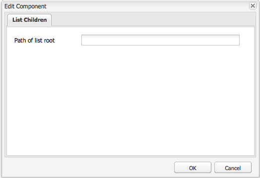

# 建立功能齊全的網站(JSP){#create-a-fully-featured-website-jsp}

>[!NOTE]
>
>本文介紹如何使用JSP和基於經典UI建立網站。 Adobe建議利用AEM您網站的最新技術，如文章中所述 [開發AEM Sites](/help/sites-developing/getting-started.md)。

本教程使您能夠與Adobe Experience Manager(AEM)一起建立功能齊全的網站。 該網站將基於一個通用網站，主要面向網路開發人員。 所有開發都將在一個作者的環境中進行。

本教程介紹如何：

1. 安裝AEM。
1. 訪問CRXDE Lite（開發環境）。
1. 在CRXDE Lite中設定項目結構。
1. 建立用作建立內容頁基礎的模板、元件和指令碼。
1. 為網站建立根頁，然後建立內容頁。
1. 建立以下元件以供您的頁面使用：

   * 上層導覽
   * 列出子項
   * 標誌
   * 影像
   * 文本影像
   * 搜尋

1. 包括各種基礎元件。

執行完所有步驟後，頁面將如下所示：


**下載最終結果**

要與本教程一起學習，而不是執行練習，請下載website-1.0.zip。 此檔案是包AEM含本教程結果的內容包。 使用 [包管理器](/help/sites-administering/package-manager.md) 將軟體包安裝到作者實例。

**注：** 安裝此軟體包將覆蓋您使用本教程建立的創作實例上的所有資源。

網站內容包

[取得檔案](assets/website-1_0.zip)

## 安裝Adobe Experience Manager {#installing-adobe-experience-manager}

要安裝用AEM於開發網站的實例，請按照設定 [部署環境，包括作者和發佈實例](/help/sites-deploying/deploy.md#author-and-publish-installs)，或執行 [通用安裝](/help/sites-deploying/deploy.md#default-local-install)。 常規安裝包括下載AEMQuickstart JAR檔案、將license.properties檔案放在與JAR檔案相同的目錄中，並按兩下JAR檔案。

安裝後，請AEM按一下「歡迎」頁上的CRXDE Lite連結訪問CRXDE Lite開發環境：


>[!NOTE]
>
>使用預設埠本AEM地安裝的創作實例的CRXDE LiteURL為 [https://localhost:4502/crx/de/](https://localhost:4502/crx/de/)。

### 在CRXDE Lite中設定項目結構 {#setting-up-the-project-structure-in-crxde-lite}

使用CRXDE Lite在儲存庫中建立myweb站點應用程式結構：

1. 在CRXDE Lite左側的樹中，按一下右鍵 **`/apps`** 資料夾，按一下 **建立** > **建立** **資料夾**。 在 **建立資料夾** 對話框，類型 `mywebsite` 資料夾名稱，然後按一下 **確定**。
1. 按一下右鍵 **`/apps/mywebsite`** 資料夾，按一下 **建立** > **建立資料夾**。 在 **建立資料夾** 對話框，類型 `components` 資料夾名稱，然後按一下 **確定**。
1. 按一下右鍵 **`/apps/mywebsite`** 資料夾，按一下 **建立** > **建立資料夾**。 在 **建立資料夾** 對話框，類型 `templates` 資料夾名稱，然後按一下 **確定**。

   現在樹上的結構應該是這樣的：

   

1. 按一下 **全部保存**。

### 設定設計 {#setting-up-the-design}

在本節中，使用設計器工具為應用程式建立設計。 該設計為您的網站提供CSS和影像資源。

>[!NOTE]
>
>按一下以下連結下載mywebise.zip。 存檔檔案包含用於您設計的static.css和影像檔案。

static.css檔案和影像示例

[取得檔案](assets/mywebsite.zip)

1. 在歡迎AEM頁面上，按一下 **工具**。 ([https://localhost:4502/libs/cq/core/content/welcome.html](https://localhost:4502/libs/cq/core/content/welcome.html))

   

1. 在資料夾樹中，選擇 **設計** 資料夾，然後按一下 **新建** > **新建頁面**。 類型 `mywebsite` 按鈕 **建立**。

1. 如果mywebsite項未出現在表中，請刷新樹或表。

1. [使用WebDAV](/help/sites-administering/webdav-access.md) 訪問https://localhost:4502上的URL，複製示例 `static.css` 檔案和 `images` 從下載的mywebise.zip檔案到 `/etc/designs/mywebsite` 的子菜單。

   

### 建立內容頁模板、元件和指令碼 {#creating-the-contentpage-template-component-and-script}

在本節中，您將建立以下內容：

* 用於在示例網站中建立內容頁的內容頁模板
* 用於呈現內容頁面的內容頁面元件
* 內容頁指令碼

#### 建立內容頁模板 {#creating-the-contentpage-template}

建立模板以用作網站網頁的基礎。

模板定義新頁面的預設內容。 複雜網站可能使用多個模板在網站中建立不同類型的頁面。 在本練習中，所有頁面都基於一個簡單模板。

1. 在CRXDE Lite的資料夾樹中，按一下右鍵 `/apps/mywebsite/templates` 按一下 **建立** > **建立模板**。

1. 在「建立模板」對話框中，鍵入以下值，然後按一下 **下一個**:

   * **標籤**:內容頁
   * **標題**:我的網站內容頁面模板
   * **說明**:這是我的網站內容頁面模板
   * **資源類型：** myweb站點/元件/內容頁

   使用Ranking屬性的預設值。

   

   資源類型標識呈現頁面的元件。 在這種情況下，使用內容頁模板建立的所有頁面由 `mywebsite/components/contentpage` 元件。

1. 要指定可使用此模板的頁的路徑，請按一下加號按鈕並鍵入 `/content(/.*)?` 的上界。 然後，按一下 **下一個**。

   

   允許的路徑屬性的值是 *規則運算式。* 具有與表達式匹配的路徑的頁可以使用模板。 在這種情況下，規則運算式與 **/內容** 資料夾和所有子頁。

   當作者在/content下建立頁面時， **內容頁** 模板將出現在可用模板清單中。

1. 按一下 **下一個** 的 **允許的父項** 和 **允許的子項** 面板，按一下 **確定**。 在CRXDE Lite中，按一下 **全部保存**。

   

#### 建立內容頁元件 {#creating-the-contentpage-component}

建立 *元件* 定義內容並呈現使用內容頁模板的頁面。 元件的位置必須與內容頁模板的「資源類型」屬性的值對應。

1. 在CRXDE Lite中，按一下右鍵 `/apps/mywebsite/components` 按一下 **建立** > **元件**。
1. 在 **建立元件** 對話框，鍵入以下屬性值：

   * **標籤**:內容頁
   * **標題**:「我的網站內容」頁面元件
   * **說明**:這是「我的網站內容」頁面元件

   

   新元件的位置是 `/apps/mywebsite/components/contentpage`。 此路徑與內容頁模板的資源類型(減去初始 **`/apps/`** 部分路徑)。

   此通信將模板連接到元件，對網站的正確運行至關重要。

1. 按一下 **下一個** 直到顯示對話框的「允許的子項」面板，然後按一下 **確定**。 在CRXDE Lite中，按一下 **全部保存**。

   現在的結構如下所示：

   

#### 開發Contentpage元件指令碼 {#developing-the-contentpage-component-script}

將代碼添加到contentpage.jsp指令碼以定義頁面內容。

1. 在CRXDE Lite中，開啟檔案 `contentpage.jsp` 在 `/apps/mywebsite/components/contentpage`。 預設情況下，檔案包含以下代碼：

   ```java
   <%--
   
     My Website Content Page Component component.
   
     This is My Website Content Page Component.
   
   --%><%
   %><%@include file="/libs/foundation/global.jsp"%><%
   %><%@page session="false" %><%
   %><%
       /* TODO add you code here */
   %>
   ```

1. 複製以下代碼，並在預設代碼後將其貼上到contentpage.jsp中：

   ```java
   <%@ page language="java" contentType="text/html; charset=ISO-8859-1"
       pageEncoding="ISO-8859-1"%>
   <!DOCTYPE html PUBLIC "-//W3C//DTD HTML 4.01 Transitional//EN"
   "https://www.w3.org/TR/html4/loose.dtd">
   <html>
   <head>
   <meta http-equiv="Content-Type" content="text/html; charset=ISO-8859-1">
   <title>My title</title>
   </head>
   <body>
   <div>My body</div>
   </body>
   </html>
   ```

1. 按一下 **全部保存** 的子菜單。

### 建立網站頁和內容頁 {#creating-your-website-page-and-content-pages}

在本節中，您將建立以下所有頁面都使用內容頁模板：我的網站、英文、產品、服務和客戶。

1. 在歡迎AEM頁([https://localhost:4502/libs/cq/core/content/welcome.html](https://localhost:4502/libs/cq/core/content/welcome.html))，按一下「Web站點」。

   

1. 在資料夾樹中，選擇 **網站** 資料夾，然後按一下 **新建** > **新建頁面**。
1. 在 **建立頁** 的子菜單。

   * 標題: `My Website`
   * 名稱: `mywebsite`
   * 選擇 `My Website Content Page Template`

   

1. 按一下&#x200B;**建立**。在資料夾樹中，選擇 **/網站/我的網站** 的 **新建** > **新建頁面**。
1. 在「建立頁」對話框中，輸入以下屬性值，然後按一下建立：

   * 標題：英語
   * 名稱：恩
   * 選擇「我的網站內容」頁面模板

1. 在資料夾樹中，選擇 **/網站/我的網站/英語** 的 **新建**> **新建頁面**。
1. 在 **建立頁** 對話框，輸入以下屬性值，然後按一下 **建立**:

   * 標題：產品
   * 選擇「我的網站內容」頁面模板

1. 在資料夾樹中，選擇 **/網站/我的網站/英語** 的 **新建** > **新建頁面**。
1. 在 **建立頁** 對話框，輸入以下屬性值，然後按一下 **建立**:

   * 標題：服務
   * 選擇「我的網站內容」頁面模板

1. 在資料夾樹中，選擇 **/網站/我的網站/英語** 的 **新建** > **新建頁面**。
1. 在 **建立頁** 對話框，輸入以下屬性值，然後按一下 **建立**:

   * 標題：客戶
   * 選擇「我的網站內容」頁面模板

   您的結構如下所示：

   

1. 要將您的頁面連結到mywebsite設計，請在CRXDE Lite中，選擇 `/content/mywebsite/en/jcr:content` 的下界。 在「屬性」頁籤上，為新屬性鍵入以下值，然後按一下「添加」：

   * 名稱：cq:designPath
   * 類型：字串
   * 值：/etc/designs/mywebse

   

1. 在新的Wb瀏覽器頁籤或窗口中，開啟 [https://localhost:4502/content/mywebsite/en/products.html](https://localhost:4502/content/mywebsite/en/products.html) 要查看「產品」頁：

   

### 增強內容頁指令碼 {#enhancing-the-contentpage-script}

本節介紹如何使用基礎元件指令碼和編寫AEM您自己的指令碼來增強內容頁指令碼。

的 **產品** 頁面顯示如下：


#### 使用Foundation頁指令碼 {#using-the-foundation-page-scripts}

在本練習中，您將配置頁內容元件，使其超類型為AEM頁元件。 由於元件繼承其超類型的功能，因此您的頁內容繼承了頁元件的指令碼和屬性。

例如，在元件JSP代碼中，可以引用超類型元件提供的指令碼，就好像這些指令碼包含在元件中一樣。

1. 在CRXDE Lite中，向 `/apps/mywebsite/components/contentpage` 的下界。

   1. 選擇 `/apps/mywebsite/components/contentpage` 的下界。
   1. 在「屬性」頁籤的底部，鍵入以下屬性值，然後按一下「添加」：

      * **名稱：** sling:resourceSuperType
      * **類型：** 字串
      * **值：** 基礎/元件/頁
   1. 按一下「全部保存」。


1. 開啟 `contentpage.jsp` 檔案 `/apps/mywebsite/components/contentpage` 並用以下代碼替換現有代碼：

   ```xml
   <%@include file="/libs/foundation/global.jsp"%><%
   %><%@page session="false" contentType="text/html; charset=utf-8" %><%
   %><!DOCTYPE HTML PUBLIC "-//W3C//DTD HTML 4.01//EN" "https://www.w3.org/TR/html4/strict.dtd">
   <html>
   <cq:include script="head.jsp"/>
   <cq:include script="body.jsp"/>
   </html>
   ```

1. 保存更改。
1. 在瀏覽器中，重新載入「產品」頁。 如下所示：

   

   開啟頁面源，查看head.jsp和body.jsp指令碼生成的javascript和HTML元素。 開啟頁面時，以下指令碼片段將開啟Sidek:

   ```java
   CQ.WCM.launchSidekick("/content/mywebsite/en/products",
               {propsDialog: "/libs/foundation/components/page/dialog",
                  locked: false locked: false
                });
   ```

#### 使用您自己的指令碼 {#using-your-own-scripts}

在本節中，您將建立多個指令碼，每個指令碼都生成頁體的一部分。 然後，在pagecontent元件中建立body.jsp檔案，以覆蓋Page元件的bodyAEM.jsp。 在body.jsp檔案中，包括生成頁面正文不同部分的指令碼。

**提示：** 當元件包含與元件超類型中的檔案具有相同名稱和相對位置的檔案時，該檔案稱為 *疊*。

1. 在CRXDE Lite中，建立檔案 `left.jsp` 在 `/apps/mywebsite/components/contentpage`:

   1. 按一下右鍵節點 `/apps/mywebsite/components/contentpage`，然後選擇**建立**, **建立檔案**。

   1. 在窗口中，鍵入 `left.jsp` 的 **名稱** 按一下 **確定**。

1. 編輯檔案 `left.jsp` 刪除現有內容並替換為以下代碼：

   ```java
   <%@include file="/libs/foundation/global.jsp"%><%
   %><div class="left">
   <div>logo</div>
   <div>newslist</div>
   <div>search</div>
   </div>
   ```

1. 儲存變更。
1. 在CRXDE Lite中，建立檔案 `center.jsp` 在 `/apps/mywebsite/components/contentpage`:

   1. 按一下右鍵節點 `/apps/mywebsite/components/contentpage`選中 **建立**，則 **建立檔案**。

   1. 在對話框中，鍵入 `center.jsp` 如 **名稱** 按一下 **確定**。

1. 編輯檔案 `center.jsp` 刪除現有內容並用以下代碼替換：

   ```java
   <%@include file="/libs/foundation/global.jsp"%><%
   %><div class="center">
   <div>trail</div>
   <div>title</div>
   <div>parsys</div>
   </div>
   ```

1. 儲存變更。
1. 在CRXDE Lite中，建立檔案 `right.jsp` 在 `/apps/mywebsite/components/contentpage`:

   1. 按一下右鍵節點 `/apps/mywebsite/components/contentpage`選中 **建立**，則 **建立檔案**。

   1. 在對話框中，鍵入 `right.jsp` 如 **名稱** 按一下 **確定**。

1. 編輯檔案 `right.jsp` 刪除現有內容並替換為以下代碼：

   ```java
   <%@include file="/libs/foundation/global.jsp"%><%
   %><div class="right">
   <div>iparsys</div>
   </div>
   ```

1. 儲存變更。
1. 在CRXDE Lite中，建立檔案 `body.jsp` 在 `/apps/mywebsite/components/contentpage`:
1. 編輯檔案 `body.jsp` 刪除現有內容並替換為以下代碼：

   ```java
   <%@include file="/libs/foundation/global.jsp"%><%
   %><body>
   <div id="CQ">
   <div class="topnav">topnav</div>
   <div class="content">
   <cq:include script="left.jsp" />
   <cq:include script="center.jsp" />
   <cq:include script="right.jsp" />
   </div>
   <div class="footer">
   <div class="toolbar">toolbar</div>
   </div>
   </div>
   </body>
   ```

1. 儲存變更。
1. 在瀏覽器中，重新載入「產品」頁。 如下所示：

   

### 建立頂部導航元件 {#creating-the-top-navigation-component}

在本節中，您將建立一個元件，該元件顯示指向網站所有頂級頁面的連結以便輕鬆導航。 此元件內容顯示在使用內容頁模板建立的所有頁面的頂部。

在頂部導航元件（頂部導航）的第一個版本中，導航項目僅是文本連結。 在第二版中，您使用影像導航連結實現topnav。

您的頂部導航如下所示：


#### 建立頂部導航元件 {#creating-the-top-navigation-component-1}

1. 在CRXDE Lite中，按一下右鍵 `/apps/mywebsite/components`選中 **建立**，則 **建立元件**。
1. 在 **建立元件** 的子菜單。

   * **標籤**: `topnav`

   * **標題**: `My Top Navigation Component`

   * **說明**: `This is My Top Navigation Component`

1. 按一下 **下一個** 直到您到達按一下 **確定**。 保存更改。

#### 使用文本連結建立頂部導航指令碼 {#creating-the-top-navigation-script-with-textual-links}

將渲染指令碼添加到topnav以生成指向子頁面的文本連結：

1. 在CRXDE Lite中，開啟檔案 `topnav.jsp` 在 `/apps/mywebsite/components/topnav`。
1. 通過複製和貼上以下代碼來替換該代碼：

   ```xml
   <%@include file="/libs/foundation/global.jsp"%><%
   %><%@ page import="java.util.Iterator,
           com.day.text.Text,
           com.day.cq.wcm.api.PageFilter, com.day.cq.wcm.api.Page" %><%
       /* get starting point of navigation */
       Page navRootPage = currentPage.getAbsoluteParent(2);
       if (navRootPage == null && currentPage != null) {
       navRootPage = currentPage;
       }
       if (navRootPage != null) {
           Iterator<Page> children = navRootPage.listChildren(new PageFilter(request));
           while (children.hasNext()) {
               Page child = children.next();
               %><a href="<%= child.getPath() %>.html"><%=child.getTitle() %></a><%
           }
       }
   %>
   ```

#### 在「內容」頁元件中包括頂部導航 {#including-top-navigation-in-the-contentpage-component}

要在內容頁元件中包含topnav:

1. 在CRXDE Lite中，開啟 `body.jsp` 在 `/apps/mywebsite/components/contentpage`和替換：

   ```xml
   <div class="topnav">topnav</div>
   ```

   替換為:

   ```xml
   <cq:include path="topnav" resourceType="mywebsite/components/topnav" />
   ```

1. 儲存變更。
1. 在瀏覽器中，重新載入「產品」頁。 頂部導航如下所示：

   

#### 利用字幕增強頁面 {#enhancing-pages-with-subtitles}

「頁面」元件定義了允許您為頁面提供字幕的屬性。 添加提供有關頁面內容資訊的字幕。

1. 在瀏覽器中，開啟 **產品** 的子菜單。
1. 《在幫派》 **頁面** 按鈕 **頁面屬性**。
1. 在對話框的「基本」(Basic)頁籤上，展開 **更多標題和說明，** 和 **副標題** 屬性，類型 **我們做什麼**。 按一下&#x200B;**「確定」**。
1. 重複上述步驟以添加副標題 **關於我們的服務** 到 **服務** 的子菜單。
1. 重複上述步驟以添加副標題 **我們贏得的信任** 到 **客戶** 的子菜單。

   **提示：** 在CRXDE Lite中，選擇/content/mywebite/en/products/jcr:content節點，以查看是否添加了副標題屬性。

#### 使用影像連結增強頂部導航 {#enhance-top-navigation-by-using-image-links}

增強topnav元件的呈現指令碼，以使用影像連結而不是超文本來導航控制項。 該影像包括連結目標的標題和字幕。

本練習證明 [吊索請求處理](/help/sites-developing/the-basics.md#sling-request-processing)。 topnav.jsp指令碼被修改為調用動態生成用於頁面導航連結的影像的指令碼。 在本練習中，Sling會解析影像源檔案的URL，以確定用於呈現影像的指令碼。

例如，指向「產品」頁的影像連結的源可以是https://localhost:4502/content/mywebsite/en/products.navimage.png。 Sling解析此URL以確定資源類型和用於呈現資源的指令碼：

1. Sling確定要執行的資源路徑 `/content/mwebysite/en/products.png.`
1. Sling將此路徑與 `/content/mywebsite/en/products` 的下界。
1. 吊具確定 `sling:resourceType` 的 `mywebsite/components/contentpage`。

1. Sling在此元件中查找與URL選擇器最匹配的指令碼( `navimage`)和檔案名副檔名( `png`)。

在本練習中，Sling將這些URL與您建立的/apps/mywebsite/components/contentpage/navimage.png.java指令碼匹配。

1. 在CRXDE Lite中，開啟 `topnav.jsp` 在 `/apps/mywebsite/components/topnav.`找到錨點元素的內容（第14行）:

   ```xml
   <%=child.getTitle() %>
   ```

1. 使用以下代碼替換錨點內容：

   ```xml
   " src="<%= child.getPath() %>.navimage.png">
   ```

1. 儲存變更。
1. 按一下右鍵 `/apps/mywebsite/components/contentpage` 按一下 **建立** > **建立檔案**。
1. 在 **建立檔案** 窗口，如 **名稱**&#x200B;鍵 `navimage.png.java`。

   .java檔案副檔名指示Sling應使用Apache Sling指令碼Java支援來編譯指令碼並建立Servlet。

1. 將以下代碼複製到 `navimage.png.java.`該代碼擴展了AbstractImageServlet類：

   * [摘要ImageServlet](https://helpx.adobe.com/experience-manager/6-5/sites/developing/using/reference-materials/javadoc/com/day/cq/wcm/commons/AbstractImageServlet.html) 建立儲存當前資源屬性的ImageContext對象。
   * 資源的父頁會從ImageContext對象中提取。 然後獲得頁標題和字幕。
   * [ImageHelper](https://helpx.adobe.com/experience-manager/6-5/sites/developing/using/reference-materials/javadoc/com/day/cq/commons/ImageHelper.html) 用於從網站設計的navimagebg.jpg檔案、頁面標題和頁面副標題生成影像。

   ```java
   package apps.mywebsite.components.contentpage;
   
   import java.awt.Color;
   import java.awt.Paint;
   import java.awt.geom.Rectangle2D;
   
   import java.io.IOException;
   import javax.jcr.RepositoryException;
   
   import com.day.cq.wcm.api.Page;
   import com.day.cq.wcm.api.PageManager;
   import com.day.cq.wcm.api.components.Component;
   import com.day.cq.wcm.api.designer.Designer;
   
   import com.day.cq.commons.SlingRepositoryException;
   import com.day.cq.wcm.commons.WCMUtils;
   import com.day.cq.wcm.commons.AbstractImageServlet;
   import com.day.cq.commons.ImageHelper;
   
   import com.day.image.Font;
   import com.day.image.Layer;
   
   import org.apache.sling.api.SlingHttpServletRequest;
   import org.apache.sling.api.SlingHttpServletResponse;
   import org.apache.sling.api.resource.Resource;
   import org.apache.sling.api.servlets.SlingSafeMethodsServlet;
   
   /**
     * Renders the navigation image
     */
   public class navimage_png extends AbstractImageServlet {
   
         protected Layer createLayer(ImageContext ctx)
                throws RepositoryException, IOException {
            PageManager pageManager = ctx.resolver.adaptTo(PageManager.class);
            Page currentPage = pageManager.getContainingPage(ctx.resource);
   
            /* constants for image appearance */
            int scale = 6;
            int paddingX = 24;
            int paddingY = 24;
            Color bgColor = new Color(0x004a565c, true);
   
            /* obtain the page title */
            String title = currentPage.getTitle();
            if (title == null) {
                title = currentPage.getName();
            }
   
            /* format the title text */
            title = title.toUpperCase();
            Paint titleColor = Color.WHITE;
            Font titleFont = new Font("Myriad Pro", 10 * scale, Font.BOLD);
            int titleBase = 10 * scale;
   
            /* obtain and format the page subtitle */
            String subtitle = currentPage.getProperties().get("subtitle", "");
            Paint subtitleColor = new Color(0xffa9afb1, true);
            Font subTitleFont = new Font("Tahoma", 7);
            int subTitleBase = 20;
   
            /* create a layer that contains the background image from the mywebsite design */
            Designer dg = ctx.resolver.adaptTo(Designer.class);
            String imgPath = new String(dg.getDesignPath(currentPage)+"/images/navimage_bg.jpg");
            Layer bg = ImageHelper.createLayer(ctx.resolver.resolve(imgPath));
   
            /* draw the title text (4 times bigger) */
            Rectangle2D titleExtent = titleFont.getTextExtent(0, 0, 0, 0, title, Font.ALIGN_LEFT, 0, 0);
            Rectangle2D subtitleExtent = subTitleFont.getTextExtent(0, 0, 0, 0, subtitle, Font.ALIGN_LEFT, 0, 0);
   
            /* ensure subtitleExtent is wide enough */
            if ( subtitle.length() > 0 ) {
                int titleWidth = (int)titleExtent.getWidth() / scale;
                if ( subtitleExtent.getWidth() > titleWidth && subtitleExtent.getWidth() + 2 * paddingX >
    bg.getWidth() ) {
                    int charWidth = (int)subtitleExtent.getWidth() / subtitle.length();
                    int maxWidth = (bg.getWidth() > titleWidth + 2  * paddingX ? bg.getWidth() - 2 * paddingX : titleWidth);
                    int len = (maxWidth - ( 2 * charWidth) ) / charWidth;
                    subtitle = subtitle.substring(0, len) + "...";
                    subtitleExtent = subTitleFont.getTextExtent(0, 0, 0, 0, subtitle, Font.ALIGN_LEFT, 0, 0);
                }
            }
            int width = Math.max((int) titleExtent.getWidth(), (int) subtitleExtent.getWidth());
           /* create the text layer */
            Layer text = new Layer(width, (int) titleExtent.getHeight() + 40, new Color(0x01ffffff, true));
            text.setPaint(titleColor);
            text.drawText(0, titleBase, 0, 0, title, titleFont, Font.ALIGN_LEFT | Font.ALIGN_BASE, 0, 0);
            text.resize(text.getWidth() / scale, text.getHeight() / scale);
            text.setX(0);
            text.setY(0);
   
            if (subtitle.length() > 0) {
                /* draw the subtitle normal sized */
                text.setPaint(subtitleColor);
                text.drawText(0, subTitleBase, 0, 0, subtitle, subTitleFont, Font.ALIGN_LEFT | Font.ALIGN_BASE, 0, 0);
            }
   
            /* merge the image and text layers */
            text.setY(paddingY);
            text.setX(paddingX);
            text.setBackgroundColor(bgColor);
   
            int bgWidth = bg.getWidth();
            if ( text.getWidth() + 2 * paddingX > bgWidth ) {
                bgWidth = text.getWidth() + 2 * paddingX;
                bg.resize(bgWidth, bg.getHeight());
            }
            bg.merge(text);
   
            return bg;
        }
    }
   ```

1. 儲存變更。
1. 在瀏覽器中，重新載入「產品」頁。 現在，頂部導航如下所示：

   

### 建立清單子元件 {#creating-the-list-children-component}

建立清單子元件，該元件生成包含頁標題、說明和日期的頁連結清單（例如，產品頁）。 這些連結針對當前頁或元件對話框中指定的根頁的子頁。


#### 建立產品頁 {#creating-product-pages}

建立位於「產品」頁下方的兩頁。 對於每個描述兩個特定產品的頁面，您可以設定標題、說明和日期。

1. 在「網站」頁面的資料夾樹中，選擇「網站」/「我的網站」/「英語」/「產品」項目，然後按一下「新建」>「新建頁面」。
1. 在對話框中輸入以下屬性值，然後按一下建立：

   * 標題：產品1。
   * 名稱：產品1。
   * 選擇我的網站內容頁面模板

1. 使用以下屬性值在「產品」下建立另一頁：

   * 標題：產品2
   * 名稱：產品2
   * 選擇我的網站內容頁面模板

1. 在CRXDE Lite中，為「產品1」頁設定說明和日期：

   1. 選擇 `/content/mywebsite/en/products/product1/jcr:content` 的下界。
   1. 在 **屬性** 頁籤中，輸入以下值：

      * 名稱: `jcr:description`
      * 類型: `String`
      * 值: `This is a description of the Product 1!.`
   1. 按一下 **添加**。
   1. 在 **屬性** 頁籤，使用以下值建立另一個屬性：

      * 名稱：日期
      * 類型：字串
      * 值：02/14/2008
      * 按一下「添加」。
   1. 按一下「全部保存」。


1. 在CRXDE Lite中，為「產品2」頁設定說明和日期：

   1. 選擇/content/mywebise/en/products/product2/jcr:content節點。
   1. 在 **屬性** 頁籤中，輸入以下值：

      * 名稱：jcr：說明
      * 類型：字串
      * 值：這是產品2！的說明。
   1. 按一下 **添加**。
   1. 在同一文本框中，用以下值替換以前的值：

      * 名稱：日期
      * 類型：字串
      * 值：05/11/2012
      * 按一下「添加」。
   1. 按一下「全部保存」。


#### 建立清單子元件 {#creating-the-list-children-component-1}

要建立清單子元件：

1. 在CRXDE Lite中，按一下右鍵 `/apps/mywebsite/components`選中 **建立**，則 **建立元件**。
1. 在對話框中輸入以下屬性值，然後按一下「下一步」：

   * 標籤：清單子項。
   * 標題：我的清單子項元件。
   * 描述：這是我的清單子項元件。

1. 繼續按一下「下一步」，直到出現「允許的子項」面板，然後按一下「確定」。

#### 建立清單子指令碼 {#creating-the-list-children-script}

開發清單子項元件的指令碼。

1. 在CRXDE Lite中，開啟檔案 `listchildren.jsp` 在 `/apps/mywebsite/components/listchildren`。
1. 將預設代碼替換為以下代碼：

   ```xml
   <%@include file="/libs/foundation/global.jsp"%><%
   %><%@ page import="java.util.Iterator,
            com.day.cq.wcm.api.PageFilter"%><%
        /* Create a new Page object using the path of the current page */
         String listroot = properties.get("listroot", currentPage.getPath());
        Page rootPage = pageManager.getPage(listroot);
        /* iterate through the child pages and gather properties */
        if (rootPage != null) {
            Iterator<Page> children = rootPage.listChildren(new PageFilter(request));
            while (children.hasNext()) {
                Page child = children.next();
                String title = child.getTitle() == null ? child.getName() : child.getTitle();
                String date = child.getProperties().get("date","");
                %><div class="item">
                <a href="<%= child.getPath() %>.html"><b><%= title %></b></a>
                <span><%= date %></code><br>
                <%= child.getProperties().get("jcr:description","") %><br>
                </div><%
            }
        }
    %>
   ```

1. 儲存變更。

#### 建立清單子項對話框 {#creating-the-list-children-dialog}

建立用於配置清單子元件屬性的對話框。

1. 在listchildren元件下建立對話框節點：

   1. 在CRXDE Lite中，按一下右鍵 `/apps/mywebsite/components/listchildren`按一下 **建立** > **建立對話框**。

   1. 在對話框中，輸入以下屬性值，然後按一下確定

      * **標籤**: `dialog`

      * **標題**: `Edit Component` 按一下 **確定**。

   

   具有以下屬性：

   

1. 選擇 `/apps/mywebsite/components/listchildren/dialog/items/items/tab1` 的下界。
1. 在「屬性」頁籤中，更改 **標題** 屬性 `List Children`

   

1. 選擇tab1節點，然後按一下「建立」>「建立節點」，輸入以下屬性值，然後按一下「確定」：

   * 名稱：項目
   * 類型：cq:WidgetCollection

   

1. 使用以下屬性值在項目節點下建立節點：

   * 名稱：利斯特羅
   * 類型：cq：小部件

   

1. 為listroot節點添加屬性以將其配置為文本欄位。 下表中的每一行都表示一個屬性。 完成後，按一下「全部保存」。

   | 名稱 | 類型 | 值 |
   |---|---|---|
   | 欄位標籤 | 字串 | 清單根的路徑 |
   | 名稱 | 字串 | ./listroot |
   | x類型 | 字串 | 文本欄位 |

   

#### 在「內容」頁元件中包括清單子項 {#including-list-children-in-the-contentpage-component}

要在內容頁元件中包括清單子元件，請按如下步驟進行：

1. 在CRXDE Lite中，開啟檔案 `left.jsp` 在 `/apps/mywebsite/components/contentpage` 並找到以下代碼（第4行）:

   ```xml
   <div>newslist</div>
   ```

1. 將該代碼替換為以下代碼：

   ```xml
   <cq:include path="newslist" resourceType="mywebsite/components/listchildren" />
   ```

1. 儲存變更。

#### 查看頁面中的清單子項 {#viewing-list-children-in-a-page}

要查看此元件的完整操作，您可以查看「產品」頁：

* 父頁（「清單根的路徑」）未定義時。
* 定義父頁（「清單根路徑」）時。

1. 在瀏覽器中，重新載入「產品」頁。 清單子元件如下所示：

   

1. 

1. 作為清單根的路徑，輸入： `/content/mywebsite/en`。 按一下「確定」。您頁面上的清單子元件現在如下所示：

   

### 建立徽標元件 {#creating-the-logo-component}

建立顯示公司徽標的元件並提供指向網站首頁的連結。 該元件包含一個設計模式對話框，以便將屬性值儲存在站點設計(/etc/designs/mywebite)中：

* 屬性值適用於添加到使用設計的頁面的元件的所有實例。
* 可以使用使用設計的頁面上的元件的任何實例配置屬性。

設計模式對話框包含用於設定影像和連結路徑的屬性。 徽標元件將放置在網站中所有頁面的左上側。

將如下所示：


>[!NOTE]
>
>Adobe Experience Manager提供功能更全的徽標元件( `/libs/foundation/components/logo`)。

#### 建立徽標元件節點 {#creating-the-logo-component-node}

要建立徽標元件，請執行以下步驟：

1. 在CRXDE Lite中，按一下右鍵/apps/mywebise/components，選擇 **建立**，則 **建立元件**。
1. 在「建立元件」對話框中輸入以下屬性值，然後按一下「下一步」：

   * 標籤: `logo`.
   * 標題: `My Logo Component`.
   * 說明: `This is My Logo Component`.

1. 按一下「下一步」，直到到達對話框的最終面板，然後按一下 **確定**。

#### 建立徽標指令碼 {#creating-the-logo-script}

本節介紹如何建立指令碼以顯示帶有指向首頁的連結的徽標影像。

1. 在CRXDE Lite中，開啟檔案 `logo.jsp` 在 `/apps/mywebsite/components/logo`。
1. 以下代碼將建立指向網站首頁的連結，並添加對徽標影像的引用。 將代碼複製到 `logo.jsp`:

   ```xml
   <%@include file="/libs/foundation/global.jsp"%><%
   %><%@ page import="com.day.text.Text,
                      com.day.cq.wcm.foundation.Image,
                      com.day.cq.commons.Doctype" %><%
       /* obtain the path for home */
       long absParent = currentStyle.get("absParent", 2L);
       String home = Text.getAbsoluteParent(currentPage.getPath(), (int) absParent);
       /* obtain the image */
       Resource res = currentStyle.getDefiningResource("imageReference");
       if (res == null) {
           res = currentStyle.getDefiningResource("image");
       }
       /* if no image use text link, otherwise draw the image */
       %>
   <a href="<%= home %>.html"><%
       if (res == null) {
           %>Home<%
       } else {
           Image img = new Image(res);
           img.setItemName(Image.NN_FILE, "image");
           img.setItemName(Image.PN_REFERENCE, "imageReference");
           img.setSelector("img");
           img.setDoctype(Doctype.fromRequest(request));
           img.setAlt("Home");
           img.draw(out);
       }
       %></a>
   ```

1. 儲存變更。

#### 建立徽標設計對話框 {#creating-the-logo-design-dialog}

在「設計」模式下建立用於配置徽標元件的對話框。 必須命名設計模式對話框節點 `design_dialog`。

1. 在徽標元件下建立對話框節點：

   1. 按一下右鍵 `/apps/mywebsite/components/logo` 按一下 **建立** > **建立對話框**。

   1. 鍵入以下屬性值，然後按一下「確定」：

      * **標籤：** `design_dialog`

      * **標題:** `Logo (Design)`

1. 按一下右鍵design_dialog分支中的tab1節點，然後按一下「刪除」(Delete)。 按一下「全部保存」。
1. 在 `design_dialog/items/items`節點，建立名為 `img` 類型 `cq:Widget`。 添加以下屬性，然後按一下「全部保存」：

   | 名稱 | 類型 | 值 |
   |---|---|---|
   | fileNameParameter | 字串 | ./imageName |
   | fileReferenceParameter | 字串 | ./imageReference |
   | 名稱 | 字串 | ./影像 |
   | 標題 | 字串 | 影像 |
   | x類型 | 字串 | html5smartimage |

   

#### 建立徽標渲染指令碼 {#creating-the-logo-render-script}

建立檢索徽標影像並將其寫入頁面的指令碼。

1. 按一下右鍵徽標元件節點，然後按一下「建立」(Create)>「建立檔案」(Create File)以建立名為img.GET.java的指令碼檔案。
1. 開啟檔案，將以下代碼複製到檔案中，然後按一下「全部保存」：

```java
package apps.mywebsite.components.logo;

import java.io.IOException;
import java.io.InputStream;

import javax.jcr.RepositoryException;
import javax.jcr.Property;
import javax.servlet.http.HttpServletResponse;

import com.day.cq.wcm.foundation.Image;
import com.day.cq.wcm.commons.RequestHelper;
import com.day.cq.wcm.commons.WCMUtils;
import com.day.cq.wcm.commons.AbstractImageServlet;
import com.day.cq.commons.SlingRepositoryException;
import com.day.image.Layer;
import org.apache.commons.io.IOUtils;
import org.apache.sling.api.SlingHttpServletRequest;
import org.apache.sling.api.SlingHttpServletResponse;
import org.apache.sling.api.resource.Resource;
import org.apache.sling.api.resource.ValueMap;
import org.apache.sling.api.servlets.SlingSafeMethodsServlet;

/**
 * Renders an image
 */
public class img_GET extends AbstractImageServlet {

    protected Layer createLayer(ImageContext c)
            throws RepositoryException, IOException {
        /* don't create the layer yet. handle everything later */
        return null;
    }

    protected void writeLayer(SlingHttpServletRequest req,
                              SlingHttpServletResponse resp,
                              ImageContext c, Layer layer)
            throws IOException, RepositoryException {

        Image image = new Image(c.resource);
        image.setItemName(Image.NN_FILE, "image");
        image.setItemName(Image.PN_REFERENCE, "imageReference");
        if (!image.hasContent()) {
            resp.sendError(HttpServletResponse.SC_NOT_FOUND);
            return;
        }
        /* get pure layer */
        layer = image.getLayer(false, false, false);

        /* do not re-encode layer, just spool */
        Property data = image.getData();
        InputStream in = data.getStream();
        resp.setContentLength((int) data.getLength());
        String contentType = image.getMimeType();
        if (contentType.equals("application/octet-stream")) {
            contentType=c.requestImageType;
        }
        resp.setContentType(contentType);
        IOUtils.copy(in, resp.getOutputStream());
        in.close();

        resp.flushBuffer();
    }
}
```

#### 將徽標元件添加到內容頁元件 {#adding-the-logo-component-to-the-contentpage-component}

1. 在CRXDE Lite中，開啟 `left.jsp` 在 `/apps/mywebsite/components/contentpage file` 並找到以下代碼行：

   ```xml
   <div>logo</div>
   ```

1. 將該代碼替換為以下代碼行：

   ```xml
   <cq:include path="logo" resourceType="mywebsite/components/logo" />
   ```

1. 儲存變更。
1. 在瀏覽器中，重新載入「產品」頁。 徽標如下所示，儘管當前它僅顯示底層連結：

   

#### 在頁面中設定徽標影像 {#setting-the-logo-image-in-a-page}

本節介紹如何使用設計模式對話框將影像設定為徽標。

1. 在瀏覽器中開啟「產品」(Products)頁面時，按一下Sidekick底部的「設計」(Design)按鈕進入設計模式。

   

1. 在徽標欄的「設計」中，按一下「編輯」以使用對話框編輯徽標元件的設定。
1. 在對話框中，按一下「影像」頁籤的面板，瀏覽從mywebise.zip檔案提取的logo.png影像，然後按一下「確定」。

   

1. 按一下「側腳標題」欄上的三角形以返回「編輯」模式。

   

1. 在CRXDE Lite中，轉到以下節點以查看儲存的屬性值：

   `/etc/designs/mywebsite/jcr:content/contentpage/logo`

### 包括Breadcrumb元件 {#including-the-breadcrumb-component}

在本節中，您將包括breadcrumb(trail)元件，它是基礎元件之一。

1. 在CRXDE Lite中，瀏覽到 `/apps/mywebsite/components/contentpage`，開啟檔案 `center.jsp` 和替換：

   ```java
   <div>trail</div>
   ```

   替換為:

   ```xml
   <cq:include path="trail" resourceType="foundation/components/breadcrumb" />
   ```

1. 儲存變更。
1. 在瀏覽器中，重新載入 **產品1** 的子菜單。 跟蹤元件如下所示：

   

### 包括標題元件 {#including-the-title-component}

在本節中，您包括標題元件，它是基礎元件之一。

1. 在CRXDE Lite中，瀏覽到 `/apps/mywebsite/components/contentpage`，開啟檔案 `center.jsp` 和替換：

   ```xml
   <div>title</div>
   ```

   替換為:

   ```xml
   <cq:include path="title" resourceType="foundation/components/title" />
   ```

1. 儲存變更。
1. 在瀏覽器中，重新載入「產品」頁。 標題元件如下所示：

   

   **注釋**:可以在編輯模式下設定不同的「標題」(Title)和「類型/大小」(Type/Size)。

### 包括段落系統元件 {#including-the-paragraph-system-component}

段落系統(parsys)是網站的重要部分，因為它管理著一個段落清單。 它使作者能夠向頁面添加段落元件並提供結構。

將parsys元件（基礎元件之一）添加到內容頁元件。

1. 在CRXDE Lite中，瀏覽到 `/apps/mywebsite/components/contentpage`，開啟檔案 `center.jsp` 並找到以下代碼行：

   ```xml
   <div>parsys</div>
   ```

1. 用以下代碼替換該代碼行，然後保存更改：

   ```xml
   <cq:include path="par" resourceType="foundation/components/parsys" />
   ```

1. 在瀏覽器中，刷新「產品」頁。 它現在具有parsys元件，如下所示：

   

### 建立影像元件 {#creating-the-image-component}

建立在段落系統中顯示影像的元件。 為節省時間，將建立影像元件作為徽標元件的副本，並更改某些屬性。

>[!NOTE]
>
>Adobe Experience Manager提供功能更全的影像元件( `/libs/foundation/components/image`)。

#### 建立影像元件 {#creating-the-image-component-1}

1. 按一下右鍵 `/apps/mywebsite/components/logo` ，然後按一下「複製」。
1. 按一下右鍵 `/apps/mywebsite/components` ，然後按一下「貼上」。
1. 按一下右鍵 `Copy of logo` 節點，按一下更名，刪除現有文本和類型 `image`。

1. 選擇 `image` 元件節點，並更改以下屬性值：

   * `jcr:title:` 我的映像元件。
   * `jcr:description`:這是我的映像元件。

1. 將屬性添加到 `image` 具有以下屬性值的節點：

   * 名稱：元件組
   * 類型：字串
   * 值：我的網站

1. 在 `image` 節點，更名 `design_dialog` 節點到 `dialog`。

1. 更名 `logo.jsp` 至 `image.jsp.`

1. 開啟img.GET.java並將包更改為 `apps.mywebsite.components.image`。


#### 建立映像指令碼 {#creating-the-image-script}

本節介紹如何建立影像指令碼。

1. 開啟 `/apps/mywebsite/components/image/` `image.jsp`
1. 將現有代碼替換為以下代碼，然後保存更改：

   ```xml
   <%@include file="/libs/foundation/global.jsp"%><%
   %><%@ page import="com.day.cq.commons.Doctype,
                       com.day.cq.wcm.foundation.Image,
                       com.day.cq.wcm.api.components.DropTarget,
                       com.day.cq.wcm.api.components.EditConfig,
                       com.day.cq.wcm.commons.WCMUtils" %><%
    /* global.jsp provides access to the current resource through the resource object */
           Image img = new Image(resource);
           img.setItemName(Image.NN_FILE, "image");
           img.setItemName(Image.PN_REFERENCE, "imageReference");
           img.setSelector("img");
           img.setDoctype(Doctype.fromRequest(request));
           img.setAlt("Home");
           img.draw(out); %>
   ```

1. 儲存變更。

#### 建立映像cq:editConfig節點 {#creating-the-image-cq-editconfig-node}

的 `cq:editConfig` 節點類型允許您在編輯元件的屬性時配置元件的某些行為。

在本節中，使用cq:editConfig節點可以將資源從Content Finder拖動到映像元件中。

1. 在CRXDE Lite中，在節點/apps/mywebise/components/image下，按如下方式建立新節點：

   * 名稱：cq:editConfig。
   * 類型：cq：編輯配置。

1. 在節點cq:editConfig下，按如下方式建立新節點：

   * 名稱：cq:dropTargets。
   * 類型：cq:DropTargetConfig。

1. 在節點cq:dropTargets下，按如下方式建立新節點：

   * 名稱：影像。
   * 類型：nt：非結構化。

1. 在CRXDE中，按如下方式設定屬性：

| 名稱 | 類型 | 值 |
|---|---|---|
| 接受 | 字串 | 影像/(gif) | jpeg | PNG) |
| 個群組 | 字串 | 媒體 |
| 屬性名稱 | 字串 | ./imageReference |


#### 添加表徵圖 {#adding-the-icon}

在本節中，在影像元件列在Sidekick中時，將添加該表徵圖以顯示在該影像元件旁邊：

1. 在CRXDE Lite中，按一下右鍵檔案 `/libs/foundation/components/image/icon.png` 選擇 **收到。**
1. 按一下右鍵節點 `/apps/mywebsite/components/image` 按一下 **貼上**，然後按一下 **全部保存**。

#### 使用影像元件 {#using-the-image-component}

在本節中，您將查看 **產品** 將影像元件添加到段落系統中。

1. 在瀏覽器中，重新載入 **產品** 的子菜單。
1. 在Sidekick中，按一下 **設計模式** 表徵圖
1. 按一下「編輯」(Edit)按鈕編輯par的設計對話框。
1. 在對話框中， **允許的元件** 顯示；導航 **我的網站**，選擇 **我的映像元件** 按一下 **好。**
1. 返回到 **編輯模式。**
1. 按兩下parsys框架(在 **將元件或資產拖到此處**)。 的 **插入新元件** 和 **側腳** 選擇器如下所示：

   

### 包括工具欄元件 {#including-the-toolbar-component}

在本節中，您包括工具欄元件，它是基礎元件之一。

在編輯模式和設計模式下，您有多個選項。

1. 在CRXDE Lite中，導航到 `/apps/mywebsite/components/contentpage`，開啟 `body.jsp` 並找到以下代碼：

   ```java
   <div class="toolbar">toolbar</div>
   ```

1. 用以下代碼替換該代碼，然後保存更改。

   ```java
   <cq:include path="toolbar" resourceType="foundation/components/toolbar"/>
   ```

1. 在「網站」頁面的資料夾樹AEM中，選擇「網站」/「我的網站」/「英語」，然後按一下「新建」>「新建頁面」。 指定以下屬性值，然後按一下建立：

   * 標題：工具欄
   * 選擇我的網站內容頁面模板

1. 在頁面清單中，按一下右鍵工具欄頁面，然後按一下屬性。 選擇「在導航中隱藏」，然後按一下「確定」。

   「在導航中隱藏」(Hide in Navigation)選項可防止頁面出現在導航元件中，如topnav和listchildren。

1. 在工具欄下，建立以下頁面：

   * 聯繫人
   * 反饋
   * 登入
   * 搜尋

1. 在瀏覽器中，重新載入「產品」頁。 如下所示：

   

### 建立搜索元件 {#creating-the-search-component}

在本節中，您將建立元件以搜索網站上的內容。 此搜索元件可放置在任何頁面的段落系統中（例如，在專用搜索結果頁面上）。

您的搜索輸入框在 **英語** 頁：


#### 建立搜索元件 {#creating-the-search-component-1}

1. 在CRXDE Lite中，按一下右鍵 `/apps/mywebsite/components`選中 **建立**，則 **建立元件**。
1. 使用該對話框配置元件：

   1. 第一個面板，指定以下屬性值：

      * 標籤：搜索
      * 標題：我的搜索元件
      * 描述：這是我的搜索元件
      * 組：我的網站
   1. 按一下「Next（下一步）」 ，然後再次按一下「Next（下一步）」。
   1. 在「允許的父項」面板上，按一下+按鈕並鍵入 `*/parsys`。
   1. 按一下「Next（下一步）」 ，然後按一下「OK（確定）」。


1. 按一下「全部保存」。
1. 複製以下節點並將它們貼上到apps/mywebise/components/search節點：

   * `/libs/foundation/components/search/dialog`
   * `` `/libs/foundation/components/search/i18n`

   * `/libs/foundation/components/search/icon.png`

1. 按一下「全部保存」。

#### 建立搜索指令碼 {#creating-the-search-script}

本節介紹如何建立搜索指令碼：

1. 開啟 `/apps/mywebsite/components/search/search.jsp` 的子菜單。
1. 將以下代碼複製到 `search.jsp`:

   ```java
   <%@ page import="com.day.cq.wcm.foundation.Search,com.day.cq.tagging.TagManager" %>
   <%@include file="/libs/foundation/global.jsp" %><%
   %><cq:setContentBundle/><%
       Search search = new Search(slingRequest);
   
       String searchIn = (String) properties.get("searchIn");
       String requestSearchPath = request.getParameter("path");
       if (searchIn != null) {
           /* only allow the "path" request parameter to be used if it
            is within the searchIn path configured */
           if (requestSearchPath != null && requestSearchPath.startsWith(searchIn)) {
               search.setSearchIn(requestSearchPath);
           } else {
               search.setSearchIn(searchIn);
           }
       } else if (requestSearchPath != null) {
           search.setSearchIn(requestSearchPath);
       }
   
       pageContext.setAttribute("search", search);
       TagManager tm = resourceResolver.adaptTo(TagManager.class);
   %><c:set var="trends" value="${search.trends}"/><%
   %><center>
     <form action="${currentPage.path}.html">
       <input size="41" maxlength="2048" name="q" value="${fn:escapeXml(search.query)}"/>
       <input value="<fmt:message key="searchButtonText"/>" type="submit" />
     </form>
   </center>
   <br/>
   <c:set var="result" value="${search.result}"/>
   <c:choose>
     <c:when test="${empty result && empty search.query}">
     </c:when>
     <c:when test="${empty result.hits}">
       <c:if test="${result.spellcheck != null}">
         <p><fmt:message key="spellcheckText"/> <a href="<c:url value="${currentPage.path}.html"><c:param name="q" value="${result.spellcheck}"/></c:url>"><b><c:out value="${result.spellcheck}"/></b></a></p>
       </c:if>
       <fmt:message key="noResultsText">
         <fmt:param value="${fn:escapeXml(search.query)}"/>
       </fmt:message>
     </c:when>
     <c:otherwise>
       <p class="searchmeta">Results ${result.startIndex + 1} - ${result.startIndex + fn:length(result.hits)} of ${result.totalMatches} for <b>${fn:escapeXml(search.query)}</b>. (${result.executionTime} seconds)</p>
      <br/>
   
     <div class="searchresults">
       <div class="results">
         <c:forEach var="hit" items="${result.hits}" varStatus="status">
           <div class="hit">
           <a href="${hit.URL}">${hit.title}</a>
           <div class="excerpt">${hit.excerpt}</div>
          <div class="hiturl"> ${hit.URL}<c:if test="${!empty hit.properties['cq:lastModified']}"> - <c:catch><fmt:formatDate value="${hit.properties['cq:lastModified'].time}" dateStyle="medium"/></c:catch></c:if> - <a href="${hit.similarURL}"><fmt:message key="similarPagesText"/></a>
           </div></div>
         </c:forEach>
       </div>
         <br/>
   
        <div class="searchRight">
             <c:if test="${fn:length(trends.queries) > 0}">
                 <p><fmt:message key="searchTrendsText"/></p>
                 <div class="searchTrends">
                     <c:forEach var="query" items="${trends.queries}">
                         <a href="<c:url value="${currentPage.path}.html"><c:param name="q" value="${query.query}"/></c:url>"><span style="font-size:${query.size}px"><c:out value="${query.query}"/></code></a>
                     </c:forEach>
                 </div>
             </c:if>
             <c:if test="${result.facets.languages.containsHit}">
                 <p>Languages</p>
                 <c:forEach var="bucket" items="${result.facets.languages.buckets}">
                     <c:set var="bucketValue" value="${bucket.value}"/>
                     <c:set var="label" value='<%= new java.util.Locale((String) pageContext.getAttribute("bucketValue")).getDisplayLanguage(request.getLocale()) %>'/>
                     <c:choose>
                         <c:when test="${param.language != null}">${label} (${bucket.count}) - <a href="<cq:requestURL><cq:removeParam name="language"/></cq:requestURL>">remove filter</a></c:when>
                         <c:otherwise><a title="filter results" href="<cq:requestURL><cq:addParam name="language" value="${bucket.value}"/></cq:requestURL>">${label} (${bucket.count})</a></c:otherwise>
                     </c:choose><br/>
                 </c:forEach>
             </c:if>
             <c:if test="${result.facets.tags.containsHit}">
                 <p>Tags</p>
                 <c:forEach var="bucket" items="${result.facets.tags.buckets}">
                     <c:set var="bucketValue" value="${bucket.value}"/>
                     <c:set var="tag" value="<%= tm.resolve((String) pageContext.getAttribute("bucketValue")) %>"/>
                     <c:if test="${tag != null}">
                         <c:set var="label" value="${tag.title}"/>
                         <c:choose>
                             <c:when test="<%= request.getParameter("tag") != null && java.util.Arrays.asList(request.getParameterValues("tag")).contains(pageContext.getAttribute("bucketValue")) %>">${label} (${bucket.count}) - <a href="<cq:requestURL><cq:removeParam name="tag" value="${bucket.value}"/></cq:requestURL>">remove filter</a></c:when>
                             <c:otherwise><a title="filter results" href="<cq:requestURL><cq:addParam name="tag" value="${bucket.value}"/></cq:requestURL>">${label} (${bucket.count})</a></c:otherwise>
                         </c:choose><br/>
                     </c:if>
                 </c:forEach>
             </c:if>
             <c:if test="${result.facets.mimeTypes.containsHit}">
                 <jsp:useBean id="fileTypes" class="com.day.cq.wcm.foundation.FileTypes"/>
                 <p>File types</p>
                 <c:forEach var="bucket" items="${result.facets.mimeTypes.buckets}">
                     <c:set var="bucketValue" value="${bucket.value}"/>
                     <c:set var="label" value="${fileTypes[bucket.value]}"/>
                     <c:choose>
                         <c:when test="<%= request.getParameter("mimeType") != null && java.util.Arrays.asList(request.getParameterValues("mimeType")).contains(pageContext.getAttribute("bucketValue")) %>">${label} (${bucket.count}) - <a href="<cq:requestURL><cq:removeParam name="mimeType" value="${bucket.value}"/></cq:requestURL>">remove filter</a></c:when>
                         <c:otherwise><a title="filter results" href="<cq:requestURL><cq:addParam name="mimeType" value="${bucket.value}"/></cq:requestURL>">${label} (${bucket.count})</a></c:otherwise>
                     </c:choose><br/>
                 </c:forEach>
             </c:if>
             <c:if test="${result.facets.lastModified.containsHit}">
                 <p>Last Modified</p>
                 <c:forEach var="bucket" items="${result.facets.lastModified.buckets}">
                     <c:choose>
                         <c:when test="${param.from == bucket.from && param.to == bucket.to}">${bucket.value} (${bucket.count}) - <a href="<cq:requestURL><cq:removeParam name="from"/><cq:removeParam name="to"/></cq:requestURL>">remove filter</a></c:when>
                         <c:otherwise><a title="filter results" href="<cq:requestURL><cq:removeParam name="from"/><cq:removeParam name="to"/><c:if test="${bucket.from != null}"><cq:addParam name="from" value="${bucket.from}"/></c:if><c:if test="${bucket.to != null}"><cq:addParam name="to" value="${bucket.to}"/></c:if></cq:requestURL>">${bucket.value} (${bucket.count})</a></c:otherwise>
                     </c:choose><br/>
                 </c:forEach>
             </c:if>
   
         <c:if test="${fn:length(search.relatedQueries) > 0}">
   
          <br/><br/><div class="related">
           <fmt:message key="relatedSearchesText"/>
           <c:forEach var="rq" items="${search.relatedQueries}">
               <a href="${currentPage.path}.html?q=${rq}"><c:out value="${rq}"/></a>
           </c:forEach></div>
         </c:if>
         </div>
   
         <c:if test="${fn:length(result.resultPages) > 1}">
           <div class="pagination">
               <fmt:message key="resultPagesText"/>
           <c:if test="${result.previousPage != null}">
             <a href="${result.previousPage.URL}"><fmt:message key="previousText"/></a>
           </c:if>
           <c:forEach var="page" items="${result.resultPages}">
             <c:choose>
               <c:when test="${page.currentPage}">${page.index + 1}</c:when>
               <c:otherwise>
                 <a href="${page.URL}">${page.index + 1}</a>
               </c:otherwise>
             </c:choose>
           </c:forEach>
           <c:if test="${result.nextPage != null}">
             <a href="${result.nextPage.URL}"><fmt:message key="nextText"/></a>
           </c:if>
           </div>
         </c:if>
         </div>
   
     </c:otherwise>
   </c:choose>
   ```

1. 儲存變更。

#### 在「內容」頁元件中包括搜索框 {#including-a-search-box-in-the-contentpage-component}

要在內容頁的左側部分包括搜索輸入框，請按如下步驟進行：

1. 在CRXDE Lite中，開啟檔案 `left.jsp` 在 `/apps/mywebsite/components/contentpage` 並找到以下代碼（第2行）:

   ```xml
   %><div class="left">
   ```

1. 插入以下代碼 **先** 該行：

   ```java
   %><%@ page import="com.day.text.Text"%><%
   %><% String docroot = currentDesign.getPath();
   String home = Text.getAbsoluteParent(currentPage.getPath(), 2);%><%
   ```

1. 找到以下代碼行：

   ```xml
   <div>search</div>
   ```

1. 用以下代碼替換該代碼，然後保存更改。

   ```java
   <div class="form_1">
        <form class="geo" action="<%= home %>/toolbar/search.html" id="form" >
             <p>
                  <input class="geo" type="text" name="q"><br>
                  <a href="<%= home %>/toolbar/search.html" class="link_1">advanced search</a>
             </p>
        </form>
   </div>
   ```

1. 在瀏覽器中，重新載入「產品」頁。 搜索元件如下所示：

   

#### 在「搜索」頁中包括搜索元件 {#including-the-search-component-in-the-search-page}

在本節中，您將搜索元件添加到段落系統。

1. 在瀏覽器中，開啟「搜索」頁。
1. 在「側腳」中，按一下設計模式表徵圖。
1. 在「par塊設計」（在「搜索」標題下）中，按一下「編輯」。
1. 在對話框中，向下滾動到  **我的網站** 組，選擇 **我的搜索元件** 按一下 **確定**。
1. 在「側腳」(Sidekick)上，按一下三角形以返回編輯模式。
1. 將「我的搜索」元件從「側腳」拖到parsys框架中。 如下所示：

   

1. 導航到「產品」頁。 在輸入框中搜索客戶，然後按Enter鍵。 您被重定向到「搜索」頁面。 切換到預覽模式：輸出的格式與以下格式類似：

   

### 包括Iparsys元件 {#including-the-iparsys-component}

在本節中，您包括繼承段落系統(iparsys)元件，它是基礎元件之一。 此元件使您能夠在父頁上建立段落結構，並讓子頁繼承段落。

對於此元件，可以在編輯模式和設計模式下設定多個參數。

1. 在CRXDE Lite中，導航到 `/apps/mywebsite/components/contentpage`，開啟檔案 `right.jsp` 和替換：

   ```java
   <div>iparsys</div>
   ```

   替換為:

   ```java
   <cq:include path="rightpar" resourceType="foundation/components/iparsys" />
   ```

1. 儲存變更。
1. 在瀏覽器中，重新載入**產品**頁面。 整個頁面如下所示：

   
