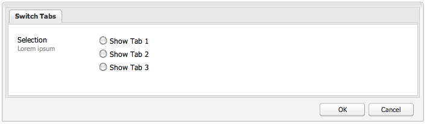

# 使用和擴充Widget(Classic UI){#using-and-extending-widgets-classic-ui}

>[!NOTE]
>
>本頁說明傳統UI中Widget的使用情形，AEM 6.4已過時。
>
>Adobe建議您根據 [Coral UI](/help/sites-developing/touch-ui-concepts.md) 和 [Granite UI](/help/sites-developing/touch-ui-concepts.md#coral-ui) ，運用現代化、可觸 [控的UI](/help/sites-developing/touch-ui-concepts.md#granite-ui-foundation-components)。

Adobe Experience manager的網頁介面使用AJAX和其他現代瀏覽器技術，讓作者直接在網頁上編輯和格式化內容。

Adobe Experience Manager(AEM)使用 [ExtJS](https://www.sencha.com/) widgets程式庫，它提供精美的使用者介面元素，可跨所有最重要的瀏覽器運作，並可建立案頭級的UI體驗。

這些Widget包含在AEM中，而且除了AEM本身使用外，還可供任何使用AEM建立的網站使用。

如需AEM中所有可用介面工具集的完整參考，您可參閱介面工具集 [API檔案](https://helpx.adobe.com/experience-manager/6-5/sites/developing/using/reference-materials/widgets-api/index.html) ，或 [現有xtypes清單](/help/sites-developing/xtypes.md)。 此外，Sencha網站（架構的擁有者）上也提供許多說明如何使用ExtJS架構的 [範例](https://www.sencha.com/products/extjs/examples/) 。

本頁提供如何使用和擴充Widget的深入資訊。 它首先說明如 [何將用戶端程式碼包含在頁面中](#including-the-client-sided-code-in-a-page)。 然後，它說明已建立的一些範例元件，以說明其基本用途和擴充功能。 這些元件可在套件共 **用上使用ExtJS Widgets****套件中使用**。

此套件包含下列範例：

* [使用現成](#basic-dialogs) Widget建立的基本對話方塊。
* [使用現成](#dynamic-dialogs) Widget和自訂Javascript邏輯建立動態對話方塊。
* 以自訂Widget為基礎 [的對話方塊](#custom-widgets)。
* 在給 [定路徑下](#tree-overview) ，顯示JCR樹的樹面板。
* 以表 [格格式顯示](#grid-overview) 資料的網格面板。

>[!NOTE]
>
>Adobe Experience manager的傳統UI是以 [ExtJS 3.4.0為基礎](https://extjs.cachefly.net/ext-3.4.0/docs/)。

## 在頁面中加入用戶端代碼 {#including-the-client-sided-code-in-a-page}

客戶端的javascript和樣式表代碼應放置在客戶端庫中。

要建立客戶端庫：

1. 使用以下屬 `/apps/<project>` 性建立節點：

   * name=&quot;clientlib&quot;
   * jcr:mixinTypes=&quot;[mix:lockable]&quot;
   * jcr:primaryType=&quot;cq:ClientLibraryFolder&quot;
   * sling:resourceType=&quot;widgets/clientlib&quot;
   * categories=&quot;[&lt;category-name>]&quot;
   * dependencies=&quot;[cq.widgets]&quot;
   `Note: <category-name> is the name of the custom library (e.g. "cq.extjstraining") and is used to include the library on the page.`

1. 以下 `clientlib` 建立 `css` 和 `js` 資料夾(nt:folder)。

1. 以下 `clientlib` 建立 `css.txt` 和 `js.txt` 檔案(nt:files)。 這些。txt檔案會列出程式庫所包含的檔案。

1. 編輯 `js.txt`:它需要從&#39; `#base=js`&#39;開始，後面接著由CQ客戶端庫服務聚合的檔案清單，例如：

   ```
   #base=js
    components.js
    exercises.js
    CustomWidget.js
    CustomBrowseField.js
    InsertTextPlugin.js
   ```

1. 編輯 `css.txt`:它需要從&#39; `#base=css`&#39;開始，後面接著由CQ客戶端庫服務聚合的檔案清單，例如：

   ```
   #base=css
    components.css
   ```

1. 在資料 `js` 夾下方，放置屬於程式庫的javascript檔案。

1. 在資料 `css` 夾下方，放 `.css` 置檔案和css檔案所使用的資源(例如 `my_icon.png`)。

>[!NOTE]
>
>以前所述的樣式表處理是可選的。

要在頁面元件jsp中包含客戶端庫，請：

* 要同時包括javascript代碼和樣式表，請執行以下操作：
   `<ui:includeClientLib categories="<category-name1>, <category-name2>, ..."/>`
其中 `<category-nameX>` 是客戶端庫的名稱。

* 若要僅包含javascript程式碼：
   `<ui:includeClientLib js="<category-name>"/>`

如需詳細資訊，請參閱&lt;ui:includeClientLib> [標籤的說明](/help/sites-developing/taglib.md#lt-ui-includeclientlib) 。

在某些情況下，用戶端程式庫只能在作者模式下使用，而且應在發佈模式中排除。 具體實現如下：

```xml
    if (WCMMode.fromRequest(request) != WCMMode.DISABLED) {
        %><ui:includeClientLib categories="cq.collab.blog"/><%
    }
```

### 範例快速入門 {#getting-started-with-the-samples}

若要遵循本頁的教學課程，請在本機AEM例項中安裝名為 **Using ExtJS Widgets** 的套件，並建立將包含元件的範例頁面。 若要這麼做：

1. 在您的AEM例項中，從「套件共用」下 **載名為「使用ExtJS Widgets(v01)** 」的套件並安裝套件。 它會在儲存庫 `extjstraining` 中創 `/apps` 建以下項目。
1. 將包含指令碼(js)和樣式表(css)的用戶端程式庫包含在geometrixx頁面jsp的head標籤中，因為您會將範例元件包含在 **** Geometrixx分支的新頁面中：在 **CRXDE Lite** ，開啟檔案 `/apps/geometrixx/components/page/headlibs.jsp` 並將類別新增至現有標 `cq.extjstraining` 簽，如 `<ui:includeClientLib>` 下所示：
   `%><ui:includeClientLib categories="apps.geometrixx-main, cq.extjstraining"/><%`
1. 在下方的 **Geometrixx** 分支中建立新頁 `/content/geometrixx/en/products` 面，並呼叫 **使用ExtJS Widget**。
1. 進入設計模式，將名為「使用ExtJS Widgets」的群組 **的所有元件新增至** Geometrixx的設計
1. 返回編輯模式：「使用ExtJS Widget **」群組的元件** ，可在Sidekick中取得。

>[!NOTE]
>
>本頁的範例是以Geometrixx範例內容為基礎，此內容已不再隨AEM一起出貨，而已由We.Retail取代。 如需如何下 [載和安裝Geometrixx的資訊，請參閱檔案We.Retail Reference Implementation](/help/sites-developing/we-retail.md#we-retail-geometrixx) 。

### 基本對話框 {#basic-dialogs}

對話框通常用於編輯內容，但也只能顯示資訊。 檢視完整對話方塊的簡單方式，是存取其json格式的表示法。 若要這麼做，請將您的瀏覽器指向：

`https://localhost:4502/<path-to-dialog>.-1.json`

在Sidekick中使用ExtJS **介面工具集** (Using ExtJS Widgets **)群組的第一個元件稱為1。 對話框基本** ，包含4個基本對話框，這些對話框是使用現成可用的Widget建立，而不需自訂的Javascript邏輯。 對話方塊儲存在下方 `/apps/extjstraining/components/dialogbasics`。 基本對話框包括：

* 完整對話框(節 `full` 點):它顯示一個包含3個頁籤的窗口，每個頁籤具有2個文本欄位。
* 「單面板」對話框( `singlepanel` 節點):它顯示一個包含1個頁籤的窗口，其中包含2個文本欄位。
* 「多面板」對話框( `multipanel` 節點):其顯示與「完整」對話框相同，但其構建方式不同。
* 設計對話框(節 `design` 點):它顯示一個包含2個頁籤的窗口。 第一個標籤具有文字欄位、下拉式選單和可收合的文字區域。 第二個標籤有一個欄位集，其中包含4個文本欄位，另一個可折疊的欄位集，其中包含2個文本欄位。

加入 **1。 範例頁面中的Dialog Basics** 元件：

1. 新增 **1。 Dialog Basics** 元件至Sidekick中「使用ExtJS介面工具集 **」標籤的範例** 頁面 ****。
1. 元件顯示標題、部分文本和 **PROPERTIES連結** :按一下連結可顯示儲存在儲存庫中的段落的屬性。 再按一下連結以隱藏屬性。

元件顯示如下：


#### 範例1:完整對話方塊 {#example-full-dialog}

「完 **整** 」對話框顯示一個窗口，其中包含三個頁籤，每個頁籤具有兩個文本欄位。 這是「對話基礎」元件的 **預設對話框** 。 其特點是：

* 由節點定義：節點類型= `cq:Dialog`, xtype = ` [dialog](/help/sites-developing/xtypes.md#dialog)`。
* 顯示3個頁籤(節點類型= `cq:Panel`)。
* 每個頁籤有2個文本欄位(節點類型= `cq:Widget`, xtype = ` [textfield](/help/sites-developing/xtypes.md#textfield)`)。
* 由節點定義：
   `/apps/extjstraining/components/dialogbasics/full`
* 以JSON格式呈現，請求：
   `https://localhost:4502/apps/extjstraining/components/dialogbasics/full.-1.json`

對話方塊顯示如下：


#### 範例2:單一面板對話框 {#example-single-panel-dialog}

「單 **一面板** 」對話方塊會顯示一個視窗，其中有一個標籤包含兩個文字欄位。 其特點是：

* 顯示1個頁籤(節點類型= `cq:Dialog`, xtype = ` [panel](/help/sites-developing/xtypes.md#panel)`)
* 該頁籤有2個文本欄位(節點類型= `cq:Widget`, xtype = ` [textfield](/help/sites-developing/xtypes.md#textfield)`)
* 由節點定義：
   `/apps/extjstraining/components/dialogbasics/singlepanel`
* 請求：
   `https://localhost:4502/apps/extjstraining/components/dialogbasics/singlepanel.-1.json`
* 相較於「完整對話 **框」** ，其優勢在於所需的組態較少。
* 建議使用：，以取得顯示資訊或只有幾個欄位的簡單對話方塊。

要使用「單一面板」對話框：

1. 使用「單面板」對 **話框替換** 「對話框 **基礎」元件對話框** :
   1. 在 **CRXDE Lite中**，刪除節點： `/apps/extjstraining/components/dialogbasics/dialog`
   1. 按一 **下「全部** 」以儲存變更。
   1. 複製節點： `/apps/extjstraining/components/dialogbasics/singlepanel`
   1. 將複製的節點貼上到下面： `/apps/extjstraining/components/dialogbasics`
   1. 選擇節點：並 `/apps/extjstraining/components/dialogbasics/Copy of singlepanel`重新命名 `dialog`。
1. 編輯元件：對話方塊顯示如下：


#### 範例3:多面板對話框 {#example-multi-panel-dialog}

「多 **面板** 」對話框的顯示與「完整」對話框的顯 **示相同** ，但其構建方式不同。 其特點是：

* 由節點定義(節點類型= `cq:Dialog`, xtype = ` [tabpanel](/help/sites-developing/xtypes.md#tabpanel)`)。
* 顯示3個頁籤(節點類型= `cq:Panel`)。
* 每個頁籤有2個文本欄位(節點類型= `cq:Widget`, xtype = ` [textfield](/help/sites-developing/xtypes.md#textfield)`)。
* 由節點定義：
   `/apps/extjstraining/components/dialogbasics/multipanel`
* 請求：
   `https://localhost:4502/apps/extjstraining/components/dialogbasics/multipanel.-1.json`
* 相較於「完整對話 **框」** ，其優勢在於其結構已簡化。
* 建議使用：對話框。

要使用「多面板」對話框：

1. 用「多面板」對話 **框替換** 「對話框基 **礎」元件的對話框** :請遵循範例2說明的 [步驟：單一面板對話框](#example-single-panel-dialog)
1. 編輯元件：對話方塊顯示如下：


#### 範例4:豐富式對話方塊 {#example-rich-dialog}

「豐 **富** 」對話框顯示一個帶有兩個頁籤的窗口。 第一個標籤具有文字欄位、下拉式選單和可收合的文字區域。 第二個頁籤具有一個欄位集，其中包含四個文本欄位和一個可折疊的欄位集，其中包含兩個文本欄位。 其特點是：

* 由節點定義(節點類型= `cq:Dialog`, xtype = ` [dialog](/help/sites-developing/xtypes.md#dialog)`)。
* 顯示2個頁籤(節點類型= `cq:Panel`)。
* 第一個標籤具有 ` [dialogfieldset](/help/sites-developing/xtypes.md#dialogfieldset)` Widget和Widget, ` [textfield](/help/sites-developing/xtypes.md#textfield)` 其中 ` [selection](/help/sites-developing/xtypes.md#selection)` 包含3個選項，以及 ` [dialogfieldset](/help/sites-developing/xtypes.md#dialogfieldset)` 可折疊 ` [textarea](/help/sites-developing/xtypes.md#textarea)` Widget。
* 第二個標籤有一個 ` [dialogfieldset](/help/sites-developing/xtypes.md#dialogfieldset)` Widget，包含4個 ` [textfield](/help/sites-developing/xtypes.md#textfield)` Widget，以及一個可折疊 `dialogfieldset` 的2個 ` [textfield](/help/sites-developing/xtypes.md#textfield)` Widget。
* 由節點定義：
   `/apps/extjstraining/components/dialogbasics/rich`
* 請求：
   `https://localhost:4502/apps/extjstraining/components/dialogbasics/rich.-1.json`

使用「豐富 **型** 」對話框：

1. 使用「豐富式」對話 **框取代** 「對話框基 **礎** 」元件：請遵循範例2說明的 [步驟：單一面板對話框](#example-single-panel-dialog)
1. 編輯元件：對話方塊顯示如下：


### 動態對話框 {#dynamic-dialogs}

在Sidekick中使用ExtJS **Widgets群組的第二個元件稱為****2。 動態對話** ，並包含三個動態對話方塊，這些對話方塊是使用現成可用的Widget和自訂 **的Javascript邏輯建立**。 對話方塊儲存在下方 `/apps/extjstraining/components/dynamicdialogs`。 動態對話框包括：

* 「交換機頁籤」對話框( `switchtabs` 節點):它顯示一個包含兩個頁籤的窗口。 第一個標籤有一個頁籤選項，其中包含三個選項：當選取選項時，會顯示與選項相關的標籤。 第二個標籤有兩個文字欄位。
* 任意對話框( `arbitrary` 節點):它會顯示一個含有一個標籤的視窗。 此標籤有一個可拖放或上傳資產的欄位，以及一個欄位，其中顯示有關包含頁面的資訊，以及參考資產的資訊。
* 切換欄位對話框( `togglefield` 節點):它會顯示一個含有一個標籤的視窗。 該頁籤具有複選框：勾選時，會顯示包含兩個文字欄位的欄位集。

加入 **2。 範例頁面上的Dynamic Dialogs** （動態對話方塊）元件：

1. 新增 **2。 動態對話框** (Dynamic Dialogs **)元件，從Sidekick的「使用ExtJS介面工具集** 」標籤，移至範例 **頁面**。
1. 元件顯示標題、部分文本和 **PROPERTIES連結** :按一下以顯示儲存在儲存庫中的段落的屬性。 再按一下以隱藏屬性。

元件顯示如下：


#### 範例1:切換標籤對話框 {#example-switch-tabs-dialog}

「切 **換頁籤** 」對話框顯示一個帶有兩個頁籤的窗口。 第一個標籤有一個頁籤選項，其中包含三個選項：當選取選項時，會顯示與選項相關的標籤。 第二個標籤有兩個文字欄位。

其主要特點是：

* 由節點定義(節點類型= `cq:Dialog`, xtype = ` [dialog](/help/sites-developing/xtypes.md#dialog)`)。
* 顯示2個頁籤(節點類型= `cq:Panel`):1頁籤，第2個頁籤取決於第1個頁籤（3個選項）中的選擇。
* 有3個可選頁籤(節點類型= `cq:Panel`)，每個頁籤有2個文本欄位(節點類型= `cq:Widget`, xtype = ` [textfield](/help/sites-developing/xtypes.md#textfield)`)。 一次只顯示一個可選頁籤。
* 由節點定義，位 `switchtabs` 於：
   `/apps/extjstraining/components/dynamicdialogs/switchtabs`
* 請求：
   `https://localhost:4502/apps/extjstraining/components/dynamicdialogs/switchtabs.-1.json`

邏輯是透過事件接聽程式和javascript程式碼實作，如下所示：

* 對話框節點具有&quot; `beforeshow`&quot;偵聽器，在顯示對話框之前隱藏所有可選頁籤：
   `beforeshow="function(dialog){Ejst.x2.manageTabs(dialog.items.get(0));}"`
   `dialog.items.get(0)` 取得包含選取面板和3個選用面板的表格面板。
* 對象 `Ejst.x2` 在檔案中定義， `exercises.js` 位於：
   `/apps/extjstraining/clientlib/js/exercises.js`
* 在方 `Ejst.x2.manageTabs()` 法中，當值為-1時，所有 `index` 可選制表符都會隱藏（i從1到3）。
* 選擇頁籤有2個偵聽程式：一個頁籤在載入對話框時顯示選定頁籤(&quot; `loadcontent`&quot;事件)，另一個頁籤在更改選擇時顯示選定頁籤(&quot; `selectionchanged`&quot;事件):
   `loadcontent="function(field,rec,path){Ejst.x2.showTab(field);}"`
   `selectionchanged="function(field,value){Ejst.x2.showTab(field);}"`
* 在方法 `Ejst.x2.showTab()` 中：
   `field.findParentByType('tabpanel')` 取得包含所有標籤的表格面板( `field` 代表選取介面工具集)
   `field.getValue()` 獲取選擇的值，例如：tab2
   `Ejst.x2.manageTabs()` 顯示選定頁籤。
* 每個可選頁籤都有一個偵聽器，它隱藏&quot; `render`&quot;事件上的頁籤：
   `render="function(tab){Ejst.x2.hideTab(tab);}"`
* 在方法 `Ejst.x2.hideTab()` 中：
   `tabPanel` 是包含所有標籤的表格面板
   `index` 是可選頁籤的索引
   `tabPanel.hideTabStripItem(index)` 隱藏標籤

其顯示如下：



#### 範例2:任意對話框 {#example-arbitrary-dialog}

對話方塊通常會顯示基礎元件的內容。 此處介紹的對話方塊稱為「 **任意** 」對話方塊，會從不同的元件提取內容。

「任 **意** 」對話框顯示一個帶有一個頁籤的窗口。 此標籤包含兩個欄位：一個要拖放或上傳資產，另一個要顯示包含頁面的相關資訊，而另一個要顯示包含頁面的相關資訊（如果已參考）。

其主要特點是：

* 由節點定義(節點類型= `cq:Dialog`, xtype = ` [dialog](/help/sites-developing/xtypes.md#dialog)`)。
* 顯示1個面板構件(節點類型= `cq:Widget`, xtype = ` [tabpanel](/help/sites-developing/xtypes.md#tabpanel)`)和1個面板(節點類型= `cq:Panel`)
* 面板具有smartfile Widget(節點類型= `cq:Widget`, xtype = ` [smartfile](/help/sites-developing/xtypes.md#smartfile)`)和擁有者繪圖Widget(節點類型= `cq:Widget`, xtype = ` [ownerdraw](/help/sites-developing/xtypes.md#ownerdraw)`)
* 由節點定義，位 `arbitrary` 於：
   `/apps/extjstraining/components/dynamicdialogs/arbitrary`
* 請求：
   `https://localhost:4502/apps/extjstraining/components/dynamicdialogs/arbitrary.-1.json`

邏輯是透過事件接聽程式和javascript程式碼實作，如下所示：

* ownerdraw Widget有一個「 `loadcontent`」偵聽器，它顯示包含元件的頁面和smartfile Widget在載入內容時引用的資產的相關資訊：
   `loadcontent="function(field,rec,path){Ejst.x2.showInfo(field,rec,path);}"`
   `field` 與ownerdraw對象一起設定
   `path` 是與元件的內容路徑一起設定(例如：/content/geometrixx/tw/products/triangle/ui-tutorial/jcr:content/par/dynamicdialogs)
* 對象 `Ejst.x2` 在檔案中定義， `exercises.js` 位於：
   `/apps/extjstraining/clientlib/js/exercises.js`
* 在方法 `Ejst.x2.showInfo()` 中：
   `pagePath` 是包含該元件的頁面的路徑
   `pageInfo` 代表json格式的頁面屬性
   `reference` 是參考資產的路徑
   `metadata` 代表json格式的資產中繼資料
   `ownerdraw.getEl().update(html);` 在對話方塊中顯示已建立的html

要使用「任意 **」對話框** :

1. 用「任意」(Arbitary **)對話框替換** 「動態對話框 **」(** Dynamic Dialog)元件的對話框：請遵循範例2說明的 [步驟：單一面板對話框](#example-single-panel-dialog)
1. 編輯元件：對話方塊顯示如下：


#### 範例3:切換欄位對話方塊 {#example-toggle-fields-dialog}

「切 **換欄位** 」對話方塊會顯示一個含有一個標籤的視窗。 該頁籤具有複選框：勾選時，會顯示包含兩個文字欄位的欄位集。

其主要特點是：

* 由節點定義(節點類型= `cq:Dialog`, xtype = ` [dialog](/help/sites-developing/xtypes.md#dialog)`)。
* 顯示1個面板構件(節點類型= `cq:Widget`, xtype = ` [tabpanel](/help/sites-developing/xtypes.md#textpanel)`)和1個面板(節點類型= `cq:Panel`)。
* 面板具有選擇／複選框構件(節點類型= `cq:Widget`, xtype = ` [selection](/help/sites-developing/xtypes.md#selection)`, type = ` [checkbox](/help/sites-developing/xtypes.md#checkbox)`)和可折疊的對話框域集構件(節點類型= `cq:Widget`, xtype = ` [dialogfieldset](/help/sites-developing/xtypes.md#dialogfieldset)`)，預設情況下，該構件具有2個文本域構件(節點類型= `cq:Widget`, xtype = ` [textfield](/help/sites-developing/xtypes.md#textfield)`)。
* 由節點定義，位 `togglefields` 於：
   `/apps/extjstraining/components/dynamicdialogs/togglefields`
* 請求：
   `https://localhost:4502/apps/extjstraining/components/dynamicdialogs/togglefields.-1.json`

邏輯是透過事件接聽程式和javascript程式碼實作，如下所示：

* 選擇頁籤有2個偵聽程式：一個顯示當載入內容時的對話欄位集(&quot; `loadcontent`&quot;事件)，另一個顯示當變更選擇時的對話欄位集(&quot; `selectionchanged`&quot;事件):
   `loadcontent="function(field,rec,path){Ejst.x2.toggleFieldSet(field);}"`
   `selectionchanged="function(field,value){Ejst.x2.toggleFieldSet(field);}"`
* 對象 `Ejst.x2` 在檔案中定義， `exercises.js` 位於：
   `/apps/extjstraining/clientlib/js/exercises.js`
* 在方法 `Ejst.x2.toggleFieldSet()` 中：
   `box` 是選擇對象
   `panel` 是包含選取範圍和對話欄位集Widget的面板
   `fieldSet` 是對話框欄位集對象
   `show` 是基於「 」的選擇值（true或false）, `show`顯示對話框欄位集

要使用「切 **換欄位** 」對話框：

1. 將「動態對話框」元 **件的對話框替換** 「切換 **欄位」對話框** :請遵循範例2說明的 [步驟：單一面板對話框](#example-single-panel-dialog)
1. 編輯元件：對話方塊顯示如下：


### 自訂Widget {#custom-widgets}

AEM隨附的現成可用Widget應涵蓋大部分的使用案例。 不過，有時可能需要建立自訂介面工具集，以涵蓋專案特定需求。 您可以延伸現有的Widget來建立自訂Widget。 為協助您開始進行此類自訂，「使用ExtJS **Widgets」套件包含三個對話方塊，使用三個不同的自訂Widget** :

* 「多欄位」對話框( `multifield` 節點)顯示一個帶有一個頁籤的窗口。 此標籤有一個自訂的多欄位介面工具集，其中包含兩個欄位：下拉式選單（含兩個選項）和文字欄位。 由於它以現成可用的介面工具集(只 `multifield` 有文字欄位)為基礎，因此具有介面工具集的所有功 `multifield` 能。
* 樹狀瀏覽對話框(節 `treebrowse` 點)顯示一個窗口，其中一個頁籤包含路徑瀏覽構件：按一下箭頭時，將開啟一個窗口，您可以在其中瀏覽層次並選擇一個項目。 然後項目的路徑會新增至路徑欄位，並在對話方塊關閉時持續存在。
* 「富格文本編輯器插件」對話框(節 `rteplugin` 點)，在「富格文本編輯器」中添加一個自定義按鈕，將一些自定義文本插入主文本。 它由Widget( `richtext` RTE)和自訂功能組成，這些功能是透過RTE外掛程式機制新增的。

自訂Widget和外掛程式都包含在名為 **3的元件中。 使用ExtJS Widgets** 套件 **的自訂Widget** 。 要將此元件包含到示例頁中：

1. 新增 **3。 自訂Widget** 元件至Sidekick中「使用ExtJS Widgets」 **標籤的範例頁** 面 ****。
1. 元件顯示標題、部分文本，並在按一下 **PROPERTIES** 連結時顯示儲存在儲存庫中的段落的屬性。 再按一下會隱藏屬性。
元件顯示如下：


#### 範例1:自訂多欄位介面工具集 {#example-custom-multifield-widget}

「自 **訂多欄位介面工具集** 」對話方塊會顯示一個含有一個標籤的視窗。 此標籤有自訂的多欄位介面工具集，與標準的多欄位介面工具集不同，它有兩個欄位：下拉式選單（含兩個選項）和文字欄位。

「自 **訂多欄位介面工具集** 」對話方塊：

* 由節點定義(節點類型= `cq:Dialog`, xtype = ` [dialog](/help/sites-developing/xtypes.md#dialog)`)。
* 顯示1個包含面板(節點類型= `cq:Widget`, xtype = ` [tabpanel](/help/sites-developing/xtypes.md#tabpanel)`)的面板(節點類型= `cq:Widget`, xtype = ` [panel](/help/sites-developing/xtypes.md#panel)`)。
* 面板具有 `multifield` Widget(節點類型= `cq:Widget`, xtype = ` [multifield](/help/sites-developing/xtypes.md#multifield)`)。
* 介面 `multifield` 工具集具有基於自定義xtype &#39; `nt:unstructured`&#39;的欄位配置(節點類型= 、 xtype = `ejstcustom`, optionsProvider = `Ejst.x3.provideOptions``ejstcustom`):
   * &#39; `fieldconfig`&#39;是對象的配置選 ` [CQ.form.MultiField](https://helpx.adobe.com/experience-manager/6-5/sites/developing/using/reference-materials/widgets-api/index.html?class=CQ.form.MultiField)` 項。
   * &#39; `optionsProvider`&#39;是介面工具集的配 `ejstcustom` 置。 它使用定義 `Ejst.x3.provideOptions` 於：的方 `exercises.js` 法：
      `/apps/extjstraining/clientlib/js/exercises.js`
並傳回2個選項。
* 由節點定義，位 `multifield` 於：
   `/apps/extjstraining/components/customwidgets/multifield`
* 請求：
   `https://localhost:4502/apps/extjstraining/components/customwidgets/multifield.-1.json`

自訂多欄位介面工具集(xtype = `ejstcustom`):

* 是名為javascript物件 `Ejst.CustomWidget`。
* 定義於Javascript檔 `CustomWidget.js` 案中：
   `/apps/extjstraining/clientlib/js/CustomWidget.js`
* 擴充介面工 ` [CQ.form.CompositeField](https://helpx.adobe.com/experience-manager/6-5/sites/developing/using/reference-materials/widgets-api/index.html?class=CQ.form.CompositeField)` 具集。
* 有3個欄位： `hiddenField` （文本欄位） `allowField` 、(ComboBox) `otherField` 和（文本欄位）
* 覆寫 `CQ.Ext.Component#initComponent` 以新增3個欄位：
   * `allowField` 是 [CQ.form.Selection](https://helpx.adobe.com/experience-manager/6-5/sites/developing/using/reference-materials/widgets-api/index.html?class=CQ.form.Selection) 對象，類型為&#39;select&#39;。 optionsProvider是Selection物件的設定，會以對話方塊中定義之自訂介面工具集的optionsProvider設定實例化
   * `otherField` 是 [CQ.Ext.form.TextField物件](https://helpx.adobe.com/experience-manager/6-5/sites/developing/using/reference-materials/widgets-api/index.html?class=CQ.Ext.form.TextField)
* 覆寫 `setValue`CQ.form.CompositeField `getValue` 的方法 `getRawValue`[](https://helpx.adobe.com/experience-manager/6-5/sites/developing/using/reference-materials/widgets-api/index.html?class=CQ.form.CompositeField) 和方法，以便設定和檢索格式為：
   `<allowField value>/<otherField value>, e.g.: 'Bla1/hello'`.
* 將自身註冊為「 `ejstcustom`」 xtype:
   `CQ.Ext.reg('ejstcustom', Ejst.CustomWidget);`

「自 **訂多欄位介面工具集** 」對話方塊會顯示如下：


#### 範例2:自訂樹狀瀏覽介面工具集 {#example-custom-treebrowse-widget}

自訂「樹狀 **瀏覽介面工具集** 」對話方塊會顯示一個視窗，其中有一個標籤包含自訂路徑瀏覽介面工具集：按一下箭頭時，將開啟一個窗口，您可以在其中瀏覽層次並選擇一個項目。 然後項目的路徑會新增至路徑欄位，並在對話方塊關閉時持續存在。

自訂樹狀瀏覽對話框：

* 由節點定義(節點類型= `cq:Dialog`, xtype = ` [dialog](/help/sites-developing/xtypes.md#dialog)`)。
* 顯示1個包含面板(節點類型= `cq:Widget`, xtype = ` [tabpanel](/help/sites-developing/xtypes.md#tabpanel)`)的面板(節點類型= `cq:Widget`, xtype = ` [panel](/help/sites-developing/xtypes.md#panel)`)。
* 面板具有自訂介面工具集(節點類型= `cq:Widget`, xtype = `ejstbrowse`)
* 由節點定義，位 `treebrowse` 於：
   `/apps/extjstraining/components/customwidgets/treebrowse`
* 請求：
   `https://localhost:4502/apps/extjstraining/components/customwidgets/treebrowse.-1.json`

自訂樹狀瀏覽介面工具集(xtype = `ejstbrowse`):

* 是名為javascript物件 `Ejst.CustomWidget`。
* 定義於Javascript檔 `CustomBrowseField.js` 案中：
   `/apps/extjstraining/clientlib/js/CustomBrowseField.js`
* 延伸 ` [CQ.Ext.form.TriggerField](https://helpx.adobe.com/experience-manager/6-5/sites/developing/using/reference-materials/widgets-api/index.html?class=CQ.Ext.form.TriggerField)`。
* 定義名為的瀏覽窗口 `browseWindow`。
* 覆寫 ` [CQ.Ext.form.TriggerField](https://helpx.adobe.com/experience-manager/6-5/sites/developing/using/reference-materials/widgets-api/index.html?class=CQ.Ext.form.TriggerField)#onTriggerClick` 以在按下箭頭時顯示瀏覽視窗。
* 定義 [CQ.Ext.tree.TreePanel對象](https://helpx.adobe.com/experience-manager/6-5/sites/developing/using/reference-materials/widgets-api/index.html?class=CQ.Ext.tree.TreePanel) :
   * 它通過調用在註冊的servlet來獲取其資料 `/bin/wcm/siteadmin/tree.json`。
   * 其根為&quot; `apps/extjstraining`&quot;。
* 定義對 `window` 像( ` [CQ.Ext.Window](https://helpx.adobe.com/experience-manager/6-5/sites/developing/using/reference-materials/widgets-api/index.html?class=CQ.Ext.Window)`):
   * 根據預先定義的面板。
   * 具有「 **確定** 」按鈕，可設定選定路徑的值並隱藏面板。
* 窗口錨定在「路徑」( **Path** )欄位下。
* 所選路徑會從瀏覽欄位傳遞至事件的視 `show` 窗。
* 將自身註冊為「 `ejstbrowse`」 xtype:
   `CQ.Ext.reg('ejstbrowse', Ejst.CustomBrowseField);`

要使用基於自 **訂樹狀結構** (Custom Treebrowse Widget based)對話框：

1. 將「自訂介面工具集」元 **件的對話方塊** ，取代 **為「自訂樹狀瀏覽」對話方塊** :請遵循範例2說明的 [步驟：單一面板對話框](#example-single-panel-dialog)
1. 編輯元件：對話方塊顯示如下：


#### 範例3:Rich Text Editor(RTE)外掛程式 {#example-rich-text-editor-rte-plug-in}

「 **Rich Text Editor(RTE)Plug-in** 」(RTE)對話框是基於「Rich Text Editor」（富格文本編輯器）的對話框，具有一個自定義按鈕，可在方括弧內插入一些自定義文本。 自訂文字可由某些伺服器端邏輯來解析（在此範例中未實作），例如新增某些在指定路徑上定義的文字：

基於 **RTE插件** 的對話框：

* 由retplugin節點定義，位於：
   `/apps/extjstraining/components/customwidgets/rteplugin`
* 請求：
   `https://localhost:4502/apps/extjstraining/components/customwidgets/rteplugin.-1.json`
* 節 `rtePlugins` 點有一個子節點( `inserttext` 節點類型= `nt:unstructured`)，它以插件命名。 它有一個名為 `features`的屬性，該屬性定義了RTE可用的插件功能。

RTE外掛程式：

* 是名為javascript物件 `Ejst.InsertTextPlugin`。
* 定義於Javascript檔 `InsertTextPlugin.js` 案中：
   `/apps/extjstraining/clientlib/js/InsertTextPlugin.js`
* 擴展對 ` [CQ.form.rte.plugins.Plugin](https://helpx.adobe.com/experience-manager/6-5/sites/developing/using/reference-materials/widgets-api/index.html?class=CQ.form.rte.plugins.Plugin)` 像。
* 下列方法會定義物 ` [CQ.form.rte.plugins.Plugin](https://helpx.adobe.com/experience-manager/6-5/sites/developing/using/reference-materials/widgets-api/index.html?class=CQ.form.rte.plugins.Plugin)` 件，並在實施外掛程式中覆寫：
   * `getFeatures()` 傳回外掛程式可用之所有功能的陣列。
   * `initializeUI()` 將新按鈕添加到RTE工具欄。
   * `notifyPluginConfig()` 在按鈕暫留時顯示標題和文字。
   * `execute()` 在按下按鈕並執行外掛程式動作時呼叫：它顯示一個窗口，用於定義要包含的文本。
* `insertText()` 使用對應的對話框對象插入文 `Ejst.InsertTextPlugin.Dialog` 本（請參見後面）。
* `executeInsertText()` 由對話框 `apply()` 的方法調用，按一下「確定」按鈕時 **觸發** 。
* 將自身註冊為「 `inserttext`」插件：
   `CQ.form.rte.plugins.PluginRegistry.register("inserttext", Ejst.InsertTextPlugin);`
* 對象 `Ejst.InsertTextPlugin.Dialog` 定義了在按一下插件按鈕時開啟的對話框。 對話方塊由面板、表單、文字欄位和2個按鈕(**確定****和取消**)組成。

要使用基 **於Rich Text Editor(RTE)的插件對話框** :

1. 將「自訂介面工 **具集** 」元件的對話方塊取代 **為「Rich Text Editor(RTE)Plug-in based** 」對話方塊：請遵循範例2說明的 [步驟：單一面板對話框](#example-single-panel-dialog)
1. 編輯元件。
1. 按一下右邊的最後一個圖示（四個箭頭的圖示）。 輸入路徑，然後按一下「 **確定**」:路徑會顯示在方括弧內([ ]).
1. 按一 **下「確定** 」以關閉Rich Text Editor。

「 **Rich Text Editor(RTE)Plug-in** 」(富格文本編輯器(RTE)插件)對話框顯示如下：


>[!NOTE]
>
>此範例僅說明如何實作邏輯的用戶端部分：然後，必須&#x200B;*[在伺服器端明確地解析佔位符(文本]*)（例如，在元件JSP中）。

### 樹概述 {#tree-overview}

現成可用的物件提供樹狀結 ` [CQ.Ext.tree.TreePanel](https://helpx.adobe.com/experience-manager/6-5/sites/developing/using/reference-materials/widgets-api/index.html?class=CQ.Ext.tree.TreePanel)` 構化資料的UI表示。 「使用ExtJS Widgets」套件中包含的「樹狀結構概 **述」元件** ，說明如何使 `TreePanel` 用物件在指定路徑下顯示JCR樹狀結構。 窗口本身可以與塢站連接／斷開塢站連接。 在此示例中，窗口邏輯嵌入到&lt;script>&lt;/script>標籤之間的元件jsp中。

要將樹概 **述元件包含** 到示例頁，請執行以下操作：

1. 新增 **4。 樹概述** (Tree Overview **)元件至Sidekick中「使用ExtJS介面工具集** 」(Using ExtJS Widgets **)標籤中的範例**&#x200B;頁面。
1. 元件將顯示：
   * 標題，含有文字
   * 屬性 **連結** :按一下以顯示儲存在儲存庫中的段落的屬性。 再按一下以隱藏屬性。
   * 一個浮動窗口，其中包含儲存庫的樹形表示，可以展開。

元件顯示如下：


樹概述元件：

* 定義於：
   `/apps/extjstraining/components/treeoverview`

* 其對話框用於設定窗口的大小和將窗口固定／取消固定（請參閱下面的詳細資訊）。

元件jsp:

* 從儲存庫檢索寬度、高度和停靠屬性。
* 顯示樹概述資料格式的一些文本。
* 在javascript標籤之間，將視窗邏輯內嵌在元件jsp中。
* 定義於：
   `apps/extjstraining/components/treeoverview/content.jsp`

元件jsp中嵌入的javascript代碼：

* 通過嘗 `tree` 試從頁面檢索樹窗口來定義對象。
* 如果顯示樹的窗口不存在，則 `treePanel` 會[建立(CQ.Ext.tree.TreePanel](https://helpx.adobe.com/experience-manager/6-5/sites/developing/using/reference-materials/widgets-api/index.html?class=CQ.Ext.tree.TreePanel)):
   * `treePanel` 包含用於建立窗口的資料。
   * 通過調用在以下位置註冊的servlet來檢索資料：
      `/bin/wcm/siteadmin/tree.json`
* 監聽 `beforeload` 器確保已載入已按一下的節點。
* 對 `root` 像將路徑設 `apps/extjstraining` 置為樹根。
* `tree` ( ` [CQ.Ext.Window](https://helpx.adobe.com/experience-manager/6-5/sites/developing/using/reference-materials/widgets-api/index.html?class=CQ.Ext.Window)`)是根據預先定義而設定 `treePanel`，並以下列方式顯示：
   `tree.show();`
* 如果窗口已存在，則根據從儲存庫檢索到的寬度、高度和停靠屬性來顯示窗口。

元件對話框：

* 顯示1個標籤和2個欄位，以設定樹概述窗口的大小（寬度和高度），並顯示1個欄位以固定／取消固定窗口
* 由節點定義(節點類型= `cq:Dialog`, xtype = ` [panel](/help/sites-developing/xtypes.md#panel)`)。
* 此面板具有大小欄位構件(節點類型= `cq:Widget`, xtype = ` [sizefield](/help/sites-developing/xtypes.md#sizefield)`)和選擇構件(節點類型= `cq:Widget`, xtype = ` [selection](/help/sites-developing/xtypes.md#selection)`, type = `radio`)，帶有2個選項(true/false)
* 由對話框節點定義，位於：
   `/apps/extjstraining/components/treeoverview/dialog`
* 請求：
   `https://localhost:4502/apps/extjstraining/components/treeoverview/dialog.-1.json`
* 顯示如下：


### 格線概觀 {#grid-overview}

「格線面板」以表格式表示行和列的資料。 它由以下幾部分組成：

* 商店：保存資料記錄（行）的模型。
* 欄模型：專欄的構成。
* 檢視：封裝了用戶介面。
* 選擇模型：選擇行為。

「使用ExtJS Widgets」套件中包含的「 **格線概述」元件** ，說明如何以表格格式顯示資料：

* 範例1使用靜態資料。
* 示例2使用從儲存庫檢索到的資料。

要將網格概述元件包括到示例頁中，請執行以下操作：

1. 新增 **5。 格線概述** (Grid Overview **)元件至Sidekick中「使用ExtJS介面工具集** 」標籤的範例 **頁面**。
1. 元件將顯示：
   * 帶有文字的標題
   * 屬性 **連結** :按一下以顯示儲存在儲存庫中的段落的屬性。 再按一下以隱藏屬性。
   * 一個浮動窗口，包含表格格式的資料。

元件顯示如下：


#### 範例1:預設格線 {#example-default-grid}

在其現成版本中，「格線概述」 **** 元件會以表格格式顯示含靜態資料的視窗。 在此示例中，邏輯以兩種方式嵌入到元件jsp中：

* 一般邏輯定義於&lt;script>&lt;/script>標籤之間
* 特定邏輯可在個別的。js檔案中使用，並在jsp中連結至。 此設定可讓您在兩個邏輯（靜態／動態）之間輕鬆切換，方法是加上所需&lt;script>標籤的註解。

網格概述元件：

* 定義於：
   `/apps/extjstraining/components/gridoverview`
* 其對話框用於設定窗口的大小，並將窗口固定／取消固定。

元件jsp:

* 從儲存庫檢索寬度、高度和停靠屬性。
* 顯示部分文字作為網格概述資料格式的簡介。
* 參考定義GridPanel物件的Javascript程式碼：
   `<script type="text/javascript" src="/apps/extjstraining/components/gridoverview/defaultgrid.js"></script>`
   `defaultgrid.js` 將某些靜態資料定義為GridPanel物件的基礎。
* 在javascript標籤之間內嵌javascript程式碼，此標籤定義使用GridPanel物件的Window物件。
* 定義於：
   `apps/extjstraining/components/gridoverview/content.jsp`

元件jsp中嵌入的javascript代碼：

* 通過嘗 `grid` 試從頁中檢索窗口元件來定義對象：
   `var grid = CQ.Ext.getCmp("<%= node.getName() %>-grid");`
* 如果 `grid` 不存在，則 [CQ.Ext.grid.GridPanel](https://helpx.adobe.com/experience-manager/6-5/sites/developing/using/reference-materials/widgets-api/index.html?class=CQ.Ext.grid.GridPanel) 物件( `gridPanel`)會透過呼叫方法來 `getGridPanel()` 定義（請參閱下文）。 此方法在中定義 `defaultgrid.js`。
* `grid` 是基於 ` [CQ.Ext.Window](https://helpx.adobe.com/experience-manager/6-5/sites/developing/using/reference-materials/widgets-api/index.html?class=CQ.Ext.Window)` 預定義的GridPanel的對象，並顯示： `grid.show();`
* 如果 `grid` 已存在，則根據從儲存庫檢索到的寬度、高度和塢站連接屬性來顯示該屬性。

元件jsp中引用的javascript文 `defaultgrid.js`件()定義了由嵌入在JSP中的指令碼調用的方法，並基於靜態數 `getGridPanel()`` [CQ.Ext.grid.GridPanel](https://helpx.adobe.com/experience-manager/6-5/sites/developing/using/reference-materials/widgets-api/index.html?class=CQ.Ext.grid.GridPanel)` 據返回對象。 邏輯如下：

* `myData` 是一組靜態資料，格式為5列和4行的表。
* `store` 是一 `CQ.Ext.data.Store` 個使用的對象 `myData`。
* `store` 已載入到記憶體中：
   `store.load();`
* `gridPanel` 是一 ` [CQ.Ext.grid.GridPanel](https://helpx.adobe.com/experience-manager/6-5/sites/developing/using/reference-materials/widgets-api/index.html?class=CQ.Ext.grid.GridPanel)` 個對象，它使用 `store`:
   * 欄寬會隨時重新比例：
      `forceFit: true`
   * 一次只能選取一行：
      `singleSelect:true`

#### 範例2:參考搜尋格線 {#example-reference-search-grid}

安裝軟體包時，網格 `content.jsp` 概述組 **** 件將顯示基於靜態資料的網格。 可以修改元件以顯示具有以下特徵的網格：

* 有三欄。
* 基於通過調用servlet從儲存庫檢索到的資料。
* 可編輯最後一列的儲存格。 值會保存在由第一列 `test` 中顯示的路徑所定義的節點下的屬性中。

如前一節所述，窗口對象通過調用檔案中定 ` [CQ.Ext.grid.GridPanel](https://helpx.adobe.com/experience-manager/6-5/sites/developing/using/reference-materials/widgets-api/index.html?class=CQ.Ext.grid.GridPanel)` 義的方法獲 `getGridPanel()` 取其對 `defaultgrid.js` 像，位於 `/apps/extjstraining/components/gridoverview/defaultgrid.js`。 **Grid Overview **元件為方法提供了不同的實現， `getGridPanel()` 在檔案中定 `referencesearch.js` 義於 `/apps/extjstraining/components/gridoverview/referencesearch.js`。 切換元件jsp中引用的。js檔案後，網格將基於從儲存庫中檢索的資料。

切換元件jsp中引用的。js檔案：

1. 在 **CRXDE Lite**，在元件 `content.jsp` 的檔案中，注釋包含檔案的 `defaultgrid.js` 行，使其外觀如下：
   `<!-- script type="text/javascript" src="/apps/extjstraining/components/gridoverview/defaultgrid.js"></script-->`
1. 從包含檔案的行中刪除注釋， `referencesearch.js` 使其如下所示：
   `<script type="text/javascript" src="/apps/extjstraining/components/gridoverview/referencesearch.js"></script>`
1. 儲存變更。
1. 重新整理範例頁面。

元件顯示如下：


元件jsp( `referencesearch.js`)中引用的Javascript代碼定義了從元件jsp中調用的方法，並根據從儲存庫中動態檢索的資料 `getGridPanel()`` [CQ.Ext.grid.GridPanel](https://helpx.adobe.com/experience-manager/6-5/sites/developing/using/reference-materials/widgets-api/index.html?class=CQ.Ext.grid.GridPanel)` 返回對象。 中的邏輯 `referencesearch.js` 將某些動態資料定義為GridPanel的基礎：

* `reader` 是讀取 ` [CQ.Ext.data.JsonReader](https://helpx.adobe.com/experience-manager/6-5/sites/developing/using/reference-materials/widgets-api/index.html?class=CQ.Ext.data.JsonReader)`3欄json格式之servlet回應的物件。
* `cm` 是3 ` [CQ.Ext.grid.ColumnModel](https://helpx.adobe.com/experience-manager/6-5/sites/developing/using/reference-materials/widgets-api/index.html?class=CQ.Ext.grid.ColumnModel)` 欄的物件。
「測試」欄儲存格可依使用編輯器定義的方式加以編輯：
   `editor: new [CQ.Ext.form.TextField](https://helpx.adobe.com/experience-manager/6-5/sites/developing/using/reference-materials/widgets-api/index.html?class=CQ.Ext.form.TextField)({})`
* 這些列是可排序的：
   `cm.defaultSortable = true;`
* `store` 是對 ` [CQ.Ext.data.GroupingStore](https://helpx.adobe.com/experience-manager/6-5/sites/developing/using/reference-materials/widgets-api/index.html?class=CQ.Ext.data.GroupingStore)` 像：
   * 它通過調用註冊於&quot; `/bin/querybuilder.json`&quot;的servlet來獲取其資料，其中有一些參數用於過濾查詢
   * 它基於， `reader`預先定義
   * 表按「**jcr:path**」列的升序排序
* `gridPanel` 是可 ` [CQ.Ext.grid.EditorGridPanel](https://helpx.adobe.com/experience-manager/6-5/sites/developing/using/reference-materials/widgets-api/index.html?class=CQ.Ext.grid.EditorGridPanel)` 編輯的對象：
   * 它基於預定義 `store` 和列模型 `cm`
   * 一次只能選取一行：
      `sm: new [CQ.Ext.grid.RowSelectionModel](https://helpx.adobe.com/experience-manager/6-5/sites/developing/using/reference-materials/widgets-api/index.html?class=CQ.Ext.grid.RowSelectionModel)({singleSelect:true})`
   * 偵聽 `afteredit` 器確保在「**Test**」列中的單元格被編輯後：
      * 在儲存庫 `test`中設定由「**jcr:path**」列定義的路徑上節點的屬性「 」，其值為單元格
      * 如果POST成功，則該值將添加到對 `store` 像中，否則被拒絕
