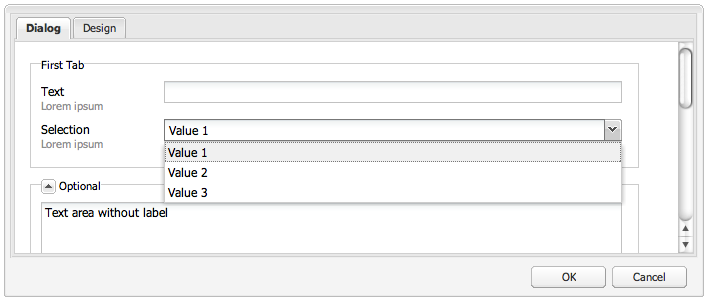

# 使用和擴展小部件（經典UI）{#using-and-extending-widgets-classic-ui}

>[!NOTE]
>
>本頁介紹了標準UI中小部件的使用情況，該UI在AEM6.4中已棄用。
>
>Adobe建議你用現代， [啟用觸摸的UI](/help/sites-developing/touch-ui-concepts.md) 基於 [珊瑚UI](/help/sites-developing/touch-ui-concepts.md#coral-ui) 和 [花崗岩UI](/help/sites-developing/touch-ui-concepts.md#granite-ui-foundation-components)。

Adobe Experience Manager(AEMWeb)的介面使AJAX用和其他現代瀏覽器技術，使WYSIWYG能夠編輯和格式化網頁上的作者的內容。

使AEM用 [ExtJS](https://www.sencha.com/) widgets庫，它提供高度精良的用戶介面元素，這些元素可在所有最重要的瀏覽器中工作，並允許建立案頭級UI體驗。

這些小部件包AEM括在內，並且除了供自AEM身使用外，還可供使用的任何網站使AEM用。

有關中所有可用小部件的完整引用AEM，請參閱 [構件API文檔](https://developer.adobe.com/experience-manager/reference-materials/6-5/widgets-api/index.html) 或 [現有xtype清單](/help/sites-developing/xtypes.md)。 此外，還提供了許多示例，說明如何使用ExtJS框架 [森沙](https://examples.sencha.com/extjs/7.6.0/) 站點，框架的所有者。

本頁提供了一些有關如何使用和擴展小部件的見解。 它首先描述了如何 [在頁面中包含客戶端代碼](#including-the-client-sided-code-in-a-page)。 然後，它描述了為說明一些基本用途和擴展而建立的一些示例元件。 這些元件在 **使用ExtJS小部件** 包 **包共用**。

該包包括以下示例：

* [基本對話框](#basic-dialogs) 用現成的小部件製造。
* [動態對話框](#dynamic-dialogs) 使用現成小部件和自定義的JavaScript邏輯構建。
* 基於 [自定義小部件](#custom-widgets)。
* A [樹面板](#tree-overview) 在給定路徑下顯示JCR樹。
* A [網格面板](#grid-overview) 以表格格式顯示資料。

>[!NOTE]
>
>經典的Adobe Experience ManagerUI [ExtJS 3.4.0](https://extjs.cachefly.net/ext-3.4.0/docs/)。

## 在頁面中包括客戶端代碼 {#including-the-client-sided-code-in-a-page}

客戶端JavaScript和樣式表代碼應放置在客戶端庫中。

要建立客戶端庫：

1. 在下面建立節點 `/apps/<project>` 具有以下屬性：

   * name=&quot;clientlib&quot;
   * jcr:mixinTypes=&quot;[混合：可鎖定]&quot;
   * jcr:primaryType=&quot;cq:ClientLibraryFolder&quot;
   * sling:resourceType=&quot;widgets/clientlib&quot;
   * 類別=&quot;[&lt;category-name>]&quot;
   * 依賴項=[cq.widgets]&quot;

   `Note: <category-name> is the name of the custom library (e.g. "cq.extjstraining") and is used to include the library on the page.`

1. 下 `clientlib` 建立 `css` 和 `js` 資料夾(nt:folder)。

1. 下 `clientlib` 建立 `css.txt` 和 `js.txt` 檔案(nt:files)。 這些.txt檔案列出了庫中包含的檔案。

1. 編輯 `js.txt`:必須以&#39;開頭 `#base=js`&#39;後跟CQ客戶端庫服務聚合的檔案清單，例如：

   ```
   #base=js
    components.js
    exercises.js
    CustomWidget.js
    CustomBrowseField.js
    InsertTextPlugin.js
   ```

1. 編輯 `css.txt`:必須以&#39;開頭 `#base=css`&#39;後跟CQ客戶端庫服務聚合的檔案清單，例如：

   ```
   #base=css
    components.css
   ```

1. 在 `js` 資料夾，放置屬於庫的JavaScript檔案。

1. 在 `css` 資料夾，放置 `.css` 檔案和css檔案使用的資源(例如， `my_icon.png`)。

>[!NOTE]
>
>前面描述的樣式表處理是可選的。

要在頁面元件jsp中包含客戶端庫，請執行以下操作：

* 要同時包括JavaScript代碼和樣式表：
   `<ui:includeClientLib categories="<category-name1>, <category-name2>, ..."/>`
何處 
`<category-nameX>` 是客戶端庫的名稱。

* 只包括JavaScript代碼：
   `<ui:includeClientLib js="<category-name>"/>`

有關詳細資訊，請參閱 [&lt;ui:includeclientlib>](/help/sites-developing/taglib.md#lt-ui-includeclientlib) 標籤。

有時，客戶端庫應僅在作者模式下可用，並應在發佈模式下排除。 具體實現如下：

```xml
    if (WCMMode.fromRequest(request) != WCMMode.DISABLED) {
        %><ui:includeClientLib categories="cq.collab.blog"/><%
    }
```

### 示例入門 {#getting-started-with-the-samples}

要遵循本頁上的教程，請安裝軟體包 **使用ExtJS小部件** 在本地AEM實例中建立包含元件的示例頁。 為此，請執行以下操作：

1. 在您的AEM實例中，下載名為 **使用ExtJS小部件(v01)** 從包共用中安裝包。 它建立項目 `extjstraining` 下 `/apps` 的下界。
1. 將包含指令碼(js)和樣式表(css)的客戶端庫包括在Geometrixx頁jsp的head標籤中。 您將將示例元件包含在 **Geometrixx** 分支：在 **CRXDE Lite** 開啟檔案 `/apps/geometrixx/components/page/headlibs.jsp` 並添加 `cq.extjstraining` 類別 `<ui:includeClientLib>` 標籤如下：
   `%><ui:includeClientLib categories="apps.geometrixx-main, cq.extjstraining"/><%`
1. 在 **Geometrixx** 下 `/content/geometrixx/en/products` 然後 **使用ExtJS小部件**。
1. 進入設計模式並添加組的所有元件 **使用ExtJS小部件** 到設計Geometrixx
1. 返回編輯模式：組的元件 **使用ExtJS小部件** 在Sidekick里。

>[!NOTE]
>
>本頁上的示例基於We.Retail已取代的不再隨附AEM的Geometrixx樣本內容。 查看 [We.Retail Reference實施](/help/sites-developing/we-retail.md#we-retail-geometrixx) 下載和安裝Geometrixx。

### 基本對話框 {#basic-dialogs}

對話框通常用於編輯內容，但也可以顯示資訊。 查看完整對話框的一種簡單方法是訪問其json格式的表示形式。 為此，請將瀏覽器指向：

`https://localhost:4502/<path-to-dialog>.-1.json`

第一個元件 **使用ExtJS小部件** Sidekick中的組稱為 **1。 對話框基礎** 包括四個基本對話框，這些對話框是使用現成的小部件構建的，而不使用自定義的JavaScript邏輯。 對話框儲存在下面 `/apps/extjstraining/components/dialogbasics`。 基本對話框包括：

* 完整對話框( `full` 節點):它顯示一個包含三個制表符的窗口，每個制表符包含兩個文本欄位。
* 「單面板」對話框( `singlepanel` 節點):它顯示一個窗口，其中有一個頁籤，該頁籤有兩個文本欄位。
* 「多面板」對話框( `multipanel` 節點):其顯示與「完全」對話框相同，但其構建方式不同。
* 設計對話框( `design` 節點):它顯示一個帶有兩個頁籤的窗口。 第一個頁籤具有文本欄位、下拉菜單和可折疊文本區域。 第二個頁籤具有一個欄位集，其中包含四個文本欄位，以及一個可折疊欄位集，其中包含兩個文本欄位。

包括 **1。 對話框基礎** 示例頁中的元件：

1. 添加 **1。 對話框基礎** 元件到示例頁 **使用ExtJS小部件** 的 **側腳**。
1. 元件顯示標題、某些文本和 **屬性** 的子菜單。 選擇連結將顯示儲存在儲存庫中的段落的屬性。 再次選擇連結以隱藏屬性。

元件顯示如下：


#### 示例1:完整對話框 {#example-full-dialog}

的 **滿** 對話框顯示一個包含三個頁籤的窗口，每個頁籤都包含兩個文本欄位。 它是 **對話框基礎** 元件。 其特點是：

* 由節點定義：節點類型= `cq:Dialog`, xtype = ` [dialog](/help/sites-developing/xtypes.md#dialog)`。
* 顯示三個頁籤(節點類型= `cq:Panel`)。
* 每個頁籤有兩個文本欄位(節點類型= `cq:Widget`, xtype = ` [textfield](/help/sites-developing/xtypes.md#textfield)`)。
* 由節點定義：
   `/apps/extjstraining/components/dialogbasics/full`
* 通過請求以JSON格式呈現：
   `https://localhost:4502/apps/extjstraining/components/dialogbasics/full.-1.json`

對話框顯示如下：


#### 示例2:單面板對話框 {#example-single-panel-dialog}

的 **單面板** 對話框顯示一個窗口，其中一個頁籤具有兩個文本欄位。 其特點是：

* 顯示一個頁籤(節點類型= `cq:Dialog`, xtype = ` [panel](/help/sites-developing/xtypes.md#panel)`)
* 該頁籤有兩個文本欄位(節點類型= `cq:Widget`, xtype = ` [textfield](/help/sites-developing/xtypes.md#textfield)`)
* 由節點定義：
   `/apps/extjstraining/components/dialogbasics/singlepanel`
* 通過請求以json格式呈現：
   `https://localhost:4502/apps/extjstraining/components/dialogbasics/singlepanel.-1.json`
* 一個優勢 **完整對話框** 就是需要較少的配置。
* 建議使用：對話框。

要使用「單面板」對話框，請執行以下操作：

1. 替換 **對話框基礎** 元件 **單面板** 對話框：
   1. 在 **CRXDE Lite**，刪除節點： `/apps/extjstraining/components/dialogbasics/dialog`
   1. 按一下 **全部保存** 的子菜單。
   1. 複製節點： `/apps/extjstraining/components/dialogbasics/singlepanel`
   1. 將複製的節點貼上到下面： `/apps/extjstraining/components/dialogbasics`
   1. 選擇節點： `/apps/extjstraining/components/dialogbasics/Copy of singlepanel`更名 `dialog`。
1. 編輯元件：對話框顯示如下：


#### 示例3:多面板對話框 {#example-multi-panel-dialog}

的 **多面板** 對話框的顯示與 **滿** 但對話是以不同的方式構建的。 其特點是：

* 由節點定義(節點類型= `cq:Dialog`, xtype = ` [tabpanel](/help/sites-developing/xtypes.md#tabpanel)`)。
* 顯示三個頁籤(節點類型= `cq:Panel`)。
* 每個頁籤有兩個文本欄位(節點類型= `cq:Widget`, xtype = ` [textfield](/help/sites-developing/xtypes.md#textfield)`)。
* 由節點定義：
   `/apps/extjstraining/components/dialogbasics/multipanel`
* 通過請求以json格式呈現：
   `https://localhost:4502/apps/extjstraining/components/dialogbasics/multipanel.-1.json`
* 一個優勢 **完整對話框** 就是它有一個簡化的結構。
* 建議使用：對話框。

要使用「多面板」對話框，請執行以下操作：

1. 替換 **對話框基礎** 元件 **多面板** 對話框：按照 [示例2:單面板對話框](#example-single-panel-dialog)
1. 編輯元件：對話框顯示如下：


#### 示例4:富對話框 {#example-rich-dialog}

的 **里奇** 對話框顯示一個包含兩個頁籤的窗口。 第一個頁籤具有文本欄位、下拉菜單和可折疊文本區域。 第二個頁籤具有一個欄位集，其中包含四個文本欄位，以及一個可折疊欄位集，其中包含兩個文本欄位。 其特點是：

* 由節點定義(節點類型= `cq:Dialog`, xtype = ` [dialog](/help/sites-developing/xtypes.md#dialog)`)。
* 顯示兩個頁籤(節點類型= `cq:Panel`)。
* 第一個頁籤具有 ` [dialogfieldset](/help/sites-developing/xtypes.md#dialogfieldset)` 小部件 ` [textfield](/help/sites-developing/xtypes.md#textfield)` 和 ` [selection](/help/sites-developing/xtypes.md#selection)` 具有三個選項的小部件和可折疊 ` [dialogfieldset](/help/sites-developing/xtypes.md#dialogfieldset)` 帶 ` [textarea](/help/sites-developing/xtypes.md#textarea)` 小部件。
* 第二個頁籤 ` [dialogfieldset](/help/sites-developing/xtypes.md#dialogfieldset)` 四個小部件 ` [textfield](/help/sites-developing/xtypes.md#textfield)` 小部件和可折疊 `dialogfieldset` 兩 ` [textfield](/help/sites-developing/xtypes.md#textfield)` 小部件。
* 由節點定義：
   `/apps/extjstraining/components/dialogbasics/rich`
* 通過請求以json格式呈現：
   `https://localhost:4502/apps/extjstraining/components/dialogbasics/rich.-1.json`

使用 **里奇** 對話框：

1. 替換 **對話框基礎** 元件 **里奇** 對話框：按照 [示例2:單面板對話框](#example-single-panel-dialog)
1. 編輯元件：對話框顯示如下：

 

### 動態對話框 {#dynamic-dialogs}

第二個元件 **使用ExtJS小部件** Sidekick中的組稱為 **2. 動態對話框** 包括三個動態對話框，這些對話框是使用現成的小部件和 **使用自定義的JavaScript邏輯**。 對話框儲存在下面 `/apps/extjstraining/components/dynamicdialogs`。 動態對話框包括：

* 切換頁籤對話框( `switchtabs` 節點):它顯示一個帶有兩個頁籤的窗口。 第一個頁籤有一個無線電選項，其中有三個選項：選中某個選項時，將顯示與該選項相關的頁籤。 第二個頁籤有兩個文本欄位。
* 任意對話框( `arbitrary` 節點):它顯示一個帶有一個頁籤的窗口。 該頁籤具有一個用於拖放或上載資產的欄位，以及一個顯示有關包含頁面和資產（如果引用）的某些資訊的欄位。
* 切換欄位對話框( `togglefield` 節點):它顯示一個帶有一個頁籤的窗口。 該頁籤具有複選框：選中時，將顯示一個包含兩個文本欄位的欄位集。

要包括 **2. 動態對話框** 示例頁上的元件：

1. 添加 **2. 動態對話框** 元件到示例頁 **使用ExtJS小部件** 的 **側腳**。
1. 元件顯示標題、某些文本和 **屬性** 的子菜單。 選擇連結將顯示儲存在儲存庫中的段落的屬性。 再次選擇連結以隱藏屬性。

元件顯示如下：


#### 示例1:「切換頁籤」對話框 {#example-switch-tabs-dialog}

的 **切換頁籤** 對話框顯示一個包含兩個頁籤的窗口。 第一個頁籤有一個無線電選項，其中有三個選項：選中某個選項時，將顯示與該選項相關的頁籤。 第二個頁籤有兩個文本欄位。

其主要特點是：

* 由節點定義(節點類型= `cq:Dialog`, xtype = ` [dialog](/help/sites-developing/xtypes.md#dialog)`)。
* 顯示兩個頁籤(節點類型= `cq:Panel`):一個選擇頁籤，第二個頁籤取決於第一個頁籤中的選擇（三個選項）。
* 有三個可選頁籤(節點類型= `cq:Panel`)，每個欄位有兩個文本欄位(節點類型= `cq:Widget`, xtype = ` [textfield](/help/sites-developing/xtypes.md#textfield)`)。 一次只顯示一個可選頁籤。
* 由 `switchtabs` 節點位於：
   `/apps/extjstraining/components/dynamicdialogs/switchtabs`
* 通過請求以json格式呈現：
   `https://localhost:4502/apps/extjstraining/components/dynamicdialogs/switchtabs.-1.json`

邏輯通過事件偵聽器和JavaScript代碼實現，如下所示：

* 對話框節點具有「」 `beforeshow`&quot;監聽器，它在顯示對話框之前隱藏所有可選頁籤：
   `beforeshow="function(dialog){Ejst.x2.manageTabs(dialog.items.get(0));}"`

   `dialog.items.get(0)` 獲取 `tabpanel` 框（包含選擇面板和三個可選面板）。
* 的 `Ejst.x2` 對象在 `exercises.js` 檔案位於：
   `/apps/extjstraining/clientlib/js/exercises.js`
* 在 `Ejst.x2.manageTabs()` 方法，作為 `index` 為–1，所有可選頁籤都隱藏（i從1到3）。
* 「選擇」頁籤有兩個監聽器：其中一個在載入對話框時顯示選定頁籤(&quot; `loadcontent`&quot;事件)和在更改選擇時顯示選定頁籤的選項(&quot; `selectionchanged`「事件):
   `loadcontent="function(field,rec,path){Ejst.x2.showTab(field);}"`

   `selectionchanged="function(field,value){Ejst.x2.showTab(field);}"`
* 對於 `Ejst.x2.showTab()` 方法
   `field.findParentByType('tabpanel')` 獲取 `tabpanel` 包含所有頁籤( `field` 表示選擇構件)
   `field.getValue()` 獲取所選內容的值，例如，tab2
   `Ejst.x2.manageTabs()` 顯示選定頁籤。
* 每個可選頁籤都有一個監聽器，它隱藏「」上的頁籤 `render`「事件：
   `render="function(tab){Ejst.x2.hideTab(tab);}"`
* 對於 `Ejst.x2.hideTab()` 方法
   `tabPanel` 是 `tabpanel` 包含所有頁籤
   `index` 是可選頁籤的索引
   `tabPanel.hideTabStripItem(index)` 隱藏頁籤

它顯示如下：


#### 示例2:任意對話框 {#example-arbitrary-dialog}

通常，對話框會顯示基礎元件中的內容。 此處描述的對話框稱為 **任意** 對話框，從其他元件中提取內容。

的 **任意** 對話框顯示一個帶有一個頁籤的窗口。 該頁籤包含兩個欄位：一個用於刪除或上載資產，一個用於顯示有關包含頁和資產（如果已引用）的某些資訊。

其主要特點是：

* 由節點定義(節點類型= `cq:Dialog`, xtype = ` [dialog](/help/sites-developing/xtypes.md#dialog)`)。
* 顯示一個 `tabpanel` 構件（節點類型） `cq:Widget`, xtype = ` [tabpanel](/help/sites-developing/xtypes.md#tabpanel)`)，帶一個面板(節點類型= `cq:Panel`)
* 面板具有smartfile構件(節點類型= `cq:Widget`, xtype = ` [smartfile](/help/sites-developing/xtypes.md#smartfile)`)和所有者繪圖構件(節點類型= `cq:Widget`, xtype = ` [ownerdraw](/help/sites-developing/xtypes.md#ownerdraw)`)
* 由 `arbitrary` 節點位於：
   `/apps/extjstraining/components/dynamicdialogs/arbitrary`
* 通過請求以json格式呈現：
   `https://localhost:4502/apps/extjstraining/components/dynamicdialogs/arbitrary.-1.json`

邏輯通過事件偵聽器和JavaScript代碼實現，如下所示：

* 的 `ownerdraw` 小部件具有「 `loadcontent`&quot;監聽器，它顯示有關包含該元件的頁的資訊。 即，載入內容時智慧檔案構件引用的資產：
   `loadcontent="function(field,rec,path){Ejst.x2.showInfo(field,rec,path);}"`

   `field` 設定為 `ownerdraw` 對象
   `path` 與元件的內容路徑一起設定(例如， `/content/geometrixx/en/products/triangle/ui-tutorial/jcr:content/par/dynamicdialogs`)
* 的 `Ejst.x2` 對象在 `exercises.js` 檔案位於：
   `/apps/extjstraining/clientlib/js/exercises.js`
* 對於 `Ejst.x2.showInfo()` 方法
   `pagePath` 是包含元件的頁面路徑；
   `pageInfo` 表示json格式的頁面屬性；
   `reference` 是引用資產的路徑；
   `metadata` 以json格式表示資產的元資料；
   `ownerdraw.getEl().update(html);` 在對話框中顯示已建立的html

使用 **任意** 對話框：

1. 替換 **動態對話框** 元件 **任意** 對話框：按照 [示例2:單面板對話框](#example-single-panel-dialog)
1. Edit the component: the dialog displays as follows:


#### Example 3: Toggle Fields Dialog {#example-toggle-fields-dialog}

的 **切換欄位** 對話框顯示一個帶有一個頁籤的窗口。 該頁籤具有複選框：選中時，將顯示一個包含兩個文本欄位的欄位集。

其主要特點是：

* 由節點定義(節點類型= `cq:Dialog`, xtype = ` [dialog](/help/sites-developing/xtypes.md#dialog)`)。
* 顯示一個 `tabpanel` 構件（節點類型） `cq:Widget`, xtype = ` [tabpanel](/help/sites-developing/xtypes.md#textpanel)`)，帶一個面板(節點類型= `cq:Panel`)。
* 面板具有選擇/複選框構件(節點類型= `cq:Widget`, xtype = ` [selection](/help/sites-developing/xtypes.md#selection)`，類型= ` [checkbox](/help/sites-developing/xtypes.md#checkbox)`)和可折疊的對話框欄位集構件(節點類型= `cq:Widget`, xtype = ` [dialogfieldset](/help/sites-developing/xtypes.md#dialogfieldset)`)，預設情況下隱藏，包含兩個文本域小部件(節點類型= `cq:Widget`, xtype = ` [textfield](/help/sites-developing/xtypes.md#textfield)`)。
* 由 `togglefields` 節點位於：
   `/apps/extjstraining/components/dynamicdialogs/togglefields`
* 通過請求以json格式呈現：
   `https://localhost:4502/apps/extjstraining/components/dynamicdialogs/togglefields.-1.json`

邏輯通過事件偵聽器和JavaScript代碼實現，如下所示：

* 「選擇」頁籤有兩個監聽器：其中一個顯示載入內容時的對話框欄位集(&quot; `loadcontent`&quot;事件)和顯示更改選擇時對話框欄位集的對話框欄位集(&quot; `selectionchanged`「事件):
   `loadcontent="function(field,rec,path){Ejst.x2.toggleFieldSet(field);}"`

   `selectionchanged="function(field,value){Ejst.x2.toggleFieldSet(field);}"`
* 的 `Ejst.x2` 對象在 `exercises.js` 檔案位於：
   `/apps/extjstraining/clientlib/js/exercises.js`
* 對於 `Ejst.x2.toggleFieldSet()` 方法
   `box` 是選擇對象；
   `panel` 是包含所選內容和對話框欄位集小部件的面板；
   `fieldSet` 是dialogfieldset對象；
   `show` 是選擇的值（真或假）;基於&#39; `show`&#39;對話框欄位集是否顯示

使用 **切換欄位** 對話框，執行以下操作：

1. 替換 **動態對話框** 元件 **切換欄位** 對話框：按照 [示例2:單面板對話框](#example-single-panel-dialog)
1. 編輯元件：對話框顯示如下：


### 自定義小部件 {#custom-widgets}

隨附的現成小部件應包括大AEM多數使用案例。 但是，有時可能需要建立一個自定義小部件來滿足特定於項目的要求。 可通過擴展現有小部件來建立自定義小部件。 為幫助您開始進行此類自定義， **`Using ExtJS Widgets`** 包包括三個使用三個不同自定義小部件的對話框：

* 「多欄位」對話框( `multifield` 節點)顯示一個帶有一個頁籤的窗口。 該頁籤具有一個自定義的多域小部件，該小部件有兩個欄位：一個包含兩個選項的下拉菜單和一個文本欄位。 因為它基於現成的 `multifield` 小部件（僅包含文本欄位），它具有 `multifield` 小部件。
* 樹瀏覽對話框( `treebrowse` 節點)顯示一個包含路徑瀏覽構件的頁籤的窗口：按一下箭頭時，將開啟一個窗口，您可以在其中瀏覽層次結構並選擇項目。 然後，項目的路徑將添加到路徑欄位，並在對話框關閉時保留。
* 基於RTEXT編輯器插件的對話框( `rteplugin` 節點)，在RT編輯器中添加自定義按鈕，以將一些自定義文本插入主文本。 它由 `richtext` 構件(RTE)和通過RTE插件機制添加的自定義功能。

自定義小部件和插件包含在名為 **3. 自定義小部件** 的 **使用ExtJS小部件** 檔案。 要將此元件包含到示例頁中：

1. 添加 **3. 自定義小部件** 元件到示例頁 **使用ExtJS小部件** 的 **側腳**。
1. 元件顯示標題、某些文本，並在按一下 **屬性** 連結，儲存在儲存庫中的段落的屬性。 再次按一下將隱藏屬性。
元件顯示如下：


#### 示例1:自定義多域小部件 {#example-custom-multifield-widget}

的 **自定義多欄位** 基於構件的對話框顯示一個帶有一個頁籤的窗口。 該頁籤具有自定義的多域小部件，該小部件與具有一個欄位的標準小部件不同，具有兩個欄位：一個包含兩個選項的下拉菜單和一個文本欄位。

的 **自定義多欄位** 基於構件的對話框：

* 由節點定義(節點類型= `cq:Dialog`, xtype = ` [dialog](/help/sites-developing/xtypes.md#dialog)`)。
* 顯示一個 `tabpanel` 構件（節點類型） `cq:Widget`, xtype = ` [tabpanel](/help/sites-developing/xtypes.md#tabpanel)`)包含面板(節點類型= `cq:Widget`, xtype = ` [panel](/help/sites-developing/xtypes.md#panel)`)。
* 面板具有 `multifield` 構件（節點類型） `cq:Widget`, xtype = ` [multifield](/help/sites-developing/xtypes.md#multifield)`)。
* 的 `multifield` 小部件具有欄位配置(節點類型= `nt:unstructured`, xtype = `ejstcustom`，選項提供程式= `Ejst.x3.provideOptions`)，它基於自定義xtype &#39; `ejstcustom`「：
   * &quot; `fieldconfig`&#39;是 ` [CQ.form.MultiField](https://developer.adobe.com/experience-manager/reference-materials/6-5/widgets-api/index.html?class=CQ.form.MultiField)` 的雙曲餘切值。
   * &quot; `optionsProvider`&#39;是 `ejstcustom` 小部件。 它與 `Ejst.x3.provideOptions` 定義的方法 `exercises.js` 地址：
      `/apps/extjstraining/clientlib/js/exercises.js`
並返回兩個選項。
* 由 `multifield` 節點位於：
   `/apps/extjstraining/components/customwidgets/multifield`
* 通過請求以json格式呈現：
   `https://localhost:4502/apps/extjstraining/components/customwidgets/multifield.-1.json`

自定義 `multifield` 構件(xtype =) `ejstcustom`):

* 是JavaScript對象調用 `Ejst.CustomWidget`
* 定義於 `CustomWidget.js` JavaScript檔案位於：
   `/apps/extjstraining/clientlib/js/CustomWidget.js`
* 擴展 ` [CQ.form.CompositeField](https://developer.adobe.com/experience-manager/reference-materials/6-5/widgets-api/index.html?class=CQ.form.CompositeField)` 小部件。
* 有三個欄位： `hiddenField` （文本欄位）, `allowField` （組合框）和 `otherField` （文本欄位）
* 覆蓋 `CQ.Ext.Component#initComponent` 添加三個欄位：
   * `allowField` 是 [CQ.form.選擇](https://developer.adobe.com/experience-manager/reference-materials/6-5/widgets-api/index.html?class=CQ.form.Selection) 「select」類型的對象。 optionsProvider是Selection對象的配置，該對象使用對話框中定義的CustomWidget的optionsProvider配置進行實例化
   * `otherField` 是 [CQ.Ext.form.TextField](https://developer.adobe.com/experience-manager/reference-materials/6-5/widgets-api/index.html?class=CQ.Ext.form.TextField) 對象
* `setValue``getValue``getRawValue`[](https://developer.adobe.com/experience-manager/reference-materials/6-5/widgets-api/index.html?class=CQ.form.CompositeField)
   `<allowField value>/<otherField value>, for example: 'Bla1/hello'`。
* `ejstcustom`
   `CQ.Ext.reg('ejstcustom', Ejst.CustomWidget);`

****


#### 示例2:自定義 `Treebrowse` 小部件 {#example-custom-treebrowse-widget}

自定義 **`Treebrowse`** 基於構件的對話框顯示一個窗口，其中有一個頁籤包含自定義路徑瀏覽構件。 選擇箭頭時，將開啟一個窗口，在該窗口中可以瀏覽層次結構並選擇項目。 然後，項目的路徑將添加到路徑欄位，並在對話框關閉時保留。

自定義 `treebrowse` 對話框：

* 由節點定義(節點類型= `cq:Dialog`, xtype = ` [dialog](/help/sites-developing/xtypes.md#dialog)`)。
* 顯示一個 `tabpanel` 構件（節點類型） `cq:Widget`, xtype = ` [tabpanel](/help/sites-developing/xtypes.md#tabpanel)`)包含面板(節點類型= `cq:Widget`, xtype = ` [panel](/help/sites-developing/xtypes.md#panel)`)。
* 面板具有自定義構件(節點類型= `cq:Widget`, xtype = `ejstbrowse`)
* 由 `treebrowse` 節點位於：
   `/apps/extjstraining/components/customwidgets/treebrowse`
* 通過請求以json格式呈現：
   `https://localhost:4502/apps/extjstraining/components/customwidgets/treebrowse.-1.json`

自定義樹瀏覽構件(xtype = `ejstbrowse`):

* 是JavaScript對象調用 `Ejst.CustomWidget`
* 定義於 `CustomBrowseField.js` JavaScript檔案位於：
   `/apps/extjstraining/clientlib/js/CustomBrowseField.js`
* 擴展 ` [CQ.Ext.form.TriggerField](https://developer.adobe.com/experience-manager/reference-materials/6-5/widgets-api/index.html?class=CQ.Ext.form.TriggerField)`。
* 定義名為的瀏覽窗口 `browseWindow`。
* 覆蓋 ` [CQ.Ext.form.TriggerField](https://developer.adobe.com/experience-manager/reference-materials/6-5/widgets-api/index.html?class=CQ.Ext.form.TriggerField)#onTriggerClick` 按鈕。
* 定義 [CQ.Ext.tree.TreePanel](https://developer.adobe.com/experience-manager/reference-materials/6-5/widgets-api/index.html?class=CQ.Ext.tree.TreePanel) 對象：
   * 它通過調用註冊於的Servlet獲取其資料 `/bin/wcm/siteadmin/tree.json`。
   * 其根為&quot; `apps/extjstraining`。
* 定義 `window` 對象(O) ` [CQ.Ext.Window](https://developer.adobe.com/experience-manager/reference-materials/6-5/widgets-api/index.html?class=CQ.Ext.Window)`):
   * 基於預定義面板。
   * 具有 **確定** 按鈕，可設定選定路徑的值並隱藏面板。
* 窗戶在 **路徑** 的子菜單。
* 所選路徑將從瀏覽欄位傳遞到 `show` 的子菜單。
* 註冊為「」 `ejstbrowse`&#39; xtype:
   `CQ.Ext.reg('ejstbrowse', Ejst.CustomBrowseField);`

使用 **自定義樹瀏覽** 基於構件的對話框：

1. 替換 **自定義小部件** 元件 **自定義樹瀏覽** 對話框：按照 [示例2:單面板對話框](#example-single-panel-dialog)
1. 編輯元件：對話框顯示如下：


#### 示例3:富格文本編輯器(RTE)插件 {#example-rich-text-editor-rte-plug-in}

的 **富格文本編輯器(RTE)插件** based對話框是基於富格文本編輯器的對話框，該對話框具有用於在方括弧內插入某些自定義文本的自定義按鈕。 自定義文本可以由某些伺服器端邏輯分析（在本示例中未實現），例如添加在給定路徑上定義的某些文本：

的 **RTE插件** 基於對話框：

* 由以下位置的retplugin節點定義：
   `/apps/extjstraining/components/customwidgets/rteplugin`
* 通過請求以json格式呈現：
   `https://localhost:4502/apps/extjstraining/components/customwidgets/rteplugin.-1.json`
* 的 `rtePlugins` 節點具有子節點 `inserttext` (節點類型= `nt:unstructured`)。 它有一個 `features` 定義RTE可用的插件功能。

RTE插件：

* 是JavaScript對象調用 `Ejst.InsertTextPlugin`
* 定義於 `InsertTextPlugin.js` JavaScript檔案位於：
   `/apps/extjstraining/clientlib/js/InsertTextPlugin.js`
* 擴展 ` [CQ.form.rte.plugins.Plugin](https://developer.adobe.com/experience-manager/reference-materials/6-5/widgets-api/index.html?class=CQ.form.rte.plugins.Plugin)` 的雙曲餘切值。
* 以下方法定義 ` [CQ.form.rte.plugins.Plugin](https://developer.adobe.com/experience-manager/reference-materials/6-5/widgets-api/index.html?class=CQ.form.rte.plugins.Plugin)` 對象，並在實現插件中被覆蓋：
   * `getFeatures()` 返回插件所提供的所有功能的陣列。
   * `initializeUI()` 將新按鈕添加到RTE工具欄。
   * `notifyPluginConfig()` 在懸停按鈕時顯示標題和文本。
   * `execute()` 按一下按鈕並執行插件操作時調用：它顯示一個窗口，用於定義要包括的文本。
* `insertText()` 使用相應對話框對象插入文本 `Ejst.InsertTextPlugin.Dialog` （見以後）。
* `executeInsertText()` 由 `apply()` 對話框的方法，在 **確定** 按鈕
* 註冊為「」 `inserttext`&#39;插件：
   `CQ.form.rte.plugins.PluginRegistry.register("inserttext", Ejst.InsertTextPlugin);`
* 這樣 `Ejst.InsertTextPlugin.Dialog` 對象定義按一下插件按鈕時開啟的對話框。 該對話框由面板、窗體、文本欄位和兩個按鈕(**確定** 和 **取消**)。

使用 **富格文本編輯器(RTE)插件** 基於對話框：

1. 替換 **自定義小部件** 元件 **富格文本編輯器(RTE)插件** 基於對話框：按照 [示例2:單面板對話框](#example-single-panel-dialog)
1. 編輯元件。
1. 按一下右側的最後一個表徵圖（帶四個箭頭的表徵圖）。 輸入路徑並按一下 **確定**:路徑顯示在方括弧內([ ])。
1. 按一下 **確定** 關閉富格文本編輯器。

的 **富格文本編輯器(RTE)插件** 基於對話框顯示如下：


>[!NOTE]
>
>*[]*

### Tree Overview {#tree-overview}

開箱即用 ` [CQ.Ext.tree.TreePanel](https://developer.adobe.com/experience-manager/reference-materials/6-5/widgets-api/index.html?class=CQ.Ext.tree.TreePanel)` 對象提供樹形結構資料的樹形UI表示。 包含在 **使用ExtJS小部件** 包顯示如何使用 `TreePanel` 對象，在給定路徑下顯示JCR樹。 窗口本身可以停靠/取消停靠。 在本示例中，窗口邏輯嵌入到元件jsp中 &lt;script>&lt;/script> 標籤。

要包括 **樹概述** 元件到示例頁：

1. 添加 **4. 樹概述** 元件到示例頁 **使用ExtJS小部件** 的 **側腳**。
1. 元件將顯示：
   * 標題，帶一些文字
   * a **屬性** 連結：按一下以顯示儲存在儲存庫中的段落的屬性。 再次按一下以隱藏屬性。
   * 一個浮動窗口，其中樹表示可展開的儲存庫。

元件顯示如下：


樹概述元件：

* 定義於：
   `/apps/extjstraining/components/treeoverview`

* 該對話框允許您設定窗口的大小以及停靠或取消停靠窗口（請參閱下面的詳細資訊）。

元件jsp:

* 從儲存庫中檢索寬度、高度和停靠屬性。
* 顯示有關樹概述資料格式的一些文本。
* 將窗口邏輯嵌入到JavaScript標籤之間的元件jsp中。
* 定義於：
   `apps/extjstraining/components/treeoverview/content.jsp`

元件jsp中嵌入的JavaScript代碼：

* 定義 `tree` 通過嘗試從頁面檢索樹窗口對象。
* 如果顯示樹的窗口不存在， `treePanel` ([CQ.Ext.tree.TreePanel](https://developer.adobe.com/experience-manager/reference-materials/6-5/widgets-api/index.html?class=CQ.Ext.tree.TreePanel))已建立：
   * `treePanel` 包含用於建立窗口的資料。
   * 通過調用在以下位置註冊的servlet來檢索資料：
      `/bin/wcm/siteadmin/tree.json`
* 的 `beforeload` 偵聽器確保已載入所選節點。
* 的 `root` 對象設定路徑 `apps/extjstraining` 作為樹根。
* `tree` ( ` [CQ.Ext.Window](https://developer.adobe.com/experience-manager/reference-materials/6-5/widgets-api/index.html?class=CQ.Ext.Window)`)是基於預定義 `treePanel`，並顯示為：
   `tree.show();`
* 如果窗口存在，則根據從儲存庫檢索到的寬度、高度和停靠屬性顯示該窗口。

元件對話框：

* 顯示一個頁籤，其中包含兩個欄位以設定樹概覽窗口的大小（寬度和高度），以及一個欄位以停靠/取消停靠窗口
* 由節點定義(節點類型= `cq:Dialog`, xtype = ` [panel](/help/sites-developing/xtypes.md#panel)`)。
* 面板具有大小域構件(節點類型= `cq:Widget`, xtype = ` [sizefield](/help/sites-developing/xtypes.md#sizefield)`)和選擇小部件(節點類型= `cq:Widget`, xtype = ` [selection](/help/sites-developing/xtypes.md#selection)`，類型= `radio`)，其中包含兩個選項(true/false)
* 由對話框節點在以下位置定義：
   `/apps/extjstraining/components/treeoverview/dialog`
* 通過請求以json格式呈現：
   `https://localhost:4502/apps/extjstraining/components/treeoverview/dialog.-1.json`
* 顯示如下：


### 網格概述 {#grid-overview}

網格面板以行和列的表格格式表示資料。 它由以下幾部分組成：

* 儲存：保存資料記錄（行）的模型。
* 列模型：柱子的構成。
* 視圖：封裝用戶介面。
* 選擇模型：選擇行為。

包含在 **使用ExtJS小部件** 包顯示了如何以表格格式顯示資料：

* 示例1使用靜態資料。
* 示例2使用從儲存庫檢索到的資料。

要將「網格概覽」元件包括到示例頁中，請執行以下操作：

1. 添加 **5. 網格概述** 元件到示例頁 **使用ExtJS小部件** 的 **側腳**。
1. 元件將顯示：
   * 帶有文本的標題
   * a **屬性** 連結：按一下以顯示儲存在儲存庫中的段落的屬性。 再次按一下以隱藏屬性。
   * 包含表格格式的資料的浮動窗口。

元件顯示如下：


#### 示例1:預設網格 {#example-default-grid}

在現成版本中， **網格概述** 元件以表格格式顯示包含靜態資料的窗口。 在本示例中，邏輯以兩種方式嵌入到元件jsp中：

* 泛型邏輯在 &lt;script>&lt;/script> 標籤
* the specific logic is available in a separate .js file and is linked to in the jsp. This setup lets you switch between the two logic (static/dynamic) by commenting the desired &lt;script> tags.

網格概述元件：

* 定義於：
   `/apps/extjstraining/components/gridoverview`
* 該對話框允許您設定窗口的大小，以及停靠或取消停靠窗口。

元件jsp:

* 從儲存庫中檢索寬度、高度和停靠屬性。
* 顯示一些文本作為網格概述資料格式的簡介。
* 引用定義GridPanel對象的JavaScript代碼：
   `<script type="text/javascript" src="/apps/extjstraining/components/gridoverview/defaultgrid.js"></script>`

   `defaultgrid.js` 將某些靜態資料定義為GridPanel對象的基。
* 在JavaScript標籤之間嵌入JavaScript代碼，該標籤定義使用GridPanel對象的Window對象。
* 定義於：
   `apps/extjstraining/components/gridoverview/content.jsp`

元件jsp中嵌入的JavaScript代碼：

* 定義 `grid` 通過嘗試從頁面中檢索窗口元件：
   `var grid = CQ.Ext.getCmp("<%= node.getName() %>-grid");`
* 如果 `grid` 不存在，a [CQ.Ext.grid.GridPanel](https://developer.adobe.com/experience-manager/reference-materials/6-5/widgets-api/index.html?class=CQ.Ext.grid.GridPanel) 對象(O) `gridPanel`)通過調用 `getGridPanel()` 方法（請參閱下文）。 此方法在中定義 `defaultgrid.js`。
* `grid` 是 ` [CQ.Ext.Window](https://developer.adobe.com/experience-manager/reference-materials/6-5/widgets-api/index.html?class=CQ.Ext.Window)` 對象，基於預定義的GridPanel，並顯示： `grid.show();`
* 如果 `grid` 存在，它根據從儲存庫檢索到的寬度、高度和停靠屬性顯示。

JavaScript檔案( `defaultgrid.js`)在元件jsp中引用，定義 `getGridPanel()` 由嵌入在JSP中的指令碼調用並返回 ` [CQ.Ext.grid.GridPanel](https://developer.adobe.com/experience-manager/reference-materials/6-5/widgets-api/index.html?class=CQ.Ext.grid.GridPanel)` 對象，基於靜態資料。 邏輯如下：

* `myData` 是一個靜態資料陣列，格式為五列四行的表。
* `store` 是 `CQ.Ext.data.Store` 使用的對象 `myData`。
* `store` 載入到記憶體中：
   `store.load();`
* `gridPanel` 是 ` [CQ.Ext.grid.GridPanel](https://developer.adobe.com/experience-manager/reference-materials/6-5/widgets-api/index.html?class=CQ.Ext.grid.GridPanel)` 使用的對象 `store`:
   * 列寬始終會重新比例：
      `forceFit: true`
   * 一次只能選擇一行：
      `singleSelect:true`

#### 示例2:引用搜索網格 {#example-reference-search-grid}

安裝軟體包時， `content.jsp` 的 **網格概述** 元件顯示基於靜態資料的網格。 可以修改元件以顯示具有以下特徵的網格：

* 有三列。
* 基於通過調用Servlet從儲存庫檢索到的資料。
* 可以編輯最後一列的單元格。 值保留在 `test` 由第一列中顯示的路徑定義的節點下的屬性。

如前一節中所述，窗口對象將獲取其 ` [CQ.Ext.grid.GridPanel](https://developer.adobe.com/experience-manager/reference-materials/6-5/widgets-api/index.html?class=CQ.Ext.grid.GridPanel)` 通過調用 `getGridPanel()` 方法 `defaultgrid.js` 檔案 `/apps/extjstraining/components/gridoverview/defaultgrid.js`。 **網格概述**元件為 `getGridPanel()` 方法，在中定義 `referencesearch.js` 檔案 `/apps/extjstraining/components/gridoverview/referencesearch.js`。 通過切換元件jsp中引用的.js檔案，網格基於從儲存庫檢索到的資料。

切換元件jsp中引用的.js檔案：

1. 在 **CRXDE Lite**，也請參見Wiki頁。 `content.jsp` 檔案，注釋包含 `defaultgrid.js` 檔案，因此如下所示：
   `<!-- script type="text/javascript" src="/apps/extjstraining/components/gridoverview/defaultgrid.js"></script-->`
1. 從包含注釋的行中刪除注釋 `referencesearch.js` 檔案，因此如下所示：
   `<script type="text/javascript" src="/apps/extjstraining/components/gridoverview/referencesearch.js"></script>`
1. 儲存變更。
1. 刷新示例頁。

元件顯示如下：


元件jsp中引用的JavaScript代碼( `referencesearch.js`)定義 `getGridPanel()` 從元件jsp調用的方法並返回 ` [CQ.Ext.grid.GridPanel](https://developer.adobe.com/experience-manager/reference-materials/6-5/widgets-api/index.html?class=CQ.Ext.grid.GridPanel)` 對象，基於從儲存庫動態檢索的資料。 中的邏輯 `referencesearch.js` 將某些動態資料定義為GridPanel的基：

* `reader` 是 ` [CQ.Ext.data.JsonReader](https://developer.adobe.com/experience-manager/reference-materials/6-5/widgets-api/index.html?class=CQ.Ext.data.JsonReader)`以json格式讀取三列的servlet響應的對象。
* `cm` 是 ` [CQ.Ext.grid.ColumnModel](https://developer.adobe.com/experience-manager/reference-materials/6-5/widgets-api/index.html?class=CQ.Ext.grid.ColumnModel)` 對象。
「Test」列單元格可以編輯，因為它們是使用編輯器定義的：
   `editor: new [CQ.Ext.form.TextField](https://developer.adobe.com/experience-manager/reference-materials/6-5/widgets-api/index.html?class=CQ.Ext.form.TextField)({})`
* 列是可排序的：
   `cm.defaultSortable = true;`
* `store` 是 ` [CQ.Ext.data.GroupingStore](https://developer.adobe.com/experience-manager/reference-materials/6-5/widgets-api/index.html?class=CQ.Ext.data.GroupingStore)` 對象：
   * 它通過調用在「 」註冊的servlet獲取其資料 `/bin/querybuilder.json`&quot;，其中有幾個用於篩選查詢的參數
   * 基於 `reader`預先定義
   * 表按「 」排序&#x200B;**jcr：路徑**「列，按升序排列
* `gridPanel` 是 ` [CQ.Ext.grid.EditorGridPanel](https://developer.adobe.com/experience-manager/reference-materials/6-5/widgets-api/index.html?class=CQ.Ext.grid.EditorGridPanel)` 可編輯的對象：
   * 它基於預定義 `store` 在柱模型上 `cm`
   * 一次只能選擇一行：
      `sm: new [CQ.Ext.grid.RowSelectionModel](https://developer.adobe.com/experience-manager/reference-materials/6-5/widgets-api/index.html?class=CQ.Ext.grid.RowSelectionModel)({singleSelect:true})`
   * 這樣 `afteredit` 偵聽器確保在「」中的單元格後&#x200B;**Test**&quot;列已編輯：
      * 屬性&#39; `test`「 」所定義的路徑上的節點的&#x200B;**jcr：路徑**「 」列在儲存庫中設定，其值為
      * 如果POST成功，則值將添加到 `store` 對象，否則被拒絕
