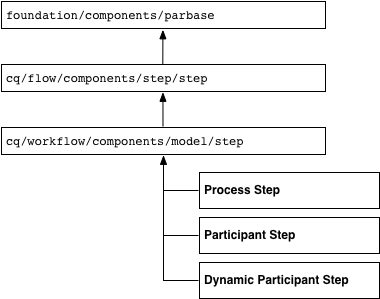

# 延伸工作流程功能{#extending-workflow-functionality}

本主題說明如何為工作流程開發自訂步驟元件，以及如何以程式設計方式與工作流程互動。

建立自訂工作流程步驟涉及下列活動：

* 開發工作流步驟元件。
* 以OSGi服務或ECMA指令碼的形式實施步驟功能。

您也可以[從程式和指令碼與工作流程互動](/help/sites-developing/workflows-program-interaction.md)。

## 工作流步驟元件——基本知識{#workflow-step-components-the-basics}

工作流步驟元件定義建立工作流模型時步驟的外觀和行為：

* 工作流側點中的類別和步驟名稱。
* 工作流模型中步驟的外觀。
* 用於配置元件屬性的編輯對話框。
* 在運行時執行的服務或指令碼。

與[all components](/help/sites-developing/components.md)一樣，工作流步驟元件繼承自為`sling:resourceSuperType`屬性指定的元件。 下圖顯示了構成所有工作流步驟元件基礎的`cq:component`節點的層次結構。 該圖還包括&#x200B;**處理步驟**、**參與者步驟**&#x200B;和&#x200B;**動態參與者步驟**&#x200B;元件，因為這些是開發自定義步驟元件最常見（和基本）的起點。



>[!CAUTION]
>
>您&#x200B;***必須***&#x200B;不要變更`/libs`路徑中的任何項目。
>
>這是因為下次升級實例時會覆寫`/libs`的內容（套用修補程式或功能套件時，很可能會覆寫）。
>
>配置和其他更改的建議方法為：
>
>1. 重新建立所需項目(即`/libs`中`/apps`下的項目
>2. 在`/apps`中進行任何更改


`/libs/cq/workflow/components/model/step`元件是&#x200B;**流程步驟**、**參與者步驟**&#x200B;和&#x200B;**動態參與者步驟**&#x200B;的最近共同祖先，它們均繼承以下項目：

* `step.jsp`

   `step.jsp`指令碼會在步驟元件新增至模型時呈現其標題。

   

* [cq:dialog](/help/sites-developing/developing-components.md#creating-and-configuring-a-dialog)

   具有以下頁籤的對話框：

   * **常見**:編輯標題和說明。
   * **進階**:編輯電子郵件通知屬性。

    

   >[!NOTE]
   >
   >當步驟元件的編輯對話框的頁籤與此預設外觀不匹配時，步驟元件具有定義的指令碼、節點屬性或對話框頁籤，這些頁籤覆蓋這些繼承的頁籤。

### ECMA指令碼{#ecma-scripts}

ECMA指令碼中提供以下對象（取決於步驟類型）:

* [WorkItemworkItem(工](https://helpx.adobe.com/experience-manager/6-5/sites/developing/using/reference-materials/javadoc/com/day/cq/workflow/exec/WorkItem.html) 作項目)
* [WorkflowSessionworkflow](https://helpx.adobe.com/experience-manager/6-5/sites/developing/using/reference-materials/javadoc/com/day/cq/workflow/WorkflowSession.html) Session
* [WorkflowDataworkflowData](https://helpx.adobe.com/experience-manager/6-5/sites/developing/using/reference-materials/javadoc/com/day/cq/workflow/exec/WorkflowData.html) 
* `args`:array with process arguments.

* `sling`:存取其他網站服務。
* `jcrSession`

### MetaDataMaps {#metadatamaps}

您可以使用工作流程中繼資料來保存工作流程期間所需的資訊。 工作流程步驟的常見要求是保存資料以供日後在工作流程中使用，或擷取持續的資料。

MetaDataMap物件有三種類型-`Workflow`、`WorkflowData`和`WorkItem`物件。 它們都有相同的目的——儲存中繼資料。

WorkItem有其自己的MetaDataMap，只能在該工作項目（如步驟）運行時使用。

`Workflow`和`WorkflowData`中繼資料地圖都會在整個工作流程中共用。 在這些情況下，建議僅使用`WorkflowData`中繼資料地圖。

## 建立自定義工作流步驟元件{#creating-custom-workflow-step-components}

工作流步驟元件可以以與任何其它元件](/help/sites-developing/components.md)相同的方式建立。[

要從其中一個（現有）基本步驟元件繼承，請向`cq:Component`節點添加以下屬性：

* 名稱: `sling:resourceSuperType`
* 類型: `String`
* 值：解析為基本元件的下列路徑之一：

   * `cq/workflow/components/model/process`
   * `cq/workflow/components/model/participant`
   * `cq/workflow/components/model/dynamic_participant`

### 指定步驟實例的預設標題和說明{#specifying-the-default-title-and-description-for-step-instances}

使用以下過程為&#x200B;**Common**&#x200B;頁籤上的&#x200B;**Title**&#x200B;和&#x200B;**Description**&#x200B;欄位指定預設值。

>[!NOTE]
>
>當滿足以下兩個要求時，欄位值將出現在步驟實例中：
>
>* 步驟的編輯對話框將標題和說明儲存在以下位置：>
>* `./jcr:title`
>* `./jcr:description` 位置

>
>  
當編輯對話框使用`/libs/cq/flow/components/step/step`元件實現的「常用」頁籤時，滿足此要求。
>
>* 該元件的步驟元件或祖先不會覆蓋`/libs/cq/flow/components/step/step`元件實施的`step.jsp`指令碼。


1. 在`cq:Component`節點下，添加以下節點：

   * 名稱: `cq:editConfig`
   * 類型: `cq:EditConfig`

   >[!NOTE]
   >
   >有關cq:editConfig節點的詳細資訊，請參閱[配置元件的編輯行為](/help/sites-developing/developing-components.md#configuring-the-edit-behavior)。

1. 在`cq:EditConfig`節點下，添加以下節點：

   * 名稱: `cq:formParameters`
   * 類型: `nt:unstructured`

1. 將以下名稱的`String`屬性添加到`cq:formParameters`節點：

   * `jcr:title`:該值填充「公 **** 用」(Common)頁籤的「 **** 標題」(Title)欄位。
   * `jcr:description`:該值填充「公用」( **** Common)頁籤的「說 **** 明」(Description)欄位。

### 在工作流元資料{#saving-property-values-in-workflow-metadata}中保存屬性值

>[!NOTE]
>
>請參閱[持續和訪問資料](#persisting-and-accessing-data)。 特別是，有關在運行時訪問屬性值的資訊，請參見[在運行時訪問對話框屬性值](#accessing-dialog-property-values-at-runtime)。

`cq:Widget`項目的名稱屬性指定儲存Widget值的JCR節點。 當工作流步驟元件對話框中的Widget將值儲存在`./metaData`節點下時，該值將添加到工作流`MetaDataMap`中。

例如，對話框中的文本欄位是`cq:Widget`節點，該節點具有以下屬性：

| 名稱 | 類型 | 值 |
|---|---|---|
| `xtype` | `String` | `textarea` |
| `name` | `String` | `./metaData/subject` |
| `fieldLabel` | `String` | `Email Subject` |

在此文本欄位中指定的值將添加到工作流實例的` [MetaDataMap](#metadatamaps)`對象中，並與`subject`鍵相關聯。

>[!NOTE]
>
>當鍵值為`PROCESS_ARGS`時，該值即可通過`args`變數在ECMA指令碼實現中使用。 在這種情況下，name屬性的值為`./metaData/PROCESS_ARGS.`

### 覆蓋步驟實施{#overriding-the-step-implementation}

每個基本步驟元件都可讓工作流程模型開發人員在設計時設定下列主要功能：

* 流程步驟：要在運行時執行的服務或ECMA指令碼。
* 參與者步驟：指派給所產生工作項目之使用者的ID。
* 動態參與者步驟：選擇指派工作項目之使用者ID的服務或ECMA指令碼。

若要將元件集中用於特定的工作流程藍本中，請在設計中設定關鍵功能，並移除模型開發人員變更它的功能。

1. 在cq:component節點下方，新增下列節點：

   * 名稱: `cq:editConfig`
   * 類型: `cq:EditConfig`

   有關cq:editConfig節點的詳細資訊，請參閱[配置元件的編輯行為](/help/sites-developing/developing-components.md#configuring-the-edit-behavior)。

1. 在cq:EditConfig節點下方，新增下列節點：

   * 名稱: `cq:formParameters`
   * 類型: `nt:unstructured`

1. 將`String`屬性添加到`cq:formParameters`節點。 元件super類型決定屬性的名稱：

   * 程序步驟: `PROCESS`
   * 參與者步驟: `PARTICIPANT`
   * 動態參與者步驟: `DYNAMIC_PARTICIPANT`

1. 指定屬性的值：

   * `PROCESS`:實施步驟行為的ECMA指令碼或服務的PID路徑。
   * `PARTICIPANT`:指派給工作項目之使用者的ID。
   * `DYNAMIC_PARTICIPANT`:指向ECMA指令碼或選擇用戶指派工作項的服務的PID的路徑。

1. 若要移除模型開發人員變更屬性值的能力，請覆寫元件super類型的對話方塊。

### 向參與者添加Forms和對話框步驟{#adding-forms-and-dialogs-to-participant-steps}

自訂參與者步驟元件，以提供[表單參與者步驟](/help/sites-developing/workflows-step-ref.md#form-participant-step)和[對話參與者步驟](/help/sites-developing/workflows-step-ref.md#dialog-participant-step)元件中的功能：

* 在使用者開啟產生的工作項目時，向使用者呈現表格。
* 當使用者完成產生的工作項目時，向使用者呈現自訂對話方塊。

在新元件上執行下列程式（請參閱[建立自訂工作流程步驟元件](#creating-custom-workflow-step-components)）:

1. 在`cq:Component`節點下，添加以下節點：

   * 名稱: `cq:editConfig`
   * 類型: `cq:EditConfig`

   有關cq:editConfig節點的詳細資訊，請參閱[配置元件的編輯行為](/help/sites-developing/components-basics.md#edit-behavior)。

1. 在cq:EditConfig節點下方，新增下列節點：

   * 名稱: `cq:formParameters`
   * 類型: `nt:unstructured`

1. 要在用戶開啟工作項時顯示表單，請將以下屬性添加到`cq:formParameters`節點：

   * 名稱: `FORM_PATH`
   * 類型: `String`
   * 值：解析為表單的路徑

1. 要在用戶完成工作項目時顯示自定義對話框，請將以下屬性添加到`cq:formParameters`節點

   * 名稱: `DIALOG_PATH`
   * 類型: `String`
   * 值：解析到對話框的路徑

### 配置工作流步驟運行時行為{#configuring-the-workflow-step-runtime-behavior}

在`cq:Component`節點下，添加`cq:EditConfig`節點。 在添加`nt:unstructured`節點（必須命名為`cq:formParameters`）後，該節點將添加以下屬性：

* 名稱: `PROCESS_AUTO_ADVANCE`

   * 類型: `Boolean`
   * 值:

      * 當設為`true`時，工作流將運行該步驟並繼續——這是預設值，也建議
      * 當`false`時，工作流將運行並停止；這需要額外處理，因此建議使用`true`

* 名稱: `DO_NOTIFY`

   * 類型: `Boolean`
   * 值：指出是否應針對使用者參與步驟傳送電子郵件通知（並假設郵件伺服器已正確設定）

## 保存和訪問資料{#persisting-and-accessing-data}

### 後續工作流程步驟的持續資料{#persisting-data-for-subsequent-workflow-steps}

您可以使用工作流程中繼資料來保存工作流程生命週期期間及各步驟之間所需的資訊。 工作流程步驟的常見要求是保存資料以供日後使用，或從先前步驟擷取持續的資料。

工作流元資料儲存在[`MetaDataMap`](#metadatamaps)對象中。 Java API提供[`Workflow.getWorkflowData`](https://helpx.adobe.com/experience-manager/6-5/sites/developing/using/reference-materials/javadoc/com/adobe/granite/workflow/exec/Workflow.html)方法，以傳回提供適當`MetaDataMap`物件的[`WorkflowData`](https://helpx.adobe.com/experience-manager/6-5/sites/developing/using/reference-materials/javadoc/com/adobe/granite/workflow/exec/WorkflowData.html)物件。 此`WorkflowData` `MetaDataMap`對象可用於步驟元件的OSGi服務或ECMA指令碼。

#### Java {#java}

`WorkflowProcess`實作的執行方法會傳遞`WorkItem`物件。 使用此對象可獲取當前工作流實例的`WorkflowData`對象。 下面的示例將一個項目添加到工作流`MetaDataMap`對象中，然後記錄每個項目。 (&quot;mykey&quot;, &quot;My Step Value&quot;)項目可用於工作流中的後續步驟。

```java
public void execute(WorkItem item, WorkflowSession session, MetaDataMap args) throws WorkflowException {

    MetaDataMap wfd = item.getWorkflow().getWorkflowData().getMetaDataMap();

    wfd.put("mykey", "My Step Value");

    Set<String> keyset = wfd.keySet();
    Iterator<String> i = keyset.iterator();
    while (i.hasNext()){
     Object key = i.next();
     log.info("The workflow medata includes key {} and value {}",key.toString(),wfd.get(key).toString());
    }
}
```

#### ECMA 指令碼 {#ecma-script}

`graniteWorkItem`變數是當前`WorkItem` Java對象的ECMA指令碼表示。 因此，您可以使用`graniteWorkItem`變數來取得工作流程中繼資料。 以下ECMA指令碼可用於實施&#x200B;**流程步驟**，以將項目添加到工作流`MetaDataMap`對象中，然後記錄每個項目。 這些項目隨後可用於工作流中的後續步驟。

>[!NOTE]
>
>步驟指令碼立即可用的`metaData`變數是步驟的中繼資料。 步驟中繼資料與工作流程中繼資料不同。

```
var currentDateInMillis = new Date().getTime();

graniteWorkItem.getWorkflowData().getMetaDataMap().put("hardcodedKey","theKey");

graniteWorkItem.getWorkflowData().getMetaDataMap().put("currentDateInMillisKey",currentDateInMillis);

var iterator = graniteWorkItem.getWorkflowData().getMetaDataMap().keySet().iterator();
while (iterator.hasNext()){
    var key = iterator.next();
    log.info("Workflow metadata key, value = " + key.toString() + ", " + graniteWorkItem.getWorkflowData().getMetaDataMap().get(key));
}
```

### 在運行時訪問對話框屬性值{#accessing-dialog-property-values-at-runtime}

工作流實例的`MetaDataMap`對象對於在整個工作流生命週期中儲存和檢索資料非常有用。 對於工作流步驟元件實施，`MetaDataMap`對於在運行時檢索元件屬性值特別有用。

>[!NOTE]
>
>有關配置元件對話框以將屬性儲存為工作流元資料的資訊，請參閱[在工作流元資料中保存屬性值](#saving-property-values-in-workflow-metadata)。

工作流`MetaDataMap`可用於Java和ECMA指令碼進程實現：

* 在WorkflowProcess介面的Java實現中，`args`參數是工作流的`MetaDataMap`對象。

* 在ECMA指令碼實施中，值可使用`args`和`metadata`變數。

### 範例：檢索進程步驟元件{#example-retrieving-the-arguments-of-the-process-step-component}的參數

**處理步驟**&#x200B;元件的編輯對話框包括&#x200B;**參數**&#x200B;屬性。 **Arguments**&#x200B;屬性的值儲存在工作流元資料中，並與`PROCESS_ARGS`鍵相關聯。

在下圖中，**Arguments**&#x200B;屬性的值為`argument1, argument2`:


#### Java {#java-1}

以下Java代碼是`WorkflowProcess`實施的`execute`方法。 該方法在`args` `MetaDataMap`中記錄與`PROCESS_ARGS`鍵關聯的值。

```java
public void execute(WorkItem item, WorkflowSession session, MetaDataMap args) throws WorkflowException {
     if (args.containsKey("PROCESS_ARGS")){
      log.info("workflow metadata for key PROCESS_ARGS and value {}",args.get("PROCESS_ARGS","string").toString());
     }
    }
```

當使用此Java實施的進程步驟執行時，日誌包含以下條目：

```xml
16.02.2018 12:07:39.566 *INFO* [JobHandler: /var/workflow/instances/server0/2018-02-16/model_855140139900189:/content/we-retail/de] com.adobe.example.workflow.impl.process.LogArguments workflow metadata for key PROCESS_ARGS and value argument1, argument2
```

#### ECMA 指令碼 {#ecma-script-1}

以下ECMA指令碼用作&#x200B;**進程步驟**&#x200B;的進程。 它記錄引數數和引數值：

```
var iterator = graniteWorkItem.getWorkflowData().getMetaDataMap().keySet().iterator();
while (iterator.hasNext()){
    var key = iterator.next();
    log.info("Workflow metadata key, value = " + key.toString() + ", " + graniteWorkItem.getWorkflowData().getMetaDataMap().get(key));
}
log.info("hardcodedKey "+ graniteWorkItem.getWorkflowData().getMetaDataMap().get("hardcodedKey"));
log.info("currentDateInMillisKey "+ graniteWorkItem.getWorkflowData().getMetaDataMap().get("currentDateInMillisKey"));
```

>[!NOTE]
>
>本節介紹如何使用流程步驟的參數。 此資訊也適用於動態參與者選擇器。

>[!NOTE]
>如需將元件屬性儲存在工作流程中繼資料中的另一個範例，請參閱範例：建立記錄程式工作流程步驟。 此範例包含一個對話方塊，可將中繼資料值與PROCESS_ARGS以外的索引鍵建立關聯。

### 指令碼和進程參數{#scripts-and-process-arguments}

在&#x200B;**處理步驟**&#x200B;元件的指令碼中，參數可通過`args`對象使用。

建立自定義步驟元件時，指令碼中提供了對象`metaData`。 此物件僅限於單一字串引數。

## 開發流程步驟實施{#developing-process-step-implementations}

在工作流進程中啟動進程步驟時，步驟會向OSGi服務發送請求或執行ECMA指令碼。 開發執行工作流程所需動作的服務或ECMA指令碼。

>[!NOTE]
>
>有關將流程步驟元件與服務或指令碼關聯的資訊，請參閱[流程步驟](/help/sites-developing/workflows-step-ref.md#process-step)或[覆蓋步驟實施](#overriding-the-step-implementation)。

### 使用Java類{#implementing-a-process-step-with-a-java-class}實現進程步驟

要將流程步驟定義為OSGI服務元件（Java包）:

1. 建立套件並將它部署至OSGI容器。 請參閱有關使用[CRXDE Lite](/help/sites-developing/developing-with-crxde-lite.md)或[Eclipse](/help/sites-developing/howto-projects-eclipse.md)建立搭售的檔案。

   >[!NOTE]
   >
   >OSGI元件需要使用其`execute()`方法實現`WorkflowProcess`介面。 請參閱下方的范常式式碼。

   >[!NOTE]
   >
   >需要將軟體包名稱添加到`maven-bundle-plugin`配置的`<*Private-Package*>`部分。

1. 添加SCR屬性`process.label`並根據需要設定值。 這將是使用通用&#x200B;**流程步驟**&#x200B;元件時列出的流程步驟的名稱。 請參閱以下範例。
1. 在&#x200B;**Models**&#x200B;編輯器中，使用通用&#x200B;**Process Step**&#x200B;元件將流程步驟添加到工作流中。
1. 在編輯對話框（**處理步驟**）中，轉至&#x200B;**處理**&#x200B;頁籤並選擇您的流程實施。
1. 如果在代碼中使用參數，請設定&#x200B;**進程參數**。 例如：false。
1. 保存步驟和工作流模型（模型編輯器的左上角）的更改。

Java方法（分別是實現可執行Java方法的類）註冊為OSGI服務，使您能夠在運行時隨時添加方法。

當裝載為頁面時，下列OSGI元件會將屬性`approved`新增至頁面內容節點：

```java
package com.adobe.example.workflow.impl.process;

import com.adobe.granite.workflow.WorkflowException;
import com.adobe.granite.workflow.WorkflowSession;
import com.adobe.granite.workflow.exec.WorkItem;
import com.adobe.granite.workflow.exec.WorkflowData;
import com.adobe.granite.workflow.exec.WorkflowProcess;
import com.adobe.granite.workflow.metadata.MetaDataMap;

import org.apache.felix.scr.annotations.Component;
import org.apache.felix.scr.annotations.Property;
import org.apache.felix.scr.annotations.Service;

import org.osgi.framework.Constants;

import javax.jcr.Node;
import javax.jcr.RepositoryException;
import javax.jcr.Session;

/**
 * Sample workflow process that sets an <code>approve</code> property to the payload based on the process argument value.
 */
@Component
@Service
public class MyProcess implements WorkflowProcess {

 @Property(value = "An example workflow process implementation.")
 static final String DESCRIPTION = Constants.SERVICE_DESCRIPTION;
 @Property(value = "Adobe")
 static final String VENDOR = Constants.SERVICE_VENDOR;
 @Property(value = "My Sample Workflow Process")
 static final String LABEL="process.label";

 private static final String TYPE_JCR_PATH = "JCR_PATH";

 public void execute(WorkItem item, WorkflowSession session, MetaDataMap args) throws WorkflowException {
  WorkflowData workflowData = item.getWorkflowData();
  if (workflowData.getPayloadType().equals(TYPE_JCR_PATH)) {
   String path = workflowData.getPayload().toString() + "/jcr:content";
   try {
    Session jcrSession = session.adaptTo(Session.class);
    Node node = (Node) jcrSession.getItem(path);
    if (node != null) {
     node.setProperty("approved", readArgument(args));
     jcrSession.save();
    }
   } catch (RepositoryException e) {
    throw new WorkflowException(e.getMessage(), e);
   }
  }
 }

 private boolean readArgument(MetaDataMap args) {
  String argument = args.get("PROCESS_ARGS", "false");
  return argument.equalsIgnoreCase("true");
 }
}
```

>[!NOTE]
>
>如果流程連續三次失敗，則項目會放在工作流管理員的「收件箱」中。

### 使用ECMAScript {#using-ecmascript}

ECMA指令碼可讓指令碼開發人員建置程式步驟。 這些指令碼位於JCR儲存庫中，並從中執行。

下表列出可立即處理指令碼的變數，提供對工作流程Java API物件的存取。

| Java類 | 指令碼變數名稱 | 說明 |
|---|---|---|
| `com.adobe.granite.workflow.exec.WorkItem` | `graniteWorkItem` | 當前步驟實例。 |
| `com.adobe.granite.workflow.WorkflowSession` | `graniteWorkflowSession` | 當前步驟實例的工作流會話。 |
| `String[]` （包含進程引數） | `args` | 步驟引數。 |
| `com.adobe.granite.workflow.metadata.MetaDataMap` | `metaData` | 當前步驟實例的元資料。 |
| `org.apache.sling.scripting.core.impl.InternalScriptHelper` | `sling` | 提供Sling執行時期環境的存取權。 |

以下示例指令碼演示如何訪問表示工作流裝載的JCR節點。 `graniteWorkflowSession`變數適用於JCR會話變數，該會話變數用於從有效載荷路徑獲得節點。

```
var workflowData = graniteWorkItem.getWorkflowData();
if (workflowData.getPayloadType() == "JCR_PATH") {
    var path = workflowData.getPayload().toString();
    var jcrsession = graniteWorkflowSession.adaptTo(Packages.javax.jcr.Session);
    var node = jcrsession.getNode(path);
    if (node.hasProperty("approved")){
     node.setProperty("approved", args[0] == "true" ? true : false);
     node.save();
 }
}
```

以下指令碼將檢查裝載是否為映像（`.png`檔案），從中建立黑白映像，並將其另存為同級節點。

```
var workflowData = graniteWorkItem.getWorkflowData();
if (workflowData.getPayloadType() == "JCR_PATH") {
    var path = workflowData.getPayload().toString();
    var jcrsession = graniteWorkflowSession.adaptTo(Packages.javax.jcr.Session);
    var node = jcrsession.getRootNode().getNode(path.substring(1));
     if (node.isNodeType("nt:file") && node.getProperty("jcr:content/jcr:mimeType").getString().indexOf("image/") == 0) {
        var is = node.getProperty("jcr:content/jcr:data").getStream();
        var layer = new Packages.com.day.image.Layer(is);
        layer.grayscale();
                var parent = node.getParent();
                var gn = parent.addNode("grey" + node.getName(), "nt:file");
        var content = gn.addNode("jcr:content", "nt:resource");
                content.setProperty("jcr:mimeType","image/png");
                var cal = Packages.java.util.Calendar.getInstance();
                content.setProperty("jcr:lastModified",cal);
                var f = Packages.java.io.File.createTempFile("test",".png");
        var tout = new Packages.java.io.FileOutputStream(f);
        layer.write("image/png", 1.0, tout);
        var fis = new Packages.java.io.FileInputStream(f);
                content.setProperty("jcr:data", fis);
                parent.save();
        tout.close();
        fis.close();
        is.close();
        f.deleteOnExit();
    }
}
```

要使用指令碼：

1. 建立指令碼(例如，CRXDE Lite)並將其保存在`/apps/myapp/workflow/scripts`下的儲存庫中
1. 要在&#x200B;**進程步驟**&#x200B;編輯對話框中指定標識指令碼的標題，請將以下屬性添加到指令碼的`jcr:content`節點：

   | 名稱 | 類型 | 值 |
   |---|---|---|
   | `jcr:mixinTypes` | `Name[]` | `mix:title` |
   | `jcr:title` | `String` | 要顯示在編輯對話框中的名稱。 |

1. 編輯&#x200B;**處理步驟**&#x200B;實例並指定要使用的指令碼。

## 開發參與者選擇器{#developing-participant-choosers}

您可以開發&#x200B;**動態參與者步驟**&#x200B;元件的參與者選擇器。

在工作流期間啟動&#x200B;**動態參與者步驟**&#x200B;元件時，該步驟需要確定可將生成的工作項目分配給的參與者。 要執行此操作，請執行以下步驟：

* 向OSGi服務發送請求
* 執行ECMA指令碼以選擇參與者

您可以開發服務或ECMA指令碼，根據工作流的要求選擇參與者。

>[!NOTE]
>
>有關將&#x200B;**動態參與者步驟**&#x200B;元件與服務或指令碼關聯的資訊，請參閱[動態參與者步驟](/help/sites-developing/workflows-step-ref.md#dynamic-participant-step)或[覆蓋步驟實施](#persisting-and-accessing-data)。

### 使用Java類{#developing-a-participant-chooser-using-a-java-class}開發參與者選擇器

要將參與者步驟定義為OSGI服務元件（Java類），請執行以下操作：

1. OSGI元件需要使用其`getParticipant()`方法實現`ParticipantStepChooser`介面。 請參閱下方的范常式式碼。

   建立套件並將它部署至OSGI容器。

1. 添加SCR屬性`chooser.label`並根據需要設定值。 這將是使用&#x200B;**動態參與者步驟**&#x200B;元件列出參與者選擇器的名稱。 請參閱範例：

   ```java
   package com.adobe.example.workflow.impl.process;
   
   import com.adobe.granite.workflow.WorkflowException;
   import com.adobe.granite.workflow.WorkflowSession;
   import com.adobe.granite.workflow.exec.ParticipantStepChooser;
   import com.adobe.granite.workflow.exec.WorkItem;
   import com.adobe.granite.workflow.exec.WorkflowData;
   import com.adobe.granite.workflow.metadata.MetaDataMap;
   
   import org.apache.felix.scr.annotations.Component;
   import org.apache.felix.scr.annotations.Property;
   import org.apache.felix.scr.annotations.Service;
   
   import org.osgi.framework.Constants;
   
   /**
    * Sample dynamic participant step that determines the participant based on a path given as argument.
    */
   @Component
   @Service
   
   public class MyDynamicParticipant implements ParticipantStepChooser {
   
    @Property(value = "An example implementation of a dynamic participant chooser.")
    static final String DESCRIPTION = Constants.SERVICE_DESCRIPTION;
       @Property(value = "Adobe")
       static final String VENDOR = Constants.SERVICE_VENDOR;
       @Property(value = "Dynamic Participant Chooser Process")
       static final String LABEL=ParticipantStepChooser.SERVICE_PROPERTY_LABEL;
   
       private static final String TYPE_JCR_PATH = "JCR_PATH";
   
       public String getParticipant(WorkItem workItem, WorkflowSession workflowSession, MetaDataMap args) throws WorkflowException {
           WorkflowData workflowData = workItem.getWorkflowData();
           if (workflowData.getPayloadType().equals(TYPE_JCR_PATH)) {
               String path = workflowData.getPayload().toString();
               String pathFromArgument = args.get("PROCESS_ARGS", String.class);
               if (pathFromArgument != null && path.startsWith(pathFromArgument)) {
                   return "admin";
               }
           }
           return "administrators";
       }
   }
   ```

1. 在&#x200B;**Models**&#x200B;編輯器中，使用通用&#x200B;**Dynamic Participant Step**&#x200B;元件將動態參與者步驟添加到工作流中。
1. 在編輯對話框中，選擇&#x200B;**參與者選擇器**&#x200B;頁籤並選擇您的選擇器實施。
1. 如果在代碼中使用參數，請設定&#x200B;**進程參數**。 對於此示例：`/content/we-retail/de`。
1. 保存步驟和工作流模型的更改。

### 使用ECMA指令碼{#developing-a-participant-chooser-using-an-ecma-script}開發參與者選擇器

您可以建立ECMA指令碼，該指令碼選擇分配了&#x200B;**參與者步驟**&#x200B;生成的工作項的用戶。 該指令碼必須包含名為`getParticipant`的函式，該函式不需要參數，並返回包含用戶或組ID的`String`。

指令碼位於JCR儲存庫中，並從中執行。

下表列出可立即存取指令碼中工作流程Java物件的變數。

| Java類 | 指令碼變數名稱 |
|---|---|
| `com.adobe.granite.workflow.exec.WorkItem` | `graniteWorkItem` |
| `com.adobe.granite.workflow.WorkflowSession` | `graniteWorkflowSession` |
| `String[]` （包含進程引數） | `args` |
| `com.adobe.granite.workflow.metadata.MetaDataMap` | `metaData` |
| `org.apache.sling.scripting.core.impl.InternalScriptHelper` | `sling` |

```
function getParticipant() {
    var workflowData = graniteWorkItem.getWorkflowData();
    if (workflowData.getPayloadType() == "JCR_PATH") {
        var path = workflowData.getPayload().toString();
        if (path.indexOf("/content/we-retail/de") == 0) {
            return "admin";
        } else {
            return "administrators";
        }
    }
}
```

1. 建立指令碼(例如，CRXDE Lite)並將其保存在`/apps/myapp/workflow/scripts`下的儲存庫中
1. 要在&#x200B;**進程步驟**&#x200B;編輯對話框中指定標識指令碼的標題，請將以下屬性添加到指令碼的`jcr:content`節點：

   | 名稱 | 類型 | 值 |
   |---|---|---|
   | `jcr:mixinTypes` | `Name[]` | `mix:title` |
   | `jcr:title` | `String` | 要顯示在編輯對話框中的名稱。 |

1. 編輯[動態參與者步驟](/help/sites-developing/workflows-step-ref.md#dynamic-participant-step)例項並指定要使用的指令碼。

## 處理工作流包{#handling-workflow-packages}

[工作流](/help/sites-authoring/workflows-applying.md#specifying-workflow-details-in-the-create-workflow-wizard) 程套件可以傳遞至工作流程進行處理。工作流程套件包含對資源（例如頁面和資產）的參考。

>[!NOTE]
>
>下列工作流程程式步驟接受大量頁面啟動的工作流程套件：
>
>* [`com.day.cq.wcm.workflow.process.ActivatePageProcess`](https://helpx.adobe.com/experience-manager/6-5/sites/developing/using/reference-materials/javadoc/com/day/cq/wcm/workflow/process/ActivatePageProcess.html)
>* [`com.day.cq.wcm.workflow.process.DeactivatePageProcess`](https://helpx.adobe.com/experience-manager/6-5/sites/developing/using/reference-materials/javadoc/com/day/cq/wcm/workflow/process/DeactivatePageProcess.html)

>


您可以開發工作流步驟，以獲取包資源並對其進行處理。 `com.day.cq.workflow.collection`包的以下成員提供對工作流包的訪問：

* `ResourceCollection`:工作流包類。
* `ResourceCollectionUtil`:用於檢索ResourceCollection對象。
* `ResourceCollectionManager`:建立和擷取系列。實作部署為OSGi服務。

以下Java類示例演示了如何獲取包資源：

```java
package com.adobe.example;

import java.util.ArrayList;
import java.util.List;

import com.day.cq.workflow.WorkflowException;
import com.day.cq.workflow.WorkflowSession;
import com.day.cq.workflow.collection.ResourceCollection;
import com.day.cq.workflow.collection.ResourceCollectionManager;
import com.day.cq.workflow.collection.ResourceCollectionUtil;
import com.day.cq.workflow.exec.WorkItem;
import com.day.cq.workflow.exec.WorkflowData;
import com.day.cq.workflow.exec.WorkflowProcess;
import com.day.cq.workflow.metadata.MetaDataMap;

import org.apache.felix.scr.annotations.Component;
import org.apache.felix.scr.annotations.Property;
import org.apache.felix.scr.annotations.Service;
import org.apache.felix.scr.annotations.Reference;
import org.osgi.framework.Constants;

import org.slf4j.Logger;
import org.slf4j.LoggerFactory;

import javax.jcr.Node;
import javax.jcr.PathNotFoundException;
import javax.jcr.RepositoryException;
import javax.jcr.Session;

@Component
@Service
public class LaunchBulkActivate implements WorkflowProcess {

 private static final Logger log = LoggerFactory.getLogger(LaunchBulkActivate.class);

 @Property(value="Bulk Activate for Launches")
  static final String PROCESS_NAME ="process.label";
 @Property(value="A sample workflow process step to support Launches bulk activation of pages")
 static final String SERVICE_DESCRIPTION = Constants.SERVICE_DESCRIPTION;

 @Reference
 private ResourceCollectionManager rcManager;
public void execute(WorkItem workItem, WorkflowSession workflowSession) throws Exception {
    Session session = workflowSession.getSession();
    WorkflowData data = workItem.getWorkflowData();
    String path = null;
    String type = data.getPayloadType();
    if (type.equals(TYPE_JCR_PATH) && data.getPayload() != null) {
        String payloadData = (String) data.getPayload();
        if (session.itemExists(payloadData)) {
            path = payloadData;
        }
    } else if (data.getPayload() != null && type.equals(TYPE_JCR_UUID)) {
        Node node = session.getNodeByUUID((String) data.getPayload());
        path = node.getPath();
    }

    // CUSTOMIZED CODE IF REQUIRED....

    if (path != null) {
        // check for resource collection
        ResourceCollection rcCollection = ResourceCollectionUtil.getResourceCollection((Node)session.getItem(path), rcManager);
        // get list of paths to replicate (no resource collection: size == 1
        // otherwise size >= 1
        List<String> paths = getPaths(path, rcCollection);
        for (String aPath: paths) {

            // CUSTOMIZED CODE....

        }
    } else {
        log.warn("Cannot process because path is null for this " + "workitem: " + workItem.toString());
    }
}

/**
 * helper
 */
private List<String> getPaths(String path, ResourceCollection rcCollection) {
    List<String> paths = new ArrayList<String>();
    if (rcCollection == null) {
        paths.add(path);
    } else {
        log.debug("ResourceCollection detected " + rcCollection.getPath());
        // this is a resource collection. the collection itself is not
        // replicated. only its members
        try {
            List<Node> members = rcCollection.list(new String[]{"cq:Page", "dam:Asset"});
            for (Node member: members) {
                String mPath = member.getPath();
                paths.add(mPath);
            }
        } catch(RepositoryException re) {
            log.error("Cannot build path list out of the resource collection " + rcCollection.getPath());
        }
    }
    return paths;
}
}
```

## 範例：建立自訂步驟{#example-creating-a-custom-step}

開始建立您自訂步驟的簡單方式，是從下列位置複製現有步驟：

`/libs/cq/workflow/components/model`

### 建立基本步驟{#creating-the-basic-step}

1. 在/apps下重新建立路徑；例如：

   `/apps/cq/workflow/components/model`

   新資料夾的類型為`nt:folder`:

   ```xml
   - apps
     - cq
       - workflow (nt:folder)
         - components (nt:folder)
           - model (nt:folder)
   ```

   >[!NOTE]
   >
   >此步驟不適用於傳統UI模型編輯器。

1. 然後將複製的步驟置於/apps檔案夾中；例如：

   `/apps/cq/workflow/components/model/myCustomStep`

   以下是我們自訂範例步驟的結果：

   

   >[!CAUTION]
   >
   >因為在標準UI中，卡片上不會顯示標題而非詳細資訊，所以不需要`details.jsp`，就像傳統UI編輯器一樣。

1. 將以下屬性應用於節點：

   `/apps/cq/workflow/components/model/myCustomStep`

   **相關物業：**

   * `sling:resourceSuperType`

      必須繼承現有步驟。

      在此範例中，我們繼承了`cq/workflow/components/model/step`的基本步驟，但您可以使用其他超類型，如`participant`、`process`等。

   * `jcr:title`

      是當元件列在步驟瀏覽器（工作流模型編輯器的左側面板）中時顯示的標題。

   * `cq:icon`

      用於指定步驟的[珊瑚表徵圖](https://helpx.adobe.com/experience-manager/6-5/sites/developing/using/reference-materials/coral-ui/coralui3/Coral.Icon.html)。

   * `componentGroup`

      必須是下列其中一項：

      * Collaboration 工作流程
      * DAM 工作流程
      * 表單工作流程
      * 專案
      * WCM 工作流程
      * 工作流程

   

1. 您現在可以開啟工作流程模型進行編輯。 在步驟瀏覽器中，您可以篩選以查看&#x200B;**我的自訂步驟**:

   

   將&#x200B;**我的自訂步驟**&#x200B;拖曳至模型時，會顯示卡片：

   

   如果尚未為步驟定義`cq:icon`，則使用標題的前兩個字母來呈現預設表徵圖。 例如：

   

#### 定義步驟配置對話框{#defining-the-step-configure-dialog}

在[建立基本步驟](#creating-the-basic-step)後，按如下方式定義步驟&#x200B;**配置**&#x200B;對話框：

1. 按如下方式配置節點`cq:editConfig`上的屬性：

   **相關物業：**

   * `cq:inherit`

      如果設定為`true`，則您的步驟元件將繼承您在`sling:resourceSuperType`中指定的步驟的屬性。

   * `cq:disableTargeting`

      視需要設定。
   

1. 按如下方式配置節點`cq:formsParameter`上的屬性：

   **相關物業：**

   * `jcr:title`

      在模型映射和&#x200B;**我的自定義——步驟屬性**&#x200B;配置對話框的&#x200B;**標題**&#x200B;欄位中設定步驟卡的預設標題。

   * 您也可以定義自己的自訂屬性。

   

1. 在節點`cq:listeners`上配置屬性。

   `cq:listener`節點及其屬性可讓您在觸控式UI模型編輯器中設定回應事件的事件處理常式；例如將步驟拖曳至模型頁面或編輯步驟屬性。

   **地產：**

   * `afterMove: REFRESH_PAGE`
   * `afterdelete: CQ.workflow.flow.Step.afterDelete`
   * `afteredit: CQ.workflow.flow.Step.afterEdit`
   * `afterinsert: CQ.workflow.flow.Step.afterInsert`

   此組態是編輯器正常運作的必備組態。 在大多數情況下，此配置不能更改。

   不過，將`cq:inherit`設為true（在`cq:editConfig`節點上，請參閱上面）可讓您繼承此組態，而不需將它明確納入步驟定義中。 如果沒有繼承，則您需要添加具有以下屬性和值的節點。

   在此示例中，繼承已激活，因此我們可以刪除`cq:listeners`節點，並且該步驟仍可以正確運行。

   

1. 您現在可以新增步驟的例項至工作流程模型。 當您&#x200B;**設定**&#x200B;步驟時，您會看到對話方塊：

    

#### 此示例{#sample-markup-used-in-this-example}中使用的標籤示例

自定義步驟的標籤表示在元件根節點的`.content.xml`中。 此示例使用的示例`.content.xml` :

`/apps/cq/workflow/components/model/myCustomStep/.content.xml`

```xml
<?xml version="1.0" encoding="UTF-8"?>
<jcr:root xmlns:sling="https://sling.apache.org/jcr/sling/1.0" xmlns:cq="https://www.day.com/jcr/cq/1.0" xmlns:jcr="https://www.jcp.org/jcr/1.0"
    cq:icon="bell"
    jcr:primaryType="cq:Component"
    jcr:title="My Custom Step"
    sling:resourceSuperType="cq/workflow/components/model/process"
    allowedParents="[*/parsys]"
    componentGroup="Workflow"/>
```

此示例中使用的`_cq_editConfig.xml`示例：

```xml
<?xml version="1.0" encoding="UTF-8"?>
<jcr:root xmlns:cq="https://www.day.com/jcr/cq/1.0" xmlns:jcr="https://www.jcp.org/jcr/1.0" xmlns:nt="https://www.jcp.org/jcr/nt/1.0"
    cq:disableTargeting="{Boolean}true"
    cq:inherit="{Boolean}true"
    jcr:primaryType="cq:EditConfig">
    <cq:formParameters
        jcr:primaryType="nt:unstructured"
        jcr:title="My Custom Step Card"
        SAMPLE_PROPERY="sample value"/>
    <cq:listeners
        jcr:primaryType="cq:EditListenersConfig"
        afterdelete="CQ.workflow.flow.Step.afterDelete"
        afteredit="CQ.workflow.flow.Step.afterEdit"
        afterinsert="CQ.workflow.flow.Step.afterInsert"
        afterMove="REFRESH_PAGE"/>
</jcr:root>
```

此示例中使用的`_cq_dialog/.content.xml`示例：

```xml
<?xml version="1.0" encoding="UTF-8"?>
<jcr:root xmlns:sling="https://sling.apache.org/jcr/sling/1.0" xmlns:cq="https://www.day.com/jcr/cq/1.0" xmlns:jcr="https://www.jcp.org/jcr/1.0" xmlns:nt="https://www.jcp.org/jcr/nt/1.0"
    jcr:primaryType="nt:unstructured"
    jcr:title="My Custom - Step Properties"
    sling:resourceType="cq/gui/components/authoring/dialog">
    <content
        jcr:primaryType="nt:unstructured"
        sling:resourceType="granite/ui/components/coral/foundation/tabs">
        <items jcr:primaryType="nt:unstructured">
            <common
                cq:hideOnEdit="true"
                jcr:primaryType="nt:unstructured"
                jcr:title="Common"
                sling:resourceType="granite/ui/components/coral/foundation/fixedcolumns"/>
            <process
                cq:hideOnEdit="true"
                jcr:primaryType="nt:unstructured"
                jcr:title="Process"
                sling:resourceType="granite/ui/components/coral/foundation/fixedcolumns"/>
            <mycommon
                jcr:primaryType="nt:unstructured"
                jcr:title="Common"
                sling:resourceType="granite/ui/components/coral/foundation/fixedcolumns">
                <items jcr:primaryType="nt:unstructured">
                    <columns
                        jcr:primaryType="nt:unstructured"
                        sling:resourceType="granite/ui/components/coral/foundation/container">
                        <items jcr:primaryType="nt:unstructured">
                            <title
                                jcr:primaryType="nt:unstructured"
                                sling:resourceType="granite/ui/components/coral/foundation/form/textfield"
                                fieldLabel="Title"
                                name="./jcr:title"/>
                            <description
                                jcr:primaryType="nt:unstructured"
                                sling:resourceType="granite/ui/components/coral/foundation/form/textarea"
                                fieldLabel="Description"
                                name="./jcr:description"/>
                        </items>
                    </columns>
                </items>
            </mycommon>
            <advanced
                jcr:primaryType="nt:unstructured"
                jcr:title="Advanced"
                sling:resourceType="granite/ui/components/coral/foundation/fixedcolumns">
                <items jcr:primaryType="nt:unstructured">
                    <columns
                        jcr:primaryType="nt:unstructured"
                        sling:resourceType="granite/ui/components/coral/foundation/container">
                        <items jcr:primaryType="nt:unstructured">
                            <email
                                jcr:primaryType="nt:unstructured"
                                sling:resourceType="granite/ui/components/coral/foundation/form/checkbox"
                                fieldDescription="Notify user via email."
                                fieldLabel="Email"
                                name="./metaData/PROCESS_AUTO_ADVANCE"
                                text="Notify user via email."
                                value="true"/>
                        </items>
                    </columns>
                </items>
            </advanced>
        </items>
    </content>
</jcr:root>
```

>[!NOTE]
>
>注意對話框定義中的公共節點和進程節點。 這些繼承自我們用作自訂步驟超類型的流程步驟：
>
>`sling:resourceSuperType : cq/workflow/components/model/process`

>[!NOTE]
>
>傳統的UI模型編輯器對話框仍可與標準的觸控式UI編輯器搭配使用。
>
>如果您AEM想要將傳統的UI步驟對話方塊升級為標準的UI對話方塊，則具有[現代化工具](/help/sites-developing/modernization-tools.md)。 轉換後，某些情況下仍可對對話方塊進行一些手動改進。
>
>* 如果升級的對話框為空，您可以查看`/libs`中與如何提供解決方案示例功能相似的對話框。 例如：
   >
   >
* `/libs/cq/workflow/components/model`
>* `/libs/cq/workflow/components/workflow`
>* `/libs/dam/components`
>* `/libs/wcm/workflow/components/autoassign`
>* `/libs/cq/projects`

>
>  
您不得修改`/libs`中的任何內容，只要將它們用作範例即可。 如果您想要利用任何現有步驟，請將它們複製到`/apps`並在此處修改。
