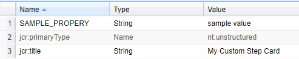

# 延伸工作流程功能{#extending-workflow-functionality}

本主題說明如何為工作流程開發自訂步驟元件，以及如何以程式設計方式與工作流程互動。

建立自訂工作流程步驟涉及以下活動：

* 開發工作流程步驟元件。
* 以OSGi服務或ECMA指令碼形式實作步驟功能。

您也可以[從程式和指令碼與工作流程互動](/help/sites-developing/workflows-program-interaction.md)。

## 工作流程步驟元件 — 基本知識 {#workflow-step-components-the-basics}

工作流程步驟元件定義步驟在建立工作流程模型時的外觀和行為：

* 工作流程Sidekick中的類別和步驟名稱。
* 工作流程模型中步驟的外觀。
* 用於設定元件屬性的編輯對話方塊。
* 在執行階段執行的服務或指令碼。

與[所有元件](/help/sites-developing/components.md)一樣，工作流程步驟元件繼承自為`sling:resourceSuperType`屬性指定的元件。 下圖顯示構成所有工作流程步驟元件基礎的`cq:component`節點階層。 此圖表也包含&#x200B;**處理步驟**、**參與者步驟**&#x200B;和&#x200B;**動態參與者步驟**&#x200B;元件，因為這些是開發自訂步驟元件最常見（也是最基本）的起點。


>[!CAUTION]
>
>您&#x200B;***必須***&#x200B;不要變更`/libs`路徑中的任何專案。
>
>這是因為下次升級執行個體時，`/libs`的內容會被覆寫（當您套用Hotfix或Feature Pack時，這些內容很可能會被覆寫）。
>
>設定和其他變更的建議方法是：
>
>1. 重新建立必要專案（亦即，該專案存在於`/apps`下的`/libs`中）
>2. 在`/apps`中進行任何變更

`/libs/cq/workflow/components/model/step`元件是&#x200B;**處理序步驟**、**參與者步驟**&#x200B;和&#x200B;**動態參與者步驟**&#x200B;的最近共同祖項，這些步驟都繼承下列專案：

* `step.jsp`

  將`step.jsp`指令碼新增到模型時，會呈現步驟元件的標題。

  

* [cq：dialog](/help/sites-developing/developing-components.md#creating-and-configuring-a-dialog)

  具有下列索引標籤的對話方塊：

   * **一般**：用於編輯標題和說明。
   * **進階**：用於編輯電子郵件通知內容。

   

  >[!NOTE]
  >
  >當步驟元件的「編輯」對話方塊的索引標籤不符合此預設外觀時，步驟元件已定義指令碼、節點屬性或對話方塊索引標籤，以覆寫這些繼承的索引標籤。

### ECMA指令碼 {#ecma-scripts}

下列物件在ECMA指令碼中可供使用（視步驟型別而定）：

* [工作專案](https://helpx.adobe.com/experience-manager/6-5/sites/developing/using/reference-materials/javadoc/com/day/cq/workflow/exec/WorkItem.html)工作專案
* [工作流程工作階段](https://helpx.adobe.com/experience-manager/6-5/sites/developing/using/reference-materials/javadoc/com/day/cq/workflow/WorkflowSession.html)工作流程工作階段
* [工作流程資料](https://helpx.adobe.com/experience-manager/6-5/sites/developing/using/reference-materials/javadoc/com/day/cq/workflow/exec/WorkflowData.html)工作流程資料
* `args`：具有處理序引數的陣列。

* `sling`：存取其他osgi服務。
* `jcrSession`

### 中繼資料地圖 {#metadatamaps}

您可以使用工作流程中繼資料來儲存工作流程期限期間所需的資訊。 工作流程步驟的常見要求是儲存資料以供日後在工作流程中使用，或擷取儲存的資料。

有三種型別的MetaDataMap物件 — 針對`Workflow`、`WorkflowData`和`WorkItem`物件。 它們有相同的預期用途 — 儲存中繼資料。

工作專案有自己的MetaDataMap，只能在該工作專案（例如步驟）執行時使用。

`Workflow`和`WorkflowData`中繼資料地圖會在整個工作流程中共用。 對於這些情況，建議僅使用`WorkflowData`中繼資料對應。

## 建立自訂工作流程步驟元件 {#creating-custom-workflow-step-components}

工作流程步驟元件可以[以與任何其他元件](/help/sites-developing/components.md)相同的方式建立。

若要繼承自其中一個（現有）基本步驟元件，請將下列屬性新增至`cq:Component`節點：

* 名稱：`sling:resourceSuperType`
* 類型：`String`
* 值：解析為基本元件的下列路徑之一：

   * `cq/workflow/components/model/process`
   * `cq/workflow/components/model/participant`
   * `cq/workflow/components/model/dynamic_participant`

### 指定步驟例項的預設標題和說明 {#specifying-the-default-title-and-description-for-step-instances}

使用以下程式，為&#x200B;**一般**&#x200B;索引標籤上的&#x200B;**標題**&#x200B;和&#x200B;**描述**&#x200B;欄位指定預設值。

>[!NOTE]
>
>當滿足以下兩個要求時，欄位值會出現在步驟例項上：
>
>* 步驟的編輯對話方塊會將標題和說明儲存在以下位置： >
>* `./jcr:title`
>* `./jcr:description`個位置
>
>  當編輯對話方塊使用`/libs/cq/flow/components/step/step`元件實作的Common索引標籤時，即可滿足此需求。
>
>* 步驟元件或元件的祖項不會覆寫`/libs/cq/flow/components/step/step`元件實作的`step.jsp`指令碼。

1. 在`cq:Component`節點底下，新增下列節點：

   * 名稱：`cq:editConfig`
   * 類型：`cq:EditConfig`

   >[!NOTE]
   >
   >如需cq：editConfig節點的詳細資訊，請參閱[設定元件的編輯行為](/help/sites-developing/developing-components.md#configuring-the-edit-behavior)。

1. 在`cq:EditConfig`節點底下，新增下列節點：

   * 名稱：`cq:formParameters`
   * 類型：`nt:unstructured`

1. 將下列名稱的`String`屬性新增至`cq:formParameters`節點：

   * `jcr:title`：值填入&#x200B;**一般**&#x200B;索引標籤的&#x200B;**標題**&#x200B;欄位。
   * `jcr:description`：值會填入&#x200B;**一般**&#x200B;索引標籤的&#x200B;**描述**&#x200B;欄位。

### 在工作流程中繼資料中儲存屬性值 {#saving-property-values-in-workflow-metadata}

>[!NOTE]
>
>檢視[儲存及存取資料](#persisting-and-accessing-data)。 特別是，如需有關在執行階段存取屬性值的資訊，請參閱[在執行階段存取對話方塊屬性值](#accessing-dialog-property-values-at-runtime)。

`cq:Widget`專案的name屬性指定儲存介面工具集值的JCR節點。 在工作流程步驟元件的對話方塊中，當Widget將值儲存在`./metaData`節點下方時，值會新增至工作流程`MetaDataMap`。

例如，對話方塊中的文字欄位是具有以下屬性的`cq:Widget`節點：

| 名稱 | 類型 | 值 |
|---|---|---|
| `xtype` | `String` | `textarea` |
| `name` | `String` | `./metaData/subject` |
| `fieldLabel` | `String` | `Email Subject` |

此文字欄位中指定的值已新增至工作流程執行個體的` [MetaDataMap](#metadatamaps)`物件，且與`subject`索引鍵相關聯。

>[!NOTE]
>
>當索引鍵為`PROCESS_ARGS`時，ECMA指令碼實作中可透過`args`變數隨時使用該值。 在這種情況下，name屬性的值為`./metaData/PROCESS_ARGS.`

### 覆寫步驟實施 {#overriding-the-step-implementation}

每個基本步驟元件可讓工作流程模型開發人員在設計時設定以下主要功能：

* 處理步驟：要在執行階段執行的服務或ECMA指令碼。
* 參與者步驟：指定已產生工作專案之使用者的識別碼。
* 動態參與者步驟：選取指派工作專案之使用者ID的服務或ECMA指令碼。

若要將焦點設定在特定工作流程案例中使用的元件，請設定設計中的關鍵功能，並移除模型開發人員變更該元件的功能。

1. 在cq：component節點底下，新增以下節點：

   * 名稱：`cq:editConfig`
   * 類型：`cq:EditConfig`

   如需cq：editConfig節點的詳細資訊，請參閱[設定元件的編輯行為](/help/sites-developing/developing-components.md#configuring-the-edit-behavior)。

1. 在cq：EditConfig節點底下，新增以下節點：

   * 名稱：`cq:formParameters`
   * 類型：`nt:unstructured`

1. 將`String`屬性新增至`cq:formParameters`節點。 元件超級型別會決定屬性的名稱：

   * 處理序步驟： `PROCESS`
   * 參與者步驟： `PARTICIPANT`
   * 動態參與者步驟： `DYNAMIC_PARTICIPANT`

1. 指定屬性的值：

   * `PROCESS`：實作步驟行為之ECMA指令碼或服務的PID的路徑。
   * `PARTICIPANT`：指派工作專案之使用者的識別碼。
   * `DYNAMIC_PARTICIPANT`： ECMA指令碼的路徑，或選擇使用者指派工作專案之服務的PID。

1. 若要移除模型開發人員變更屬性值的功能，請覆寫元件超級型別的對話方塊。

### 新增Forms和對話方塊至參與者步驟 {#adding-forms-and-dialogs-to-participant-steps}

自訂您的參與者步驟元件，以提供在[表單參與者步驟](/help/sites-developing/workflows-step-ref.md#form-participant-step)和[對話方塊參與者步驟](/help/sites-developing/workflows-step-ref.md#dialog-participant-step)元件中找到的功能：

* 當使用者開啟產生的工作專案時，向他們展示表單。
* 當使用者完成產生的工作專案時，向他們顯示自訂對話方塊。

在新元件上執行下列程式（請參閱[建立自訂工作流程步驟元件](#creating-custom-workflow-step-components)）：

1. 在`cq:Component`節點底下，新增下列節點：

   * 名稱：`cq:editConfig`
   * 類型：`cq:EditConfig`

   如需cq：editConfig節點的詳細資訊，請參閱[設定元件的編輯行為](/help/sites-developing/components-basics.md#edit-behavior)。

1. 在cq：EditConfig節點底下，新增以下節點：

   * 名稱：`cq:formParameters`
   * 類型：`nt:unstructured`

1. 若要在使用者開啟工作專案時顯示表單，請將下列屬性新增至`cq:formParameters`節點：

   * 名稱：`FORM_PATH`
   * 類型：`String`
   * 值：解析為表單的路徑

1. 若要在使用者完成工作專案時顯示自訂對話方塊，請將下列屬性新增至`cq:formParameters`節點

   * 名稱：`DIALOG_PATH`
   * 類型：`String`
   * 值：解析至對話方塊的路徑

### 設定工作流程步驟執行階段行為 {#configuring-the-workflow-step-runtime-behavior}

在`cq:Component`節點底下，新增`cq:EditConfig`節點。 在該節點下方新增`nt:unstructured`節點（必須命名為`cq:formParameters`），並新增下列屬性至該節點：

* 名稱：`PROCESS_AUTO_ADVANCE`

   * 類型：`Boolean`
   * 值：

      * 設定為`true`時，工作流程將執行該步驟並繼續 — 這是預設值，也建議使用
      * 當`false`時，工作流程將執行並停止；這需要額外的處理，因此建議`true`

* 名稱：`DO_NOTIFY`

   * 類型：`Boolean`
   * 值：指出是否應該針對使用者參與步驟傳送電子郵件通知（並假設郵件伺服器已正確設定）

## 保留和存取資料 {#persisting-and-accessing-data}

### 保留資料以供後續工作流程步驟使用 {#persisting-data-for-subsequent-workflow-steps}

您可以使用工作流程中繼資料來儲存工作流程存留期期間以及步驟之間所需的資訊。 工作流程步驟的常見要求是儲存資料以供未來使用，或從先前步驟中擷取儲存的資料。

工作流程中繼資料儲存在[`MetaDataMap`](#metadatamaps)物件中。 Java API提供[`Workflow.getWorkflowData`](https://helpx.adobe.com/experience-manager/6-5/sites/developing/using/reference-materials/javadoc/com/adobe/granite/workflow/exec/Workflow.html)方法，以傳回提供適當`MetaDataMap`物件的[`WorkflowData`](https://helpx.adobe.com/experience-manager/6-5/sites/developing/using/reference-materials/javadoc/com/adobe/granite/workflow/exec/WorkflowData.html)物件。 此`WorkflowData` `MetaDataMap`物件可用於步驟元件的OSGi服務或ECMA指令碼。

#### Java {#java}

`WorkflowProcess`實作的執行方法傳遞至`WorkItem`物件。 使用此物件來取得目前工作流程執行個體的`WorkflowData`物件。 下列範例將專案新增至工作流程`MetaDataMap`物件，然後記錄每個專案。 （「我的金鑰」、「我的步驟值」）專案可用於工作流程中的後續步驟。

```java
public void execute(WorkItem item, WorkflowSession session, MetaDataMap args) throws WorkflowException {

    MetaDataMap wfd = item.getWorkflow().getWorkflowData().getMetaDataMap();

    wfd.put("mykey", "My Step Value");

    Set<String> keyset = wfd.keySet();
    Iterator<String> i = keyset.iterator();
    while (i.hasNext()){
     Object key = i.next();
     log.info("The workflow medata includes key {} and value {}",key.toString(),wfd.get(key).toString());
    }
}
```

#### ECMA 指令碼 {#ecma-script}

`graniteWorkItem`變數是目前`WorkItem` Java物件的ECMA指令碼表示法。 因此，您可以使用`graniteWorkItem`變數來取得工作流程中繼資料。 下列ECMA指令碼可用來實作&#x200B;**處理步驟**，以將專案新增至工作流程`MetaDataMap`物件，然後記錄每個專案。 這些專案隨後可用於工作流程中的後續步驟。

>[!NOTE]
>
>步驟指令碼可立即使用的`metaData`變數是步驟的中繼資料。 步驟中繼資料與工作流程中繼資料不同。

```
var currentDateInMillis = new Date().getTime();

graniteWorkItem.getWorkflowData().getMetaDataMap().put("hardcodedKey","theKey");

graniteWorkItem.getWorkflowData().getMetaDataMap().put("currentDateInMillisKey",currentDateInMillis);

var iterator = graniteWorkItem.getWorkflowData().getMetaDataMap().keySet().iterator();
while (iterator.hasNext()){
    var key = iterator.next();
    log.info("Workflow metadata key, value = " + key.toString() + ", " + graniteWorkItem.getWorkflowData().getMetaDataMap().get(key));
}
```

### 在執行階段存取對話方塊屬性值 {#accessing-dialog-property-values-at-runtime}

工作流程執行個體的`MetaDataMap`物件適合在整個工作流程存留期內儲存及擷取資料。 對於工作流程步驟元件實作，`MetaDataMap`對於在執行階段擷取元件屬性值特別有用。

>[!NOTE]
>
>如需有關設定元件對話方塊以儲存屬性作為工作流程中繼資料的資訊，請參閱[在工作流程中繼資料中儲存屬性值](#saving-property-values-in-workflow-metadata)。

工作流程`MetaDataMap`可用於Java和ECMA指令碼處理實作：

* 在WorkflowProcess介面的Java實作中，`args`引數是工作流程的`MetaDataMap`物件。

* 在ECMA指令碼實作中，可使用`args`和`metadata`變數來使用此值。

### 範例：擷取流程步驟元件的引數 {#example-retrieving-the-arguments-of-the-process-step-component}

**處理序步驟**&#x200B;元件的編輯對話方塊包含&#x200B;**引數**&#x200B;屬性。 **引數**&#x200B;屬性的值儲存在工作流程中繼資料中，且與`PROCESS_ARGS`金鑰相關聯。

在下圖中，**引數**&#x200B;屬性的值為`argument1, argument2`：


#### Java {#java-1}

下列Java程式碼是`WorkflowProcess`實作的`execute`方法。 方法會將與`PROCESS_ARGS`索引鍵相關聯的值`args` `MetaDataMap`記錄下來。

```java
public void execute(WorkItem item, WorkflowSession session, MetaDataMap args) throws WorkflowException {
     if (args.containsKey("PROCESS_ARGS")){
      log.info("workflow metadata for key PROCESS_ARGS and value {}",args.get("PROCESS_ARGS","string").toString());
     }
    }
```

當使用此Java實作的處理步驟執行時，記錄會包含以下專案：

```xml
16.02.2018 12:07:39.566 *INFO* [JobHandler: /var/workflow/instances/server0/2018-02-16/model_855140139900189:/content/we-retail/de] com.adobe.example.workflow.impl.process.LogArguments workflow metadata for key PROCESS_ARGS and value argument1, argument2
```

#### ECMA 指令碼 {#ecma-script-1}

下列ECMA指令碼已用作&#x200B;**處理序步驟**&#x200B;的處理序。 它會記錄引數和引數值的數量：

```
var iterator = graniteWorkItem.getWorkflowData().getMetaDataMap().keySet().iterator();
while (iterator.hasNext()){
    var key = iterator.next();
    log.info("Workflow metadata key, value = " + key.toString() + ", " + graniteWorkItem.getWorkflowData().getMetaDataMap().get(key));
}
log.info("hardcodedKey "+ graniteWorkItem.getWorkflowData().getMetaDataMap().get("hardcodedKey"));
log.info("currentDateInMillisKey "+ graniteWorkItem.getWorkflowData().getMetaDataMap().get("currentDateInMillisKey"));
```

>[!NOTE]
>
>本節說明如何使用程式步驟的引數。 此資訊也會套用至動態參與者選擇器。

>[!NOTE]
>如需在工作流程中繼資料中儲存元件屬性的另一個範例，請參閱範例：建立記錄器工作流程步驟。 此範例包含將中繼資料值與PROCESS_ARGS以外的索引鍵建立關聯的對話方塊。

### 指令碼和處理引數 {#scripts-and-process-arguments}

在&#x200B;**處理步驟**&#x200B;元件的指令碼中，引數可透過`args`物件使用。

建立自訂步驟元件時，可在指令碼中使用物件`metaData`。 此物件僅限於單一字串引數。

## 開發流程步驟實作 {#developing-process-step-implementations}

當在工作流程處理期間啟動處理步驟時，這些步驟會傳送請求給OSGi服務或執行ECMA指令碼。 開發服務或ECMA指令碼，以執行工作流程所需的動作。

>[!NOTE]
>
>如需將處理步驟元件與服務或指令碼建立關聯的資訊，請參閱[處理步驟](/help/sites-developing/workflows-step-ref.md#process-step)或[覆寫步驟實作](#overriding-the-step-implementation)。

### 使用Java類別實作流程步驟 {#implementing-a-process-step-with-a-java-class}

若要將程式步驟定義為OSGI服務元件（Java套件）：

1. 建立該套件組合併將其部署至OSGI容器。 請參閱有關使用[CRXDE Lite](/help/sites-developing/developing-with-crxde-lite.md)或[Eclipse](/help/sites-developing/howto-projects-eclipse.md)建立套件組合的檔案。

   >[!NOTE]
   >
   >OSGI元件需要使用其`execute()`方法實作`WorkflowProcess`介面。 請參閱下列範常式式碼。

   >[!NOTE]
   >
   >套件名稱需要新增到`maven-bundle-plugin`設定的`<*Private-Package*>`區段。

1. 新增SCR屬性`process.label`並視需要設定值。 這是使用一般&#x200B;**處理步驟**&#x200B;元件時列出的處理步驟名稱。 請參閱下列範例。
1. 在&#x200B;**模型**&#x200B;編輯器中，使用一般&#x200B;**處理步驟**&#x200B;元件將處理步驟新增至工作流程。
1. 在（**程式步驟**）的編輯對話方塊中，移至&#x200B;**程式**&#x200B;索引標籤，並選取您的程式實作。
1. 如果您在程式碼中使用引數，請設定&#x200B;**處理序引數**。 例如： false。
1. 儲存步驟和工作流程模型（模型編輯器左上角）的變更。

Java方法（分別是實作可執行Java方法的類別）會註冊為OSGI服務，讓您在執行階段隨時新增方法。

當裝載為頁面時，下列OSGI元件會將屬性`approved`新增至頁面內容節點：

```java
package com.adobe.example.workflow.impl.process;

import com.adobe.granite.workflow.WorkflowException;
import com.adobe.granite.workflow.WorkflowSession;
import com.adobe.granite.workflow.exec.WorkItem;
import com.adobe.granite.workflow.exec.WorkflowData;
import com.adobe.granite.workflow.exec.WorkflowProcess;
import com.adobe.granite.workflow.metadata.MetaDataMap;

import org.apache.felix.scr.annotations.Component;
import org.apache.felix.scr.annotations.Property;
import org.apache.felix.scr.annotations.Service;

import org.osgi.framework.Constants;

import javax.jcr.Node;
import javax.jcr.RepositoryException;
import javax.jcr.Session;

/**
 * Sample workflow process that sets an <code>approve</code> property to the payload based on the process argument value.
 */
@Component
@Service
public class MyProcess implements WorkflowProcess {

 @Property(value = "An example workflow process implementation.")
 static final String DESCRIPTION = Constants.SERVICE_DESCRIPTION;
 @Property(value = "Adobe")
 static final String VENDOR = Constants.SERVICE_VENDOR;
 @Property(value = "My Sample Workflow Process")
 static final String LABEL="process.label";

 private static final String TYPE_JCR_PATH = "JCR_PATH";

 public void execute(WorkItem item, WorkflowSession session, MetaDataMap args) throws WorkflowException {
  WorkflowData workflowData = item.getWorkflowData();
  if (workflowData.getPayloadType().equals(TYPE_JCR_PATH)) {
   String path = workflowData.getPayload().toString() + "/jcr:content";
   try {
    Session jcrSession = session.adaptTo(Session.class);
    Node node = (Node) jcrSession.getItem(path);
    if (node != null) {
     node.setProperty("approved", readArgument(args));
     jcrSession.save();
    }
   } catch (RepositoryException e) {
    throw new WorkflowException(e.getMessage(), e);
   }
  }
 }

 private boolean readArgument(MetaDataMap args) {
  String argument = args.get("PROCESS_ARGS", "false");
  return argument.equalsIgnoreCase("true");
 }
}
```

>[!NOTE]
>
>如果流程連續失敗三次，則會將專案置於工作流程管理員的「收件匣」中。

### 使用ECMAScript {#using-ecmascript}

ECMA指令碼可讓指令碼開發人員實作程式步驟。 這些指令碼位於JCR存放庫中，並從那裡執行。

下表列出可立即用於處理指令碼的變數，提供工作流程Java API物件的存取權。

| Java類別 | 指令碼變數名稱 | 說明 |
|---|---|---|
| `com.adobe.granite.workflow.exec.WorkItem` | `graniteWorkItem` | 目前的步驟例項。 |
| `com.adobe.granite.workflow.WorkflowSession` | `graniteWorkflowSession` | 目前步驟例項的工作流程工作階段。 |
| `String[]` （包含處理序引數） | `args` | 步驟引數。 |
| `com.adobe.granite.workflow.metadata.MetaDataMap` | `metaData` | 目前步驟例項的中繼資料。 |
| `org.apache.sling.scripting.core.impl.InternalScriptHelper` | `sling` | 提供Sling執行階段環境的存取權。 |

以下範例指令碼示範如何存取代表工作流程裝載的JCR節點。 `graniteWorkflowSession`變數已改編為JCR工作階段變數，用來從裝載路徑取得節點。

```
var workflowData = graniteWorkItem.getWorkflowData();
if (workflowData.getPayloadType() == "JCR_PATH") {
    var path = workflowData.getPayload().toString();
    var jcrsession = graniteWorkflowSession.adaptTo(Packages.javax.jcr.Session);
    var node = jcrsession.getNode(path);
    if (node.hasProperty("approved")){
     node.setProperty("approved", args[0] == "true" ? true : false);
     node.save();
 }
}
```

下列指令碼會檢查裝載是否為影像（ `.png`檔案）、從中建立黑白影像，並將其儲存為同層級節點。

```
var workflowData = graniteWorkItem.getWorkflowData();
if (workflowData.getPayloadType() == "JCR_PATH") {
    var path = workflowData.getPayload().toString();
    var jcrsession = graniteWorkflowSession.adaptTo(Packages.javax.jcr.Session);
    var node = jcrsession.getRootNode().getNode(path.substring(1));
     if (node.isNodeType("nt:file") && node.getProperty("jcr:content/jcr:mimeType").getString().indexOf("image/") == 0) {
        var is = node.getProperty("jcr:content/jcr:data").getStream();
        var layer = new Packages.com.day.image.Layer(is);
        layer.grayscale();
                var parent = node.getParent();
                var gn = parent.addNode("grey" + node.getName(), "nt:file");
        var content = gn.addNode("jcr:content", "nt:resource");
                content.setProperty("jcr:mimeType","image/png");
                var cal = Packages.java.util.Calendar.getInstance();
                content.setProperty("jcr:lastModified",cal);
                var f = Packages.java.io.File.createTempFile("test",".png");
        var tout = new Packages.java.io.FileOutputStream(f);
        layer.write("image/png", 1.0, tout);
        var fis = new Packages.java.io.FileInputStream(f);
                content.setProperty("jcr:data", fis);
                parent.save();
        tout.close();
        fis.close();
        is.close();
        f.deleteOnExit();
    }
}
```

若要使用指令碼：

1. 建立指令碼(例如，使用CRXDE Lite)並將其儲存在`//apps/workflow/scripts/`下的存放庫中
1. 若要在&#x200B;**處理步驟**&#x200B;編輯對話方塊中指定識別指令碼的標題，請將下列屬性新增至指令碼的`jcr:content`節點：

   | 名稱 | 類型 | 值 |
   |---|---|---|
   | `jcr:mixinTypes` | `Name[]` | `mix:title` |
   | `jcr:title` | `String` | 要在編輯對話方塊中顯示的名稱。 |

1. 編輯&#x200B;**處理步驟**&#x200B;執行個體並指定要使用的指令碼。

## 開發參與者選擇器 {#developing-participant-choosers}

您可以為&#x200B;**動態參與者步驟**&#x200B;元件開發參與者選擇器。

在工作流程期間啟動&#x200B;**動態參與者步驟**&#x200B;元件時，步驟需要確定產生的工作專案可指派給哪個參與者。 若要執行此動作，請執行下列步驟之一：

* 傳送要求至OSGi服務
* 執行ECMA指令碼以選取參與者

您可以開發服務或ECMA指令碼，以根據工作流程的要求選取參與者。

>[!NOTE]
>
>如需將&#x200B;**動態參與者步驟**&#x200B;元件與服務或指令碼產生關聯的資訊，請參閱[動態參與者步驟](/help/sites-developing/workflows-step-ref.md#dynamic-participant-step)或[覆寫步驟實作](#persisting-and-accessing-data)。

### 使用Java類別開發參與者選擇器 {#developing-a-participant-chooser-using-a-java-class}

若要將參與者步驟定義為OSGI服務元件（Java類別）：

1. OSGI元件需要使用其`getParticipant()`方法實作`ParticipantStepChooser`介面。 請參閱下列範常式式碼。

   建立該套件組合併將其部署至OSGI容器。

1. 新增SCR屬性`chooser.label`並根據需要設定值。 這是使用&#x200B;**動態參與者步驟**&#x200B;元件列出參與者選擇器的名稱。 請參閱範例：

   ```java
   package com.adobe.example.workflow.impl.process;
   
   import com.adobe.granite.workflow.WorkflowException;
   import com.adobe.granite.workflow.WorkflowSession;
   import com.adobe.granite.workflow.exec.ParticipantStepChooser;
   import com.adobe.granite.workflow.exec.WorkItem;
   import com.adobe.granite.workflow.exec.WorkflowData;
   import com.adobe.granite.workflow.metadata.MetaDataMap;
   
   import org.apache.felix.scr.annotations.Component;
   import org.apache.felix.scr.annotations.Property;
   import org.apache.felix.scr.annotations.Service;
   
   import org.osgi.framework.Constants;
   
   /**
    * Sample dynamic participant step that determines the participant based on a path given as argument.
    */
   @Component
   @Service
   
   public class MyDynamicParticipant implements ParticipantStepChooser {
   
    @Property(value = "An example implementation of a dynamic participant chooser.")
    static final String DESCRIPTION = Constants.SERVICE_DESCRIPTION;
       @Property(value = "Adobe")
       static final String VENDOR = Constants.SERVICE_VENDOR;
       @Property(value = "Dynamic Participant Chooser Process")
       static final String LABEL=ParticipantStepChooser.SERVICE_PROPERTY_LABEL;
   
       private static final String TYPE_JCR_PATH = "JCR_PATH";
   
       public String getParticipant(WorkItem workItem, WorkflowSession workflowSession, MetaDataMap args) throws WorkflowException {
           WorkflowData workflowData = workItem.getWorkflowData();
           if (workflowData.getPayloadType().equals(TYPE_JCR_PATH)) {
               String path = workflowData.getPayload().toString();
               String pathFromArgument = args.get("PROCESS_ARGS", String.class);
               if (pathFromArgument != null && path.startsWith(pathFromArgument)) {
                   return "admin";
               }
           }
           return "administrators";
       }
   }
   ```

1. 在&#x200B;**模型**&#x200B;編輯器中，使用一般&#x200B;**動態參與者步驟**&#x200B;元件將動態參與者步驟新增至工作流程。
1. 在編輯對話方塊中，選取&#x200B;**參與者選擇器**&#x200B;標籤，然後選取您的選擇器實作。
1. 如果您在程式碼中使用引數，請設定&#x200B;**處理程式引數**。 此範例： `/content/we-retail/de`。
1. 儲存步驟和工作流程模型的變更。

### 使用ECMA指令碼開發參與者選擇器 {#developing-a-participant-chooser-using-an-ecma-script}

您可以建立ECMA指令碼，以選取指派給&#x200B;**參與者步驟**&#x200B;所產生工作專案的使用者。 指令碼必須包含名為`getParticipant`且不需要引數的函式，並傳回包含使用者或群組識別碼的`String`。

指令碼位於JCR存放庫中，並從那裡執行。

下表列出可讓您立即存取指令碼中工作流程Java物件的變數。

| Java類別 | 指令碼變數名稱 |
|---|---|
| `com.adobe.granite.workflow.exec.WorkItem` | `graniteWorkItem` |
| `com.adobe.granite.workflow.WorkflowSession` | `graniteWorkflowSession` |
| `String[]` （包含處理序引數） | `args` |
| `com.adobe.granite.workflow.metadata.MetaDataMap` | `metaData` |
| `org.apache.sling.scripting.core.impl.InternalScriptHelper` | `sling` |

```
function getParticipant() {
    var workflowData = graniteWorkItem.getWorkflowData();
    if (workflowData.getPayloadType() == "JCR_PATH") {
        var path = workflowData.getPayload().toString();
        if (path.indexOf("/content/we-retail/de") == 0) {
            return "admin";
        } else {
            return "administrators";
        }
    }
}
```

1. 建立指令碼(例如，使用CRXDE Lite)並將其儲存在`//apps/workflow/scripts`下的存放庫中
1. 若要在&#x200B;**處理步驟**&#x200B;編輯對話方塊中指定識別指令碼的標題，請將下列屬性新增至指令碼的`jcr:content`節點：

   | 名稱 | 類型 | 值 |
   |---|---|---|
   | `jcr:mixinTypes` | `Name[]` | `mix:title` |
   | `jcr:title` | `String` | 要在編輯對話方塊中顯示的名稱。 |

1. 編輯[動態參與者步驟](/help/sites-developing/workflows-step-ref.md#dynamic-participant-step)執行個體並指定要使用的指令碼。

## 處理工作流程封裝 {#handling-workflow-packages}

[工作流程封裝](/help/sites-authoring/workflows-applying.md#specifying-workflow-details-in-the-create-workflow-wizard)可以傳遞至工作流程進行處理。 工作流程套件包含對資源（如頁面和資產）的參照。

>[!NOTE]
>
>以下工作流程處理步驟接受工作流程套件以進行大量頁面啟用：
>
>* [`com.day.cq.wcm.workflow.process.ActivatePageProcess`](https://helpx.adobe.com/experience-manager/6-5/sites/developing/using/reference-materials/javadoc/com/day/cq/wcm/workflow/process/ActivatePageProcess.html)
>* [`com.day.cq.wcm.workflow.process.DeactivatePageProcess`](https://helpx.adobe.com/experience-manager/6-5/sites/developing/using/reference-materials/javadoc/com/day/cq/wcm/workflow/process/DeactivatePageProcess.html)
>

您可以開發工作流程步驟來取得封裝資源並加以處理。 `com.day.cq.workflow.collection`封裝的下列成員提供工作流程封裝的存取權：

* `ResourceCollection`：工作流程封裝類別。
* `ResourceCollectionUtil`：用來擷取ResourceCollection物件。
* `ResourceCollectionManager`：建立和擷取集合。 實作會部署為OSGi服務。

以下範例Java類別示範如何取得套件資源：

```java
package com.adobe.example;

import java.util.ArrayList;
import java.util.List;

import com.day.cq.workflow.WorkflowException;
import com.day.cq.workflow.WorkflowSession;
import com.day.cq.workflow.collection.ResourceCollection;
import com.day.cq.workflow.collection.ResourceCollectionManager;
import com.day.cq.workflow.collection.ResourceCollectionUtil;
import com.day.cq.workflow.exec.WorkItem;
import com.day.cq.workflow.exec.WorkflowData;
import com.day.cq.workflow.exec.WorkflowProcess;
import com.day.cq.workflow.metadata.MetaDataMap;

import org.apache.felix.scr.annotations.Component;
import org.apache.felix.scr.annotations.Property;
import org.apache.felix.scr.annotations.Service;
import org.apache.felix.scr.annotations.Reference;
import org.osgi.framework.Constants;

import org.slf4j.Logger;
import org.slf4j.LoggerFactory;

import javax.jcr.Node;
import javax.jcr.PathNotFoundException;
import javax.jcr.RepositoryException;
import javax.jcr.Session;

@Component
@Service
public class LaunchBulkActivate implements WorkflowProcess {

 private static final Logger log = LoggerFactory.getLogger(LaunchBulkActivate.class);

 @Property(value="Bulk Activate for Launches")
  static final String PROCESS_NAME ="process.label";
 @Property(value="A sample workflow process step to support Launches bulk activation of pages")
 static final String SERVICE_DESCRIPTION = Constants.SERVICE_DESCRIPTION;

 @Reference
 private ResourceCollectionManager rcManager;
public void execute(WorkItem workItem, WorkflowSession workflowSession) throws Exception {
    Session session = workflowSession.getSession();
    WorkflowData data = workItem.getWorkflowData();
    String path = null;
    String type = data.getPayloadType();
    if (type.equals(TYPE_JCR_PATH) && data.getPayload() != null) {
        String payloadData = (String) data.getPayload();
        if (session.itemExists(payloadData)) {
            path = payloadData;
        }
    } else if (data.getPayload() != null && type.equals(TYPE_JCR_UUID)) {
        Node node = session.getNodeByUUID((String) data.getPayload());
        path = node.getPath();
    }

    // CUSTOMIZED CODE IF REQUIRED....

    if (path != null) {
        // check for resource collection
        ResourceCollection rcCollection = ResourceCollectionUtil.getResourceCollection((Node)session.getItem(path), rcManager);
        // get list of paths to replicate (no resource collection: size == 1
        // otherwise size >= 1
        List<String> paths = getPaths(path, rcCollection);
        for (String aPath: paths) {

            // CUSTOMIZED CODE....

        }
    } else {
        log.warn("Cannot process because path is null for this " + "workitem: " + workItem.toString());
    }
}

/**
 * helper
 */
private List<String> getPaths(String path, ResourceCollection rcCollection) {
    List<String> paths = new ArrayList<String>();
    if (rcCollection == null) {
        paths.add(path);
    } else {
        log.debug("ResourceCollection detected " + rcCollection.getPath());
        // this is a resource collection. the collection itself is not
        // replicated. only its members
        try {
            List<Node> members = rcCollection.list(new String[]{"cq:Page", "dam:Asset"});
            for (Node member: members) {
                String mPath = member.getPath();
                paths.add(mPath);
            }
        } catch(RepositoryException re) {
            log.error("Cannot build path list out of the resource collection " + rcCollection.getPath());
        }
    }
    return paths;
}
}
```

## 範例：建立自訂步驟 {#example-creating-a-custom-step}

開始建立您自己的自訂步驟的簡單方法是從以下複製現有步驟：

`/libs/cq/workflow/components/model`

### 建立基本步驟 {#creating-the-basic-step}

1. 在/apps下重新建立路徑；例如：

   `/apps/cq/workflow/components/model`

   新資料夾的型別為`nt:folder`：

   ```xml
   - apps
     - cq
       - workflow (nt:folder)
         - components (nt:folder)
           - model (nt:folder)
   ```

   >[!NOTE]
   >
   >此步驟不適用於傳統UI模型編輯器。

1. 然後將複製的步驟放置到/apps資料夾中；例如，如下所示：

   `/apps/cq/workflow/components/model/myCustomStep`

   以下是我們的自訂步驟範例的結果：

   

   >[!CAUTION]
   >
   >因為在標準UI中，只有標題而不是詳細資訊不會顯示在卡片上，所以不需要使用`details.jsp`，因為它適用於傳統UI編輯器。

1. 將下列屬性套用至節點：

   `/apps/cq/workflow/components/model/myCustomStep`

   **感興趣的內容：**

   * `sling:resourceSuperType`

     必須繼承自現有步驟。

     在此範例中，我們從`cq/workflow/components/model/step`的基本步驟繼承，但您可以使用其他超級型別，例如`participant`、`process`等。

   * `jcr:title`

     元件在步驟瀏覽器中列出時顯示的標題（工作流程模型編輯器的左側面板）。

   * `cq:icon`

     用於指定步驟的[珊瑚色圖示](https://helpx.adobe.com/experience-manager/6-5/sites/developing/using/reference-materials/coral-ui/coralui3/Coral.Icon.html)。

   * `componentGroup`

     必須為下列其中一項：

      * Collaboration 工作流程
      * DAM 工作流程
      * 表單工作流程
      * 專案
      * WCM 工作流程
      * 工作流程

   

1. 您現在可以開啟工作流程模型以進行編輯。 在步驟瀏覽器中，您可以篩選以檢視&#x200B;**我的自訂步驟**：

   

   將&#x200B;**我的自訂步驟**&#x200B;拖曳到模型上會顯示卡片：

   

   如果尚未為步驟定義`cq:icon`，則會使用標題的前兩個字母來呈現預設圖示。 例如：

   

#### 定義步驟設定對話方塊 {#defining-the-step-configure-dialog}

在[建立基本步驟](#creating-the-basic-step)之後，定義步驟&#x200B;**設定**&#x200B;對話方塊，如下所示：

1. 設定節點`cq:editConfig`上的屬性，如下所示：

   **感興趣的內容：**

   * `cq:inherit`

     設定為`true`時，您的步驟元件將會繼承您在`sling:resourceSuperType`中指定的步驟屬性。

   * `cq:disableTargeting`

     視需要設定。

   

1. 設定節點`cq:formsParameter`上的屬性，如下所示：

   **感興趣的內容：**

   * `jcr:title`

     在模型圖和&#x200B;**我的自訂 — 步驟屬性**&#x200B;設定對話方塊的&#x200B;**標題**&#x200B;欄位中，設定步驟卡上的預設標題。

   * 您也可以定義自己的自訂屬性。

   

1. 設定節點`cq:listeners`上的屬性。

   `cq:listener`節點及其屬性可讓您設定事件處理常式，在觸控式UI模型編輯器中對事件做出反應；例如將步驟拖曳至模型頁面或編輯步驟屬性。

   **感興趣的內容：**

   * `afterMove: REFRESH_PAGE`
   * `afterdelete: CQ.workflow.flow.Step.afterDelete`
   * `afteredit: CQ.workflow.flow.Step.afterEdit`
   * `afterinsert: CQ.workflow.flow.Step.afterInsert`

   此設定是編輯器正常運作的關鍵。 在大多數情況下，不可變更此設定。

   但是，將`cq:inherit`設定為true （在上面的`cq:editConfig`節點上，請參閱上文）可讓您繼承此組態，而不需要將其明確包含在步驟定義中。 如果沒有適當的繼承，則您確實需要使用下列屬性和值來新增此節點。

   在此範例中，繼承已啟用，因此我們可以移除`cq:listeners`節點，而步驟仍可正常運作。

   

1. 您現在可以將步驟的例項新增至工作流程模型。 當您&#x200B;**設定**&#x200B;步驟時，您將看到對話方塊：

    

#### 此範例中使用的範例標籤 {#sample-markup-used-in-this-example}

自訂步驟的標籤會顯示在元件根節點的`.content.xml`中。 用於此範例的範例`.content.xml`：

`/apps/cq/workflow/components/model/myCustomStep/.content.xml`

```xml
<?xml version="1.0" encoding="UTF-8"?>
<jcr:root xmlns:sling="https://sling.apache.org/jcr/sling/1.0" xmlns:cq="https://www.day.com/jcr/cq/1.0" xmlns:jcr="https://www.jcp.org/jcr/1.0"
    cq:icon="bell"
    jcr:primaryType="cq:Component"
    jcr:title="My Custom Step"
    sling:resourceSuperType="cq/workflow/components/model/process"
    allowedParents="[*/parsys]"
    componentGroup="Workflow"/>
```

此範例中使用的`_cq_editConfig.xml`範例：

```xml
<?xml version="1.0" encoding="UTF-8"?>
<jcr:root xmlns:cq="https://www.day.com/jcr/cq/1.0" xmlns:jcr="https://www.jcp.org/jcr/1.0" xmlns:nt="https://www.jcp.org/jcr/nt/1.0"
    cq:disableTargeting="{Boolean}true"
    cq:inherit="{Boolean}true"
    jcr:primaryType="cq:EditConfig">
    <cq:formParameters
        jcr:primaryType="nt:unstructured"
        jcr:title="My Custom Step Card"
        SAMPLE_PROPERY="sample value"/>
    <cq:listeners
        jcr:primaryType="cq:EditListenersConfig"
        afterdelete="CQ.workflow.flow.Step.afterDelete"
        afteredit="CQ.workflow.flow.Step.afterEdit"
        afterinsert="CQ.workflow.flow.Step.afterInsert"
        afterMove="REFRESH_PAGE"/>
</jcr:root>
```

此範例中使用的`_cq_dialog/.content.xml`範例：

```xml
<?xml version="1.0" encoding="UTF-8"?>
<jcr:root xmlns:sling="https://sling.apache.org/jcr/sling/1.0" xmlns:cq="https://www.day.com/jcr/cq/1.0" xmlns:jcr="https://www.jcp.org/jcr/1.0" xmlns:nt="https://www.jcp.org/jcr/nt/1.0"
    jcr:primaryType="nt:unstructured"
    jcr:title="My Custom - Step Properties"
    sling:resourceType="cq/gui/components/authoring/dialog">
    <content
        jcr:primaryType="nt:unstructured"
        sling:resourceType="granite/ui/components/coral/foundation/tabs">
        <items jcr:primaryType="nt:unstructured">
            <common
                cq:hideOnEdit="true"
                jcr:primaryType="nt:unstructured"
                jcr:title="Common"
                sling:resourceType="granite/ui/components/coral/foundation/fixedcolumns"/>
            <process
                cq:hideOnEdit="true"
                jcr:primaryType="nt:unstructured"
                jcr:title="Process"
                sling:resourceType="granite/ui/components/coral/foundation/fixedcolumns"/>
            <mycommon
                jcr:primaryType="nt:unstructured"
                jcr:title="Common"
                sling:resourceType="granite/ui/components/coral/foundation/fixedcolumns">
                <items jcr:primaryType="nt:unstructured">
                    <columns
                        jcr:primaryType="nt:unstructured"
                        sling:resourceType="granite/ui/components/coral/foundation/container">
                        <items jcr:primaryType="nt:unstructured">
                            <title
                                jcr:primaryType="nt:unstructured"
                                sling:resourceType="granite/ui/components/coral/foundation/form/textfield"
                                fieldLabel="Title"
                                name="./jcr:title"/>
                            <description
                                jcr:primaryType="nt:unstructured"
                                sling:resourceType="granite/ui/components/coral/foundation/form/textarea"
                                fieldLabel="Description"
                                name="./jcr:description"/>
                        </items>
                    </columns>
                </items>
            </mycommon>
            <advanced
                jcr:primaryType="nt:unstructured"
                jcr:title="Advanced"
                sling:resourceType="granite/ui/components/coral/foundation/fixedcolumns">
                <items jcr:primaryType="nt:unstructured">
                    <columns
                        jcr:primaryType="nt:unstructured"
                        sling:resourceType="granite/ui/components/coral/foundation/container">
                        <items jcr:primaryType="nt:unstructured">
                            <email
                                jcr:primaryType="nt:unstructured"
                                sling:resourceType="granite/ui/components/coral/foundation/form/checkbox"
                                fieldDescription="Notify user via email."
                                fieldLabel="Email"
                                name="./metaData/PROCESS_AUTO_ADVANCE"
                                text="Notify user via email."
                                value="true"/>
                        </items>
                    </columns>
                </items>
            </advanced>
        </items>
    </content>
</jcr:root>
```

>[!NOTE]
>
>請注意對話方塊定義中的通用和流程節點。 這些是從我們作為自訂步驟的超型別使用的流程步驟繼承而來：
>
>`sling:resourceSuperType : cq/workflow/components/model/process`

>[!NOTE]
>
>傳統UI模型編輯器對話方塊仍可與標準觸控式UI編輯器搭配使用。
>
>雖然AEM有[現代化工具](/help/sites-developing/modernization-tools.md)，但如果您要將傳統UI步驟對話方塊升級為標準UI對話方塊。 轉換後，某些情況下仍可對對話方塊進行一些手動改進。
>
>* 如果升級後的對話方塊是空的，您可以檢視`/libs`中的對話方塊，這些對話方塊具有類似功能的範例，可做為提供解決方案的範例。 例如：
>
>* `/libs/cq/workflow/components/model`
>* `/libs/cq/workflow/components/workflow`
>* `/libs/dam/components`
>* `/libs/wcm/workflow/components/autoassign`
>* `/libs/cq/projects`
>
>  請勿在`/libs`中編輯任何專案，只需以範例使用即可。 如果您想要使用任何現有步驟，請將它們複製到`/apps`並在那裡進行編輯。
