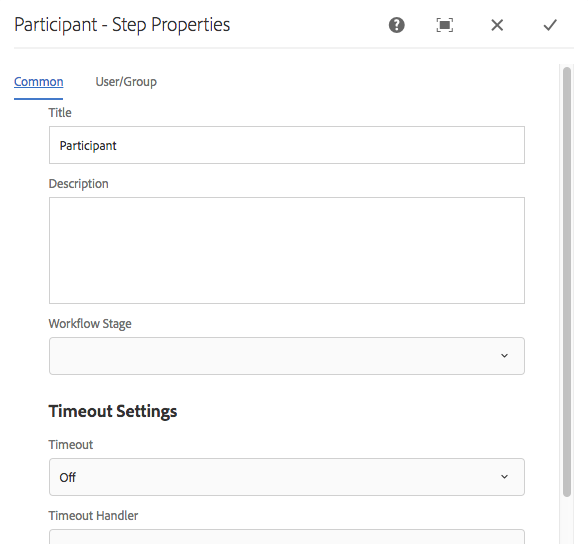

# 建立工作流模型{#creating-workflow-models}

>[!CAUTION]
>
>若要使用傳統UI，請參閱[AEM 6.3檔案](https://helpx.adobe.com/experience-manager/6-3/help/sites-developing/workflows-models.html)以取得參考。

您可以建立[工作流模型](/help/sites-developing/workflows.md#model)以定義使用者啟動工作流時執行的一系列步驟。 您也可以定義模型屬性，例如工作流是暫時性的，還是使用多個資源。

使用者啟動工作流程時，會啟動例項；這是在您[同步](#sync-your-workflow-generate-a-runtime-model)變更時建立的對應執行階段模型。

## 建立新工作流程 {#creating-a-new-workflow}

首次建立新的工作流模型時，它包含：

* 步驟： **流開始**&#x200B;和&#x200B;**流結束**。
這些代表工作流程的開始和結束。 這些步驟為必要步驟，無法編輯/移除。
* 名為&#x200B;**步驟1**&#x200B;的&#x200B;**參與者**步驟範例。
此步驟配置為將工作項分配給工作流啟動器。 編輯或刪除此步驟，並視需要新增步驟。

若要使用編輯器建立新工作流程：

1. 開啟&#x200B;**工作流模型**&#x200B;控制台；透過&#x200B;**工具**、**工作流程**、**模型**&#x200B;或，例如：[https://localhost:4502/aem/workflow](https://localhost:4502/aem/workflow)
1. 選擇&#x200B;**建立**，然後選擇&#x200B;**建立模型**。
1. 將顯示&#x200B;**添加工作流模型**&#x200B;對話框。 在選擇&#x200B;**Done**&#x200B;之前，輸入&#x200B;**Title**&#x200B;和&#x200B;**Name**（可選）。
1. 新模型會列在&#x200B;**工作流模型**&#x200B;控制台中。
1. 選擇新工作流，然後使用&#x200B;[**Edit**&#x200B;開啟它以進行配置](#editinganexistingworkflow):
   

>[!NOTE]
>
>如果以寫程式方式建立模型（使用crx套件），您也可以在以下項目中建立子資料夾：
>
>`/var/workflow/models`
>
>例如， `/var/workflow/models/prototypes`
>
>然後，此資料夾可用於[管理對該資料夾](/help/sites-administering/workflows-managing.md#create-a-subfolder-in-var-workflow-models-and-apply-the-acl-to-that)中模型的訪問。

## 編輯工作流程 {#editing-a-workflow}

您可以編輯任何現有的工作流模型以：

* [定義步](#addingasteptoamodel-) 驟及其參 [數](#configuring-a-workflow-step)
* 配置工作流屬性，包括[ptages](#configuring-workflow-stages-that-show-workflow-progress)、[是否工作流為暫時](#creatingatransientworkflow-)和/或[是否使用多個資源](#configuring-a-workflow-for-multi-resource-support)

編輯&#x200B;[**預設和/或舊版**（現成可用）工作流](#editing-a-default-or-legacy-workflow-for-the-first-time)有一個附加步驟，以確保在您進行更改之前執行[安全副本](/help/sites-developing/workflows-best-practices.md#locations-workflow-models)。

完成對工作流的更新後，必須使用&#x200B;**Sync**&#x200B;來&#x200B;**生成運行時模型**。 如需詳細資訊，請參閱[同步您的工作流程](#sync-your-workflow-generate-a-runtime-model)。

### 同步工作流 — 生成運行時模型 {#sync-your-workflow-generate-a-runtime-model}

**同步** （在編輯器工具列中右側）會產生執 [行階段模型](/help/sites-developing/workflows.md#runtime-model)。執行階段模型是使用者啟動工作流程時實際使用的模型。 如果您未&#x200B;**同步**&#x200B;您的更改，則這些更改將在運行時不可用。

當您（或任何其他用戶）對工作流進行任何更改時，必須使用&#x200B;**Sync**&#x200B;來生成運行時模型，即使單個對話框（例如，步驟）有各自的保存選項時也是如此。

當更改與運行時（已保存）模型同步時，將顯示&#x200B;**Synched**。

有些步驟包含必要欄位和/或內建驗證。 當這些條件不滿足時，當您嘗試&#x200B;**同步**&#x200B;模型時，將顯示錯誤。 例如，當未為&#x200B;**參與者**&#x200B;步驟定義參與者時：


### 首次編輯預設或舊版工作流程 {#editing-a-default-or-legacy-workflow-for-the-first-time}

開啟[預設和/或舊模型](/help/sites-developing/workflows.md#workflow-types)進行編輯時：

* 步驟瀏覽器不可用（左側）。
* 工具列（右側）中提供&#x200B;**Edit**&#x200B;動作。
* 最初，模型及其屬性以只讀模式顯示為：
   * 預設工作流位於`/libs`中
   * 舊式工作流程位於`/etc`
選取 
**** 編輯：
* 將工作流程副本帶入`/conf`
* 使步驟瀏覽器可用
* 可讓您進行變更

>[!NOTE]
>
>如需詳細資訊，請參閱[工作流模型的位置](/help/sites-developing/workflows-best-practices.md#locations-workflow-models)。


### 向模型添加步驟 {#adding-a-step-to-a-model}

您需要將步驟新增至模型以代表要執行的活動 — 每個步驟都會執行特定活動。 標準AEM例項中提供一系列步驟元件。

編輯模型時，可用步驟將顯示在&#x200B;**步驟瀏覽器**&#x200B;的各組中。 例如：


>[!NOTE]
>
>有關隨AEM安裝的主要步驟元件的資訊，請參閱[工作流步驟參考](/help/sites-developing/workflows-step-ref.md)。

若要將步驟新增至工作流程模型：

1. 開啟現有的工作流模型進行編輯。 從&#x200B;**工作流模型**&#x200B;控制台中，選擇所需的模型，然後選擇&#x200B;**編輯**。
1. 開啟步驟瀏覽器；使用&#x200B;**切換頂端面板**，位於頂端工具列的最左側。 您可以在此：

   * **** 篩選特定步驟。
   * 使用下拉式選取器，將選取範圍限制為特定的一組步驟。
   * 選擇「顯示說明」表徵圖以顯示有關相應步驟的詳細資訊。

   

1. 將適當的步驟拖曳至模型中的所需位置。

   例如，**參與者步驟**。

   新增至流程後，您可以[設定步驟](#configuring-a-workflow-step)。

   

1. 視需要新增多個步驟或其他更新。

   在運行時，按步驟在模型中的顯示順序執行步驟。 添加步驟元件後，可將它們拖動到模型中的不同位置。

   您也可以複製、剪下、貼上、分組或刪除現有步驟；與[頁面編輯器相同。](/help/sites-authoring/editing-content.md)

   也可以使用工具欄選項收合/展開分割步驟：

1. 使用&#x200B;**Sync**（編輯器工具欄）確認更改以生成運行時模型。

   如需詳細資訊，請參閱[同步您的工作流程](#sync-your-workflow-generate-a-runtime-model)。

### 設定工作流程步驟 {#configuring-a-workflow-step}

您可以使用&#x200B;**步驟屬性**&#x200B;對話方塊，來&#x200B;**設定**&#x200B;及自訂工作流程步驟的行為。

1. 要開啟步驟的&#x200B;**步驟屬性**&#x200B;對話框，請執行以下操作之一：

   * 按一下/點選工作流程模型中的* *步驟，然後從元件工具列選取&#x200B;**設定**。

   * 按兩下步驟。
   >[!NOTE]
   >
   >有關隨AEM安裝的主要步驟元件的資訊，請參閱[工作流步驟參考](/help/sites-developing/workflows-step-ref.md)。

1. 視需要設定&#x200B;**步驟屬性**;可用的屬性視步驟類型而定，可能還有幾個可用的標籤。 例如，預設&#x200B;**參與者步驟**&#x200B;在新工作流中顯示為`Step 1`:

   

1. 使用勾號確認更新。
1. 使用&#x200B;**Sync**（編輯器工具欄）確認更改以生成運行時模型。

   如需詳細資訊，請參閱[同步您的工作流程](#sync-your-workflow-generate-a-runtime-model)。

### 建立暫時性工作流程 {#creating-a-transient-workflow}

建立新模型或編輯現有模型時，可以建立[暫時](/help/sites-developing/workflows.md#transient-workflows)工作流模型：

1. 開啟[editing](#editinganexistingworkflow)的工作流模型。
1. 從工具欄中選擇&#x200B;**工作流模型屬性**。
1. 在對話方塊中，啟用&#x200B;**暫時工作流程**（或視需要停用）:

   

1. 使用&#x200B;**儲存並關閉**&#x200B;確認變更；後跟&#x200B;**同步**（編輯器工具列），以產生執行階段模型。

   如需詳細資訊，請參閱[同步您的工作流程](#sync-your-workflow-generate-a-runtime-model)。

>[!NOTE]
>
>在[暫時](/help/sites-developing/workflows.md#transient-workflows)模式AEM中執行工作流程時，不會儲存任何工作流程歷史記錄。 因此，[時間軸](/help/sites-authoring/basic-handling.md#timeline)不會顯示與該工作流程相關的任何資訊。

## 讓工作流程模型可在觸控式UI中使用 {#classic2touchui}

如果傳統UI中存在工作流模型，但觸控式UI的&#x200B;**[!UICONTROL 時間軸]**&#x200B;邊欄中的選取快顯功能表中遺失，請依照設定操作以使其可用。 下列步驟說明如何使用名為&#x200B;**[!UICONTROL Request for Activation]**&#x200B;的工作流模型。

1. 確認模型無法在觸控式UI中使用。 使用`/assets.html/content/dam`路徑存取資產。 選取資產。 在左側邊欄中開啟&#x200B;**[!UICONTROL 時間軸]**。 按一下「**[!UICONTROL 啟動工作流]**」並確認彈出式清單中未顯示&#x200B;**[!UICONTROL 啟動請求]**&#x200B;模型。

1. 瀏覽&#x200B;**[!UICONTROL 工具>一般>標籤]**。 選擇&#x200B;**[!UICONTROL Workflow]**。

1. 選擇&#x200B;**[!UICONTROL 建立>建立標籤]**。 將&#x200B;**[!UICONTROL Title]**&#x200B;設定為`DAM`，將&#x200B;**[!UICONTROL Name]**&#x200B;設定為`dam`。 選擇&#x200B;**[!UICONTROL Submit]**。
   

1. 導覽至「**[!UICONTROL 工具>工作流程>模型]**」。 選擇&#x200B;**[!UICONTROL Request for Activation]**，然後選擇&#x200B;**[!UICONTROL Edit]**。

1. 選擇&#x200B;**[!UICONTROL 編輯]**，開啟&#x200B;**[!UICONTROL 頁資訊]**&#x200B;菜單，然後從那裡選擇&#x200B;**[!UICONTROL 開啟屬性]**&#x200B;並轉至&#x200B;**[!UICONTROL 基本]**&#x200B;頁簽（如果尚未開啟）。

1. 將`Workflow : DAM`新增至&#x200B;**[!UICONTROL 標籤]**&#x200B;欄位。 使用勾選（勾選）確認選取項目。

1. 確認新增標籤（包含&#x200B;**[!UICONTROL 儲存並關閉]**）。
   

1. 使用&#x200B;**[!UICONTROL Sync]**&#x200B;完成該過程。 現在，觸控式UI中提供工作流程。

### 為多資源支援配置工作流 {#configuring-a-workflow-for-multi-resource-support}

建立新模型時，或編輯現有模型時，可以為[多資源支援](/help/sites-developing/workflows.md#multi-resource-support)配置工作流模型：

1. 開啟[editing](#editinganexistingworkflow)的工作流模型。
1. 從工具欄中選擇&#x200B;**工作流模型屬性**。

1. 在對話方塊中，啟用&#x200B;**多資源支援**（或視需要停用）:

   

1. 使用&#x200B;**儲存並關閉**&#x200B;確認變更；後跟&#x200B;**同步**（編輯器工具列），以產生執行階段模型。

   如需詳細資訊，請參閱[同步您的工作流程](#sync-your-workflow-generate-a-runtime-model)。

### 配置工作流階段（顯示工作流進度） {#configuring-workflow-stages-that-show-workflow-progress}

[工作](/help/sites-developing/workflows.md#workflow-stages) 流程階段可協助視覺化處理任務時工作流程的進度。

>[!CAUTION]
>
>如果已在&#x200B;**頁面屬性**&#x200B;中定義工作流階段，但未用於任何工作流步驟，則進度欄將不顯示任何進度（無論當前工作流步驟如何）。

可用的階段在工作流模型中定義；可以更新現有的工作流模型以包含階段定義。 您可以為工作流模型定義任意數量的階段。

要為工作流定義&#x200B;**階段**，請執行以下操作：

1. 開啟工作流程模型以進行編輯。
1. 從工具欄中選擇&#x200B;**工作流模型屬性**。 然後開啟&#x200B;**階段**&#x200B;標籤。
1. 添加（並定位）所需的&#x200B;**階段**。 您可以為工作流模型定義任意數量的階段。

   例如：

   

1. 按一下「**儲存並關閉**」以儲存屬性。
1. 為工作流模型中的每個步驟分配一個階段。 例如：

   

   可以將一個階段分配給多個步驟。 例如：

   | **步驟** | **分段** |
   |---|---|
   | 步驟 1 | 建立 |
   | 步驟 2 | 建立 |
   | 步驟 3 | 評論 |
   | 步驟 4 | 批准 |
   | 步驟 5 | 批准 |
   | 步驟 6 | 完成 |

1. 使用&#x200B;**Sync**（編輯器工具欄）確認更改以生成運行時模型。

   如需詳細資訊，請參閱[同步您的工作流程](#sync-your-workflow-generate-a-runtime-model)。

## 導出包中的工作流模型 {#exporting-a-workflow-model-in-a-package}

要導出包中的工作流模型，請執行以下操作：

1. 使用[包管理器](/help/sites-administering/package-manager.md#package-manager)建立新包：

   1. 通過&#x200B;**Tools**、**Deployment**、**Packages**&#x200B;導航到包管理器。

   1. 按一下「**建立包**」。
   1. 指定&#x200B;**封裝名稱**，並視需要指定任何其他詳細資訊。
   1. 按一下&#x200B;**「確定」**。

1. 按一下新包工具欄上的&#x200B;**編輯**。

1. 開啟&#x200B;**Filters**&#x200B;頁簽。

1. 選擇&#x200B;**添加篩選器**&#x200B;並指定工作流模型&#x200B;*design*&#x200B;的路徑：

   `/conf/global/settings/workflow/models/<*your-model-name*>`

   按一下&#x200B;**Done**。

1. 選擇&#x200B;**添加篩選器**&#x200B;並指定&#x200B;*runtime*&#x200B;工作流模型的路徑：

   `/var/workflow/models/<*your-model-name*>`

   按一下&#x200B;**Done**。

1. 為模型使用的任何自訂指令碼新增其他篩選器。
1. 按一下&#x200B;**儲存**&#x200B;以確認您的篩選器定義。
1. 從包定義的工具欄中選擇&#x200B;**Build**。
1. 從包工具欄選擇&#x200B;**下載**。

## 使用工作流程處理表單提交 {#using-workflows-to-process-form-submissions}

您可以設定要由所選工作流程處理的表單。 當使用者提交表單時，會建立新的工作流程例項，並將表單提交的資料作為有效負載。

設定要與表單搭配使用的工作流程：

1. 建立新頁面並開啟它以進行編輯。
1. 將&#x200B;**Form**&#x200B;元件新增至頁面。
1. **** 設定 **出** 現在頁面中的「表單開始」元件。
1. 使用&#x200B;**開始工作流**&#x200B;從可用的工作流中選擇所需的工作流：

   

1. 使用勾號確認新的表單設定。

## 測試工作流程 {#testing-workflows}

在測試工作流程以使用各種裝載類型時，這是個好作法；包括與已開發的類型不同的類型。 例如，如果您想要處理資產，請將頁面設定為裝載以測試工作流程，並確定不會擲回錯誤。

例如，依照下列方式測試您的新工作流程：

1. [從主控台啟](/help/sites-administering/workflows-starting.md) 動工作流程模型。
1. 定義&#x200B;**裝載**&#x200B;並確認。

1. 視需要採取動作，以便工作流程繼續進行。
1. 在工作流程執行時監控記錄檔。

您也可以設定AEM在記錄檔中顯示&#x200B;**DEBUG**&#x200B;訊息。 如需詳細資訊，並在開發完成時，將&#x200B;**記錄層級**&#x200B;設回&#x200B;**資訊**。[](/help/sites-deploying/configure-logging.md)

## 範例 {#examples}

### 範例：建立（簡單）工作流以接受或拒絕發佈請求 {#example-creating-a-simple-workflow-to-accept-or-reject-a-request-for-publication}

為了說明建立工作流的一些可能性，以下示例建立了`Publish Example`工作流的變化。

1. [建立新的工作流模型](#creating-a-new-workflow)。

   新工作流程將包含：

   * **流程啟動**
   * `Step 1`
   * **流程結束**

1. 刪除`Step 1`（因為此示例的步驟類型錯誤）:

   * 按一下該步驟，然後從元件工具欄中選擇&#x200B;**Delete**。 確認動作。

1. 從步驟瀏覽器的&#x200B;**工作流**&#x200B;選擇中，將&#x200B;**參與者步驟**&#x200B;拖動到工作流，並將其置於&#x200B;**流開始**&#x200B;和&#x200B;**流結束**&#x200B;之間。
1. 要開啟屬性對話框，請執行以下操作：

   * 按一下參與者步驟，然後從元件工具欄中選擇&#x200B;**配置**。
   * 按兩下參與者步驟。

1. 在&#x200B;**Common**&#x200B;標籤中，為&#x200B;**Title**&#x200B;和&#x200B;**Description**&#x200B;輸入`Validate Content`。
1. 開啟&#x200B;**User/Group**&#x200B;頁簽：

   * 啟用&#x200B;**透過電子郵件**&#x200B;通知使用者。
   * 為&#x200B;**用戶/組**&#x200B;欄位選擇`Administrator`(`admin`)。

   >[!NOTE]
   >
   >對於要發送的電子郵件，[需要配置郵件服務和用戶帳戶詳細資訊](/help/sites-administering/notification.md)。

1. 使用勾號確認更新。

   您將返回至工作流模型的概述，此處參與者步驟將更名為`Validate Content`。

1. 將&#x200B;**Or Split**&#x200B;拖曳至工作流程，並將其置於`Validate Content`和&#x200B;**Flow End**&#x200B;之間。
1. 開啟&#x200B;**或Split**&#x200B;進行配置。
1. 設定：

   * **常見**:指定拆分名稱。
   * **分支1**:選 **擇預設路由**。

   * **分支2**:確 **保未** 選取預設路徑。

1. 確認對&#x200B;**OR Split**&#x200B;的更新。
1. 將&#x200B;**參與者步驟**&#x200B;拖曳至左側分支，開啟屬性，指定下列值，然後確認變更：

   * **標題**: `Reject Publish Request`

   * **使用者/群組**:例如，  `projects-administrators`

   * **透過電子郵件通知使用者**:啟動，透過電子郵件通知使用者。

1. 將&#x200B;**處理步驟**&#x200B;拖曳至右側分支，開啟屬性，指定下列值，然後確認變更：

   * **標題**: `Publish Page as Requested`

   * **程式**:選取「  `Activate Page`」 。此程式會將選取的頁面發佈至發佈者例項。

1. 按一下&#x200B;**Sync**（編輯器工具欄）以生成運行時模型。

   如需詳細資訊，請參閱[同步您的工作流程](#sync-your-workflow-generate-a-runtime-model)。

   您的新工作流程模型將如下所示：

   

1. 將此工作流程套用至您的頁面，以便當使用者移至&#x200B;**完成** **驗證內容**&#x200B;步驟時，他們可以選取是要依請求&#x200B;**發佈頁面，還是**&#x200B;拒絕發佈請求&#x200B;**。**

   

### 範例：使用ECMA指令碼定義OR拆分的規則 {#defineruleecmascript}

**或分** 割步驟可讓您將條件式處理路徑引入工作流程中。

若要定義OR規則，請依照下列步驟進行：

1. 建立兩個指令碼並儲存在存放庫中，例如：

   `/apps/myapp/workflow/scripts`

   >[!NOTE]
   >
   >指令碼必須具有[函式`check()`](#function-check)，該函式返回布爾值。

1. 編輯工作流程，並將&#x200B;**OR Split**&#x200B;新增至模型。
1. 編輯&#x200B;**OR Split**&#x200B;的&#x200B;**Branch 1**&#x200B;的屬性：

   * 將&#x200B;**Value**&#x200B;設定為`true`，將此定義為&#x200B;**預設路由**。

   * 以&#x200B;**Rule**的形式，將路徑設定為指令碼。 例如：
      `/apps/myapp/workflow/scripts/myscript1.ecma`
   >[!NOTE]
   >
   >您可以視需要切換分支順序。

1. 編輯&#x200B;**OR Split**&#x200B;的&#x200B;**Branch 2**&#x200B;的屬性。

   * 以&#x200B;**Rule**的形式，將路徑設定為其他指令碼。 例如：
      `/apps/myapp/workflow/scripts/myscript2.ecma`

1. 設定每個分支中各個步驟的屬性。 請確定已設定&#x200B;**使用者/群組**。
1. 按一下&#x200B;**Sync**（編輯器工具欄），將更改保留到運行時模型。

   如需詳細資訊，請參閱[同步您的工作流程](#sync-your-workflow-generate-a-runtime-model)。

#### 函式檢查() {#function-check}

>[!NOTE]
>
>請參閱[使用ECMAScript](/help/sites-developing/workflows-customizing-extending.md#using-ecmascript)。

如果節點位於`/content/we-retail/us/en`下，則以下示例指令碼返回`true`:`JCR_PATH`

```
function check() {
    if (workflowData.getPayloadType() == "JCR_PATH") {
      var path = workflowData.getPayload().toString();
      var node = jcrSession.getItem(path);

      if (node.getPath().indexOf("/content/we-retail/us/en") >= 0) {
       return true;
      } else {
       return false;
      }
     } else {
      return false;
     }
}
```

### 範例：自訂的啟動請求 {#example-customized-request-for-activation}

您可以自訂任何現成可用的工作流程。 若要具有自訂行為，請覆蓋適當工作流程的詳細資訊。

例如， **Request for Activation**。 此工作流程用於發佈&#x200B;**Sites**&#x200B;內的頁面，並會在內容作者沒有適當的復寫權限時自動觸發。 如需詳細資訊，請參閱[自訂頁面編寫 — 自訂啟動工作流程的請求](/help/sites-developing/customizing-page-authoring-touch.md#customizing-the-request-for-activation-workflow) 。
