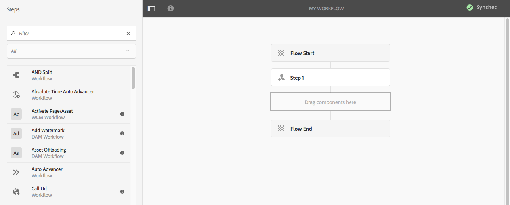
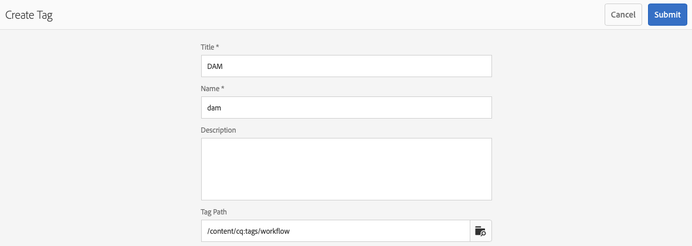

# 建立工作流模型{#creating-workflow-models}

>[!CAUTION]
>
>要使用經典UI，請參閱 [AEM 6.3文檔](https://helpx.adobe.com/experience-manager/6-3/help/sites-developing/workflows-models.html) 的下界。

建立 [工作流模型](/help/sites-developing/workflows.md#model) 定義用戶啟動工作流時執行的一系列步驟。 您還可以定義模型屬性，如工作流是瞬態的還是使用多個資源。

當用戶啟動工作流時，啟動一個實例；這是相應的運行時模型，建立時 [同步](#sync-your-workflow-generate-a-runtime-model) 您的更改。

## 建立新工作流 {#creating-a-new-workflow}

首次建立新工作流模型時，它包含：

* 台階， **流啟動** 和 **流結束**。
這些表示工作流的開始和結束。 這些步驟是必需的，無法編輯/刪除。
* 一個例子 **參與者** 步驟命名 **步驟1**。
此步驟配置為將工作項分配給工作流啟動器。 編輯或刪除此步驟，並根據需要添加步驟。

要使用編輯器建立新工作流，請執行以下操作：

1. 開啟 **工作流模型** 控制台；通過 **工具**。 **工作流**。 **模型** 或，例如： [https://localhost:4502/aem/workflow](https://localhost:4502/aem/workflow)
1. 選擇 **建立**，則 **建立模型**。
1. 的 **添加工作流模型** 對話框。 輸入 **標題** 和 **名稱** （可選），然後選擇 **完成**。
1. 新模型列於 **工作流模型** 控制台。
1. 選擇新工作流，然後使用 [**編輯** 開啟它以進行配置](#editinganexistingworkflow):
   

>[!NOTE]
>
>如果以寫程式方式（使用crx包）建立模型，也可以在以下位置建立子資料夾：
>
>`/var/workflow/models`
>
>例如 `/var/workflow/models/prototypes`
>
>此資料夾可用於 [管理對該資料夾中模型的訪問](/help/sites-administering/workflows-managing.md#create-a-subfolder-in-var-workflow-models-and-apply-the-acl-to-that)。

## 編輯工作流 {#editing-a-workflow}

您可以編輯任何現有工作流模型以：

* [定義步驟](#addingasteptoamodel-) 和 [參數](#configuring-a-workflow-step)
* 配置工作流屬性，包括 [階段](#configuring-workflow-stages-that-show-workflow-progress)。 [工作流是否是瞬時的](#creatingatransientworkflow-) 和/或 [使用多個資源](#configuring-a-workflow-for-multi-resource-support)

編輯 [**預設和/或舊版** （現成）工作流](#editing-a-default-or-legacy-workflow-for-the-first-time) 還有一步，以確保 [安全複製](/help/sites-developing/workflows-best-practices.md#locations-workflow-models) 在進行更改之前進行。

完成對工作流的更新後，必須使用 **同步** 至 **生成運行時模型**。 請參閱 [同步工作流](#sync-your-workflow-generate-a-runtime-model) 的雙曲餘切值。

### 同步工作流 — 生成運行時模型 {#sync-your-workflow-generate-a-runtime-model}

**同步** （位於編輯器工具欄中）生成 [運行時模型](/help/sites-developing/workflows.md#runtime-model)。 運行時模型是用戶啟動工作流時實際使用的模型。 如果你不 **同步** 您所做的更改，則在運行時將不可用更改。

當您（或任何其他用戶）對必須使用的工作流進行任何更改時 **同步** 生成運行時模型 — 即使單個對話框（例如，步驟）具有自己的保存選項。

當更改與運行時（已保存）模型同步時， **同步** 的下界。

某些步驟具有必需欄位和/或內置驗證。 當這些條件不滿足時，當您嘗試 **同步** 模型。 例如，當沒有為 **參與者** 步驟：


### 首次編輯預設或舊式工作流 {#editing-a-default-or-legacy-workflow-for-the-first-time}

開啟 [預設和/或舊模型](/help/sites-developing/workflows.md#workflow-types) 編輯：

* 步驟瀏覽器不可用（左側）。
* 有 **編輯** 工具欄（右側）中提供的操作。
* 最初，模型及其屬性以只讀模式顯示為：
   * 預設工作流位於 `/libs`
   * 舊工作流位於 `/etc`
選擇 
**編輯** 將：
* 將工作流的副本 `/conf`
* 使「步驟」瀏覽器可用
* 使您能夠進行更改

>[!NOTE]
>
>請參閱 [工作流模型的位置](/help/sites-developing/workflows-best-practices.md#locations-workflow-models) 的上界。


### 向模型添加步驟 {#adding-a-step-to-a-model}

您需要向模型中添加步驟來表示要執行的活動 — 每個步驟都執行特定的活動。 在標準實例中可以選擇步驟組AEM件。

編輯模型時，可用步驟將出現在 **步驟瀏覽器**。 例如：


>[!NOTE]
>
>有關隨之安裝的主要步驟元件的信AEM息，請參見 [工作流步驟參考](/help/sites-developing/workflows-step-ref.md)。

要向工作流模型添加步驟：

1. 開啟現有工作流模型進行編輯。 從 **工作流模型** 控制台，選擇所需型號， **編輯**。
1. 開啟「步驟」瀏覽器；使用 **切換側面板**&#x200B;的上界。 您可以在這裡：

   * **篩選** 的子菜單。
   * 使用下拉選擇器將選擇限制為特定步驟組。
   * 選擇「顯示說明」表徵圖  顯示有關相應步驟的詳細資訊。

   

1. 將相應步驟拖至模型中所需的位置。

   例如， **參與者步驟**。

   添加到流後，您可以 [配置步驟](#configuring-a-workflow-step)。

   

1. 根據需要添加多個步驟或其他更新。

   在運行時，按步驟在模型中顯示的順序執行步驟。 添加步驟元件後，可將它們拖動到模型中的不同位置。

   您還可以複製、剪切、貼上、分組或刪除現有步驟；和 [的子菜單。](/help/sites-authoring/editing-content.md)

   還可以使用工具欄選項折疊/展開拆分步驟： 

1. 確認更改 **同步** （編輯器工具欄）以生成運行時模型。

   請參閱 [同步工作流](#sync-your-workflow-generate-a-runtime-model) 的雙曲餘切值。

### 配置工作流步驟 {#configuring-a-workflow-step}

你可以 **配置** 並使用 **步驟屬性** 對話框。

1. 開啟 **步驟屬性** 對話框，用於執行步驟之一：

   * 按一下/點擊工作流模型中的* *步驟，然後選擇 **配置** 的子菜單。

   * 按兩下步驟。
   >[!NOTE]
   >
   >有關隨之安裝的主要步驟元件的信AEM息，請參見 [工作流步驟參考](/help/sites-developing/workflows-step-ref.md)。

1. 配置 **步驟屬性** 按要求；可用屬性取決於步驟類型，也可能有幾個頁籤可用。 例如， **參與者步驟**，在新工作流中顯示為 `Step 1`:

   

1. 使用勾選符確認更新。
1. 確認更改 **同步** （編輯器工具欄）以生成運行時模型。

   請參閱 [同步工作流](#sync-your-workflow-generate-a-runtime-model) 的雙曲餘切值。

### 建立臨時工作流 {#creating-a-transient-workflow}

可以建立 [瞬態](/help/sites-developing/workflows.md#transient-workflows) 建立新模型時或通過編輯現有模型時的工作流模型：

1. 開啟工作流模型 [編輯](#editinganexistingworkflow)。
1. 選擇 **工作流模型屬性** 的子菜單。
1. 在對話框中激活 **臨時工作流** (或在需要時停用：

   

1. 確認更改 **保存並關閉**;後跟 **同步** （編輯器工具欄）以生成運行時模型。

   請參閱 [同步工作流](#sync-your-workflow-generate-a-runtime-model) 的雙曲餘切值。

>[!NOTE]
>
>在中運行工作流時 [瞬態](/help/sites-developing/workflows.md#transient-workflows) 模式AEM不儲存任何工作流歷史記錄。 所以， [時間軸](/help/sites-authoring/basic-handling.md#timeline) 不顯示與該工作流相關的任何資訊。

## 使工作流模型在Touch UI中可用 {#classic2touchui}

如果工作流模型在傳統用戶介面中存在，但在 **[!UICONTROL 時間軸]** 觸控UI，然後按照配置使其可用。 以下步驟說明了如何使用稱為 **[!UICONTROL 激活請求]**。

1. 確認模型在啟用觸摸的用戶介面中不可用。 使用 `/assets.html/content/dam` 路徑。 選擇資產。 開啟 **[!UICONTROL 時間軸]** 左欄。 按一下 **[!UICONTROL 啟動工作流]** 並確認 **[!UICONTROL 激活請求]** 彈出式清單中不存在模型。

1. 瀏覽 **[!UICONTROL 工具>常規>標籤]**。 選擇 **[!UICONTROL 工作流]**。

1. 選擇 **[!UICONTROL 「建立」>「建立標籤」]**。 設定 **[!UICONTROL 標題]** 如 `DAM` 和 **[!UICONTROL 名稱]** 如 `dam`。 選擇 **[!UICONTROL 提交]**。
   

1. 導航到 **[!UICONTROL 工具>工作流>模型]**。 選擇 **[!UICONTROL 激活請求]**，然後選擇 **[!UICONTROL 編輯]**。

1. 選擇 **[!UICONTROL 編輯]**，開啟 **[!UICONTROL 頁面資訊]** 菜單，然後從中選擇 **[!UICONTROL 開啟屬性]** 去 **[!UICONTROL 基本]** 頁籤（如果尚未開啟）。

1. 添加 `Workflow : DAM` 至 **[!UICONTROL 標籤]** 的子菜單。 使用檢查（勾選）確認所選內容。

1. 確認添加標籤 **[!UICONTROL 保存並關閉]**。
   

1. 完成流程 **[!UICONTROL 同步]**。 該工作流現在可在啟用觸摸的用戶介面中使用。

### 為多資源支援配置工作流 {#configuring-a-workflow-for-multi-resource-support}

可以為 [多資源支援](/help/sites-developing/workflows.md#multi-resource-support) 建立新模型時，或通過編輯現有模型：

1. 開啟工作流模型 [編輯](#editinganexistingworkflow)。
1. 選擇 **工作流模型屬性** 的子菜單。

1. 在對話框中激活 **多資源支援** (或在需要時停用：

   

1. 確認更改 **保存並關閉**;後跟 **同步** （編輯器工具欄）以生成運行時模型。

   請參閱 [同步工作流](#sync-your-workflow-generate-a-runtime-model) 的雙曲餘切值。

### 配置工作流階段（顯示工作流進度） {#configuring-workflow-stages-that-show-workflow-progress}

[工作流階段](/help/sites-developing/workflows.md#workflow-stages) 幫助直觀顯示處理任務時的工作流進度。

>[!CAUTION]
>
>如果在中定義了工作流階段 **頁面屬性**，但未用於任何工作流步驟，則進度欄將不顯示任何進度（無論當前工作流步驟如何）。

可用階段在工作流模型中定義；可以更新現有工作流模型以包括階段定義。 您可以為工作流模型定義任意數量的階段。

要定義 **階段** 對於您的工作流：

1. 開啟工作流模型進行編輯。
1. 選擇 **工作流模型屬性** 的子菜單。 然後開啟 **階段** 頁籤。
1. 添加（和定位）您所需的 **階段**。 您可以為工作流模型定義任意數量的階段。

   例如：

   

1. 按一下 **保存並關閉** 的子菜單。
1. 為工作流模型中的每個步驟分配一個階段。 例如：

   

   可將階段分配給多個步驟。 例如：

   | **步驟** | **測試** |
   |---|---|
   | 步驟 1 | 建立 |
   | 步驟 2 | 建立 |
   | 步驟 3 | 評論 |
   | 步驟 4 | 批准 |
   | 步驟 5 | 批准 |
   | 步驟 6 | 完成 |

1. 確認更改 **同步** （編輯器工具欄）以生成運行時模型。

   請參閱 [同步工作流](#sync-your-workflow-generate-a-runtime-model) 的雙曲餘切值。

## 導出包中的工作流模型 {#exporting-a-workflow-model-in-a-package}

要在包中導出工作流模型，請執行以下操作：

1. 使用 [包管理器](/help/sites-administering/package-manager.md#package-manager):

   1. 通過導航至包管理器 **工具**。 **部署**。 **包**。

   1. 按一下 **建立包**。
   1. 指定 **包名稱**，以及需要的任何其他詳細資訊。
   1. 按一下&#x200B;**「確定」**。

1. 按一下 **編輯** 的上界。

1. 開啟 **篩選器** 頁籤。

1. 選擇 **添加篩選器** 並指定工作流模型的路徑 *設計*:

   `/conf/global/settings/workflow/models/<*your-model-name*>`

   按一下 **完成**。

1. 選擇 **添加篩選器** 並指定 *運行時* 工作流模型：

   `/var/workflow/models/<*your-model-name*>`

   按一下 **完成**。

1. 為模型使用的任何自定義指令碼添加其他篩選器。
1. 按一下 **保存** 確認篩選器定義。
1. 選擇 **生成** 的子菜單。
1. 選擇 **下載** 的子菜單。

## 使用工作流處理表單提交 {#using-workflows-to-process-form-submissions}

您可以配置要由所選工作流處理的表單。 當用戶提交表單時，將建立一個新的工作流實例，其中表單提交的資料作為其負載。

要配置要與表單一起使用的工作流，請執行以下操作：

1. 建立新頁面並開啟它進行編輯。
1. 添加 **窗體** 元件。
1. **配置** 這樣 **窗體開始** 顯示在頁面中的元件。
1. 使用 **啟動工作流** 要從可用工作流中選擇所需的工作流，請執行以下操作：

   

1. 使用勾選符確認新窗體配置。

## 測試工作流 {#testing-workflows}

在測試工作流使用多種負載類型時，這是一個很好的做法；包括不同於其開發的類型。 例如，如果您打算將工作流處理資產，請通過將頁面設定為負載來test它，並確保它不會引發錯誤。

例如，按如下方式test新工作流：

1. [啟動工作流模型](/help/sites-administering/workflows-starting.md) 從控制台。
1. 定義 **負載** 確認一下。

1. 根據需要採取操作，以便繼續工作流。
1. 在工作流運行時監視日誌檔案。

您還可以配置AEM為顯示 **調試** 日誌檔案中的消息。 請參閱 [記錄](/help/sites-deploying/configure-logging.md) 有關詳細資訊，並在開發完成時，設定 **日誌級別** 返回 **資訊**。

## 範例 {#examples}

### 示例：建立（簡單）工作流以接受或拒絕發佈請求 {#example-creating-a-simple-workflow-to-accept-or-reject-a-request-for-publication}

為了說明建立工作流的一些可能性，以下示例建立了 `Publish Example` 工作流。

1. [建立新工作流模型](#creating-a-new-workflow)。

   新工作流將包含：

   * **流程啟動**
   * `Step 1`
   * **流程結束**

1. 刪除 `Step 1` （因為此示例的步驟類型錯誤）:

   * 按一下步驟並選擇 **刪除** 的子菜單。 確認操作。

1. 從 **工作流** 選擇步驟瀏覽器，拖動 **參與者步驟** 放到工作流上，並將其置於 **流啟動** 和 **流結束**。
1. 要開啟屬性對話框，請執行以下操作：

   * 按一下參與者步驟並選擇 **配置** 的子菜單。
   * 按兩下參與者步驟。

1. 在 **常用** 頁籤 `Validate Content` 兩者 **標題** 和 **說明**。
1. 開啟 **用戶/組** 頁籤：

   * 激活 **通過電子郵件通知用戶**。
   * 選擇 `Administrator` ( `admin`) **用戶/組** 的子菜單。

   >[!NOTE]
   >
   >要發送電子郵件， [需要配置郵件服務和用戶帳戶詳細資訊](/help/sites-administering/notification.md)。

1. 使用勾選符確認更新。

   您將返回到工作流模型的概述，此時參與者步驟將更名為 `Validate Content`。

1. 拖動 **或拆分** 放到工作流上，並將其置於 `Validate Content` 和 **流結束**。
1. 開啟 **或拆分** 的子菜單。
1. 設定:

   * **常用**:指定拆分名稱。
   * **分支1**:選擇 **預設路由**。

   * **分支2**:確保 **預設路由** 的子菜單。

1. 確認更新 **或拆分**。
1. 拖動 **參與者步驟** 在左側分支中，開啟屬性，指定以下值，然後確認更改：

   * **標題**: `Reject Publish Request`

   * **用戶/組**:比如說， `projects-administrators`

   * **通過電子郵件通知用戶**:激活以通過電子郵件通知用戶。

1. 拖動 **處理步驟** 在右側分支中，開啟屬性，指定以下值，然後確認更改：

   * **標題**: `Publish Page as Requested`

   * **進程**:選擇 `Activate Page`。 此進程將所選頁面發佈到發佈者實例。

1. 按一下 **同步** （編輯器工具欄）以生成運行時模型。

   請參閱 [同步工作流](#sync-your-workflow-generate-a-runtime-model) 的雙曲餘切值。

   您的新工作流模型將如下所示：

   

1. 將此工作流應用到您的頁面，以便當用戶移到 **完成** 這樣 **驗證內容** 步驟，他們可以選擇 **按請求發佈頁面**&#x200B;或 **拒絕發佈請求**。

   

### 示例：使用ECMA指令碼定義OR拆分的規則 {#defineruleecmascript}

**或拆分** 步驟允許將條件處理路徑引入工作流。

要定義OR規則，請按如下步驟進行：

1. 建立兩個指令碼並將它們保存到儲存庫中，例如：

   `/apps/myapp/workflow/scripts`

   >[!NOTE]
   >
   >指令碼必須具有 [函式 `check()`](#function-check) 返回布爾值。

1. 編輯工作流並添加 **或拆分** 到模型。
1. 編輯 **分支1** 的 **或拆分**:

   * 將其定義為 **預設路由** 設定 **值** 至 `true`。

   * 作為 **規則**，設定指令碼的路徑。 例如：
      `/apps/myapp/workflow/scripts/myscript1.ecma`
   >[!NOTE]
   >
   >如果需要，可以切換分支順序。

1. 編輯 **分支2** 的 **或拆分**。

   * 作為 **規則**，將路徑設定為其他指令碼。 例如：
      `/apps/myapp/workflow/scripts/myscript2.ecma`

1. 設定每個分支中各個步驟的屬性。 確保 **用戶/組** 的子菜單。
1. 按一下 **同步** （編輯器工具欄），以保留對運行時模型的更改。

   請參閱 [同步工作流](#sync-your-workflow-generate-a-runtime-model) 的雙曲餘切值。

#### 函式檢查() {#function-check}

>[!NOTE]
>
>請參閱 [使用ECMAScript](/help/sites-developing/workflows-customizing-extending.md#using-ecmascript)。

以下示例指令碼返回 `true` 如果節點是 `JCR_PATH` 位於 `/content/we-retail/us/en`:

```
function check() {
    if (workflowData.getPayloadType() == "JCR_PATH") {
      var path = workflowData.getPayload().toString();
      var node = jcrSession.getItem(path);

      if (node.getPath().indexOf("/content/we-retail/us/en") >= 0) {
       return true;
      } else {
       return false;
      }
     } else {
      return false;
     }
}
```

### 示例：自定義激活請求 {#example-customized-request-for-activation}

您可以定制任何出廠設定的工作流。 要進行自定義行為，請覆蓋相應工作流的詳細資訊。

比如說， **激活請求**。 此工作流用於在 **站點** 當內容作者沒有相應的複製權限時，將自動觸發。 請參閱 [自定義頁面創作 — 自定義激活工作流請求](/help/sites-developing/customizing-page-authoring-touch.md#customizing-the-request-for-activation-workflow) 的上界。
