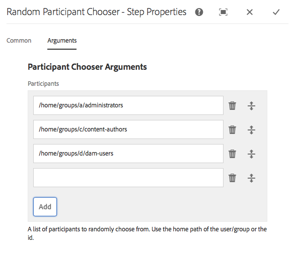

# 工作流程步驟參考 {#workflow-step-reference}

工作流程模型包含一系列各種型別的步驟。 根據型別，您可以使用引數和指令碼來設定和擴充這些步驟，以提供您需要的功能和控制項。

>[!NOTE]
>
>本節介紹標準工作流程步驟。
>
>如需模組專屬步驟，請參閱下列內容：
>
>* [AEM Forms工作流程步驟參考](/help/forms/using/aem-forms-workflow-step-reference.md)
>* [使用媒體處理常式和工作流程處理Assets](/help/assets/media-handlers.md)
>

## 步驟屬性 {#step-properties}

每個步驟元件都有&#x200B;**步驟屬性**&#x200B;對話方塊，可讓您定義和編輯必要的屬性。

### 步驟屬性 — 通用標籤 {#step-properties-common-tab}

在屬性對話方塊的&#x200B;**一般**&#x200B;索引標籤上，下列屬性的組合可用於大多數工作流程步驟元件：

* **標題**
步驟的標題。

* **描述**
步驟的說明。

* **工作流程階段**

  要將[階段](/help/sites-developing/workflows.md#workflow-stages)套用至步驟的下拉式選取器。

* **逾時**

  步驟「逾時」之前的期間。
您可以選取： **關閉**、**立即**、**1h**、**6h**、**12h**、**24h**。

* **逾時處理常式**

  控制步驟逾時的工作流程的處理常式。 例如 `Auto Advancer`

* **處理常式前進**

  選取此選項可自動將工作流程推進至執行後的下一個步驟。 如果未選取，實作指令碼必須處理工作流程推進。

### 步驟屬性 — 使用者/群組標籤 {#step-properties-user-group-tab}

在屬性對話方塊的&#x200B;**使用者/群組**&#x200B;索引標籤上，許多工作流程步驟元件都可以使用下列屬性：

* **透過電子郵件通知使用者**

   * 當工作流程到達步驟時，透過傳送電子郵件通知參與者來通知參與者。
   * 如果啟用，會傳送電子郵件給屬性&#x200B;**使用者/群組**&#x200B;所定義的使用者，或如果已定義群組，則會傳送電子郵件給群組的每個成員。

* **使用者/群組**

   * 下拉式選取方塊可讓您導覽至並選取使用者或群組。
   * 如果您將步驟指派給特定使用者，則只有此使用者可以在該步驟上進行操作。
   * 如果您將步驟指派給整個群組，則當工作流程到達此步驟時，此群組中的所有使用者都會在其&#x200B;**工作流程收件匣**&#x200B;中執行該動作。
   * 如需詳細資訊，請參閱[參與工作流程](/help/sites-authoring/workflows-participating.md)。

## AND 拆分 {#and-split}

**AND Split**&#x200B;會在工作流程中建立分割，之後兩個分支都會啟用。 您可以視需要將工作流程步驟新增到每個分支。 此步驟可讓您將多個處理路徑匯入工作流程中。 例如，您可以允許並行執行某些稽核步驟，以節省時間。


### AND拆分 — 設定 {#and-split-configuration}

若要設定分割：

* 編輯&#x200B;**AND分割屬性**：

   * **分割名稱**：指派名稱以供解釋
   * 選取所需的分支數；2、3、4或5。

* 視需要將工作流程步驟新增到分支。

  

## 容器步驟 {#container-step}

容器步驟會啟動另一個作為子工作流程執行的工作流程模型。

此容器可讓您重複使用工作流程模型，以實施常見的步驟順序。 例如，翻譯工作流程模型可用於多個編輯工作流程。


### 容器步驟 — 設定 {#container-step-configuration}

若要設定此步驟，請編輯並使用下列標籤：

* [一般](#step-properties-common-tab)
* **容器**

   * **子工作流程**：選取要啟動的工作流程。

## 移至步驟 {#goto-step}

**移至步驟**&#x200B;可讓您指定下一個要在工作流程模型中執行的步驟。 您可以將規則定義、外部指令集或ECMA指令集指定為路由表示式，以評估工作流程模型的下一個步驟。

* 如果您指定的條件為true，則&#x200B;**移至步驟**&#x200B;會完成，而工作流程引擎會執行指定的步驟。
* 若您指定的條件不成立，**跳到步驟**&#x200B;就會完成，而一般的路由邏輯會決定下一個要執行的步驟。

**移至步驟**&#x200B;可讓您在工作流程模型中實作進階路由結構。 例如，若要實作回圈，可定義&#x200B;**跳到步驟**&#x200B;以執行工作流程中的前一個步驟，路由運算式會評估回圈條件。

### 移至步驟 — 設定 {#goto-step-configuration}

若要設定此步驟，請編輯並使用下列標籤：

* [一般](#step-properties-common-tab)
* **處理序**

   * **目標步驟**：選取評估路由運算式的條件後要執行的步驟。
   * **路由運算式**：選取規則定義、外部指令碼，或決定是否執行&#x200B;**目標步驟**&#x200B;的ECMA指令碼。

      * **規則定義：**&#x200B;使用[運算式編輯器](/help/forms/using/variable-in-aem-workflows.md#use-expression-editor)來定義規則。
      * **外部指令碼：**&#x200B;外部指令碼的路徑。
      * **ECMA指令碼**：決定是否要執行&#x200B;**Goto步驟**&#x200B;的指令碼。

#### 模擬for回圈 {#simulating-a-for-loop}

模擬「for回圈」需要您維持已發生回圈迭代次數的計數：

* 計數通常代表工作流程中執行之專案的索引。
* 此計數會評估為回圈的退出條件。

例如，若要實作在數個JCR節點上執行動作的工作流程，您可以使用回圈計數器作為節點的索引。 若要保留計數，請在工作流程執行個體的資料對應中儲存`integer`值。 若要增加計數並與退出條件比較，請使用&#x200B;**跳到步驟**&#x200B;的指令碼。

```
function check(){
   var count=0;
   var keyname="loopcount"
   try{
      if (workflowData.getMetaDataMap().containsKey(keyname)){
        log.info("goto script: found loopcount key");
        count= parseInt(workflowData.getMetaDataMap().get(keyname))+1;
      }

     workflowData.getMetaDataMap().put(keyname,count);

     }catch(err) {
         log.info(err.message);
         return false;
    }
   if (parseInt(count) <7){
       return true;
   } else {
      return false;
   }
}
```

### 使用規則定義模擬for回圈 {#simulateforloop}

您也可以使用「規則定義」作為路由運算式來模擬for回圈。 [建立Long資料型別的&#x200B;**count**&#x200B;變數](/help/forms/using/variable-in-aem-workflows.md#create-a-variable)。 在&#x200B;**[設定變數](/help/sites-developing/using-variables-in-aem-workflows.md#set-a-variable)**&#x200B;步驟中使用&#x200B;**運算式**&#x200B;做為對應模式，以將&#x200B;**count**&#x200B;變數的值設定為&#x200B;**count + 1** （每次執行&#x200B;**設定變數**&#x200B;步驟）。


在&#x200B;**Goto步驟**&#x200B;中，使用&#x200B;**設定變數**&#x200B;做為&#x200B;**目標步驟**，使用&#x200B;**計數&lt; 5**&#x200B;做為路由運算式。


**設定變數**&#x200B;步驟會重複執行，每次執行&#x200B;**count**&#x200B;變數的值會增加1，直到值達到5為止。

## OR 拆分 {#or-split}

**OR Split**&#x200B;會在工作流程中建立分割，之後只有一個分支是作用中。 此步驟可讓您將條件式處理路徑匯入工作流程中。 您可以視需要將工作流程步驟新增到每個分支。

>[!NOTE]
>
>請參閱[或分割步驟](https://experienceleague.adobe.com/docs/experience-manager-65/developing/extending-aem/extending-workflows/using-variables-in-aem-workflows.html#use-a-variable)


### OR拆分 — 設定 {#or-split-configuration}

若要設定分割：

* 編輯&#x200B;**OR分割屬性**：

   * **一般**

      * 指定分割名稱。

   * **分支(*x)***

      * **新增分支：**&#x200B;在步驟中新增更多分支。
      * **選取路由運算式**：若要評估作用中的分支，請選取路由運算式。 可能的值包括：規則定義、外部指令碼和ECMA指令碼。
      * **按一下以新增運算式**：如果您選取&#x200B;**規則定義**&#x200B;作為路由運算式，請新增運算式以評估作用中分支。
      * **指令碼路徑**：如果選取&#x200B;**外部指令碼**&#x200B;作為路由運算式，則包含要評估作用中分支之指令碼的檔案路徑。
      * **指令碼**：如果您選取&#x200B;**ECMA指令碼**&#x200B;作為路由運算式，請在方塊中新增指令碼，以評估作用中分支。
      * **預設路由**：如果有多個分支，則遵循預設分支。 您只能指定一個分支作為預設值。

  >[!NOTE]
  >
  >    * 系統會根據路由運算式一次評估一個分支。
  >    * 系統會從上到下評估分支。
  >    * 系統會執行第一個評估為true的指令碼。
  >    * 如果沒有分支的計算結果為true，則工作流程不會前進。
  >
  >

  >[!NOTE]
  >
  >請參閱[定義OR分割](/help/sites-developing/workflows-models.md#defineruleecmascript)的規則。

* 視需要將工作流程步驟新增到分支。

## 參與者步驟與選擇器 {#participant-steps-and-choosers}

### 參與者步驟 {#participant-step}

**參與者步驟**&#x200B;可讓您指派特定動作的擁有權。 只有在使用者手動確認該步驟時，工作流程才會繼續。 如果您希望某人執行工作流程，請使用此工作流程。 例如，稽核步驟。

雖然與工作流程並非直接相關，但在指派動作時必須考量使用者授權；使用者必須擁有工作流程裝載頁面的存取權。

#### 參與者步驟 — 設定 {#participant-step-configuration}

若要設定此步驟，請編輯並使用下列標籤：

* [一般](#step-properties-common-tab)
* [使用者/群組](#step-properties-user-group-tab)

>[!NOTE]
>
>當發生下列情況時，一律會通知工作流程發起人：
>
>* 工作流程已完成（已完成）。
>* 工作流程已中止（已終止）。
>

>[!NOTE]
>
>某些屬性必須設定為啟用電子郵件通知。 您也可以自訂電子郵件範本，或新增新語言的電子郵件範本。 若要在AEM中設定電子郵件通知，請參閱[設定電子郵件通知](/help/sites-administering/notification.md#configuringemailnotification)。

### 對話方塊參與者步驟 {#dialog-participant-step}

使用&#x200B;**對話方塊參與者步驟**&#x200B;從指派工作專案的使用者收集資訊。 此步驟對於收集稍後在工作流程中使用的少量資料很有用。

完成步驟後，**完成工作專案**&#x200B;對話方塊會包含您在對話方塊中定義的欄位。 在欄位中收集的資料會儲存在工作流程裝載的節點中。 接著，後續的工作流程步驟就可以從存放庫讀取值。

若要配置步驟，請指定工作專案指派的目標群組或使用者，以及對話方塊的路徑。

#### 對話方塊參與者步驟 — 設定 {#dialog-participant-step-configuration}

若要設定此步驟，請編輯並使用下列標籤：

* [一般](#step-properties-common-tab)
* [使用者/群組](#step-properties-user-group-tab)
* **對話方塊**

   * **對話方塊路徑**：您建立的[對話方塊](#dialog-participant-step-creating-a-dialog)的對話方塊節點路徑。

#### 對話方塊參與者步驟 — 建立對話 {#dialog-participant-step-creating-a-dialog}

若要建立對話方塊，您必須建立對話方塊：

* 決定產生的資料儲存在承載[&#128279;](#dialog-participant-step-storing-data-in-the-payload)中的何處。
* [定義對話方塊；包括定義用來收集和儲存資料的欄位](#dialog-participant-step-dialog-definition)。

#### 對話方塊參與者步驟 — 將資料儲存在承載中 {#dialog-participant-step-storing-data-in-the-payload}

您可以將Widget資料儲存在工作流程裝載或工作專案中繼資料中。 Widget節點的`name`屬性格式會決定資料儲存的位置。

* **儲存資料與承載**

   * 若要將Widget資料儲存為工作流程裝載的屬性，請為Widget節點的name屬性值使用以下格式：

     `./jcr:content/nodename`

   * 資料儲存在承載節點的`nodename`屬性中。 如果節點不包含該屬性，則會建立屬性。
   * 與裝載一併儲存時，後續使用具有相同裝載的對話方塊會覆寫屬性的值。

* **儲存工作專案的資料**

   * 若要將Widget資料儲存為工作專案中繼資料的屬性，請為name屬性的值使用下列格式：

     `nodename`

   * 資料儲存在工作專案`metadata`的`nodename`屬性中。 如果之後將對話方塊用於相同的裝載，則會保留資料。

#### 對話方塊參與者步驟 — 對話方塊定義 {#dialog-participant-step-dialog-definition}

1. **對話方塊結構**

   對話方塊參與者步驟的對話方塊類似於您為編寫元件而建立的對話方塊。 它們會儲存在：

   `/apps/myapp/workflow/dialogs`

   標準、觸控式UI的對話方塊具有以下節點結構：

   ```xml
   newComponent (cq:Component)
     |- cq:dialog (nt:unstructured)
       |- content
         |- layout
           |- items
             |- column
               |- items
                 |- component0
                 |- component1
                 |- ...
   ```

   >[!NOTE]
   >
   >請參閱[建立和設定對話方塊](/help/sites-developing/developing-components.md#creating-and-configuring-a-dialog)。

1. **對話方塊路徑屬性**

   **對話參與者步驟**&#x200B;具有&#x200B;**對話方塊路徑**&#x200B;屬性（以及[參與者步驟](#participant-step)的屬性）。 **對話方塊路徑**&#x200B;屬性的值是您對話方塊的`dialog`節點的路徑。

   例如，對話方塊包含在儲存於節點中的名為`EmailWatch`的元件中：

   `/apps/myapp/workflows/dialogs`

   對於觸控式UI，下列值用於&#x200B;**對話方塊路徑**&#x200B;屬性：

   `/apps/myapp/workflow/dialogs/EmailWatch/cq:dialog`

   

1. **範例對話方塊定義**

   下列XML程式碼片段代表在承載內容的`watchEmail`節點中儲存`String`值的對話方塊。 標題節點代表[TextField](https://developer.adobe.com/experience-manager/reference-materials/6-5/granite-ui/api/jcr_root/libs/granite/ui/components/coral/foundation/form/textfield/index.html)元件：

   ```xml
   jcr:primaryType="nt:unstructured"
       jcr:title="Watcher Email Address Dialog"
       sling:resourceType="cq/gui/components/authoring/dialog">
       <content jcr:primaryType="nt:unstructured"
           sling:resourceType="granite/ui/components/foundation/container">
           <layout jcr:primaryType="nt:unstructured"
               margin="false"
               sling:resourceType="granite/ui/components/foundation/layouts/fixedcolumns"
           />
           <items jcr:primaryType="nt:unstructured">
               <column jcr:primaryType="nt:unstructured"
                   sling:resourceType="granite/ui/components/foundation/container">
                   <items jcr:primaryType="nt:unstructured">
                       <title jcr:primaryType="nt:unstructured"
                           fieldLabel="Notification Email Address"
                           name="./jcr:content/watchEmails"
                           sling:resourceType="granite/ui/components/foundation/form/textfield"
                       />
                   </items>
               </column>
           </items>
       </content>
   </cq:dialog>
   ```

   在觸控式UI中，此範例會產生一個對話方塊，如下所示：

   

### 動態參與者步驟 {#dynamic-participant-step}

**動態參與者步驟**&#x200B;元件類似於&#x200B;**[參與者步驟](#participant-step)**，差異在於參與者會在執行階段自動選取。

若要設定步驟，請選取&#x200B;**參與者選擇器**，識別要指派工作專案的參與者，並設定對話方塊。

#### 動態參與者步驟 — 設定 {#dynamic-participant-step-configuration}

若要設定此步驟，請編輯並使用下列標籤：

* [一般](#step-properties-common-tab)
* **參與者選擇器**

   * **參與者選擇器**：您建立的[參與者選擇器](#developingtheparticipantchooser)的名稱。
   * **引數**：任何必要的引數。
   * **電子郵件**：是否應傳送電子郵件通知給使用者。

* **對話方塊**

   * **對話方塊路徑**：您建立之[對話方塊的對話方塊節點路徑（如同&#x200B;**對話方塊參與者步驟**）](#dialog-participant-step-creating-a-dialog)。

#### 動態參與者步驟 — 開發參與者選擇器 {#dynamic-participant-step-developing-the-participant-chooser}

您可以建立參與者選擇器。 因此，您可以使用任何選擇邏輯或條件。 例如，您的參與者選擇器可以選取工作專案最少的使用者（在群組內）。 您可以建立任意數量的參與者選擇器，以搭配工作流程模型中&#x200B;**動態參與者步驟**&#x200B;元件的不同執行個體使用。

建立OSGi服務或ECMAScript，以選取要指派工作專案的使用者。

* **ECMAscript**

  指令碼必須包含名為getParticipant的函式，該函式會傳回使用者識別碼作為`String`值。 將您的自訂指令碼儲存在`/apps/myapp/workflow/scripts`資料夾或子資料夾中。

  範例指令碼包含在標準AEM例項中：

  `/libs/workflow/scripts/initiator-participant-chooser.ecma`

  >[!CAUTION]
  >
  >請勿變更`/libs`路徑中的任何專案。
  >
  >
  >原因是因為下次升級執行個體時，`/libs`的內容會被覆寫（當您套用Hotfix或Feature Pack時，這些內容可能會被覆寫）。

  此指令碼會選取工作流程發起人作為參與者：

  ```
  function getParticipant() {
      return workItem.getWorkflow().getInitiator();
  }
  ```

  >[!NOTE]
  >
  >**工作流程發起人參與者選擇器**&#x200B;元件會擴充&#x200B;**動態參與者步驟**，並使用此指令碼作為步驟實作。

* **OSGi服務**

  服務必須實作[com.day.cq.workflow.exec.ParticipantStepChooser](https://developer.adobe.com/experience-manager/reference-materials/6-5/javadoc/com/day/cq/workflow/exec/ParticipantStepChooser.html)介面。 介面會定義下列成員：

   * `SERVICE_PROPERTY_LABEL`欄位：使用此欄位來指定參與者選擇器的名稱。 該名稱出現在&#x200B;**動態參與者步驟**&#x200B;屬性的可用參與者選擇器清單中。

   * `getParticipant`方法：傳回動態解析的主體ID做為`String`值。

  >[!CAUTION]
  >
  >`getParticipant`方法會傳回動態解析的主體識別碼。 此ID可以是群組ID或使用者ID。
  >
  >
  >但是，當傳回參與者清單時，群組ID只能用於&#x200B;**參與者步驟**。 對於&#x200B;**動態參與者步驟**，會傳回空白清單且無法用於委派。

  若要讓您的實作可供&#x200B;**動態參與者步驟**&#x200B;元件使用，請將您的Java™類別新增至匯出服務的OSGi套件組合，然後將套件組合部署至AEM伺服器。

  >[!NOTE]
  >
  >**隨機參與者選擇器**&#x200B;是選擇隨機使用者( `com.day.cq.workflow.impl.process.RandomParticipantChooser`)的範例服務。 **隨機參與者選擇** r步驟元件範例會擴充&#x200B;**動態參與者步驟**，並將此服務作為步驟實作。

#### 動態參與者步驟 — 參與者選擇器服務範例 {#dynamic-participant-step-example-participant-chooser-service}

下列Java™類別實作`ParticipantStepChooser`介面。 類別會傳回啟動工作流程的參與者名稱。 程式碼使用的邏輯與範例指令碼(`initiator-participant-chooser.ecma`)使用的邏輯相同。

`@Property`註解將`SERVICE_PROPERTY_LABEL`欄位的值設為`Workflow Initiator Participant Chooser`。

```java
package com.adobe.example;

import org.apache.felix.scr.annotations.Component;
import org.apache.felix.scr.annotations.Properties;
import org.apache.felix.scr.annotations.Property;
import org.apache.felix.scr.annotations.Service;
import org.osgi.framework.Constants;
import org.slf4j.Logger;
import org.slf4j.LoggerFactory;

import com.adobe.granite.workflow.WorkflowException;
import com.adobe.granite.workflow.WorkflowSession;
import com.adobe.granite.workflow.exec.ParticipantStepChooser;
import com.adobe.granite.workflow.exec.WorkItem;
import com.adobe.granite.workflow.metadata.MetaDataMap;

@Component
@Service
@Properties({
        @Property(name = Constants.SERVICE_DESCRIPTION, value = "An example implementation of a dynamic participant chooser."),
        @Property(name = ParticipantStepChooser.SERVICE_PROPERTY_LABEL, value = "Workflow Initiator Participant Chooser (service)") })
public class InitiatorParticipantChooser implements ParticipantStepChooser {

 private Logger logger = LoggerFactory.getLogger(this.getClass());

 public String getParticipant(WorkItem arg0, WorkflowSession arg1,
   MetaDataMap arg2) throws WorkflowException {

  String initiator = arg0.getWorkflow().getInitiator();
  logger.info("Assigning Dynamic Participant Step work item to {}",initiator);

  return initiator;
 }
}
```

在&#x200B;**動態參與者步驟**&#x200B;屬性對話方塊中，**參與者選擇器**&#x200B;清單包含代表此服務的專案`Workflow Initiator Participant Chooser (script)`。

啟動工作流程模型時，記錄會指出啟動工作流程的使用者ID以及工作專案的指派者。 在此範例中，`admin`使用者已啟動工作流程。

`13.09.2015 15:48:53.037 *INFO* [10.176.129.223 [1347565733037] POST /etc/workflow/instances HTTP/1.1] com.adobe.example.InitiatorParticipantChooser Assigning Dynamic Participant Step work item to admin`

### 表單參與者步驟 {#form-participant-step}

工作專案開啟時，**表單參與者步驟**&#x200B;會顯示表單。 當使用者填寫並提交表單時，欄位資料儲存在工作流程裝載的節點中。

若要設定步驟，請指定工作專案指派的目標群組或使用者，以及表單的路徑。

>[!CAUTION]
>
>本節說明用於編寫頁面之Foundation元件的[Forms章節](/help/sites-authoring/default-components-foundation.md#form)。

#### 表單參與者步驟 — 設定 {#form-participant-step-configuration}

若要設定此步驟，請編輯並使用下列標籤：

* [一般](#step-properties-common-tab)
* [使用者/群組](#step-properties-user-group-tab)
* **表單**

   * **表單路徑**：您建立的[表單](#form-participant-step-creating-the-form)的路徑。

#### 表單參與者步驟 — 建立表單 {#form-participant-step-creating-the-form}

建立表單以正常方式與&#x200B;**表單參與者步驟**&#x200B;搭配使用。 不過，表單參與者步驟的表單必須具備下列設定：

* 表單&#x200B;**元件的** Start必須將&#x200B;**Action Type**&#x200B;屬性設定為`Edit Workflow Controlled Resource(s)`。
* Form **元件的**&#x200B;開始必須有`Form Identifier`屬性的值。
* 表單元件必須將&#x200B;**Element Name**&#x200B;屬性設定為儲存欄位資料的節點的路徑。 路徑必須在工作流程裝載內容中找出節點。 值會使用以下格式：

  `./jcr:content/path_to_node`

* 表單必須包含&#x200B;**工作流程提交按鈕**&#x200B;元件。 您未設定元件的任何屬性。

工作流程的要求決定了您應將欄位資料儲存的位置。 例如，欄位資料可用於設定頁面內容的屬性。 **Element Name**&#x200B;屬性的下列值會將欄位資料儲存為`jcr:content`節點的`redirectTarget`屬性值：

`./jcr:content/redirectTarget`

在下列範例中，欄位資料是做為承載頁面上&#x200B;**Text**&#x200B;元件的內容：

`./jcr:content/par/text_3/text`

第一個範例可用於`cq:Page`元件轉譯的任何頁面。 第二個範例只能在裝載頁面包含識別碼為`text_3`的&#x200B;**Text**&#x200B;元件時使用。

表單可以位於存放庫中的任何位置，但工作流程使用者必須獲得讀取表單的授權。

### 隨機參與者選擇器 {#random-participant-chooser}

**隨機參與者選擇器**&#x200B;步驟是將產生的工作專案指派給從清單中隨機選取的使用者的參與者選擇器。



#### 隨機參與者選擇器 — 設定 {#random-participant-chooser-configuration}

若要設定此步驟，請編輯並使用下列標籤：

* [一般](#step-properties-common-tab)
* **引數**

   * **參與者**：指定可供選取的使用者清單。 若要新增使用者至清單，請按一下[新增專案] **&#x200B;**，然後輸入使用者節點的本位目錄路徑或使用者ID。 使用者的順序不會影響被指派工作專案的可能性。

### 工作流程發起人參與者選擇器 {#workflow-initiator-participant-chooser}

**工作流程發起人參與者選擇器**&#x200B;步驟是一個參與者選擇器，可將產生的工作專案指派給啟動工作流程的使用者。 除了&#x200B;**Common**&#x200B;屬性，沒有其他要設定的屬性。

#### 工作流程發起人參與者選擇器 — 設定 {#workflow-initiator-participant-chooser-configuration}

若要設定此步驟，請使用下列標籤進行編輯：

* [一般](#step-properties-common-tab)

## 程序步驟 {#process-step}

**處理步驟**&#x200B;執行ECMAScript或呼叫OSGi服務以執行自動處理。


### 流程步驟 — 設定 {#process-step-configuration}

若要設定此步驟，請編輯並使用下列標籤：

* [一般](#step-properties-common-tab)
* **處理序**

   * **處理程式**：要執行的處理程式實作。 使用下拉式功能表選取ECMAScript或OSGi服務。 如需下列相關資訊：

      * 標準ECMAScripts和OSGi服務，請參閱[處理步驟的內建程式](/help/sites-developing/workflows-process-ref.md)。
      * 正在建立處理步驟的ECMAScript，請參閱[使用ECMAScript實作處理步驟](/help/sites-developing/workflows-customizing-extending.md#using-ecmascript)。
      * 正在建立處理序步驟的OSGi服務，請參閱[使用Java™類別實作處理序步驟](/help/sites-developing/workflows-customizing-extending.md#implementing-a-process-step-with-a-java-class)。

   * **處理常式前進**：選取此選項可自動將工作流程前進到執行後的下一個步驟。 如果未選取，實作指令碼必須處理工作流程推進。
   * **引數**：要傳遞給處理程式的引數。

## 設定變數 {#set-variable}

「設定變數」步驟可讓您設定變數的值，並定義值的設定順序。 變數的設定順序，是依照變數對應在「設定變數」步驟中的列示順序而定。


### 設定變數 — 設定 {#setvariable}

若要設定此步驟，請編輯並使用下列標籤：

* [一般](/help/sites-developing/workflows-step-ref.md#step-properties-common-tab)
* **對應**

   * **選取變數：**&#x200B;使用此選項來選取變數以設定其值。
   * **選取對應模式：**&#x200B;若要設定變數的值，請選取對應模式。 視變數的資料型別而定，您可以使用下列選項來設定變數的值：

      * **常值：**&#x200B;當您知道要指定的確切值時，請使用選項。
      * **運算式：**&#x200B;根據運算式計算所要使用的值時，請使用選項。 運算式是在提供的運算式編輯器中建立。
      * **JSON點標籤法：**&#x200B;使用選項從JSON或FDM型別變數擷取值。
      * **XPATH：**&#x200B;使用選項從XML型別變數擷取值。
      * **相對於承載：**&#x200B;當要儲存至變數的值可在相對於承載的路徑取得時，請使用選項。
      * **絕對路徑：**&#x200B;當要儲存至變數的值在絕對路徑可用時，請使用選項。

   * **指定值：**&#x200B;若要對應至變數，請指定值。 您在此欄位中指定的值取決於對應模式。
   * **新增對應：**&#x200B;使用此選項新增更多對應，以設定變數的值。
