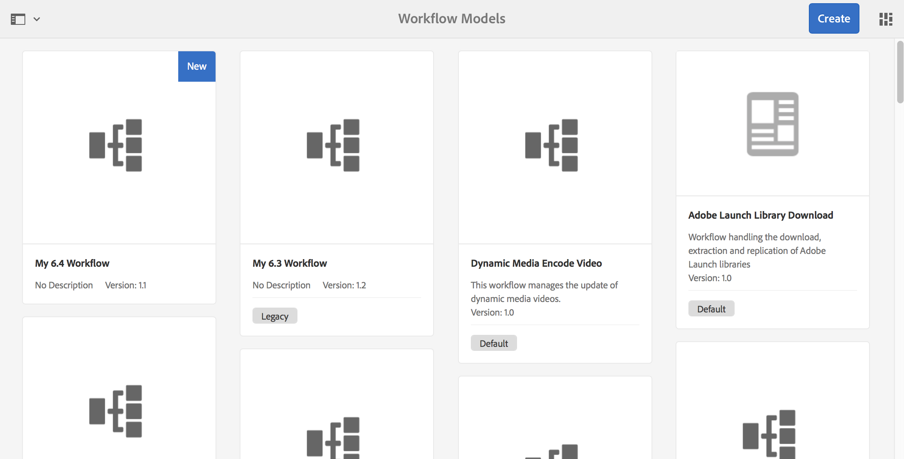

# 開發和延伸工作流程{#developing-and-extending-workflows}

提供AEM了幾種工具和資源，用於建立工作流模型、開發工作流步驟以及以寫程式方式與工作流交互。

工作流使您能夠自動執行管理環境中的資源和發佈內容AEM的過程。 工作流由一系列步驟組成，每個步驟都完成一個離散任務。 可以使用邏輯和運行時資料來確定進程何時可以繼續，並從多個可能的步驟之一中選擇下一步。

例如，用於建立和發佈網頁的業務流程包括各種參與者的批准和註銷任務。 這些進程可以使用工作AEM流建模並應用於特定內容。

以下是主要方面，而以下各頁則涵蓋更多詳情：

* [建立工作流模型](/help/sites-developing/workflows-models.md)
* [延伸工作流程功能](/help/sites-developing/workflows-customizing-extending.md)
* [以寫程式方式與工作流交互](/help/sites-developing/workflows-program-interaction.md)
* [工作流程步驟參考](/help/sites-developing/workflows-step-ref.md)
* [工作流程處理序參考](/help/sites-developing/workflows-process-ref.md)
* [工作流最佳實踐](/help/sites-developing/workflows-best-practices.md)

>[!NOTE]
>
>關於後述資訊：:
>
>* 參與工作流，請參閱 [使用工作流](/help/sites-authoring/workflows.md)。
>* 管理工作流和工作流實例，請參閱 [管理工作流](/help/sites-administering/workflows.md)。
>* 有關端到端社區文章，請參見 [使用Adobe Experience Manager工作流修改數字資產。](https://experienceleague.adobe.com/docs/experience-manager-65/assets/using/assets-workflow.html?lang=zh-Hant)
>* 查看 [咨詢工AEM作流專家網路研討會](https://communities.adobeconnect.com/p5s33iburd54/)。
>* 對資訊位置的更改請參閱 [6.5中的AEM儲存庫重組](/help/sites-deploying/repository-restructuring.md) 和 [工作流最佳實踐 — 位置](/help/sites-developing/workflows-best-practices.md#locations)。
>

## 模型 {#model}

A `WorkflowModel` 表示工作流的定義（模型）。 它由 `WorkflowNodes` 和 `WorkflowTransitions`。 過渡連接節點並定義 *流*。 「模型」始終具有起始節點和結束節點。

### 運行時模型 {#runtime-model}

工作流模型已版本化。 運行工作流實例時，它使用並保留工作流的運行時模型（在工作流啟動時可用）。

運行時模型為 [生成時 **同步** 在工作流模型編輯器中觸發](/help/sites-developing/workflows-models.md#sync-your-workflow-generate-a-runtime-model)。

對發生的工作流模型或生成的或兩者的運行時模型進行編輯 *後* 啟動的特定實例未應用於該實例。

>[!CAUTION]
>
>執行的步驟由 [運行時模型](/help/sites-developing/workflows-models.md#sync-your-workflow-generate-a-runtime-model)，在 **同步** 在工作流模型編輯器中觸發操作。
>
>如果在此時間點後更改了工作流模型(沒有 **同步** )，則運行時實例不會反映這些更改。 只有更新後生成的運行時模型反映更改。 除外的是基礎ECMA指令碼，它們只保留一次，以便進行這些更改。

### 步驟 {#step}

每個步驟都完成一個離散任務。 工作流步驟有不同類型：

* 參與者（用戶/組）:這些步驟將生成工作項並將其分配給用戶或組。 用戶必須完成工作項以推進工作流。
* 進程（指令碼、Java™方法調用）:這些步驟由系統自動執行。 ECMA指令碼或Java™類實現該步驟。 服務可以開發為根據業務邏輯來偵聽特定工作流事件並執行任務。
* 容器（子工作流）:此類型的步驟將啟動另一個工作流模型。
* 或拆分/聯接：使用邏輯確定在工作流中下一步執行的步驟。
* 和拆分/連接：允許同時執行多個步驟。

所有步驟共用以下公共屬性： `Autoadvance` 和 `Timeout` 警報（可指令碼化）。

### 切換 {#transition}

A `WorkflowTransition` 表示兩個 `WorkflowNodes` 的 `WorkflowModel`。

* 它定義了兩個連續步驟之間的連結。
* 可以應用規則。

### 工作項目 {#workitem}

A `WorkItem` 是通過 `Workflow` 實例 `WorkflowModel`。 它包含 `WorkflowData` 這個案子的行為，以及 `WorkflowNode` 描述基礎工作流步驟。

* 它用於標識任務，並放入相應的收件箱中。
* 工作流實例可以具有一個或多個 `WorkItems` 同時（取決於工作流模型）。
* 的 `WorkItem` 引用工作流實例。
* 在儲存庫中， `WorkItem` 儲存在工作流實例下。

### 裝載 {#payload}

引用必須通過工作流進行高級的資源。

負載實現引用儲存庫中的資源（按路徑、UUID或URL）或序列化的Java™對象。 在儲存庫中引用資源是靈活的，並且具有靈活性。 例如，可將引用的節點呈現為表單。

### 生命週期 {#lifecycle}

在啟動新工作流時（通過選擇相應的工作流模型並定義負載）建立，在處理結束節點時結束。

對工作流實例可執行以下操作：

* 終止
* 暫停
* 繼續
* 重新啟動

已完成和終止的實例將存檔。

### 收件匣 {#inbox}

每個用戶帳戶都有其自己的工作流收件箱，其中已分配 `WorkItems` 可訪問。

的 `WorkItems` 將直接分配給用戶帳戶或分配給其所屬的組。

### 工作流類型 {#workflow-types}

「工作流模型」控制台中指出有各種類型的工作流：

* **預設**

   這些類型是標準實例中包括的出廠設定工AEM作流。

* 自定義工作流（控制台中沒有指示器）

   這些工作流已建立為新工作流，或從已覆蓋有自定義項的現成工作流建立。

* **舊版**

   在以前版本中建立的工作AEM流。 這些工作流可以在升級期間保留，也可以作為工作流包從以前的版本導出，然後導入到新版本中。

### 暫時性工作流程 {#transient-workflows}

標準工作流在運行時（歷史記錄）資訊運行期間保存。 也可以將工作流模型定義為 **瞬態** 避免這樣的歷史持續下去。 此工作流用於效能調整，因為它節省了用於保存資訊的時間和資源。

臨時工作流可用於以下任何工作流：

* 經常運行。
* 不需要工作流歷史記錄。

在工作流運行歷史中，資產資訊是重要的，而工作流運行時歷史不是重要的。

>[!NOTE]
>
>請參閱 [建立臨時工作流](/help/sites-developing/workflows-models.md#creating-a-transient-workflow) 的上界。

>[!CAUTION]
>
>當將工作流模型標籤為「暫時」時，在運行時資訊仍必須保留時會出現以下幾種情況：
>
>* 負載類型（如視頻）需要外部步驟來處理；在這種情況下，需要運行時歷史記錄來確認狀態。
>* 工作流將輸入 **和拆分**。 在這種情況下，需要運行時歷史記錄來確認狀態。
>* 當臨時工作流進入參與者步驟時，它會在運行時將模式更改為非臨時。 在將任務傳遞給人時，必須保留歷史。
>

>[!CAUTION]
>
>在臨時工作流中，不應使用 **轉至步驟**。
>
>原因是 **轉至步驟** 建立sling作業以在 `goto` 點。 它使工作流變為瞬態的目的失敗，並在日誌檔案中生成錯誤。
>
>使用 **或拆分** 在臨時工作流中進行選擇。

>[!NOTE]
>
>請參閱 [資產最佳做法](/help/assets/performance-tuning-guidelines.md#transient-workflows) 有關「暫時性工作流」如何影響資產效能的詳細資訊。

### 多重資源支援 {#multi-resource-support}

激活 **多資源支援** 對於工作流模型，意味著即使您選擇了多個資源，也會啟動單個工作流實例。 每個都作為包連接。

如果 **多資源支援** 不會為工作流模型激活，並且會選擇多個資源，然後為每個資源啟動單個工作流實例。

>[!NOTE]
>
>請參閱 [為多資源支援配置工作流](/help/sites-developing/workflows-models.md#configuring-a-workflow-for-multi-resource-support) 的上界。

### 工作流階段 {#workflow-stages}

工作流階段有助於在處理任務時可視化工作流的進度。 它們可用於概述工作流在處理過程中的距離。 運行工作流時，用戶可以查看由 **舞台** （而不是單個步驟）。

由於單個步驟名稱可以是特定的和技術性的，因此可以定義階段名稱以提供工作流進度的概念視圖。

例如，對於具有六個步驟和四個階段的工作流：

1. 你可以 [配置工作流階段（顯示工作流進度），然後將相應階段分配給工作流中的每個步驟](/help/sites-developing/workflows-models.md#configuring-workflow-stages-that-show-workflow-progress):

   * 可以建立多個階段名稱。
   * 然後，將單個階段名稱分配給每個步驟（可以將階段名稱分配給一個或多個步驟）。

   | **步驟名稱** | **階段（分配給步驟）** |
   |---|---|
   | 步驟 1 | 建立 |
   | 步驟 2 | 建立 |
   | 步驟 3 | 評論 |
   | 步驟 4 | 批准 |
   | 步驟 5 | 完成 |
   | 步驟 6 | 完成 |

1. 運行工作流時，用戶可以根據階段名稱（而不是步驟名稱）查看進度。 工作流進度顯示在 [工作流項的任務詳細資訊窗口的「工作流資訊」頁籤](/help/sites-authoring/workflows-participating.md#opening-a-workflow-item-to-view-details-and-take-actions) 在 [收件箱](/help/sites-authoring/inbox.md)。

### 工作流和Forms {#workflows-and-forms}

通常，工作流用於處理中的表單提AEM交。 可以和 [核心元件構成元件](https://experienceleague.adobe.com/docs/experience-manager-core-components/using/wcm-components/forms/form-container.html?lang=en) 在標準實例AEM中提供，或 [AEM Forms解](/help/forms/using/aem-forms-workflow.md)。

建立表單時，表單提交可以輕鬆與工作流模型關聯。 例如，將內容儲存在儲存庫的特定位置，或通知用戶表單提交及其內容。

### 工作流和翻譯 {#workflows-and-translation}

工作流也是 [翻譯](/help/sites-administering/translation.md) 處理。
